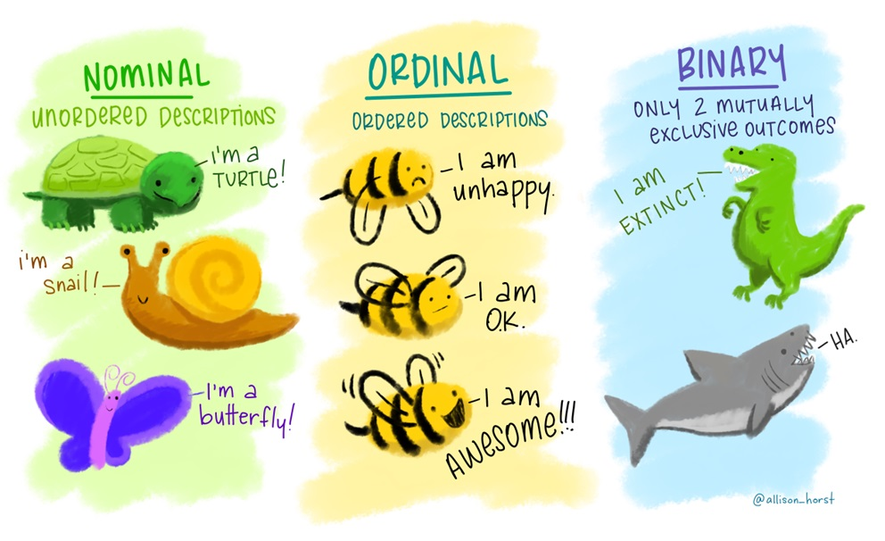

```{r setup, include=FALSE}
library(learnr)
library(tidyverse)
library(openintro)
library(emo)
library(glue)
shiny_url <- "https://oferengel-posit.shinyapps.io/"

gradethis::gradethis_setup(pass.praise = TRUE, fail.encourage = TRUE)
knitr::opts_chunk$set(echo = FALSE, message = FALSE, warning = FALSE)


# Hash generation helpers
# Should ideally be loaded from the imstutorials package when it exists
is_server_context <- function(.envir) {
  # We are in the server context if there are the follow:
  # * input - input reactive values
  # * output - shiny output
  # * session - shiny session
  #
  # Check context by examining the class of each of these.
  # If any is missing then it will be a NULL which will fail.
  
  inherits(.envir$input, "reactivevalues") &
    inherits(.envir$output, "shinyoutput") &
    inherits(.envir$session, "ShinySession")
}

check_server_context <- function(.envir) {
  if (!is_server_context(.envir)) {
    calling_func <- deparse(sys.calls()[[sys.nframe() - 1]])
    err <- paste0("Function `", calling_func, "`", " must be called from an Rmd chunk where `context = \"server\"`")
    stop(err, call. = FALSE)
  }
}
encoder_logic <- function(strip_output = FALSE) {
  p <- parent.frame()
  check_server_context(p)
  # Make this var available within the local context below
  assign("strip_output", strip_output, envir = p)
  # Evaluate in parent frame to get input, output, and session
  local(
    {
      encoded_txt <- shiny::eventReactive(
        input$hash_generate,
        {
          # shiny::getDefaultReactiveDomain()$userData$tutorial_state
          state <- learnr:::get_tutorial_state()
          shiny::validate(shiny::need(length(state) > 0, "No progress yet."))
          shiny::validate(shiny::need(nchar(input$name) > 0, "No name entered."))
          shiny::validate(shiny::need(nchar(input$studentID) > 0, "Please enter your student ID"))
          user_state <- purrr::map_dfr(state, identity, .id = "label")
          user_state <- dplyr::group_by(user_state, label, type, correct)
          user_state <- dplyr::summarize(
            user_state,
            answer = list(answer),
            timestamp = dplyr::first(timestamp),
            .groups = "drop"
          )
          user_state <- dplyr::relocate(user_state, correct, .before = timestamp)
          user_info <- tibble(
            label = c("student_name", "student_id"),
            type = "identifier",
            answer = as.list(c(input$name, input$studentID)),
            timestamp = format(Sys.time(), "%Y-%m-%d %H:%M:%S %Z", tz = "UTC")
          )
          learnrhash::encode_obj(bind_rows(user_info, user_state))
        }
      )
      output$hash_output <- shiny::renderText(encoded_txt())
    },
    envir = p
  )
}

hash_encoder_ui <- {
  shiny::div("If you have completed this tutorial and are happy with all of your", "solutions, please enter your identifying information, then click the button below to generate your hash", textInput("name", "What's your name?"), textInput("studentID", "What is your student ID (Gebruikersnaam  s-/p-nummer)?"), renderText({
    input$caption
  }), )
}


```

## Welcome

Hello, and welcome to **Introduction to data**!

In this tutorial we will take you through concepts and R code that are essential
for getting started with data analysis.

Scientists seek to answer questions using rigorous methods and careful
observations. These observations form the backbone of a statistical
investigation and are called data. Statistics is the study of how best to
collect, analyze, and draw conclusions from data. It is helpful to put
statistics in the context of a general process of investigation:

-   **Step 1**: Identify a question or problem.

-   **Step 2**: Collect relevant data on the topic.

-   **Step 3**: Analyze the data.

-   **Step 4**: Form a conclusion.

We will focus on **steps 1 and 2** of this process in this tutorial.

Our learning goals for the tutorial are *to internalize the language of data,
load and view a dataset in R and distinguish between various variable types,
classify a study as observational or experimental, and determine the scope of
inference, distinguish between various sampling strategies, and identify the
principles of experimental design.*

This tutorial does not assume any previous R experience, but if you would like
an introduction to R first, we recommend the [RStudio
Primers](https://rstudio.cloud/learn/primers) or the [R
Bootcamp](https://r-bootcamp.netlify.com/).

## Packages

Packages are the fundamental units of reproducible R code. They include reusable
functions, the documentation that describes how to use them, and sample data. In
this lesson we will make use of two packages:

-   **tidyverse**: Tidyverse is a collection of R packages for data science that
    adhere to a common philosophy of data and R programming syntax, and are
    designed to work together naturally. You can learn more about tidyverse
    [here](https://tidyverse.org/). But no need to go digging through the
    package documentation, we will walk you through what you need to know about
    these packages as they become relevant.
-   **openintro**: The openintro package contains datasets used in openintro
    resources. You can find out more about the package
    [here](http://openintrostat.github.io/openintro).

Once we have installed the packages, we use the `library()` function to load
packages into R.

Let's load these two packages to be used in the remainder of this lesson. Here
is how we load the packages:

```{r load-packages, echo=TRUE}
library(tidyverse)
library(openintro)
```

## Data in R

In this lesson, we'll begin by introducing the terminology of datasets and data
frames in R.

One of the datasets that we will work with in this tutorial comes from the High
School and Beyond Survey, which is a survey conducted on high school seniors by
the National Center of Education Statistics.

The data are organized in what we call a *data frame*, where each row represents
an *observation* or a *case* and each column represents a *variable*. If you
ever use spreadsheets, such as a Google sheet or Excel, this representation
should be familiar to you.

In this lesson we'll work with the High School and Beyond dataset, stored in the
openintro package. The data are stored in a **data frame** called `hsb2`. You
can read more about this dataset
[here](http://openintrostat.github.io/openintro/reference/hsb2.html). Below is a
preview of the dataset. You can use the arrow on the right hand side to scroll
through the variables, and the numbers on the bottom to see different rows in
the dataset.

```{r print-hsb2}
hsb2
```

### Loading data into R

There are many ways of loading data into R depending on where your data are
stored. In this lesson we're using a dataset that is included in an R package so
we can access this dataset by loading the package with the `library()` function.
Other commonly used formats of data are plain text, comma separated values
(CSV), Excel files (XLS or XLSX), or RData (the file format R uses to store
data).

In many of the tutorials in these series we will use data from existing R
packages, so you won't need to worry about the myriad ways of loading data into
R. However, learning more about loading data into R is very important for when
you're working on an analysis with your own data. A resource we recommend for
learning more about importing data into R is the Data Import chapter in [R 4
Data Science](https://r4ds.had.co.nz/data-import.html) by Grolemund and Wickham.


```{r img-tidy, echo=FALSE, out.width="80%"}
knitr::include_graphics("images/tidydata_obs_var.jpg")
```


```{r quiz-obs-vars}
question("how many observations and how many variables are in the `hsb2` dataset? ", allow_retry = TRUE, random_answer_order = TRUE,
    answer("200 variables", message = "Nope, try again!"),
    answer("200 observations", correct = TRUE),
    answer("11 variables", correct = TRUE),
    answer("11 observations", message = "Nope, try again!")
)
```


### Take a peek

When you want to work with data in R, a good first step is to take a peek at what the data look like. The `glimpse()` function is one good way of doing this.
Click on the blue "Run Code" button to run the code below, and take a look at
the output of the `glimpse()` function.

```{r glimpse-hsb2, exercise=TRUE}
glimpse(hsb2)
```

The output of `glimpse()` tells us how many observations and variables we have in our dataset. It also lists the variables and their types, along with values of the first few observations.

Now let's put what you've learned so far to use!

### 

We'll practice on another dataset, `email50`, which contains a subset of
incoming emails for the first three months of 2012 for a single email account.
We'll examine the structure of this dataset and determine the number of rows
(observations) and columns (variables).

Take a peek at the `email50` dataset using the `glimpse()` function.


```{r glimpse-email50, exercise=TRUE}

```

```{r  glimpse-email50-hint}
glimpse(___)
```


```{r glimpse-email50-solution}
glimpse(email50)
```


```{r quiz-obs-vars-email50}
question("how many observations and how many variables are in the `email50` dataset? ", allow_retry = TRUE, random_answer_order = TRUE,
    answer("50 variables", message = "Nope, try again!"),
    answer("50 observations", correct = TRUE),
    answer("21 variables", correct = TRUE),
    answer("21 observations", message = "Nope, try again!")
)
```


## Types of variables

When you first start working with a dataset, it's good practice to take a note
of its dimensions; how many rows or observations and how many columns or
variables the data frame has.

You learned how to do this in the previous section using the `glimpse()`
function. You also learned how to take a quick look at the list of variables in
the dataset. In this section, we will delve deeper into the categorization of
variables as **numerical and categorical**. This is an important step, as the
type of variable helps us determine what summary statistics to calculate, what
type of visualizations to make, and what statistical method will be appropriate
to answer the research questions we're exploring.

There are two types of variables: numerical and categorical.

-   **Numerical**, in other words, quantitative, variables take on numerical
    values. It is sensible to add, subtract, take averages, and so on, with
    these values.

-   **Categorical**, or qualitative, variables, take on a limited number of
    distinct categories. These categories can be identified with numbers, for
    example, it is customary to see likert variables (strongly agree to strongly
    disagree) coded as 1 through 5, but it wouldn't be sensible to do arithmetic
    operations with these values. They are merely placeholders for the levels of
    the categorical variable.

### Numerical data

Numerical variables can be further categorized as **continuous or discrete**.

-   **Continuous numerical** variables are usually measured, such as height.
    These variables can take on an infinite number of values within a given
    range.

-   **Discrete numerical** variables are those that take on one of a specific
    set of numeric values where we are able to count or enumerate all of the
    possibilities. One example of a discrete variable is number of pets in a
    household. In general, count data are an example of discrete variables.

When determining whether a numerical variable is continuous or discrete, it is
important to think about the nature of the variable and not just the observed
value, as rounding of continuous variables can make them appear to be discrete.
For example, height is a continuous variable, however we tend to report our
height rounded to the nearest unit of measure, like inches or centimeters.

### Categorical data

Categorical variables that have ordered levels are called **ordinal**.

Think about a survey question where you're asked how satisfied you are with the
customer service you received and the options are very unsatisfied, unsatisfied,
neutral, satisfied, and very satisfied. These levels have an inherent ordering,
hence the variable would be called ordinal.

If the levels of a categorical variable do not have an inherent ordering to
them, then the variable is simply called **nominal**. For example, do you
consume caffeine or not?

{width="60%"}

### Variables in `hsb2`

Let's take a moment to go through the variables in the High School and Beyond
dataset:

```{r glimpse-hsb2-again, echo=TRUE}
glimpse(hsb2)
```

Using the `glimpse()` function, we can obtain a list of the variables in the
dataset and also see what the values stored in these variables look like.

The first variable is id, which is an identifier variable for the student.

```{r glimpse-hsb2-id}
hsb2 |> 
  select(id)  |>  
  glimpse()
```

Each id represents the name of a unique student, and therefore this is a categorical variable, though the labeling of this variable is likely not that useful since we would not use this variable in an analysis of relationships between the variables in the dataset. 

The next variable is gender, a categorical variable, with levels `"male"` and `"female"`. It should be noted that the language of government surveys, such as High School and Beyond, is slow to change. So with these types of data, you will continue to see variables mislabeled as "gender" when they in fact measure the biological sex (male, female) of the participant.

There is no inherent ordering to the levels of this variable, and since we have just two possible values, this would be a categorical/binary variable. 
The race variable has more possible values, and it is also a categorical variable which has levels of `"white"`, `"african american"`,`"hispanic"`, and `"asian"`.

```{r glimpse-hsb2-race-gender}
hsb2 |> 
  select(race, gender) |> 
  glimpse()
```

Socio-economic status, on the other hand, has three levels `"low"`, `"middle"`, and `"high"` that have an inherent ordering, hence this variable is an *ordinal* categorical variable.

```{r glimpse-hsb2-ses}
hsb2 |> 
  select(ses) |> 
  glimpse()
```

School type and program are also both categorical variables, with no inherent ordering to their levels.

```{r glimpse-hsb2-schtyp-prog}
hsb2 |> 
  select(schtyp, prog) |> 
  glimpse()
```

The remaining variables are scores that these students received in reading,
writing, math, science, and social studies tests. Since these scores are al
whole numbers, and assuming that it is not possible to obtain a non-whole number score on these tests, these variables are discrete numerical.

## Categorical data in R: factors

There are various data classes in R. In this tutorial, we'll focus on ones that
are relevant to the concepts we will introduce. One of these classes is a
factor, which is what R often stores categorical variables as. An important use
of factors is in statistical modeling, since categorical variables enter into
models differently than numerical variables. We'll learn more about what this
difference is in a later tutorial, but for now just keep in mind that while
factors might crop up in places where they're not actually helpful, there are
also many places where they are essential to running a statistical analysis
correctly.

### Categorical Data

-   Often stored as factor in R
-   Common in subgroup analysis
    -   Only interested in a subset of the data
    -   Filter for specific levels (values) of categorical variable

A common step in many analyses that involve categorical data is a subgroup
analysis, where we work with only a subset of the data. For example, analyzing
data only from students in public schools or only for students who identified as
female. We can obtain these subsets by filtering for the specific levels we're
interested in.

Suppose we want to do an analysis of only the students in public schools in the
High School and Beyond dataset. Let's first find out how many such students
there are.

One option for obtaining this information in R uses the `count()` function from
the **dplyr** package, one of the packages included in the tidyverse. This
package provides a variety of functions for wrangling and summarizing data. Once
such function is `count()` which gives the frequencies of occurrence of the
unique values in a given column. In this case we're interested in the number of
students for each level of the `schtyp` (school type) column.

```{r hsb2-count-schtyp, exercise=TRUE}
hsb2 |> 
  count(schtyp)
```

There are 168 students in public schools and 32 in private schools.

Let's pause for a moment and dissect what happened in these two lines of code.

We can read the code as: "take the `hsb2` data frame and **pipe it** into the
`count()` function, then `count()` the occurrences of unique values in the
`schtyp` variable."

You might be wondering what we mean by *"pipe it into the `count()` function"*?

### The pipe operator

{width="30%"}

The **pipe operator**, which **is vertical bar greater than**, tells `R` to pass
the object that comes before it into the first argument of the function that
comes after it. Mathematically, **x pipe f(y)** becomes *f(x, y)*, since x is
piped into the first argument of the function f().

{width="30%"}

For example, one way of adding numbers in R is using the `sum()` function. The
`sum()` function has as many arguments as there are numbers you wish to add,
where each number is separated with a comma. For example, to add 3 and 4, we
would use the following code. Notice, 3 and 4 are separated by a comma,
indicating that these are the two numbers we wish for the `sum()` function to
add.

```{r sumdata1, echo=TRUE}
# Sum of 3 and 4, without pipe
sum(3, 4)
```

If we wanted to do the same operation with a pipe, we would instead use the code
below. The pipe operator inserts 3 as the first argument into the `sum()`
function, which looks like `sum(3, 4)`.

```{r sumdata2, echo=TRUE}
# Sum of 3 and 4, with pipe
3 |> sum(4)
```

Piping 3 into the `sum()` function may seem a bit silly, especially since it's
not much easier than typing `sum(3,4)`. However, as we progress through these
tutorials you will see that the piping operator will allow us to sequentially
link together data wrangling operations. This can save us a great deal of
headache later on, as the format of operations that use the pipe are far simpler
to read! We'll start with short pipes and throughout the tutorial build up to
longer pipes that perform multiple operations.

Next, let's use the `filter()` function to filter the data to only include
public school students.

```{r hsb2-filter-schtyp-public, exercise=TRUE}
hsb2 |>
  filter(schtyp == "public")
```

We can read the above code as: "take the `hsb2` data frame and **pipe it** into the `filter()` function. Next, `filter()` the data **for cases where school type is equal to public**". 

We should take note of two pieces of R syntax: *the double equal sign* (`==`)
and quotations (""). In R, `==` is a logical test for *"is equal to"*. `R` uses
this logical test to search for observations (rows) in the data frame where
school type is equal to public, and returns a data frame where this comparison
is `TRUE` for every row.

In R, variables that are categorical use characters (rather than numbers) for
values. To indicate to R that you want your logical test to compare the values
of a categorical variable to a specific level of that variable, you need to
surround the name of the level in quotations (e.g. `schtyp == "public"`). The
quotations tell R that the value of the variable is a character, not a number.
If you forget to use quotations, R will give you an error message!

Compare the result with and without the filter by removing the filter from the code above and running it. 

```{r quiz-filter}
question("How does the filter influence the result?", allow_retry = TRUE, random_answer_order = TRUE,
    answer("The filter changes the number of observations", correct = TRUE),
    answer("The filter changes the number of variables"),
    answer("The filter removes all rows where the variable `schtyp` is `public`"), 
    answer("The filter keeps only rows where the variable `schtyp` is `public`", correct = TRUE)
)
```


Now, if we make another frequency table of school type in the filtered dataset, we should only see public school in the output.

```{r hsb2-count-schtyp-again, exercise=TRUE}
hsb2 |>
  filter(schtyp == "public") |> 
  count(schtyp)
```

Now we will practice filtering and handling factors with a different categorical
variable.

### Filtering based on a factor


Next we will practice identifying variables in a different dataset.


Recall that the `glimpse()` function tells us the number of observations and
variables in a dataset as well as the names and types of each column, along with
a neatly printed preview of their first few values.

Let's have another look at the `email50` data, so we can practice identifying
variable types.

Use the `glimpse()` function to view the variables in the `email50` dataset.

Remember that variable descriptions are available in the help file for the
dataset, which we can access by typing `?email50` (that is, type a question mark followed by the name of the dataset) in the code box and running it.

*Review the output to identify each variable as either numerical or categorical, and further as discrete or continuous (if numerical) or ordinal or not ordinal (if categorical).*

```{r glimpse-data, exercise=TRUE}

```

```{r glimpse-data-hint}
glimpse(___)
```

```{r glimpse-data-solution}
glimpse(email50)
```

Next, we'll practice working
with a factor variable, `number`, from the `email50` dataset. This variable
tells us what type of number (none, small, or big) an email contains.

Modify the code below to:

-   Start with the dataset called `email50` 
-   Filter a subset of the original dataset containing only emails with `"big"` numbers. 
-   Use the `glimpse()` function again to establish how many emails contain big numbers.

```{r email50-filter-number-big, exercise=TRUE}
# Subset of emails with big numbers: email50_big
email50 |>
  filter(___ == ___) |> 
  # Glimpse the subset 
  ___( )

```

```{r email50-filter-number-big-hint-1}
# We're looking for emails with big numbers, so filter for `number == "big"`.
```

```{r email50-filter-number-big-hint-2}
# Subset of emails with big numbers: email50_big
email50 |>
  filter(number == "big") |> 
  # Glimpse the subset 
  ___( )
```

```{r email50-filter-number-big-solution}
# Subset of emails with big numbers: email50_big
email50 |>
  filter(number == "big") |> 
  # Glimpse the subset
  glimpse( )
```


```{r quiz-filter-email50}
question("How did the filter influence the data set?", allow_retry = TRUE, random_answer_order = TRUE,
    answer("The filter reduced the number of observations from 50 to 7", correct = TRUE),
    answer("The filter reduced the number of observations from 21 to 7"),
    answer("All emails in the filtered dataset have `big` numbers.")

)
```


## Visualizing numerical data

The most logical and most useful first step of any data analysis is an
exploratory analysis. And a very important and informative component of
exploratory data analysis is visualization.

We will learn a lot more about data visualization in the tutorial on Summarizing
and Visualizing Data, so we won't go into too much detail on data visualization
in this tutorial. Let's, however, make a simple scatterplot to visualize the
relationship between two numerical variables so that you can get some exposure
to constructing plots in R and how to interpret them.


We'll visualize the relationship between the math and science scores of the
students in the High School and Beyond dataset.

```{r hsb2-science-math, exercise=TRUE}
ggplot(data = hsb2, aes(x = science, y = math)) + 
  geom_point()
```

Let's pause for a moment and review what's going on in the code above.

-   We use the `ggplot()` function to create plots.
-   The first argument is the data frame containing the data we wish to plot:
    `data = hsb2`.
-   In the `aes`thetics argument, we map variables from the data frame to certain components of the plot. In this case we want to plot science test
    scores on the x and math test scores on the y axis:
    `aes(x = science, y = math)`.
-   Lastly, we specify what `geom`etric shapes should be used to represent each
    observation. In this case, we want to make a scatterplot, so we want each
    observation to be represented by a "point" on the plot, hence we add use the
    `geom_point()` function to add a points layer to the plot.
    
    
```{r img-ggplot, out.width="80%"}


```
    

In summary, the main function is `ggplot()`, the first argument is the data to
use, then the aes maps the variables to certain features of the plot, and
finally the geom informs the type of plot you want to make.

Another important aspect to note here is that the `geom_XXX()` function is
separated from the `ggplot()` function with a plus, `+`. 

As we mentioned earlier, ggplot2 plots are constructed in series of layers. The plus sign
separates these layers. Generally, the `+` sign can be thought of as the end of a line, so you should always hit enter/return after it. 

Now that you've learned how to make the plot, let's talk about what the plot
says.

### Interpreting a visualization

We can see that there is a positive relationship between the science and math
scores of students, meaning that students who score highly in science tend to
also score highly in math. Probably not that surprising a result.

```{r hsb2-science-math-lm}
ggplot(data = hsb2, aes(x = science, y = math)) +
  geom_point() +
  geom_smooth(method = "lm", se = FALSE)
```

We also mentioned earlier that extending from bivariate to multivariate plots is
easy in ggplot2. Let's test that out!

### Math, science, and program

Let's plot the same math and science test scores, but this time let's also
consider the program that the student is in: general, academic, or vocational.

```{r hsb2-science-math-prog, exercise=TRUE}
ggplot(data = hsb2, aes(x = science, y = math, color = prog)) +
  geom_point()
```

The code looks very similar to what we used before, except that we now have one
other aesthetic mapping between the program variable and the `color` of the
points that represent the observations. Note that we type the name of the
variable as it appears in the data frame: `prog`.

How does the plot below differ from the plot above? Look at the plot above and
think about where the lines would go if we fit a separate line for each level of
the program variable (each color of points). The result would be a plot that
looks like the one below.

```{r hsb2-science-mat-prog-lm}
ggplot(data = hsb2, aes(x = science, y = math, color = prog)) +
  geom_point() +
  geom_smooth(method = "lm", se = FALSE)
```

The same positive relationship between math and science scores is still
apparent. But we can also see that students in academic programs, shown with
green points, tend to have higher math scores relative to their science scores
than those in vocational programs, in blue, and general programs, in red.

We will wrap up this lesson with some practice creating a similar plot with
different variables.

### Visualizing numerical and categorical data

Next we'll visualize the relationship between two numerical variables from the
`email50` dataset, separated by whether or not the email was spam. This means
that we will use an aspect of the plot (like color or shape) to identify the
levels in the `spam` variable so that we can compare plotted values between
them.

Recall that in the `ggplot()` function, the first argument is the dataset, then
we map the aesthetic features of the plot to variables in the dataset, and
finally the `geom_XXX()` layer informs how data are represented on the plot.

Next, we will make a scatterplot by adding a `geom_point()` layer to the
`ggplot()` call.

-   Create a scatterplot of number of exclamation points (`exclaim_mess`) on the
    y-axis vs. number of characters (`num_char`) on the x-axis.
-   Color points by whether or not the email is `spam`.


```{r email50-plot, exercise=TRUE}
ggplot(email50, aes(x = ___, y = ___, color = ___)) +
  [GEOM]
```

```{r email50-plot-hint-1}
ggplot(email50, aes(x = num_char, y = ___, color = ___)) +
  [GEOM]
```

```{r email50-plot-hint-2}
ggplot(email50, aes(x = num_char, y = exclaim_mess, color = ___)) +
  [GEOM]
```

```{r email50-plot-hint-3}
ggplot(email50, aes(x = num_char, y = exclaim_mess, color = spam)) +
  {GEOM}
```

```{r email50-plot-solution}
ggplot(email50, aes(x = num_char, y = exclaim_mess, color = spam)) +
  geom_point()
```

*Based on the plot, does there appear to be a relationship between these
variables?*

## Congratulations!

You have successfully completed Lesson 1 in Tutorial 1: Introduction to data. If
you need to generate a hash for submission, click "Next Topic".

```{r, child="../01-data-footer.rmd"}

```
