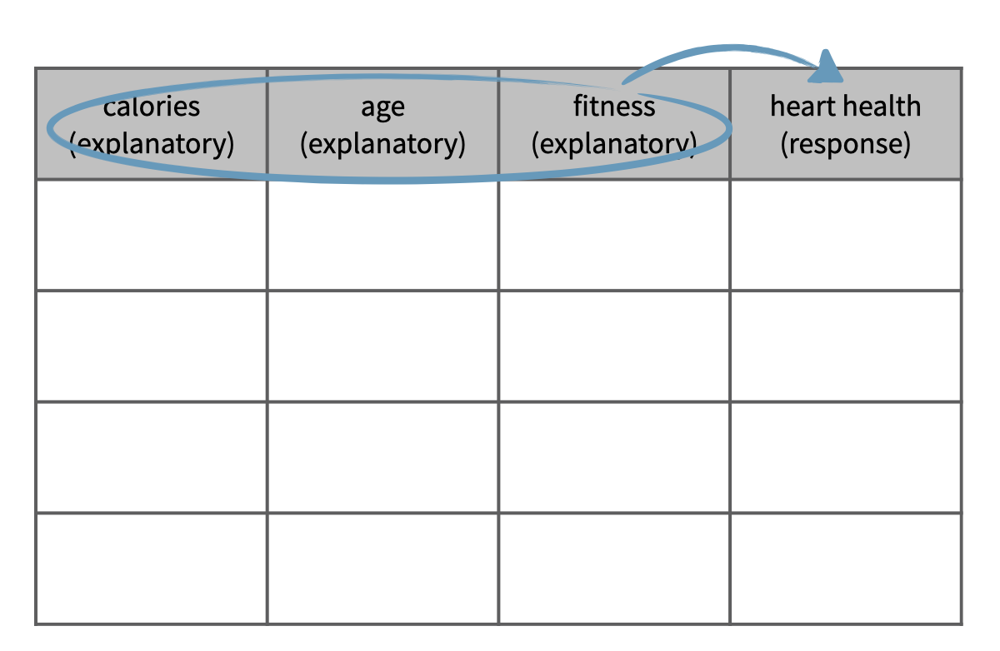

```{r setup, include=FALSE}
library(learnr)
library(gapminder)
library(tidyverse)
library(emo)
library(glue)
shiny_url <- "https://oferengel-posit.shinyapps.io/"

gradethis::gradethis_setup(pass.praise = TRUE, fail.encourage = TRUE)
knitr::opts_chunk$set(echo = FALSE, message = FALSE, warning = FALSE)


# Used in some exercises
load("data/ucb_admit.RData")

ucb_admission_counts <- ucb_admit |>
  count(Gender, Admit)

# Hash generation helpers
# Should ideally be loaded from the imstutorials package when it exists
is_server_context <- function(.envir) {
  # We are in the server context if there are the follow:
  # * input - input reactive values
  # * output - shiny output
  # * session - shiny session
  #
  # Check context by examining the class of each of these.
  # If any is missing then it will be a NULL which will fail.
  
  inherits(.envir$input, "reactivevalues") &
    inherits(.envir$output, "shinyoutput") &
    inherits(.envir$session, "ShinySession")
}

check_server_context <- function(.envir) {
  if (!is_server_context(.envir)) {
    calling_func <- deparse(sys.calls()[[sys.nframe() - 1]])
    err <- paste0("Function `", calling_func, "`", " must be called from an Rmd chunk where `context = \"server\"`")
    stop(err, call. = FALSE)
  }
}
encoder_logic <- function(strip_output = FALSE) {
  p <- parent.frame()
  check_server_context(p)
  # Make this var available within the local context below
  assign("strip_output", strip_output, envir = p)
  # Evaluate in parent frame to get input, output, and session
  local(
    {
      encoded_txt <- shiny::eventReactive(
        input$hash_generate,
        {
          # shiny::getDefaultReactiveDomain()$userData$tutorial_state
          state <- learnr:::get_tutorial_state()
          shiny::validate(shiny::need(length(state) > 0, "No progress yet."))
          shiny::validate(shiny::need(nchar(input$name) > 0, "No name entered."))
          shiny::validate(shiny::need(nchar(input$studentID) > 0, "Please enter your student ID"))
          user_state <- purrr::map_dfr(state, identity, .id = "label")
          user_state <- dplyr::group_by(user_state, label, type, correct)
          user_state <- dplyr::summarize(
            user_state,
            answer = list(answer),
            timestamp = dplyr::first(timestamp),
            .groups = "drop"
          )
          user_state <- dplyr::relocate(user_state, correct, .before = timestamp)
          user_info <- tibble(
            label = c("student_name", "student_id"),
            type = "identifier",
            answer = as.list(c(input$name, input$studentID)),
            timestamp = format(Sys.time(), "%Y-%m-%d %H:%M:%S %Z", tz = "UTC")
          )
          learnrhash::encode_obj(bind_rows(user_info, user_state))
        }
      )
      output$hash_output <- shiny::renderText(encoded_txt())
    },
    envir = p
  )
}

hash_encoder_ui <- {
  shiny::div("If you have completed this tutorial and are happy with all of your", "solutions, please enter your identifying information, then click the button below to generate your hash", textInput("name", "What's your name?"), textInput("studentID", "What is your student ID (Gebruikersnaam  s-/p-nummer)?"), renderText({
    input$caption
  }), )
}
```

## Observational studies and experiments

Two types of studies commonly used in scientific research: observational studies and experiments.

```{r quiz-obs-exp}
quiz(
  question("In this type of study, researchers simply record what already exists without influencing the data they collect. They study the  association between the *explanatory* and *response* variables. What type of study is this?", allow_retry = TRUE, random_answer_order = TRUE,
    answer("Observational study", correct = TRUE),
    answer("Experiment", message = "Try again!")
), 
  question("In this type of study, researchers randomly assign subjects to various treatments and can therefore establish causal connections between the *explanatory* and *response* variables. What type of study is this?", allow_retry = TRUE, random_answer_order = TRUE,
    answer("Experiment", correct = TRUE),
    answer("Observational study", message = "Try again!")
), 
caption = "")
```

Suppose we want to evaluate the relationship between using screens at bedtime such as a computer, tablet, or phone and attention span during the day. We can design this study as an observational study or as an experiment.

In an observational study, we sample two types of people from the population: those who choose to use screens at bedtime and those who don't.

Then, we find the average attention span for the two groups of people and compare.

{width="70%"}

On the other hand, in an experiment, we sample a group of people from the population and then we randomly assign these people into two groups: those who are asked to use screens at bedtime and those who asked not to use them. The difference is that the decision of whether to use screens or not is not left up to the subjects, as it was in the observational study, but is instead imposed by the researcher.

At the end, we compare the attention spans of the two groups.

{width="70%"}

Based on the observational study, even if we find a difference between the average attention span of these two groups of people, we can't attribute this difference solely to using screens because perhaps there is something else (perhaps a stressful job?) that causes them to use the screen at bedtime **and** causes them a shorter attention span.

This "something else" that contributes to the explanatory variable and to the outcome variable, is called confounding variables. In experiments, confounding variables are most likely represented equally in the two groups due to random assignment. Therefore, if we find a difference between the two averages, it cannot be due to the confounder and we can indeed make a causal statement attributing this difference to bedtime screen usage.

Let's put these ideas into practice.

### Identify type of study: Reading speed and font

A study is designed to evaluate whether people read text faster in Arial or Helvetica font. A group of volunteers who agreed to be a part of the study are randomly assigned to two groups: one where they read some text in Arial, and another where they read the same text in Helvetica. At the end, average reading speeds from the two groups are compared.

```{r quiz-identify-type-study}
quiz(
  question("What type of study is this?", correct = "Awesome! Even though participants are volunteers, this is still an experiment!", allow_retry = TRUE, random_answer_order = TRUE,
    answer("Observational study", message = "Not quite, this is not an observational study."),
    answer("Experiment", correct = TRUE),
    answer("Neither, since the sample consists of volunteers", message = "Try again!")
), caption = "")
```

Next, let's take a look at data from a different study on country characteristics. First, load the data and view it, then identify the type of study. Remember, an experiment requires random assignment.

### Recap: Types of studies

Let's take a look at data from a different study on country characteristics. The data come from the **gapminder** package.

To view the top 10 rows of the data, simply type `gapminder`. You are welcome to view the data using functions from the **tidyverse** package you have learned previously to inspect it.

```{r gapminder-final, exercise=TRUE}
library(gapminder)
gapminder
```

Then, identify the type of study this data come from.

```{r quiz-gapminder-final}
quiz(
  question("What type of study is this?", correct = "Awesome!", allow_retry = TRUE,
    answer("Observational study", correct = TRUE),
    answer("Experiment", message = "Not quite, this is not an experiment since it's not possible to randomly assign countries to attributes in the dataset."),
    answer("Neither, since we don't have data on all countries.", message = "Try again!")
), caption = "")
```

## Random sampling assignment

In this section, we'll clarify the difference between *random sampling* and *random assignment*, and more importantly, why we care about this difference.

**Random sampling** occurs when *subjects are being selected for a study*. If subjects are selected randomly from the population of interest, then the resulting sample is likely representative of that population and therefore the study's results can be generalizable to that population.

**Random assignment** occurs only *in experimental settings where subjects are being assigned to various treatments*. Random assignment *allows for causal conclusions* about the relationship between the treatment and the response.

Here is a quick summary of how random sampling and random assignment affect the scope of inference of a study's results.

#### Scope of inference

A study that employs random sampling and random assignment can be used to make causal conclusions and these conclusions can be generalized to the whole population. This would be an ideal experiment, but such studies are usually difficult to carry out, especially if the experimental units are humans, since it may be difficult to randomly sample people from the population and then impose treatments on them. This is why most experiments recruit volunteer subjects. You may have seen ads for these on a university campus or in a newspaper.

{width="70%"}

```{r quiz-rand-gen}
quiz(
  question("Which type of sampling allows for a generalizeable study?", allow_retry = TRUE,
      answer("Option A", correct = TRUE),
      answer("Option B", correct = TRUE),
      answer("Option C"),
      answer("Option D")
  ), 
  question("Which type of sampling allows for causal inference?", allow_retry = TRUE,
      answer("Option A", correct = TRUE),
      answer("Option B"),
      answer("Option C", correct = TRUE),
      answer("Option D")
  ), caption = ""
)


```

Such human experiments that rely on volunteers employ random assignment, but not random sampling. These studies can be used to make causal conclusions, but the conclusions only apply to the sample and the results cannot be generalized to the population.

### Experimental vs. Observational studies

A study that uses no random assignment, but does use random sampling is your typical observational study. Results can only be used to make association statements, but they can be generalized to the whole population.

A final type of study, one that doesn't use random assignment or random sampling, can only be used to make non causal association statements. This is an unideal observational study.

You'll get some more practice with these concepts now.

### Random sampling and random assignment?

{width="70%"}

One of the early studies linking smoking and lung cancer compared patients who are already hospitalized with lung cancer to similar patients without lung cancer (hospitalized for other reasons), and recorded whether each patient smoked. Then, proportions of smokers for patients with and without lung cancer were compared.

```{r quiz-random-sampling}
quiz(
  question("Does this study employ random sampling and/or random assignment?", correct = "Right! Random assignment is not employed because the conditions are not imposed on the patients by the people conducting the study; random sampling is not employed because the study records the patients who are already hospitalized, so it wouldn't be appropriate to apply the findings back to the population as a whole.", allow_retry = TRUE, random_answer_order = TRUE,
    answer("Random sampling, but not random assignment", message = "Hm, not quite!"),
    answer("Random assignment, but not random sampling", message = "Try again!"),
    answer("Neither random sampling nor random assignment", correct = TRUE),
    answer("Both random sampling and random assignment")
), caption = "")
```

### Identify the scope of inference of study

Volunteers were recruited to participate in a study where they were asked to type 40 bits of trivia into a computer (for example, one bit of trivia they had to type was: "*an ostrich's eye is bigger than its brain*"). A randomly selected half of these subjects were told the information would be saved in the computer; the other half were told the items they typed would be erased.

Then, the subjects were asked to remember these bits of trivia, and the number of bits of trivia each subject could correctly recall were recorded. It was found that the subjects were significantly more likely to remember information if they thought they would not be able to find it later.

```{r quiz-identify-scope}
quiz(
  question("The results of the study ______ be generalized to all people and a causal link between believing information is stored and memory ______ be inferred based on these results.", correct = "Correct! There is no random sampling since the subjects of the study were volunteers, so the results cannot be generalized to all people. However, due to random assignment, we are able to infer a causal link between the belief information is stored and the ability to recall that same information.", allow_retry = TRUE,
    answer("cannot, cannot", message = "Nope, try again!"),
    answer("cannot, can", correct = TRUE),
    answer("can, cannot", message = "Not quite!"),
    answer("can, can")
), caption = "")
```

## Simpson's paradox

A new drug is offered to a group with risk of developing coronary artery disease, and members of the group are followed for a number of years to see their health outcomes. The results are shown in the table below.

{width="70%"}

```{r quiz-simpson-drug}
quiz(
  caption = "",
  question(
    "Based only on the information provided in the table, choose the correct statements:", allow_retry = TRUE, random_answer_order = FALSE, 
    answer("Each subject in the study is associated with three categorical variables: `sex` (male/female), `heart-attack` (yes/no) and `taking the drug` (yes/no)", correct = TRUE), 
    answer("Among male participants, those who took the drug were less likely to get a heart attack than those who didn't"), 
    answer("Among female participants, those who took the drug were more likely to get a heart attack than those who didn't", correct = TRUE),
    answer("More females took the drug than males", correct = TRUE),
    answer("Females are more prone to getting a heart attack than males"),
    answer("A random person in this sample is more likely to have a heart attack if they took the drug"),
    answer("The results of this trial seem to suggest that overall, taking the drug is associated with an increased rate of heart attack", correct = TRUE) 
  )
)
```

### 

The data presents a puzzling situation: If we look at the male and female subgroups, their members tend to fair worse when taking the drug, on average. But if we look at the total numbers overall, the average person in the sample appears to fair better if they do take the drug (only 18.3% heart attack) than if they do not take the drug (21.7% heart attack).

Based on these data, would you advise the drug to be approved? Probably not!

To understand what is going on here, consider the "relationship between the variables." Often, we think of a relationship between just two variables. In this example, one variable is whether a person takes the drug yes or no (this is the predictor or the explanatory variable). A second variable is the health outcomes (aka outcome or response variable).

However, truly understanding the relationship between these two variables might require considering other potentially related variables as well (in this case, the sex of the subjects). If we don't, we might find ourselves in a *Simpson's paradox*. So, what is Simpson's paradox?

First, let's clarify what we mean when we say explanatory and response variables. Labeling variables as explanatory and response does not guarantee the relationship between the two is actually causal, even if there is an association identified. We use these labels only to keep track of which variable we suspect affects the other.

### Explanatory and response

{width="30%"}

```{r quiz-response-explanatory}
quiz(
  caption = "",
  question(
    "Consider the following two variables:<br/>V1 - The amount of liquid used to water the plant<br/>V2 - The health of the plant.", allow_retry = TRUE, 
    answer("V1 is the explanatory and V2 is the outcome", correct = TRUE), 
    answer("V2 is the explanatory and V1 is the outcome")
    ), 
  question(
    "V1 - University grade point average (GPA)<br/>V2 - High school grade point average.", 
    answer("V1 is the explanatory and V2 is the outcome"), 
    answer("V2 is the explanatory and V1 is the outcome", correct = TRUE)
    ), 
  question(
    "In a herd of sheep, animals vary in terms of their: <br/>V1 - daily caloric intake<br/>V2 - Their body mass.", allow_retry = TRUE,
    answer("V1 is the explanatory and V2 is the outcome", correct = TRUE), 
    answer("V2 is the explanatory and V1 is the outcome")
    )
)
```

And these definitions can be expanded to more than just two variables. For example, we could study the relationship between three explanatory variables and a single response variable.

### Multivariate relationships

{width="50%"}

This is often a more realistic scenario since most real world relationships are multivariable. For example, if we're interested in the relationship between calories consumed daily and heart health, we would probably also want to consider information on variables like age and fitness level of the person as well.

{width="50%"}

Not considering an important variable when studying a relationship can result in what we call a **Simpson's paradox**. This paradox illustrates the effect the omission of an explanatory variable can have on the measure of association between another explanatory variable and the response variable. In other words, the inclusion of a third variable in the analysis can change the apparent relationship between the other two variables.

Consider the eight dots in the scatter plot below (the points happen to fall on the orange and blue lines). The trend describing the points when only considering `x1` and `y`, illustrated by the black dashed line, is reversed when `x2`, the grouping variable, is also considered. If we don't consider `x2`, the relationship between `x1` and `y` is positive. If we do consider `x2`, we see that within each group the relationship between `x1` and `y` is actually negative.

{width="50%"}

### Berkeley admission data

We'll explore Simpson's paradox further with another dataset, which comes from a study carried out by the graduate Division of the University of California, Berkeley in the early 70's to evaluate whether there was a sex bias in graduate admissions. The data come from six departments. For confidentiality we'll call them A through F. The dataset contains information on whether the applicant identified as male or female, recorded as `Gender`, and whether they were admitted or rejected, recorded as `Admit`. 

Use the code chunk below to explore the data-set `ucb_admit`. You can either type in the name of the data set and hit run code, or use `glimpse` to observe the results.


```{r glimpse-ucb-admit, exercise=TRUE}

```


```{r glimpse-ucb-admit-solution}
ucb_admit

glimpse(ucb_admit)
```


```{r quiz-glimpse-ucb-admit}
quiz(
  caption = "",
  question(
    "Based only on the data set provided in the table, choose the correct statements:", allow_retry = TRUE, random_answer_order = TRUE, 
    answer("The dataset consists of 4526 applicants.", correct = TRUE), 
    answer("The dataset consists of 4526 students who were admitted to the University."),
  answer("The dataset has three variables: `Admit`, `Gender`, `Dept`" , correct = TRUE),
    answer("The dataset has three variables: `Gender`, `Male`, `Female`"),
    answer("The dataset has three variables: `Admitted`, `Male`, `A`"),
    answer("The dataset has four variables: the number of males and females admitted, the number of males and females rejected")

  )
)
```


First, we will evaluate whether the percentage of males admitted is indeed higher than females, overall. Next, we will calculate the same percentage for each individual department.


| .      | Admitted | Rejected |
|--------|----------|----------|
| Male   | 1198     | 1493     |
| Female | 557      | 1278     |

> Note: At the time of this study, gender and sexual identities were not given distinct names. Instead, it was common for a survey to ask for your "gender" and then provide you with the options of "male" and "female."

### Number of males and females admitted

The goal of this exercise is to determine the number of male and female applicants who got admitted and rejected. Specifically, we want to find out how many males are admitted and how many are rejected. And similarly we want to find how many females are admitted and how many are rejected.

To do so we will use the `count()` function. In one step, `count()` groups the data and then tallies the number of observations in each level of the grouping variable. These counts are available under a new variable called `n`.

Pass the `Gender` and `Admit` columns from the `ucb_admit` dataset (which is already pre-loaded) into the `count()` function, to count how many students of each gender are admitted and how many are rejected.

```{r count-male, exercise=TRUE}
# Count number of male and female applicants admitted
___ |>
  count(___, ___)
```

```{r count-male-solution}
# Count number of male and female applicants admitted
ucb_admit |>
  count(Gender, Admit)
```

### Replace counts with proportions

Next we'll calculate the proportion of males and proportion of females admitted, by creating a new variable, called `prop` (short for proportion) based on the counts calculated in the previous exercise and using the `mutate()` function. Proportions for each row of the data frame we created in the previous exercise can be calculated as `n / sum(n)`.

```{r prop-admit, exercise=TRUE}
ucb_admit |> 
  count(___, ___) |>
  # Create new variable
  mutate(prop = ___ / ___) 

```

```{r prop-admit-hint-1}
ucb_admit |> 
  count(Gender, Admit) |>
  # Group by Gender
  mutate(prop = ___ / ___) |>
  
```

```{r prop-admit-solution}
ucb_admit |> 
  count(Gender, Admit) |>
  # Create new variable
  mutate(prop = n / sum(n))

```

For each group, we now have the proportion out of all applications. The proportions are 26.4% (proportion of admitted males), 32.9% (rejected males), 12.3% (admitted females) and 28.2% (rejected females). These proportions add up to 100%.

However, we are interested in the proportion of students admitted within each gender, not the proportion out of all applicants. To do this, we first need to group the data by gender, so that `sum(n)` will be calculated for males and females separately. Luckily, the `group_by()` function can do this grouping for us!

The `group_by()` function takes as arguments the column names of the **categorical** variables for which you want to perform grouped operations. We add this grouping into our data wrangling pipeline, by inserting a `group_by()` statement before we perform our subsequent tasks. For example, we could have found the same admission table as before, if we first grouped the data based on `Gender`, and then counted how many students were admitted and rejected. This process would look like this:

Then answer the following question: *Which gender had a higher admission rate, male or female?*

```{r gender-male, exercise=TRUE}
ucb_admit |> 
  count(Gender, Admit) |>
  # Group by Gender
  ___(___) |>
  # Create new variable
  mutate(prop = ___ / ___) 
```

```{r gender-male-hint-1}
ucb_admit |> 
  count(Gender, Admit) |>
  # Group by Gender
  group_by(Gender) |>
  # Create new variable
  mutate(prop = ___ / ___) 
```

```{r gender-male-solution}
ucb_admit |> 
  count(Gender, Admit) |>
  # Group by gender
  group_by(Gender) |>
  # Create new variable
  mutate(prop = n / sum(n)) 
```

We can see from this result that the rate of admission among males was about 44.5%, whereas the rate among females was only 30.4%.

### Proportion admitted for each department

Finally we'll make a similar table to the one we constructed earlier, except we'll first group the data by department. The goal is to compare the proportions of male and female students admitted across departments.

As before, proportions for each row of the data frame is calculated as `n / sum(n)`. Note that since the data are grouped by department **and** gender, `sum(n)` will be calculated for males and females separately **for each department**.

First, let's count how many students were admitted to the university, and divide by department, gender, and admission status. In this case, it doesn't matter what order you place `Dept`, `Gender`, or `Admit` inside of `count()`!

```{r gender-male2, exercise=TRUE}
ucb_admit |>
  # Counts by department, gender, and admission status
  ___(___, ___, ___)

```

```{r gender-male2-solution}
ucb_admit |>
  # Counts by department, then gender, then admission status
  count(Dept, Gender, Admit)

```

Next, calculate the proportions of male and female students admitted across departments, using the following steps:

1.  Use `group_by()` to group first by department then by gender.
2.  Use `mutate()` to add a new column named `prop`, which is the ratio of those admitted or rejected by department and gender. Remember the calculation you used previously for row proportions!
3.  Use `filter()` to keep the data for those who were admitted so that the resulting data frame only contains the proportions of males and females who were admitted.

```{r gender-male3, exercise=TRUE}
ucb_admit |>
  # Count by Department, then Gender, then Admit status
  count(___, ___, ___) |>
  # Group by the department and the gender
  group_by(___, ___) |>
  # Create new proportion variable
  mutate(prop = ___) |>  
  # filter for Admit=="Admitted"
  filter(___)
```

```{r gender-male3-hint-1}
ucb_admit |>
  # Count by Department, then Gender, then Admit status
  count(Dept, Gender, ___) |>
  # Group by the department and the gender
  group_by(___, ___) |>
  # Create new proportion variable
  mutate(prop = ___) |>  
  # filter for Admit=="Admitted"
  filter(___)
```

```{r gender-male3-hint-2}
ucb_admit |>
  # Count by Department, then Gender, then Admit status
  count(Dept, Gender, Admit) |>
  # Group by the department and the gender
  group_by(___, ___) |>
  # Create new proportion variable
  mutate(prop = ___) |>  
  # filter for Admit=="Admitted"
  filter(___)
```

```{r gender-male3-hint-3}
ucb_admit |>
  # Count by Department, then Gender, then Admit status
  count(Dept, Gender, Admit) |>
  # Group by the department and the gender
  group_by(Dept, Gender) |>
  # Create new proportion variable
  mutate(prop = ___) |>  
  # filter for Admit=="Admitted"
  filter(___)
```

```{r gender-male3-solution}
ucb_admit |>
  # Count by Department, then Gender, then Admit status
  count(Dept, Gender, Admit) |>
  # Group by the department and the gender
  group_by(Dept, Gender) |>
  # Create new proportion variable
  mutate(prop = n / sum(n)) |>  
  # filter for Admit=="Admitted"
  filter(Admit=="Admitted")

```

```{r quiz-gender}
quiz(
  question("From the table above, which departments admit more than 50% of their candidates?", allow_retry = TRUE,
    answer("Department A.", correct = TRUE),
    answer("Department B.", correct = TRUE),
    answer("Department C.", message = "Try again!"),
    answer("Department D.", message = "Try again!"),
    answer("Department E.", message = "Try again!"),
    answer("Department F.", message = "Try again!")
    ), 
  question("Which departments admit a larger share of their female applicants than of their male applicants?", allow_retry = TRUE,
    answer("Department A.", correct = TRUE),
    answer("Department B.", correct = TRUE),
    answer("Department C.", message = "Try again!"),
    answer("Department D.", correct = TRUE),
    answer("Department E.", message = "Try again!"),
    answer("Department F.", correct = TRUE)
    ), 
  caption = "")
```

### Recap: Simpson's paradox

We'll wrap up the lesson with a recap of our findings.

Overall: males were more likely to be admitted

-   Within most departments: females were more likely
-   When controlling for department, relationship between gender and admission status was reversed
-   Potential reason:
    -   Women tended to apply to competitive departments with lower admission rates
    -   Men tended to apply to less competitive departments with higher admission rates

We saw that overall males were more likely to be admitted.

But when we consider the department information, within most departments actually females are more likely to be admitted.

So when we control for department, the relationship between gender and admission status was reversed, which is what we call Simpson's paradox.

One potential reason for this paradox is that women tended to apply to competitive departments with lower rates of admission even among qualified applicants, such as in the English Department. Whereas, men tended to apply to less competitive departments with higher rates of admission among the qualified applicants, such as in engineering and chemistry.

Note that we were only able to discover the contradictory finding once we incorporated information about the department of the application. Examples like this highlight the importance of a good study design that considers and collects information on extraneous, but potentially confounding variables in a study.

## Congratulations!

You have successfully completed Lesson 2 in Tutorial 1: Introduction to data. If you need to generate a hash for submission, click "Next Topic".

```{r footer-setup}
library(glue)
shiny_url <- "https://oferengel-posit.shinyapps.io/"

```

What's next?

`r emo::ji("ledger")` [Full list of tutorials](https://oferengel.github.io/ims-tutorials-4-umcg/)

`r emo::ji("spiral_notepad")` [Tutorial 1: Introduction to data](https://oferengel.github.io/ims-tutorials-4-umcg/01-data/)

`r emo::ji("one")` [Lesson 1.1: Language of data](%60r%20glue(%22%7Bshiny_url%7D01-01-lesson/%22)%60)

`r emo::ji("two")` [Tutorial 1 - Lesson 2: Types of studies](%60r%20glue(%22%7Bshiny_url%7D01-02-lesson/%22)%60)

`r emo::ji("four")` [Tutorial 1 - Lesson 3: Case study](%60r%20glue(%22%7Bshiny_url%7D01-04-lesson/%22)%60)

## Hash and submit

```{r encoder, echo=FALSE, context="server"}
encoder_logic()
```

```{r encode, echo=FALSE}
learnrhash::encoder_ui(ui_before = hash_encoder_ui)
```

### Submit your hash in a form

After creating the hash, please copy it, navigate to [this form](https://forms.gle/ajEDfePc1jcTukyB7) and fill it in and submit. You will need to submit the form once for every lesson you complete in this tutorial.

```{r img-submit, message=FALSE, warning=FALSE, fig.align='center', out.width="50%"}

```
