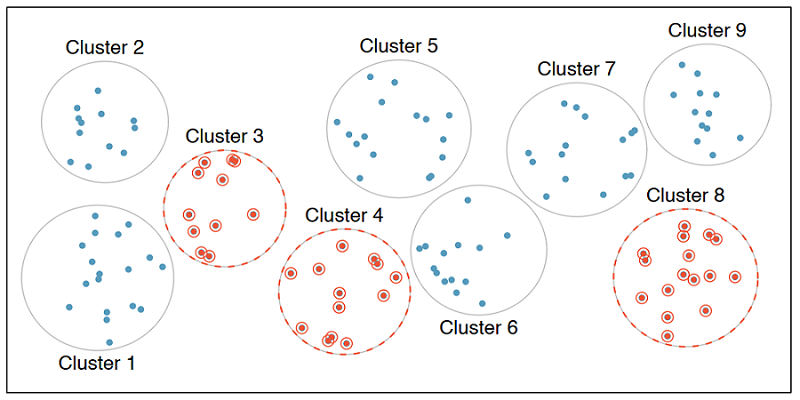
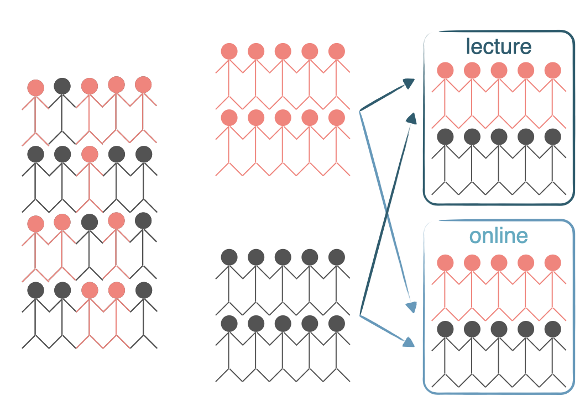

```{r setup, include=FALSE}
library(learnr)
library(usdata)
library(tidyverse)
library(emo)
library(glue)
shiny_url <- "https://oferengel-posit.shinyapps.io/"

gradethis::gradethis_setup(pass.praise = TRUE, fail.encourage = TRUE)
knitr::opts_chunk$set(echo = FALSE, message = FALSE, warning = FALSE)

# Used in some exercises
load("data/us_regions.RData")

county <- county |>
  filter(state != "District of Columbia") |>
  droplevels()

county_srs <- county |>
  slice_sample(n = 150)

# Hash generation helpers
# Should ideally be loaded from the imstutorials package when it exists
is_server_context <- function(.envir) {
  # We are in the server context if there are the follow:
  # * input - input reactive values
  # * output - shiny output
  # * session - shiny session
  #
  # Check context by examining the class of each of these.
  # If any is missing then it will be a NULL which will fail.
  
  inherits(.envir$input, "reactivevalues") &
    inherits(.envir$output, "shinyoutput") &
    inherits(.envir$session, "ShinySession")
}

check_server_context <- function(.envir) {
  if (!is_server_context(.envir)) {
    calling_func <- deparse(sys.calls()[[sys.nframe() - 1]])
    err <- paste0("Function `", calling_func, "`", " must be called from an Rmd chunk where `context = \"server\"`")
    stop(err, call. = FALSE)
  }
}
encoder_logic <- function(strip_output = FALSE) {
  p <- parent.frame()
  check_server_context(p)
  # Make this var available within the local context below
  assign("strip_output", strip_output, envir = p)
  # Evaluate in parent frame to get input, output, and session
  local(
    {
      encoded_txt <- shiny::eventReactive(
        input$hash_generate,
        {
          # shiny::getDefaultReactiveDomain()$userData$tutorial_state
          state <- learnr:::get_tutorial_state()
          shiny::validate(shiny::need(length(state) > 0, "No progress yet."))
          shiny::validate(shiny::need(nchar(input$name) > 0, "No name entered."))
          shiny::validate(shiny::need(nchar(input$studentID) > 0, "Please enter your student ID"))
          user_state <- purrr::map_dfr(state, identity, .id = "label")
          user_state <- dplyr::group_by(user_state, label, type, correct)
          user_state <- dplyr::summarize(
            user_state,
            answer = list(answer),
            timestamp = dplyr::first(timestamp),
            .groups = "drop"
          )
          user_state <- dplyr::relocate(user_state, correct, .before = timestamp)
          user_info <- tibble(
            label = c("student_name", "student_id"),
            type = "identifier",
            answer = as.list(c(input$name, input$studentID)),
            timestamp = format(Sys.time(), "%Y-%m-%d %H:%M:%S %Z", tz = "UTC")
          )
          learnrhash::encode_obj(bind_rows(user_info, user_state))
        }
      )
      output$hash_output <- shiny::renderText(encoded_txt())
    },
    envir = p
  )
}

hash_encoder_ui <- {
  shiny::div("If you have completed this tutorial and are happy with all of your", "solutions, please enter your identifying information, then click the button below to generate your hash", textInput("name", "What's your name?"), textInput("studentID", "What is your student ID?"), renderText({
    input$caption
  }), )
}
```

## Sampling strategies

In this section, we discuss why and how to sample data.

In the previous lesson, when we defined observational studies and experiments, we mentioned working with samples from the population. But why do we sample in the first place? Why not try to collect data from the entire population of interest? Well, you could try, that is, try to take a census, but it isn't easy.

```{r quiz-why-not-census}
question_checkbox("Why would a sample be preferable to a census?", 
         allow_retry = TRUE, 
         random_answer_order = TRUE,
         answer("Cost-Effectiveness and Time Efficiency: Conducting a census involves collecting data from an entire population, which can be time-consuming and expensive. Sampling, on the other hand, involves collecting data from a smaller subset of the population, which is generally more cost-effective.", correct = TRUE), 
         answer("Flexibility in Research Design: Sampling allows researchers to adjust the sample size, selection methods, and other parameters to fit the specific research objectives and constraints.", correct = TRUE), 
         answer("Reduced Ethical Concerns: In some cases, obtaining informed consent or collecting data from every individual in a population may be ethically challenging. Sampling can be designed to address these concerns more effectively.", correct = TRUE), 
         answer("Reduced Response Burden: In a census, every individual or unit in the population is surveyed, which can lead to survey fatigue and reduced response rates. In a sample, only a portion of the population is surveyed, which can lead to higher response rates and better data quality.", correct = TRUE),
         answer("Accessibility to Hard-to-Reach Populations: Some populations may be difficult to access or unwilling to participate in a survey. Sampling methods can be designed to reach these populations more effectively", correct = TRUE) 
         )

```

### Sampling is natural

Think about something you are cooking we taste or in other words examine a small part of what we're cooking to get an idea about the dish as a whole. After all, we would never eat a whole pot of soup just to check its taste.

When you taste a spoonful of soup and decide the spoonful you tasted isn't salty enough, what you're doing is simply exploratory analysis for the sample at hand.

If you then generalize and conclude that your entire soup needs salt, that's making an inference.

For your inference to be valid, the spoonful you tasted, your sample, needs to be representative of the entire pot, your population.

If your spoonful comes only from the surface and the salt is collected at the bottom of the pot, what you tasted is probably not going to be representative of the whole pot.

On the other hand, if you first stir the soup thoroughly before you taste, your spoonful will more likely be representative of the whole pot.

Sampling data is a bit different than sampling soup though. So next, we'll introduce a few commonly used sampling methods: simple random sampling, stratified sampling, cluster sampling, and multistage sampling.

+---------------------------------------------------------------------+---------------------------------------------------------------------+
| {width="100%"}\           | {width="100%"}\       |
| Random sampling                                                     | Cluster sampling                                                    |
+---------------------------------------------------------------------+---------------------------------------------------------------------+
| {width="100%"}\ | {width="100%"}\ |
| Stratified sampling                                                 | Multistage sampling                                                 |
+---------------------------------------------------------------------+---------------------------------------------------------------------+

```{r quiz-sampling}
quiz(
  question("Randomly select cases from the population, such that each case is equally likely to be selected.", allow_retry = TRUE,
           random_answer_order = TRUE,
    answer("Random sampling", correct = TRUE),
    answer("Stratified sampling"),
    answer("Cluster sampling", message = "Try again!"),
    answer("Multistage sampling", message = "Try again!")
    ),
  question("First divide the population into homogeneous groups (aka strata), and then sample randomly from within each stratum. For example, if we wanted to make sure that people from low, medium, and high socioeconomic status are equally represented in a study, we would first divide our population into three groups and then sample from within each group.", allow_retry = TRUE,
           random_answer_order = TRUE,
    answer("Random sampling"),
    answer("Stratified sampling", correct = TRUE),
    answer("Cluster sampling", message = "Try again!"),
    answer("Multistage sampling", message = "Try again!")
    ),
  question("We divide the population into heterogenous groups (aka clusters), randomly choose a few clusters, and then sample all observations within these clusters", allow_retry = TRUE,
           random_answer_order = TRUE,
    answer("Random sampling"),
    answer("Stratified sampling"),
    answer("Cluster sampling", correct = TRUE),
    answer("Multistage sampling", message = "Try again!")
    ),
  question("Divide the population into (heterogenous) clusters, randomly sample a few clusters, and then we randomly sample observations from within those clusters. For example, one might divide a city into geographic regions that are on average similar to one other and then sample randomly from a few randomly picked regions in order to avoid traveling to all regions.", allow_retry = TRUE,
           random_answer_order = TRUE,
    answer("Random sampling"),
    answer("Stratified sampling"),
    answer("Cluster sampling"),
    answer("Multistage sampling", correct = TRUE)
    ),
  caption = "")

```

Cluster and multistage sampling are often used for economical reasons.

## Sampling in R

Suppose we want to collect data from counties in the United States, but we do not have the resources to obtain these data from all counties. Conveniently, however, we do have a list of all counties. This is publicly available information and is contained in the `county` dataset in the **usdata** package. You can read more about the data [here](https://openintrostat.github.io/usdata/reference/county.html).

### Setup

So, let's start by loading the necessary packages with the `library()` function. We need the **usdata** package for the relevant data frame and the **tidyverse** package for the sampling and grouping functions we'll introduce shortly.

```{r load-packages, echo=TRUE}
library(usdata)
library(tidyverse)
```

Next we'll work with the `county` data from the usdata package.

This data frame contains data from counties in all 50 states in the United States.

-   You can observe the `county` dataset by uncommenting the first line in the following code (remove the first hashtag `#`).
-   You can view the dataset's meta-data by uncommenting the second line (remove the second hashtag `#`).

```{r remove-dc, exercise=TRUE}
# county
# glimpse(county)
```

### Simple random sample

Suppose our limited resources require that we collect data from only *150* of the over *3000* counties in the United States.

One option is to take a simple random sample. We will use the `slice_sample()` function in dplyr (a package included in the tidyverse) to do this.

We start with the `county` data frame and pipe it into the `slice_sample()` function, setting the size (`n`) argument to 150. With the following code chunk, try the following:

-   Run as it is, and observe the results.
-   Pipe the result into a `glimpse` function. Notice the difference between the results!

```{r random-sample, exercise=TRUE}
# Simple random sample of 150 counties
county |>
  slice_sample(n = 150)

```

```{r random-sample-solution}
# Simple random sample of 150 counties
county |>
  slice_sample(n = 150) |>
  glimpse()

```

### 

A quick `glimpse()` shows that there are indeed *150* observations in this data frame. Note that your sample will look different than someone else's sample, even though you're running the exact same code. We are taking a random sample here, so your sample will be different than mine, just by random chance. However, the sample size should be the same since that is something we specified in the `slice_sample()` function.

### State distribution in a simple random sample

If our goal was to take a random sample of any 150 counties from the entire USA, we have accomplished our goal. But a random sample can take more counties from certain states and fewer from other. In other words, we may get a different number of counties from different states.

We can confirm this by counting the number of counties per state. To do so we group our data by state, then count the number of observations per state.

```{r random-sample3, exercise=TRUE}
# State distribution of SRS counties
county |>
  slice_sample(n = 150) |>
  group_by(state) |>
  count()
```

```{r q-group-by}
question("What is the function of `group_by` in the code above? Try to remove it and run the code to see what happens.", 
         allow_retry = TRUE,
         random_answer_order = TRUE,
    answer("`group_by` tells the `count` function to count the number of states separately for each county", message = "Try again. Remember that each state consists of multiple counties."), 
    answer("`group_by` tells the `count` function to count the number of all the counties in our sample", message = "Try again. Try removing the third line from the code above and running it again."), 
    answer("`group_by` tells the `count` function to count the number of counties separately for each state", correct = TRUE), 
    answer("Removing the `group_by` clause tells the `count` function to count the number of all the counties  in our sample", correct = TRUE))
```

The resulting output shows that this sampling approach yielded data from less than *50* states, some states are over-represented in our sample and some are under represented. The number of counties sampled varies from state to state.

If we instead want to sample three counties per state to make up our sample of 150 counties, we should use stratified sampling.

### Stratified sample

The code looks very similar to how we selected the simple random sample, except that *before* sampling we **first** group by state and **then sample** three observations per group.

A quick glimpse at the resulting data frame confirms that we indeed have *150* observations in this sample. In the following code do the following:

-   Run it as is, checking how many counties you have from each state.
-   Pipe the results into the `count(___)` clause to count the number of counties sampled in each state (you will need to remove the `#` hash signs)

```{r stratified-sample, exercise=TRUE}
# Stratified sample of 150 counties, each state is a stratum
county |>
  group_by(state) |>
  slice_sample(n = 3) # |>
# count(___)
```

```{r stratified-sample-solution}
# Stratified sample of 150 counties, each state is a stratum
county |>
  group_by(state) |>
  slice_sample(n = 3) |> 
  count(state)
```

We can now see that from every state we have sampled exactly three counties.

Now it's your turn to take a sample!

### Exercise: Simple random sample in R

Suppose we want to collect some data from a sample of eight states. A list of all states and the region they belong to (Northeast, Midwest, South, West) are given in the `us_regions` data frame.

The dplyr package and `us_regions` data frame have been loaded. Use the code below to `glimpse` to the structure of this dataset.

```{r us_regions, exercise=TRUE}
# Simple random sample: states_srs
glimpse(___)
```

```{r us_regions_solution}
# Simple random sample: states_srs
glimpse(us_regions)
```

### 

You can see that the dataset `us_regions` has only two columns:

-   `state` is the name of the state
-   `region` the region to which the state belongs

We now want to use simple random sampling to select eight states from `us_regions`. Because it is a random sample (and not stratified sampling), we don't expect regions to be represented equally!

```{r simple-random-sample, exercise=TRUE}
# Simple random sample: states_srs
us_regions |>
  slice_sample(___) |>
  count(___)
```

```{r simple-random-sample-solution}
# Simple random sample
us_regions |>
  slice_sample(n = 8) |>
  count(region)
```

### Exercise: Stratified sample in R

In the previous exercise, we took a simple random sample of eight states. However, we did not have any control over how many states from each region got sampled. The goal of stratified sampling in this context is to have control over the number of states sampled from each region. Our goal for this exercise is to sample an equal number of states from each region.

```{r q-stratifying-howto}
question("What do we need to do in order to make sure two states are chosen from each region?", 
         allow_retry = TRUE,
         random_answer_order = TRUE,
    answer("Use a `group_by(region)` clause before sampling", correct = TRUE, message = "This will sample the groups (regions) rather than the counties."),
    answer("Use a `group_by(region)` clause after sampling", correct = TRUE, message = "This will sample the same number of counties from each region")
)
```

### 

For this exercise you should use stratified sampling to select a total of eight states, two from each stratum, where each stratum is a region of the country. We can break this down into three steps:

1.  group the dataset by region (using `group_by()`)
2.  sample two states from each region (using `slice_sample(n=2)`)
3.  count the number of states from each region in your sample to confirm that each region is represented equally in your sample.

```{r stratified-sample4, exercise=TRUE}
# Stratified sample
us_regions |>
  group_by(___) |>
  slice_sample(___) |> 
  count(___)

```

```{r stratified-sample4-solution}
# Stratified sample
us_regions |>
  group_by(region) |>
  slice_sample(n = 2) |> 
  count(region)
```

### Exercise: Compare random sampling to stratified sampling

```{r quiz-compare-SRS-stratified-sample}
quiz(
  question("Which method you implemented, simple random sampling or stratified sampling, ensured an equal number of states from each region?", correct = "Super! Simple random sampling would result in different amounts of data being sampled from each state.", allow_retry = TRUE,
    answer("Simple random sampling", message = "Try again!"),
    answer("Stratified sampling", correct = TRUE)), caption = "")
```

## Principles of experimental design

In this section, we discuss principles of experimental design: *control, randomize, replicate, and block*.

To **control** means to compare the treatment of interest to a control group.

To **randomize** means to randomly assign subjects to treatments.

To **replicate** means to collect a sufficiently large sample within a study or to replicate the entire study.

And the last principle of experimental design is **blocking**. The goal of blocking is to account for the potential effect of known or suspected confounding variables. We do this by first grouping subjects into blocks based on these variables and then randomizing them within each block to treatment groups.

Let's discuss blocking a bit more.

### Design a study, with blocking

We would like to design an experiment to investigate whether students learn the R language better in a traditional lecture based course or using an interactive online learning platform. Two courses that teach the exact same material are designed and the only difference between these courses is the method of delivery: traditional lecture or interactive online.

We sample a group of students for our study that we will randomly assign to these two courses.

But before we do so, we need to consider any potential confounding variables. It is suspected that previous programming experience might have an effect on how students learn in these two settings and we know that some of the students in our study have previous programming experience and some don't. Therefore we decide to block for having previous programming experience.

To do so, we divide our sample into two, those with programming experience and those without.

Then, we randomly assign individuals from each block into the two courses, ensuring that those with and without programming experience are equally represented in the two treatment groups.

{width="50%"}

In this experiment the *explanatory* variable is the *course type* lecture versus interactive online and the variable that we're *blocking* for is *previous programming experience*.

This way, if we find a difference in mastery of the R language between students in the two courses, we will be able to attribute it to the course type and can be assured that the difference isn't due to previous programming experience since both those with and without such experience were equally represented in the two treatment groups.

Now it's time to practice these experimental design concepts.

### Identifying components of a study

A researcher designs a study to test the effect of light and noise levels on exam performance of students. The researcher also believes that light and noise levels might have different effects on males and females, so she wants to make sure both sexes are represented equally under different conditions.

```{r quiz-identify-study-components}
quiz(
  question("Which of the below is correct?", correct = "Nice job!", allow_retry = TRUE,
    answer("There are 3 explanatory variables (light, noise, sex) and 1 response variable (exam performance).", message = "Close, but sex is thought to be a confounding variable, not an explanatory one!"),
    answer("There is 1 explanatory variable (sex) and 3 response variables (light, noise, exam performance).", message = "Not quite!"),
    answer("There are 2 blocking variables (light and noise), 1 explanatory variable (sex), and 1 response variable (exam performance).", message = "Incorrect!"),
    answer("There are 2 explanatory variables (light and noise), 1 blocking variable (sex), and 1 response variable (exam performance).", correct = TRUE)), caption = "")
```

### Experimental design terminology

\_\_\_ variables are conditions you can impose on the experimental units, while \_\_\_ variables are characteristics that the experimental units come with that you would like to control for.

```{r quiz-experimental-desing-terminology}
quiz(
  question("", correct = "Nice job!", allow_retry = TRUE,
    answer("Blocking, explanatory", message = "Not quite!"),
    answer("Explanatory, blocking", correct = TRUE),
    answer("Control, treatment", message = "Nope, try again!"),
    answer("Treatment, control", message = "Try again!")), caption = "")
```

### Connect blocking and stratifying

In random sampling, we use \_\_\_ to control for a variable. In random assignment, we use \_\_\_ to achieve the same goal.

```{r quiz-blocking-and-stratifying}
quiz(
  question("", correct = "Correct!", allow_retry = TRUE,
    answer("stratifying, blocking", correct = TRUE),
    answer("blocking, stratifying", message = "Incorrect!"),
    answer("confounding, stratifying", message = "Not quite!"),
    answer("confounding, blocking", message = "Try again!")), caption = "")
```

## Congratulations!

You have successfully completed Lesson 3 in Tutorial 1: Introduction to data. If you need to generate a hash for submission, click "Next Topic".

```{r, child="../01-data-footer.rmd"}

```
