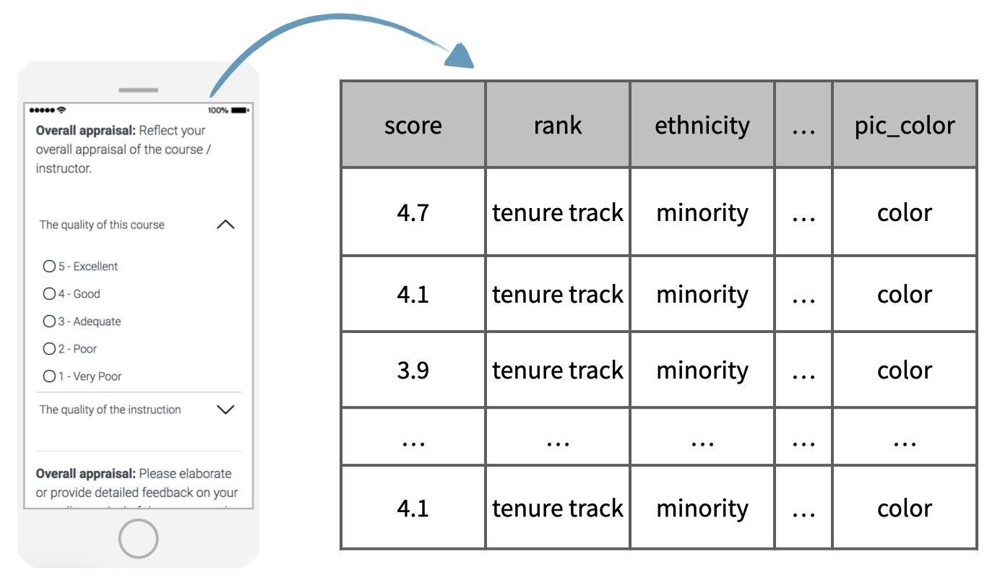

```{r setup, include=FALSE}
library(learnr)
library(openintro)
library(tidyverse)
library(emo)
library(glue)
shiny_url <- "https://oferengel-posit.shinyapps.io/"

gradethis::gradethis_setup(pass.praise = TRUE, fail.encourage = TRUE)
knitr::opts_chunk$set(echo = FALSE, message = FALSE, warning = FALSE)
# Used in some exercises
# Recode cls_students as cls_type
evals <- evals |>
  # mutate(cls_type = case_when(
  #   cls_students <= 18                      ~ "small",
  #   cls_students >= 19 & cls_students <= 59 ~ "midsize",
  #   cls_students >= 60                      ~ "large"
  #   )
  # ) |> 
  select(course_id, 
        prof_id, 
        score, 
        rank, 
        ethnicity, 
        gender, 
        age, 
        cls_perc_eval,
        cls_students, 
        bty_avg)

# Hash generation helpers
# Should ideally be loaded from the imstutorials package when it exists
is_server_context <- function(.envir) {
  # We are in the server context if there are the follow:
  # * input - input reactive values
  # * output - shiny output
  # * session - shiny session
  #
  # Check context by examining the class of each of these.
  # If any is missing then it will be a NULL which will fail.
  
  inherits(.envir$input, "reactivevalues") &
    inherits(.envir$output, "shinyoutput") &
    inherits(.envir$session, "ShinySession")
}

check_server_context <- function(.envir) {
  if (!is_server_context(.envir)) {
    calling_func <- deparse(sys.calls()[[sys.nframe() - 1]])
    err <- paste0("Function `", calling_func, "`", " must be called from an Rmd chunk where `context = \"server\"`")
    stop(err, call. = FALSE)
  }
}
encoder_logic <- function(strip_output = FALSE) {
  p <- parent.frame()
  check_server_context(p)
  # Make this var available within the local context below
  assign("strip_output", strip_output, envir = p)
  # Evaluate in parent frame to get input, output, and session
  local(
    {
      encoded_txt <- shiny::eventReactive(
        input$hash_generate,
        {
          # shiny::getDefaultReactiveDomain()$userData$tutorial_state
          state <- learnr:::get_tutorial_state()
          shiny::validate(shiny::need(length(state) > 0, "No progress yet."))
          shiny::validate(shiny::need(nchar(input$name) > 0, "No name entered."))
          shiny::validate(shiny::need(nchar(input$studentID) > 0, "Please enter your student ID"))
          user_state <- purrr::map_dfr(state, identity, .id = "label")
          user_state <- dplyr::group_by(user_state, label, type, correct)
          user_state <- dplyr::summarize(
            user_state,
            answer = list(answer),
            timestamp = dplyr::first(timestamp),
            .groups = "drop"
          )
          user_state <- dplyr::relocate(user_state, correct, .before = timestamp)
          user_info <- tibble(
            label = c("student_name", "student_id"),
            type = "identifier",
            answer = as.list(c(input$name, input$studentID)),
            timestamp = format(Sys.time(), "%Y-%m-%d %H:%M:%S %Z", tz = "UTC")
          )
          learnrhash::encode_obj(bind_rows(user_info, user_state))
        }
      )
      output$hash_output <- shiny::renderText(encoded_txt())
    },
    envir = p
  )
}

hash_encoder_ui <- {
  shiny::div("If you have completed this tutorial and are happy with all of your", "solutions, please enter your identifying information, then click the button below to generate your hash", textInput("name", "What's your name?"), textInput("studentID", "What is your student ID (Gebruikersnaam  s-/p-nummer)?"), renderText({
    input$caption
  }), )
}
```


## Case study

In this last lesson of the tutorial, we will work on a case study, based on data from a study titled "[Beauty in the Classroom](https://www.sciencedirect.com/science/article/abs/pii/S0272775704001165)".

 
College courses often conclude by giving students the opportunity to anonymously evaluate both the course and the instructor. The question that motivated this study was whether a teacher's attractiveness affects their anonymous evaluations.

{width="70%"}

The data in this case study consists of course evaluations as well as scoring of professors' physical attractiveness. The data was collected as part of a study conducted at University of Texas, Austin.


## Exercise: Beauty in the classroom

### Inspect the data

The purpose of this lesson is to give you an opportunity to apply and practice what you've learned on a real world dataset. For this reason, we'll provide a little less guidance than usual.

Inspect the `evals` data frame using techniques you learned in previous lessons. Use an approach that shows you how many observations and variables are included in the dataset. This data is in the **openintro** package and we will use functions from the **tidyverse** for our analysis. You can read more about the data [here](http://openintrostat.github.io/openintro/reference/evals.html). 

Note that for the purposes of this analysis we have added an additional variable to the dataset, `cls_type`. This variable classifies classes as small, midsize, or large, depending on the number of students in the class. This was done using the following.

```{r echo = TRUE, eval=FALSE}
evals |>
  mutate(cls_type = case_when(
    cls_students <= 18 ~ "small",
    cls_students <= 59 ~ "midsize",
    cls_students >= 60 ~ "large"
    )
  )
```


```{r inspect-data, exercise=TRUE, exercise.lines=5}
# Inspect evals
```

```{r inspect-data-solution}
# Inspect evals
glimpse(evals)

# Alternative solution
dim(evals)
```

### Identify type of study

```{r quiz-identify-type-study}
quiz(
  question("What type of study is this?", correct = "How observant! It was an observational study.", allow_retry = TRUE,
    answer("Observational study", correct = TRUE),
    answer("Experiment", message = "Try again!")
    ), 
  question("Each row (observation) in this data set represents _____.", correct = "Good!", allow_retry = TRUE,
    answer("a class", correct = TRUE),
    answer("a student", message = "Try again!"),
    answer("a school", message = "Nope!")
    ), caption = "")
```

## Variables in the data

Let's take a closer look at each of the variables in the course evaluations dataset.

Remember that using the `glimpse()` function we can obtain a list of the variables and take a peek at the first few observations from each.

```{r glimpse-evals, exercise=TRUE}
# Glimpse the data
glimpse(___)
```


```{r glimpse-evals-solution}
# Glimpse the data
glimpse(evals)
```
Besides two id columns, we have the following variables: 

-   `score` is the average evaluation score of the professor for a given course. Scores range between 1 and 5 with 1 being a poor evaluation and 5 being an excellent evaluation.
-   The variables `rank`, `ethnicity`, `gender` and `age` are about the professor. Their rank (teaching faculty, tenure track, or tenured), Whether they are from a minority, whether they are male or female, and their age. 
-   `cls_perc_eval` is the percent of students who completed the evaluations, number of students who completed the evaluations, 
-   `cls_students` is the total number of students in the class, 
-   `bty_avg` is the average attractiveness score of the professors in the sample. This was determined by six students who were provided photos of the professors to rate, 3 female students and 3 male students. In their scoring 1 indicates a low attractiveness score and 10 a high attractiveness score.

```{r quiz-which-cat}
question("Which of the variables are categorical?", allow_retry = TRUE,
    answer("score"), 
    answer("rank", correct = TRUE),
    answer("ethnicity", correct = TRUE), 
    answer("gender", correct = TRUE), 
    answer("age"), 
    answer("cls_perc_eval"), 
    answer("cls_students"), 
    answer("bty_avg")
    )
```


### Recode a variable

The `cls_students` variable in `evals` tells you the number of students in the class. Suppose instead of the exact number of students, you're interested in whether the class is 

*   `"small"` (18 students or fewer), 
*   `"midsize"` (19 - 59 students), or 
*   `"large"` (60 students or more).


Recode the `cls_students` variable into a new variable, `cls_type`, using `case_when()`. This command is part of the tidyverse package. If you are unsure how to use the clause, try searching it on the web in combination with `tidyverse`.

This new variable should have three levels  as  described above. Save the resulting data frame (with the new variable) as `evals`. 

- *What type of variable is `cls_type`?*

```{r type-of-variable, exercise=TRUE}
# Recode cls_students as cls_type
evals <- evals |>
  mutate(
    cls_type = case_when(
      ___ ~ "small",
      ___ ~ "midsize",
      ___ ~ "large"
    )
  )

evals
```


```{r type-of-variable-hint-1}
# Recode cls_students as cls_type
evals <- evals |>
  mutate(
    cls_type = case_when(
      cls_students <= ___ ~ "small",
      ___ <= ___ ~ "midsize",
      ___ >= ___ ~ "large"
    )
  )

evals
```


```{r type-of-variable-hint-2}
# Recode cls_students as cls_type
evals <- evals |>
  mutate(
    cls_type = case_when(
      cls_students <= 18 ~ "small",
      ___ <= ___ ~ "midsize",
      ___ >= ___ ~ "large"
    )
  )

evals
```

```{r type-of-variable-hint-3}
# Recode cls_students as cls_type
evals <- evals |>
  mutate(
    cls_type = case_when(
      cls_students <= 18 ~ "small",
      cls_students <= 59 ~ "midsize",
      ___ >= ___ ~ "large"
    )
  )

evals
```

```{r type-of-variable-solution}
# Recode cls_students as cls_type
evals <- evals |>
  mutate(
    cls_type = case_when(
      cls_students <= 18 ~ "small",
      cls_students <= 59 ~ "midsize",
      cls_students >= 60 ~ "large"
    )
  )

evals
```

```{r prepare_classtype, echo=FALSE, include=FALSE}
# Recode cls_students as cls_type
evals <- evals |>
  mutate(
    cls_type = case_when(
      cls_students <= 18 ~ "small",
      cls_students <= 59 ~ "midsize",
      cls_students >= 60 ~ "large"
    )
  )

evals
```

To see the `cls_type` variable, you will need to scroll to the right most column. The new variable is added at the very end of the dataset.


### Create a scatterplot

The `bty_avg` variable shows the average beauty rating of the professor by the six students who were asked to rate the attractiveness of these faculty. The `score` variable shows the average professor evaluation score, with 1 being *very unsatisfactory* and 5 being *excellent*.

-   Use `ggplot()` to create a scatterplot displaying the relationship between these two variables. 
-   To create a scatter plot, add a `+ geom_point()` layer   
- *How would you describe the relationship apparent in this visualization?*

```{r create-scatterplot, exercise=TRUE,  exercise.setup="prepare_classtype"}
# Scatterplot of score vs. bty_avg
___(evals, ___) +
  ___
```

```{r create-scatterplot-solution}
# Scatterplot of score vs. bty_avg
ggplot(evals, aes(x = bty_avg, y = score)) +
  geom_point()
```

### Create a scatterplot, with an added aesthetic

Suppose you are interested in evaluating how the relationship between a professor's attractiveness and their evaluation score varies across different class types (small, midsize, and large).

- Recreate your visualization from the previous exercise, but this time color the points by class type (you will need to map the `color` of the point to the variable `cls_type`)

- *How would you describe the relationship apparent in this visualization?*

```{r scatterplot-added-layer, exercise=TRUE,  exercise.setup="prepare_classtype"}
# Scatterplot of score vs. bty_avg colored by cls_type
___(evals, ___) +
  ___
```

```{r scatterplot-added-layer-solution}
# Scatterplot of score vs. bty_avg colored by cls_type
ggplot(evals, aes(x = bty_avg, y = score, color = cls_type)) +
  geom_point()
```


## Congratulations!

You have successfully completed all of the lessons in Tutorial 1: Introduction to data.
If you need to generate a hash for submission, click "Next Topic".

You now know how to get started with data analysis! In this tutorial you have learned concepts and terminology related to study design and the first steps of working with a dataset. We have also laid the foundation for using certain R packages, like dplyr for data wrangling and ggplot2 for data visualization.

We hope you enjoyed the tutorial and that the topics we discussed in this tutorial motivated you to learn more data analysis and statistics. What we covered in this tutorial is just the tip of the iceberg, so we hope you decide to dive deeper to learn more.


```{r footer-setup}
library(glue)
shiny_url <- "https://oferengel-posit.shinyapps.io/"

```

What's next?

`r emo::ji("ledger")` [Full list of tutorials](https://oferengel.github.io/ims-tutorials-4-umcg/)

`r emo::ji("spiral_notepad")` [Tutorial 1: Introduction to data](https://oferengel.github.io/ims-tutorials-4-umcg/01-data/)

`r emo::ji("one")` [Lesson 1.1: Language of data](%60r%20glue(%22%7Bshiny_url%7D01-01-lesson/%22)%60)

`r emo::ji("two")` [Tutorial 1 - Lesson 2: Types of studies](%60r%20glue(%22%7Bshiny_url%7D01-02-lesson/%22)%60)

`r emo::ji("four")` [Tutorial 1 - Lesson 3: Case study](%60r%20glue(%22%7Bshiny_url%7D01-04-lesson/%22)%60)

## Hash and submit

```{r encoder, echo=FALSE, context="server"}
encoder_logic()
```

```{r encode, echo=FALSE}
learnrhash::encoder_ui(ui_before = hash_encoder_ui)
```

### Submit your hash in a form

After creating the hash, please copy it, navigate to [this form](https://forms.gle/ajEDfePc1jcTukyB7) and fill it in and submit. You will need to submit the form once for every lesson you complete in this tutorial.

```{r img-submit, message=FALSE, warning=FALSE, fig.align='center', out.width="50%"}

```

