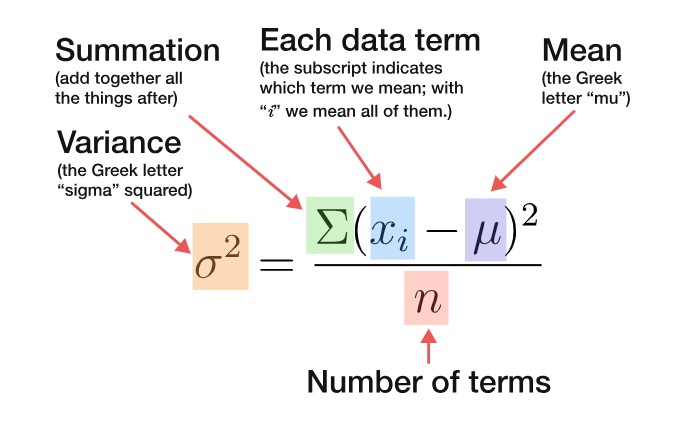

```{r setup, include=FALSE}
library(learnr)
library(gradethis)
library(glue)

gradethis::gradethis_setup(pass.praise = TRUE, fail.encourage = TRUE)

# put figures in center
knitr::opts_chunk$set(fig.align = 'center')
# The ID to look for in the student document
options(tutorial.id = "UMCG/centrality-spread")

library(tidyverse)
knitr::opts_chunk$set(comment = "", echo = FALSE)


# Hash generation helpers
# Should ideally be loaded from the imstutorials package when it exists
is_server_context <- function(.envir) {
  # We are in the server context if there are the follow:
  # * input - input reactive values
  # * output - shiny output
  # * session - shiny session
  #
  # Check context by examining the class of each of these.
  # If any is missing then it will be a NULL which will fail.
  
  inherits(.envir$input, "reactivevalues") &
    inherits(.envir$output, "shinyoutput") &
    inherits(.envir$session, "ShinySession")
}

check_server_context <- function(.envir) {
  if (!is_server_context(.envir)) {
    calling_func <- deparse(sys.calls()[[sys.nframe() - 1]])
    err <- paste0("Function `", calling_func, "`", " must be called from an Rmd chunk where `context = \"server\"`")
    stop(err, call. = FALSE)
  }
}
encoder_logic <- function(strip_output = FALSE) {
  p <- parent.frame()
  check_server_context(p)
  # Make this var available within the local context below
  assign("strip_output", strip_output, envir = p)
  # Evaluate in parent frame to get input, output, and session
  local(
    {
      encoded_txt <- shiny::eventReactive(
        input$hash_generate,
        {
          # shiny::getDefaultReactiveDomain()$userData$tutorial_state
          state <- learnr:::get_tutorial_state()
          shiny::validate(shiny::need(length(state) > 0, "No progress yet."))
          shiny::validate(shiny::need(nchar(input$name) > 0, "No name entered."))
          shiny::validate(shiny::need(nchar(input$studentID) > 0, "Please enter your student ID"))
          user_state <- purrr::map_dfr(state, identity, .id = "label")
          user_state <- dplyr::group_by(user_state, label, type, correct)
          user_state <- dplyr::summarize(
            user_state,
            answer = list(answer),
            timestamp = dplyr::first(timestamp),
            .groups = "drop"
          )
          user_state <- dplyr::relocate(user_state, correct, .before = timestamp)
          user_info <- tibble(
            label = c("student_name", "student_id"),
            type = "identifier",
            answer = as.list(c(input$name, input$studentID)),
            timestamp = format(Sys.time(), "%Y-%m-%d %H:%M:%S %Z", tz = "UTC")
          )
          learnrhash::encode_obj(bind_rows(user_info, user_state))
        }
      )
      output$hash_output <- shiny::renderText(encoded_txt())
    },
    envir = p
  )
}

hash_encoder_ui <- {
  shiny::div("If you have completed this tutorial and are happy with all of your", "solutions, please enter your identifying information, then click the button below to generate your hash", textInput("name", "What's your name?"), textInput("studentID", "What is your student ID?"), renderText({
    input$caption
  }), )
}

```

## Welcome

One of the problems of analyzing data sets is that it is easy to miss the wood for the trees. Extracting the salient features out of complex data, statistical indicators help us tease out the signal from the noise.

Two types of indicators are known as measures of `centrality` and measures of `spread`.

```{r centralilty-spread-1}
quiz(caption = "",
    question(
      "Which of the following are measures of centrality?",
      answer("mean", correct = TRUE), 
      answer("median", correct = TRUE), 
      answer("mode", correct = TRUE), 
      answer("variance"),
      answer("inter quartile range  (IQR)"),
      answer("range"),
      answer("probability distribution"),
      message = "The `mean` is the sum of our observations divided by the count of observations, <br/>The `median` is a number that is the value that splits a set in half when it is ordered from smallest to the largest, , <br/>The `mode` is the observation appearing most frequently in our data",
      allow_retry = TRUE, 
      random_answer_order = TRUE
  ),
  question(
      "Which of the following are measures of spread?",
      answer("mean"), 
      answer("median"), 
      answer("mode"), 
      answer("variance", correct = TRUE),
      answer("inter quartile range (IQR)", correct = TRUE),
      answer("range", correct = TRUE),
      answer("probability distribution"),
      message = "The `variance` is the average of the square distances between each observed value and the mean observation, <br/> The `range` is the difference between the largest observation and the smallest one, <br/>The `IQR` is the difference between the third and first quartile, <br/>The `probability distribution` maps an observed value to the probability of observing it, it is not considered a measure of the data.",
      allow_retry = TRUE, 
      random_answer_order = TRUE
  )
)

```

## Measures of central tendency: mean and median

For a refresher on measures of central tendency, please watch [this video](https://www.youtube.com/watch?v=kn83BA7cRNM){target="_blank" rel="noopener noreferrer"}.

```{r centrality-fig1, fig.height=1.5, fig.width=3}
bus.wait <- c(10, 10, 15, 18, 22)
# sum(bus.wait)

ggplot() + 
  geom_dotplot(aes(x = bus.wait), 
               binwidth = 1) + 
  scale_x_continuous(breaks = unique(bus.wait)) +
  scale_y_continuous(labels = NULL, limits = c(0,.01)) + 
  theme_classic()  + 
  labs(x = NULL, y=NULL) + 
  theme(text = element_text(size = 17), 
        legend.position = "none", 
        axis.line.y = element_blank(), 
        axis.ticks  = element_blank()) 

```

You want to estimate the average time you wait at the bus stop. Every time you reach it, you set your stopwatch and measure the time until the bus arrives. After five days, you collected five measurements (in minutes): 10, 10, 15, 18, 22.

```{r mean-spread}
quiz(caption = "",
     question(
      "What is the mean waiting time for your bus?", 
      answer("10 minutes"),
      answer("15 minutes", correct = TRUE),
      answer("20 minutes"),
      incorrect = "Add up all the numbers and divide by five",
      allow_retry = TRUE
      ),
     question(
     "What is the median waiting time for your bus?", 
      answer("10 minutes"),
      answer("15 minutes", correct = TRUE),
      answer("20 minutes"),
      incorrect = "Sort the numbers and choose the middle one",
      allow_retry = TRUE
       )
  )

     
```

### 

+-----------------------------------------------------------------------------------------------------------------------------------+-----------------------------------------------------------:+
| The mean and the median are exactly the same in this exercise, this is a sign that the mean is right in the middle of our sample. | {width="217"}\ |
|                                                                                                                                   | <font size="1"> Attribution: publicdomainq.net</font>      |
+-----------------------------------------------------------------------------------------------------------------------------------+------------------------------------------------------------+

### 

```{r centrality-fig2, fig.height=1.5, fig.width=3}

new.bus.wait <- c(bus.wait, 13, 17)

ggplot() + 
  geom_dotplot(aes(x = bus.wait), 
               binwidth = 1) + 
  geom_dotplot(aes(x=c(13, 17), fill = "red"), 
               binwidth = 1, color="red") +
  scale_x_continuous(breaks = unique(new.bus.wait)) +
  scale_y_continuous(labels = NULL) + 
  theme_classic()  + 
  labs(x = NULL, y=NULL) + 
  theme(text = element_text(size = 15), 
        legend.position = "none", 
        axis.line.y = element_blank(), 
        axis.ticks  = element_blank()) 

```

```{r centralilty-2, fig.height=3, fig.width=3}
quiz(caption = "",
     question(
       "After two more days of bus waiting, you add two observations to your data: on the first day you waited for the bus 13 minutes, and on the second 17 minutes. What happened to the mean and the median?", 
       answer("The mean and the median would stay the same", correct = TRUE), 
       answer("The mean would increase and the median would stay the same"), 
       answer("The mean would decrease and the median would stay the same"), 
       answer("None of the above"),
       incorrect = "Calculate the mean by adding up all the numbers and dividing by the sample size",
       message = "Notice that adding up the new observations (13 and 17), you effectively add twice the mean, which is 15. Adding the mean value to a set of numbers will not change their mean (try to reason why that is!).<br/>We can add the mean as many times as we want without changing the mean of the overall set.",
    allow_retry = TRUE, 
    random_answer_order = FALSE 
    )
  )

 
     
```

We observe the numbers: $\{7, 8, 8 , 9, 20, 20, 30\}$

```{r centrality-fig3, fig.height=1.5, fig.width=5}
x <- c(7, 8, 8 , 9, 20, 20, 30)

ggplot() + 
  geom_dotplot(
    aes(
      x=x,
      fill=letters[rank(x)]
    ), color = NA, binwidth = 1) + 
  scale_x_continuous(breaks = x) +
  scale_y_continuous(labels = NULL) + 
  theme_classic()  + 
  labs(x = NULL, y=NULL) + 
  theme(text = element_text(size = 15), 
        legend.position = "none", 
        axis.line.y = element_blank(), 
        axis.ticks  = element_blank()) 
# mean(x)
# median(x)

```

```{r centralilty-3, fig.height=3, fig.width=3}
quiz(caption = "",
     question(
       "Given the set of values, which is larger: the median or the mean?", 
       answer("mean", correct = TRUE),
       answer("median"),
       answer("mean and median are equal"),
       incorrect = "Not quite. Since we have an odd number of observations, the median is simply the middle of the set, when ordered from least to greatest. When calculating the mean, we add up all the numbers and divide by the sample size. Try again!", 
       correct = "We can reason that though observations are mostly clustered around the median, those that are far away from the median (at 20 and 30) will have a bigger influence on the mean than on the median. ",
       allow_retry = TRUE
       ), 
     question_checkbox(
       "You want to calculate the mean and median of a set consisting of ninety-nine times observing the value zero, followed by a single value 100 $X=\\{0,0,0,0,\\ldots,100 \\}$. <br/>Which of the following is correct?", 
       answer("The median of this set is 0", correct = TRUE),
       answer("The median is 1"),
       answer("The mean is 1", correct = TRUE),
       answer("The mean is 0"),
       try_again = "Most of the numbers in the set are zero, so the middle of the set (i.e. the median) must be zero. To calculate the mean we add up ninety-nine of zeros and the number 100, giving a total sum of $99\\cdot0 + 1\\cdot100 = 100$. Now divide this sum by the size of the set (i.e, 100) to get the mean.",
       correct = "Most of the numbers in the set are zero, so the middle of the set (i.e. the median) must be zero. To calculate the mean we add up ninety-nine of zeros and the number 100, giving a total sum of $99\\cdot0 + 1\\cdot100 = 100$. Dividing the sum by the size of the set (i.e, 100), the mean is 1.<br/><br/>The mean of this set is influenced by the extreme value 100, but the median is not. ",
       allow_retry = TRUE, 
       random_answer_order = FALSE
       )
)

```

### 

Notice how in this example, where there is one extreme value (at 100), the mean is larger than the median. In general, extreme values affect the mean much more than the median.

::: tip
The mean and median are known as measures of central tendency. They both give a sense of what the "center" of the distribution is, although they do it in slightly different ways. If you need to predict the next number coming from a distribution, choose which measure of central tendency is most appropriate, depending on your goals and the cost and benefits of making an error.

The mean is the sum of the numbers in the set divided by the size of the set.

```{r mean-formula, out.width="80%"}

```


The median is the middle number of the set when it is written in ascending order. If there are an even number of items in the set, the median is the mean of the middle two numbers.

The two measures are similar in that they provide a sense of a typical number in our data set. Yet they also behave differently: the mean tends to be influenced by extreme values, but the median is not. You can also use R to calculate these measures.
:::

Of course you can use code to calculate the mean and the median! For example, try to calculate the mean of the numbers {1, 9, 10}

```{r centrality-4-mean, exercise=TRUE}
# calculate the mean of the numbers {1, 9, 10}.
c(___, ___, ___) %>% mean()
```

```{r centrality-4-mean-check}
grade_result(
  pass_if(~ identical(.result, mean(c(1, 9, 10))), "Good job!")
)
```

```{r centrality-5-median, exercise=TRUE}
# calculate the median of the numbers {1, 9, 10}.
___ %>% median()
```

```{r centrality-5-median-check}
grade_result(
  pass_if(~ identical(.result, median(c(1, 9, 10))), "Good job!")
)
```

Because there is a clustering of two numbers close together $\{9,10\}$, the "outlier" $\{1\}$ has more of an effect on the mean than on the median, which is why, in this exercise, the mean is smaller than the median.

```{r centralilty-6}
quiz(caption = "",
     question(
       "Is it possible to add a single number to the set $\\{1, 9,10\\}$ such that the mean increases yet the median decreases?", 
       answer("yes", correct = TRUE),
       answer("no"),
       correct = "Right on! The mean is smaller than the median, so if you add a number that is between the mean and the median, it will pull up the mean and pull down the median.",
       incorrect = "Try again! The mean is smaller than the median, so if you add a number that is between the mean and the median, it will pull up the mean and pull down the median.",
       allow_retry = TRUE
       )
  )

```

Choose a value between the mean and the median of the set $X=\{1, 9, 10\}$ and add it in the code below. Then run the code and convince yourself that this new number increased the mean and decreased the median:

```{r centrality-7, exercise=TRUE}
x_new_value <- ___
# The mean of the original set 
old_mean <- c(1, 9, 10) %>% mean()
# The mean with your new value
new_mean <- c(1, 9, 10, ___) %>% mean()
glue("Holla! Adding the value {x_new_value} increased the mean from {old_mean} to {new_mean}!") %>% 
  print()

 # The median of the original set 
old_median <- c(1, 9, 10) %>% median()
# The median goes down after adding the the new value
new_median <- c(1, 9, 10, ___) %>% median()
glue("Gracious me! The same value decreased the median from {old_median} to {new_median}!")%>% 
  print()

```


```{r centrality-7-solution}
x_new_value <- 7
# The mean of the original set 
old_mean <- c(1, 9, 10) %>% mean()
# The mean with your new value
new_mean <- c(1, 9, 10, x_new_value) %>% mean()
glue("Holla! Adding the value {x_new_value} 
     increased the mean from {old_mean} to {new_mean}!") %>% 
  print()

 # The median of the original set 
old_median <- c(1, 9, 10) %>% median()
# The median goes down after adding the the new value
new_median <- c(1, 9, 10, x_new_value) %>% median()
glue("Gracious me! The same value decreased
     the median from {old_median} to {new_median}!")%>% 
  print()

```

### Central tendency: a conclusion {.tip}
The mean and median are both measures of central tendency, but they have different properties: extreme values influences the mean but not the median.

Measures of central tendency are important, because they tell us something about the typical values in a set. If we know that a number comes from a set and we want to predict it, our best bet is to choose a measure of central tendency.

But how certain are we, that we will get our prediction right? Imagine that making a mistake in your prediction would incur a cost. What cost would you expect to pay, on average? Measures of centrality don't give us an answer to these question. To estimate the uncertainty in our data, or to know what cost we will need to pay for our mistakes, we need to turn to **measures of spread**.

## Spread: Range and MAD

For a refresher on measures of spread, please stop and watch [this video](https://www.youtube.com/watch?v=R4yfNi_8Kqw){target="_blank" rel="noopener noreferrer"}.

Suppose we want to describe variation in the data. One way is to use the range, which describes the distance between the smallest and largest value in a set.

Consider the following two sets, $A$ and $B$.

```{r spread-fig1, fig.height=3, fig.width=5}


x_1 <- c(7,   10,  13,  17,  23,  25,  30)
x_2 <- c(100, 121, 123, 125, 125, 125)

data.frame(
  group = c(
    rep("A", length(x_1)),
    rep("B", length(x_2)) 
    ), 
  value = c(x_1, x_2)
  )|> 
ggplot() + 
  geom_dotplot(
    aes(
      x=value,
      fill=group
    ), 
    color = NA, binwidth = 1) + 
  facet_wrap(~group, scales = "free", nrow = 2) + 
  scale_x_continuous(breaks = seq(0,1025, by = 5)) +
  scale_y_continuous(labels = NULL) + 
  theme_classic()  + 
  labs(x = NULL, y=NULL) + 
  theme(text = element_text(size = 15), 
        legend.position = "none", 
        axis.line.y = element_blank(), 
        axis.ticks  = element_blank()) 

quiz(caption = "",
     question(
       "Which of these two sets of data has the larger range?", 
       answer("$A = \\{7,   10,  13,  17,  23,  25,  30\\}$"),
       answer("$B = \\{100, 121, 123, 125, 125, 125\\}$", correct = TRUE),
       incorrect = "identify the most extreme values in both sets, and subtract the largest from the smallest value",
       correct = "B has the larger range, because its range is $125 - 100 = 25$, whereas A's range is only $30 - 7 = 23$. <br/>This result may be counterintuitive, as B feels more clustered: most of the values are in the range to 120 - 125 and there is only one isolated number 100 outside of this range. <br/>But the range does not take this into account, telling us nothing about the data except for the distance between the smallest and largest values.",
       allow_retry = TRUE
       )
  )


```

### 

The range is often an inappropriate description of variation in data, because it is sensitive only to the extreme values, values that don't necessarily represent most data points because they don't necessarily occur that often.

In particular, range ignores all the values in a set except for the largest and smallest, and therefore tells us nothing about the distribution of the values within the data set

### Mean Absolute Deviation (MAD)

Remember the data we collected in the previous example, while waiting for the bus? Here are our data-points again $X=\{10, 10, 15, 18, 22\}$

```{r spread-fig2, fig.height=1.5, fig.width=3}

ggplot() + 
  geom_dotplot(aes(x = bus.wait), 
               binwidth = 1) +
  scale_x_continuous(breaks = unique(bus.wait)) +
  scale_y_continuous(labels = NULL) + 
  theme_classic()  + 
  labs(x = NULL, y=NULL) + 
  theme(text = element_text(size = 17), 
        legend.position = "none", 
        axis.line.y = element_blank(), 
        axis.ticks  = element_blank()) 

```

One measure of spread would consider the distances between each of the data points and the sample mean $\bar{X}=15$. These distances are as follows:

$$
\text{distance}_i=X_i - \bar{X}=\{10 - 15, 10- 15, 15 - 15,\cdots \}=\{-5, -15, 0,\cdots \}
$$

```{r spread-2, fig.height=3, fig.width=3, eval=TRUE}
quiz(caption = "",
     question(
       "Complete the set of distances and calculate its mean", 
       answer("0", correct = TRUE), 
       answer("4"), 
       answer("5"), 
       answer("None of the above"),
       incorrect = "Some of the distances are negative and some are positive, so that the distances cancel each other out. Do take that into account when calculating the mean distance.", 
       correct = "It turns out that the average distance between data points and their average is always zero, no matter which data you use. In other words, the average distance is not a good indicator of spread and we cannot use it for this purpose.",
    allow_retry = TRUE, 
    random_answer_order = FALSE 
    ),
    question(
       "The example above shows that the distances cancel one another, and the average distance is zero. But what happens if we take the absolute value of the distances? Calculate the mean of the absolute distances", 
       answer("0"), 
       answer("4", correct = TRUE), 
       answer("5"), 
       answer("None of the above"),
       correct = "In contrast to the mean deviance, the absolute mean deviance is sensitive to the data-points and reflects their spread.",
    allow_retry = TRUE, 
    random_answer_order = FALSE 
    )
  )
     
```

### 

In the question above, you calculated a very important measure of spread: the "mean absolute deviation" also known as MAD. To calculate MAD, simply find the the mean value of a set (or the sample mean, $\bar{X}$) and compare it with each value in the set (or $X_i$). The distance between these two numbers is called the deviation. Now find the mean of the absolute value of these deviations, and voila!

The mean absolute deviation is a helpful statistic as it allows us to represent the spread of a set of data-points with a single number. A set with a MAD of 4 has values that are, on average, 4 units away from the mean.

```{r, eval=TRUE}
ggplot() + 
  geom_point(aes(x = seq(bus.wait), y = bus.wait)) + 
  geom_hline(yintercept = 15, 
             linetype = "dashed", 
             color = "blue", 
             alpha = .5) +
  geom_segment(aes(x = seq(bus.wait), xend = seq(bus.wait), 
                   y = 15, yend = bus.wait), 
               linetype = "dashed", color = "red") +
  geom_text(aes(x = 1.5, y = 15.5, label = "mean"), color = "blue") +
  scale_y_continuous(breaks = seq(10, 23, by = 2), minor_breaks  = NULL,
                     limits = c(8,23)) + 
  scale_x_continuous(breaks = NULL) + 
  theme_minimal() + 
  theme(text = element_text(size = 18)) +
  labs(x = NULL, y = NULL, title = "Waiting for the bus: deviances")

```

### 

Consider the following two sets, $A$ and $B$

```{r spread-fig3, fig.height=3, fig.width=5}


x_1 <- c(0,   12,  12,  12,  12,  24)
x_2 <- c(8, 8, 8, 16, 16, 16)

# mean(abs(x_1 - mean(x_1)))
# mean(abs(x_2 - mean(x_2)))
# mad(x_1, center = mean(x_1), const=1)

data.frame(
  group = c(
    rep("A", length(x_1)),
    rep("B", length(x_2)) 
    ), 
  value = c(x_1, x_2)
  )|> 
ggplot() + 
  geom_dotplot(
    aes(
      x=value,
      fill=group
    ), 
    color = NA, binwidth = 1) + 
  facet_wrap(~group, scales = "fixed", nrow = 2) + 
  scale_x_continuous(breaks = seq(0, 24, by = 4)) +
  scale_y_continuous(labels = NULL) + 
  theme_classic()  + 
  labs(x = NULL, y=NULL) + 
  theme(text = element_text(size = 15), 
        legend.position = "none", 
        axis.line.y = element_blank(), 
        axis.ticks  = element_blank()) 
# mean(x)
# median(x)

quiz(caption = "",
     question(
       "Which of these two sets of data has a larger MAD?", 
       answer("$A = \\{0,   12,  12,  12,  12,  24\\}$"),
       answer("$B = \\{8, 8, 8, 16, 16, 16\\}$"),
       answer("They are the same", correct = TRUE),
       incorrect = "Not quite. Both sets are centred around 12. For set A, the set of deviances is $\\{-12, 0, 0, 0, 0, 12\\}$. For set B the set of deviances is $\\{-4, -4, -4, -4, 4, 4, 4, 4\\}$. . To calculate thDe MA, you will take the mean of the absolute values of these two lists.",
       correct = "Both sets are centred around 12, and taking the mean of their absolute deviances gives us the number 4 in both cases. Thus, their MAD is the same. <br/> This result can be a bit surprising because A is more spread out, you would expect it to have a larger MAD. <br/>The larger range contributes to the MAD, but this effect is diminished because of the clustering in A around the its center, the number 12. This clustering reducing the variation in our data.",
       allow_retry = TRUE
       )
  )

```

### The two MADs {.tip}
In addition to **Mean Absolute Deviation** there is a second (in fact more popular) MAD, known as **Median Absolute Deviation**.

-   **Mean Absolute Deviation** calculates the **mean** of the absolute differences from the mean,
-   **Median Absolute Deviation** calculates the **median** value of the absolute difference from the **median**.

For example, consider our bus-waiting data set $X=\{10, 10, 15, 18, 22\}$. Let's calculated both MADs:

-   The set's mean is 15, and set of its deviations from the mean are $\{-5, -5, 0, 3, 7\}$. Taking the mean of the absolute deviations we find that the mean average deviation is $\frac{5+5+0+3+7}{5}=4$.
-   The set's median is the same as its mean and so the absolute deviations from the median are the same as above. To find the median we first need to arrange the absolute values in order $\{0, 3, 5, 5, 7\}$ the number 5 in the middle is our Median Absolute Deviation.

In this case we do not see much of a difference between the two MADs, but recall that the mean is more susceptible to extreme values than the median. Adding an extreme value will therefore affect the Mean Absolute Deviance much more than the Median Absolute Deviance.


## Spread: Variance and SD

Though simple to use and intuitive as a measure of spread, the two MADs have some unwanted properties. First, the absolute value of a number has no derivative at zero, which makes it mathematically inconvenient to use. In addition, the mean deviation from the **mean** can be the same as the mean deviation from other points along the continuum, so as a measure of spread, MAD is not uniquely associated with the mean. This becomes a problem, when we would like our measure of dispersion to be a mathematical optimum of some objective function.

### 

To address this problem, instead of taking the absolute value of differences between the mean and data points, we **square** the deviance (thereby transforming any negative deviance to positive). We then calculate the mean of the squares.

$$
\text{Variance}=\frac{\text{sum of (squared differences between datapoints and mean)}}{\text{number of values in set}}
$$

The result is called the variance.

### 

```{r quiz-vars}
quiz(caption = "",
    question("Instead of averaging the absolute deviations, we average the squares of the differences. What effect will that have the measure of spread?",
    answer("No effect"),
    answer("The influence of data points  far from the mean will become more pronounced", correct = TRUE),
    answer("The influence of data points  far from the mean will become less pronounced"),
    allow_retry = TRUE, 
    random_answer_order = TRUE, 
    correct = "Whether we square them or not, extreme values contribute more to the measure of spread. However, if we square the deviance, an extreme value contributes much more. This is not always something we want, because rare values at the extreme end of the data do not represent the data very well but have a great influence on the the variance."
  )
)


```

### 

Consider the two sets of data in Figure 1 below.


```{r compare-vars-a, out.width="80%"}
knitr::include_graphics("images/compare-vars-a.png")
```


```{r quiz-var1-a}
quiz(caption = "",
  question("Figure 1 above presents two sets of numbers. Set A has a total of eight data points: four times the number 3 and four times the number 5. Set B consists of eight observations of the number 4. Choose the correct statements regarding figure 1:",
    answer("The variance of A is greater than the variance of B", correct = TRUE),
    answer("The variance of B is greater than the variance of A"), 
    answer("Both variances are the same"),
    allow_retry = TRUE, 
    random_answer_order = TRUE, 
    incorrect = "All the values in set B are equal to one another, and they are all equal to the mean, so deviances are all zero. What is the mean of the squared deviances (aka the variance)? Now think about the mean and the mean squared deviance for set A. Which is larger?",
    correct = "Set B has zero variance: all the values are equal to one another and to the mean. The distance between the data points and the mean is therefore zero, and the mean of the distance square is zero. The mean in set A is 4, and so all the deviances are 1 and the mean of the squared deviances is therefore $\\frac{8\\cdot1^2}{8}=1$. The variance is therefore 1."
  )
)


```

Consider the three sets of data in Figure 2 below.


```{r compare-vars-b, out.width="80%"}
knitr::include_graphics("images/compare-vars-b.png")
```


```{r quiz-vars-b}
quiz(caption = "",
  question("In figure 2 above there are three sets of numbers. Choose the correct statements:",
    answer("The variance of C is the larger than the variance of A and that of B", correct = TRUE),
    answer("The variance of A, B and C are all different"), 
    answer("The variance of A and B are the same", correct = TRUE),
    allow_retry = TRUE, 
    random_answer_order = TRUE, 
    message = "Set A is clustered around 2, whereas set B is clustered around 4, making B's mean larger than that of A. But the spread of both sets is the very same because the list of deviances (=distance of each data point from the mean) will also be the same, and so will it be with the squares and the mean of those squared (aka the variance). In set C, the deviances will be larger than that of A and B because the range of data points is wider."
  )
)


```

```{r compare-vars, eval=FALSE, include=FALSE}


x_1 <- c(rep(3,4), rep(5,4))
x_2 <- rep(4, 8)
x_3 <- c(rep(2,7), rep(4,1))
x_3 <- c(rep(2,1), rep(4,7))

mean((x_3 - mean(x_3))^2)

data.frame(
  group = c(
    rep("A", length(x_1)),
    rep("B", length(x_2)) 
    ), 
  value = c(x_1, x_2)
  )|> 
ggplot() + 
  geom_dotplot(
    aes(
      x=value,
      fill=group
    ), 
    color = NA, binwidth = .5) + 
  facet_wrap(~group, scales = "fixed", nrow = 1) + 
  scale_x_continuous(breaks = seq(2, 5, by = 1), 
                     limits = c(1,6)) +
  scale_y_continuous(labels = NULL) + 
  theme_classic()  + 
  labs(x = NULL, y=NULL, title = "Figure 1") + 
  theme(text = element_text(size = 17), 
        legend.position = "none", 
        axis.line.y = element_blank(), 
        axis.ticks  = element_blank()) 


x_1 <- rep(2, 8)
x_2 <- rep(4, 8)

data.frame(
  group = c(
    rep("A", length(x_1)),
    rep("B", length(x_2)) 
    ), 
  value = c(x_1, x_2)
  )|> 
ggplot() + 
  geom_dotplot(
    aes(
      x=value,
      fill=group
    ), 
    color = NA, binwidth = .5) + 
  facet_wrap(~group, scales = "fixed", nrow = 1) + 
  scale_x_continuous(breaks = seq(0, 5, by = 1), 
                     limits = c(1,6)) +
  scale_y_continuous(labels = NULL) + 
  theme_classic()  + 
  labs(x = NULL, y=NULL, title = "Figure 2") + 
  theme(text = element_text(size = 17), 
        legend.position = "none", 
        axis.line.y = element_blank(), 
        axis.ticks  = element_blank()) 
# mean(x)
# median(x)


x_1 <- c(rep(2,7), rep(4,1))
x_2 <- c(rep(2,1), rep(4,7))
x_3 <- c(rep(1,1), rep(4,7))

data.frame(
  group = c(
    rep("A", length(x_1)),
    rep("B", length(x_2)),
    rep("C", length(x_2)) 
    ), 
  value = c(x_1, x_2, x_3)
  )|> 
ggplot() + 
  geom_dotplot(
    aes(
      x=value,
      fill=group
    ), 
    color = NA, binwidth = 1) + 
  facet_wrap(~group, scales = "fixed", nrow = 1) + 
  scale_x_continuous(breaks = seq(0, 5, by = 1), 
                     limits = c(0, 6)) +
  scale_y_continuous(labels = NULL) + 
  theme_classic()  + 
  labs(x = NULL, y=NULL, title = "Figure 3") + 
  theme(text = element_text(size = 17), 
        legend.position = "none", 
        axis.line.y = element_blank(), 
        axis.ticks  = element_blank()) 

p1 / p2 / p3

```

```{r  quiz-var2}

quiz(caption = "", 
     question_checkbox("In a previous question, we explored a set consisting of ninety-nine times the value zero, and one time the value 100 $X=\\{0,0,0,0,\\ldots,100 \\}$. We found that the median of this set is zero while its mean is 1.<br/><br/> Imagine that a number is chosen at random from this set. Your job is to guess this number. Making a mistake incurs a cost, equal to the difference between your guess and the real number. You want to minimize your (average) cost. Select the correct answer:", 
     answer("Guessing the mean minimizes your (average) cost"),
     answer("Guessing the median minimizes your (average) cost", correct = TRUE), 
     answer("Guessing the median, your average cost is 1", correct = TRUE),
     answer("Guessing the median, your average cost is 1.98"),
     answer("Guessing the mean, your average cost is 1"),
     answer("Guessing the mean, your average cost is 1.98", correct = TRUE),
     correct = "That's right! If you guess the median (the number 0) you will be spot on ninety-nine times out of 100. You will incur a cost only once: when the number 100 appears (your cost will be 100). Over 100 games, your total cost is 100, or an average cost of $\\frac{99\\cdot0 + 1\\cdot100}{100}=1$. <br/>In contrast, guessing the mean (the number 1), your total cost is $99\\cdot1 + 1\\cdot100=198$, or on average $\\frac{99\\cdot1 + 1\\cdot100}{100}=1.98$ This number is also the MAD of the set.<br/><br/>Guessing the mean will nearly double the cost, so the median is your best bet!",
     try_again = "Here's a hint: suppose you play the game 100 times (once for each number in the set). If you guess the median (the number 0) you will be spot on ninety-nine times out of 100. You will incur a cost only once, when the real number is 100. Over 100 games, the total cost is 100, or an average fine of $\\frac{99\\cdot0 + 1\\cdot100}{100}$. <br/>Now suppose you guess the mean (the number 1), you will be off by 1 point ninety nine times out of a hundred, and you will be off by 99 once out of 100. What would be your cost on average?",
     allow_retry = TRUE, 
     random_answer_order = TRUE
     ),
  question_checkbox("The same setup as above, your job is to guess a random number from this set, but this time making a mistake incurs a cost, equal to the square of the difference between your guess and the real number. For example, if you guessed 50 and the real number is zero, the cost is $50^2$. You want to minimize your (average) cost. Select the correct answer:",
    answer("Guessing the mean minimizes your (average) cost", correct = TRUE),
    answer("Guessing the median minimizes your (average) cost"), 
    answer("Guessing the median, your average cost is 100", correct = TRUE),
    answer("Guessing the median, your average cost is 99"),
    answer("Guessing the mean, your average cost is 100"),
    answer("Guessing the mean, your average cost is 99", correct = TRUE),
    allow_retry = TRUE, 
    random_answer_order = FALSE, 
    try_again = "Try again! This time the costs are the squares of the costs in the previous question. If you guess the median (the number 0), your average cost will be $\\frac{99\\cdot0^2 + 1\\cdot100^2}{100}$. <br/>Now suppose you guess the mean (the number 1), you will be off by 1 point ninety nine times out of a hundred, and only once you will be off by 99 points. How much would you have to pay on average?", 
    correct = "That's right! If you guess the median (the number 0), your average cost will be $\\frac{99\\cdot0^2 + 1\\cdot100^2}{100}=100$ and if you guess the mean your cost would be $\\frac{99\\cdot1^2 + 1\\cdot99^2}{100}=99$, and we see that the average cost of guessing the mean is smaller when the cost is the square of the deviances. How exciting!"
  ), 
    question_checkbox("Given the examples above, how would you interpret the MAD and the variance?", 
    answer("The MAD is the average cost incurred when your prediction of the next observation is the <bold>mean</bold> and when the cost of an error is the difference between your guess and the <bold>mean</bold>", correct = TRUE), 
    answer("The MAD is the average cost incurred when your prediction of the next observation is the <bold>mean</bold> and when the  cost of an error is the square difference between your guess and the <bold>mean</bold>"), 
    answer("The Variance is the average cost incurred when your prediction of the next observation is the <bold>mean</bold> and when the  cost of an error is the difference between your guess and the <bold>mean</bold>"), 
    answer("The Variance is the average cost incurred when your prediction of the next observation is the <bold>mean</bold> and when the  cost of an error is the square difference between your guess and the <bold>mean</bold>", correct = TRUE),
    allow_retry = TRUE, 
    random_answer_order = FALSE
  )
)


```

### {.tip}
The questions above show that extreme values affect the variance much more than they affect the MAD. In fact, in the example of a set consisting of ninety-nine times the value zero and one time the value 100 $\{0,0,0,0,\ldots,100 \}$ the variance of the set (which is 99) is 50 times larger than the MAD (which is 1.98).

This example may look a bit contrived, but in fact it represents a common pattern of rare but very extreme events, such as crises or natural breakdowns. The zeros reflect nothing out of the ordinary happening most of the time. But then one big event occurs, just like that, out of the blue.

It is not surprising that this example was inspired by a (very much recommended) tutorial titled: [Breaking down intuitively the concept of standard deviation. Why people don't get it](https://www.youtube.com/watch?v=iKJy2YpYPe8){target="_blank" rel="noopener noreferrer"} by the great Nassim Nicholas Taleb, the author of the bestseller: **The Black Swan: The Impact of the Highly Improbable**.


### Standard deviation

Variance tends to be difficult to compare mentally to the actual data. While it's intuitive to think, for example, that most of the data is about 4 points away from the mean (i.e., MAD) squaring makes it difficult to make sense of the spread or compare between sets.

A more intuitive measure of spread is the square root of the variance, also known as the standard deviation.

$$
\text{sd}=\sqrt{\text{variance}}
$$


```{r sd-formula, out.width="80%"}

```

<br/> <br/>

::: tip
This formula for the variance works as a measure of spread for our particular data-set.

But often, we are not interested in the features of our sample per se. Our goal is broader: we want to estimate the variance for the entire population. Remember that our data-set is only a sample taken from a population, i.e., only a small portion of the entire population.

When you want to estimate the variance of the population, the formula above turns out to be biased, as it underestimates the real variation in the population. The reason for this is that a sample, in particular when it is small, is unlikely to capture the rarer, more extreme values in the population.

To correct for this bias, we will need to replace the denominator $n$ with $n-1$. By dividing by a smaller number, we get a larger estimate, which turns out to be unbiased. The unbiased sample estimate for the standard deviation of the population is denoted with the letter $s$, and its square calculated as follows:

$$
s^2=\frac{\sum(X_i-\bar{X})}{n-1}
$$

Notice that when data represents a sample of a population we will have to use a different version of the variance formula.
:::

## The normal distribution

We often collect data that is continuous: heights of people, systolic blood pressure in the population, birth weight, measurement errors in scientific experiments, students exam scores and many more.

Beyond being continuous, these data often have similar features because the shape of the data can be approximated as a normal distribution, or a bell curve.

```{r which-normal, fig.height=3, fig.width=3, message=FALSE, warning=FALSE, fig.align='center'}
data.frame(x = seq(-3.5, 3.5, by = .01)) %>% 
  mutate(y = dnorm(x)) %>% 
ggplot() + 
  geom_area(aes(x, y), color = "lightblue", alpha = .5)  + 
  theme_minimal() + 
  theme(legend.position = "none",
        axis.text.y = element_blank(),
        axis.line.y = element_blank(), 
        axis.text.x = element_blank(),
        axis.line.x = element_blank())  + 
  labs(y = NULL, x = NULL) 

quiz(caption = "",
    question("Which of the following data points is normally distributed (approximately)?",
    answer("Exam scores on standardized tests, such as SAT or GRE exams", correct = TRUE),
    answer("The wealth of people around the world"), 
    answer("Time to radioactive decay"),
    answer("The winning number in a lottery"),
    correct = "Standardized tests scores are designed to be normally distributed. Most test-takers score around the average, with fewer scoring at the extremes.<br/><br/>Much of the world's wealth is concentrated disproportionately in the  hands of few people, implying that extreme values of wealth are more common than what you would expect in a normal distributoin.<br/><br/>Time to radioactive decay is not normally distributed because there is a real possibility of rare, long periods of time before decay events occur. In contrast, the normal distribution makes it practically impossible to observe rare events.<br/><br/>The winning number in a lottery is usually a random choice where every number is equally likely to be the winning number. This is a uniform distribution and not a normal one.",
    allow_retry = TRUE, 
    random_answer_order = FALSE
  )
)

```

### Features of the normal distribution

The most important features common to normally distributed data are the following: 

-   Normal distributions have a typical, central range of values that are commonly observed.
-   Extreme values are highly improbable, practically impossible to observe.
-   The distribution is single peaked and symmetric around the peak. 


```{r normal-features}
quiz(caption = "Which features of the normal distribution are illustrated in the examples below?",
    question("A healthy human's body temperature usually hovers around the rather narrow range of 36 - 38 degrees Celsius",
    answer("Normal distributions have a typical, central range", correct = TRUE),
    answer("Extreme values are extremely rare"), 
    answer("Single-peaked and symmetric"),
    allow_retry = TRUE, 
    random_answer_order = TRUE, 
    correct = "Normal distributions all have a typical, central range of values that occur frequently. Values that deviate from the typical range occur less frequently."
  ), 
  
  
  question("You will practically never find healthy people whose body temperature are very far from the narrow range range of 36 - 38 degrees Celsius",
    answer("Normal distributions have a typical, central range"),
    answer("Extreme values are extremely rare", correct = TRUE), 
    answer("Single-peaked and symmetric"),
    allow_retry = TRUE, 
    random_answer_order = TRUE, 
    correct = "Move away from the centre about 3 standard deviations or more and you will practically find no observations at all. If the mean temperature of the human body was 37 with a standard deviation of 1 degree Celsius, it would be extremely improbable to find healthy people with a body temperature of 40 (= 37 + 3) degrees Celsius or more, and equally improbable to find healthy people with 34 (= 37 - 3) degrees Celsius or less."
  ),
  
  question("If the mean body temperature is 37 degrees Celsius, we will find the same number of people who happen to have a body temperature of 36.5 or below, as the number of people who happen to have 37.5 or above.",
    answer("Normal distributions have a typical, central range"),
    answer("Extreme values are extremely rare"), 
    answer("Single-peaked and symmetric", correct = TRUE),
    allow_retry = TRUE, 
    random_answer_order = TRUE, 
    correct = "Equal deviations from the center towards the large numbers (on the right) or to the smaller numbers (on the left) will be associated with the an equal reduction in observed frequency."
  ),
  
  question("If the mean body temperature is 37 degrees Celsius, the median will also be 37 degrees Celsius (i.e, half the population would have body temperatures above and half below the mean).",
    answer("Normal distributions have a typical, central range"),
    answer("Extreme values are extremely rare"), 
    answer("Single-peaked and symmetric", correct = TRUE),
    allow_retry = TRUE, 
    random_answer_order = TRUE, 
    correct = "If a distribution is symmetric, its mean and median coincide."
  )
)
```

```{r plot-stuff, eval=FALSE, echo=FALSE}

df <- data.frame(
  x = seq(-3.5, 3.5, by=.1)
) %>% mutate(
  y = dnorm(x), 
  q1 = case_when(
    x < -3 ~ "4 sig", 
    x >=  3 ~ "4 sig", 
    x < -2 ~ "3 sig", 
    x >=  2 ~ "3 sig", 
    x < -1 ~ "2 sig",
    x >=  1 ~ "2 sig",
    TRUE ~ "1 sig"
    ), 
  q1 = case_when(
    x < -3 ~ "4 sig", 
    x >=  3 ~ "4 sig", 
    x < -2 ~ "3 sig", 
    x >=  2 ~ "3 sig", 
    x < -1 ~ "2 sig",
    x >=  1 ~ "2 sig",
    TRUE ~ "1 sig"
    )
  ) 

df %>% ggplot( ) + 
  geom_area(
    data = df %>% filter(x<2), 
    aes(x, y, fill = q), 
    alpha = .8
    ) + 
  geom_area(
    data = df %>% filter(x>=2), 
    aes(x, y, fill = q), 
    alpha = .8
    )  + 
 scale_fill_manual(values=c("#E69F00", "#56B4E9", "black")) + 
  scale_x_continuous(
    limits = c(-4, 4), 
    breaks = seq(-3,3), 
    labels = c()
    )  + theme_minimal() + 
  theme(legend.position = "none",
        axis.text.y = element_blank(),
        axis.line.y = element_blank(), 
        axis.ticks  = element_blank(), 
        text = element_text(size = 17))  + 
  labs(y = NULL, x = NULL) # theme(text = element_text(size = 20), 
  #       legend.position = "none", 
  #      ) 

df %>% ggplot( ) + 
  geom_area(
    data = df %>% filter(x<2), 
    aes(x, y, fill = q), 
    alpha = .8
    ) + 
  geom_area(
    data = df %>% filter(x>=2), 
    aes(x, y, fill = q), 
    alpha = .8
    )  + 
 scale_fill_manual(values=c("#E69F00", "#56B4E9", "black")) + 
  scale_x_continuous(
    limits = c(-4, 4), 
    breaks = seq(-3,3), 
    labels = c()
    )  + theme_minimal() + 
  theme(legend.position = "none",
        axis.text.y = element_blank(),
        axis.line.y = element_blank(), 
        axis.ticks  = element_blank(), 
        text = element_text(size = 17))  + 
  labs(y = NULL, x = NULL) # theme(text = element_text(size = 20), 
  #       legend.position = "none", 
  #      ) 

```

Once you establish that your data can be approximated by a normal distribution, you can predict how frequently you might observe a range of values. Given a certain value of interest, calculate its distance from the center, and how many standard deviations fill that distance.

A well-known application of this is the 68 - 95 - 99.7 rule:

-   approximately 68% of the data lies within one standard deviation away from the mean (34% on each side)
-   approximately 95% of the data lies within 2 standard deviations of the mean (about 47.5% on each side)
-   approximately 99.7% of the data lies within 3 standard deviations of the mean (about 49.85% on each side)


```{r mnormal-dist, out.width="80%"}
knitr::include_graphics("images/normal-dist.jpg")
```


```{r quiz-normal}

quiz(caption = "",
    question("Suppose the scores of students in an exam are normally distributed with a mean of 70 and a standard deviation of 10. One student scored two standard deviations away from the mean. What is the expected highest possible score this student could have earned?",
    answer("50"),
    answer("60"), 
    answer("90", correct = TRUE),
    answer("100"),
    correct = "The mean (70) is at the center of the distribution, and the range of two standard deviations away include the range from $70 - 2\\cdot10$ to $70 + 2\\cdot10$. The highest value in this range is $70 + 2\\cdot10 = 90$",
    allow_retry = TRUE, 
    random_answer_order = FALSE
  ),
    question("A class of 100 students are taking this exam. How many of them would you expect to score in the range 60 - 80?",
    answer("About 50%"),
    answer("About 68%", correct = TRUE), 
    answer("About 84%"),
    answer("About 95%"),
    answer("All of them"),
    allow_retry = TRUE, 
    random_answer_order = FALSE
  ),
    question("Out of a class of 100 students how many of them would you expect to score 80 or less?",
    answer("About 50%"),
    answer("About 68%"), 
    answer("About 84%", correct = TRUE),         
    answer("About 95%"),
    answer("All of them"),
    allow_retry = TRUE, 
    random_answer_order = FALSE, 
    correct = "The score 80 is one standard deviation above the median (which is the score 70). We expect 50% of the students to have scored 70 or less. <br/>We also know that 68% of the students are within one standard deviation from the mean, scoring anything between 60 and 80. Of those 68%, half (i.e., 34%) scored between the median and one standard deviation above the median. Now we need to add up the proportions 50% + 34%." 
  )
)
```

## Recap

Measures of central tendency and measures of spread are numbers that give us a sense about the most important features of a distribution.

-   Measures of central tendency give us the typical number in the distribution. In this tutorial we explored two such measures: mean and median, highlighting the differences between the two. We found that if you need to predict the next number in a sequence, your best bet would be one of the measures of centrality.

-   Measures of spread give us a sense of the variation of our distribution. In this tutorial we explored several such measures: range, MAD, variance and the standard deviation. The measure of spread can be interpreted as an indicator of our average error, if we were to bet on the next value.  

-   The normal distribution is a common approximation for the distribution of data in large range of disciplines and applications. If you know that your data is (approximately) normally distributed and you have an estimation of its mean and standard deviation, you would know that your data has a typical, central range of values that are commonly observed, that extreme values are highly improbable and that the distribution is single peaked and symmetric. Moreover, you would be able to calculate the probability to observing values at any range.


## Submit

```{r, echo=FALSE, context="server"}
encoder_logic()
```

```{r encode, echo=FALSE}
learnrhash::encoder_ui(ui_before = hash_encoder_ui)
```

