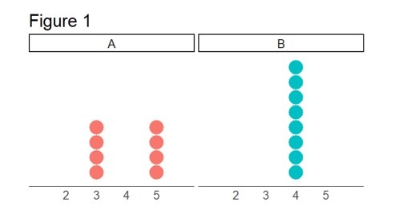
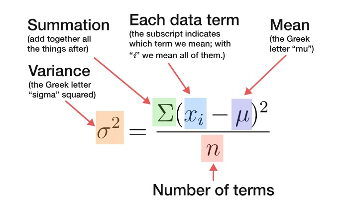

```{r setup, message = FALSE, warning = FALSE,	include = FALSE}
library(learnr)
library(tidyverse)
library(openintro)
library(gapminder)
library(gt)
library(patchwork)
library(emo)
library(gradethis)
library(glue)

knitr::opts_chunk$set(warning = FALSE,
                      message = FALSE,
                      echo = FALSE, 
                      fig.height = 3,
                      fig.width = 5,
                      fig.align = "center")

life <- read_csv("data/life_exp.csv") |> 
  mutate(
    state = str_to_title(state),
    county = str_to_title(county)
    ) 

life_with_west <- life |>
  mutate(west_coast = if_else(state %in% c("California", "Oregon", "Washington"), 
    "yes",
    "no"
  ))

life_ma <- life |>
  filter(state == "Massachusetts") |>
  mutate(expectancy = round(expectancy)) |>
  select(county, expectancy)

# Hash generation helpers
# Should ideally be loaded from the imstutorials package when it exists
is_server_context <- function(.envir) {
  # We are in the server context if there are the follow:
  # * input - input reactive values
  # * output - shiny output
  # * session - shiny session
  #
  # Check context by examining the class of each of these.
  # If any is missing then it will be a NULL which will fail.
  
  inherits(.envir$input, "reactivevalues") &
    inherits(.envir$output, "shinyoutput") &
    inherits(.envir$session, "ShinySession")
}

check_server_context <- function(.envir) {
  if (!is_server_context(.envir)) {
    calling_func <- deparse(sys.calls()[[sys.nframe() - 1]])
    err <- paste0("Function `", calling_func, "`", " must be called from an Rmd chunk where `context = \"server\"`")
    stop(err, call. = FALSE)
  }
}
encoder_logic <- function(strip_output = FALSE) {
  p <- parent.frame()
  check_server_context(p)
  # Make this var available within the local context below
  assign("strip_output", strip_output, envir = p)
  # Evaluate in parent frame to get input, output, and session
  local(
    {
      encoded_txt <- shiny::eventReactive(
        input$hash_generate,
        {
          # shiny::getDefaultReactiveDomain()$userData$tutorial_state
          state <- learnr:::get_tutorial_state()
          shiny::validate(shiny::need(length(state) > 0, "No progress yet."))
          shiny::validate(shiny::need(nchar(input$name) > 0, "No name entered."))
          shiny::validate(shiny::need(nchar(input$studentID) > 0, "Please enter your student ID"))
          user_state <- purrr::map_dfr(state, identity, .id = "label")
          user_state <- dplyr::group_by(user_state, label, type, correct)
          user_state <- dplyr::summarize(
            user_state,
            answer = list(answer),
            timestamp = dplyr::first(timestamp),
            .groups = "drop"
          )
          user_state <- dplyr::relocate(user_state, correct, .before = timestamp)
          user_info <- tibble(
            label = c("student_name", "student_id"),
            type = "identifier",
            answer = as.list(c(input$name, input$studentID)),
            timestamp = format(Sys.time(), "%Y-%m-%d %H:%M:%S %Z", tz = "UTC")
          )
          learnrhash::encode_obj(bind_rows(user_info, user_state))
        }
      )
      output$hash_output <- shiny::renderText(encoded_txt())
    },
    envir = p
  )
}


hash_encoder_ui <- {
  shiny::div("If you have completed this tutorial and are happy with all of your", "solutions, please enter your identifying information, then click the button below to generate your hash", textInput("name", "What's your name?"), textInput("studentID", "What is your student ID (Gebruikersnaam  s-/p-nummer)?"), renderText({
    input$caption
  }), )
}
```

## Measures of center

What do we mean by a typical observation? For example, it sounds perfectly fine to state a statistic like: the typical life expectancy in the US is 77.6 years, but where does that number come from? Before we answer that question, let's make this more concrete by introducing a dataset that we'll be working with throughout the lesson.

### County demographics

Researchers in public health have compiled data on the demographics of every county in the US. We see here that we have 4 variables: 

-   the state name, 
-   the county name,  
-   the average life expectancy in that county, 
-   the median income in the county. 

```{r life}
life
```

### Massachusetts

We're going to focus on the state of Massachusetts, which happens to have 14 counties. Let's filter the data for counties from that state, and name the resulting data frame `life_ma`. To make the rest of the conversation simpler we'll also round the life expectancy values to whole numbers for this state.

```{r life-ma-filter, echo = TRUE}
life_ma <- life |>
  filter(state == "Massachusetts") |>
  mutate(expectancy = round(expectancy)) |>
  select(county, expectancy)
```

Here is a look at those counties.

```{r life-ma-view}
life_ma
```

```{r life-exp-mean}
life_ma_summary <- life_ma |>
  summarise(
    mean = round(mean(expectancy), 1),
    med = round(median(expectancy), 1),
    mode = 80,
    var = round(var(expectancy), 2),
    sd = round(sd(expectancy), 2),
    iqr = round(IQR(expectancy), 2)
  )
```

### Mean

Let's take a closer look at the life expectancies for counties in Massachusetts. We'll arrange them in ascending order to make it a bit easier to to answer the question "What is a typical value for life expectancies in Massachusetts counties?"

```{r life-ma-view2}
life_ma |>
  arrange(expectancy) |>
  print(n = 14)
```

Here is another look at these values, as a dot plot.

```{r life-ma-plot}
ggplot(data = life_ma, aes(x = expectancy)) +
  geom_dotplot() +
  theme(axis.text.y = element_blank(),
        axis.title.y = element_blank())
```

To answer this question, we need to think about what "typical" means. One statistic we commonly use to describe a typical observation is the **mean**, or in other words, the arithmetic average. The average life expectancy for counties in Massachusetts is `r life_ma_summary$mean` years.

```{r mean, exercise = TRUE}
life_ma |>
  summarise(mean = mean(expectancy))
```

Let's add that value as a red, dashed line to our dot plot.

```{r life-ma-plot-mean}
ggplot(data = life_ma, aes(x = expectancy)) +
  geom_dotplot() +
  theme(axis.text.y = element_blank(),
        axis.title.y = element_blank()) +
  geom_vline(xintercept = life_ma_summary$mean, color = COL[4,1], linetype = "longdash", size = 1)
```


### Median

Another measure of "typical" or "center" is the **median**. 
The median is the 50th percentile, i.e. the middle value in the sorted data. Let's take another look at the sorted life expectancies.

```{r}
life_ma |>
  arrange(expectancy) |>
  pull(expectancy)
```

The value that cuts the data in half is `r life_ma_summary$med`. We can also calculate this using the `median()` function.

```{r median, exercise = TRUE}
life_ma |>
  summarise(median = median(expectancy))
```

Let's add that value as a blue, solid line to our dot plot.

```{r life-ma-plot-mean-med}
ggplot(data = life_ma, aes(x = expectancy)) +
  geom_dotplot() +
  theme(axis.text.y = element_blank(),
        axis.title.y = element_blank()) +
  geom_vline(xintercept = life_ma_summary$mean, color = COL[4,1], linetype = "longdash", size = 1) +
  geom_vline(xintercept = life_ma_summary$med, color = COL[1,1], size = 1)
```

The mean can be thought of as the balance point of the data and it tends to be drawn towards the longer tail of a distribution. Here the number 78 breaks the symmetry of this distribution and is a left tail, pulling the mean (but not the median) to the left.

This highlights an important feature of the mean: its sensitivity to extreme values. For this reason, when working with skewed distributions, the median is often a more appropriate measure of center.


::: tip
The mean and median are known as measures of central tendency. They both give a sense of what the "center" of the distribution is, although they do it in slightly different ways. If you need to predict the next number coming from a distribution, choose which measure of central tendency is most appropriate, depending on your goals and the cost and benefits of making an error.

The mean is the sum of the numbers in the set divided by the size of the set.

```{r mean-formula, out.width="80%"}
knitr::include_graphics("images/mean-formula.jpg")
```


The median is the middle number of the set when it is written in ascending order. If there are an even number of items in the set, the median is the mean of the middle two numbers.

The two measures are similar in that they provide a sense of a typical number in our data set. Yet they also behave differently: the mean tends to be influenced by extreme values, but the median is not. You can also use R to calculate these measures.
:::


### Mode

The **mode** is yet another measure of center. The mode is the number that occurs the most frequently in the dataset. To find the mode, we can `count()` the life expectancy values, and identify the most frequent one.

```{r mode}
life_ma |>
  count(expectancy, sort = TRUE)
```

In this case, the median and the mode are the same (both `r life_ma_summary$mode`), but that is often not the case.

Let's plot the mode right on top of the median as a yellow, dotted line.

```{r life-ma-plot-mean-med-mod}
ggplot(data = life_ma, aes(x = expectancy)) +
  geom_dotplot() +
  theme(axis.text.y = element_blank(),
        axis.title.y = element_blank()) +
  geom_vline(xintercept = life_ma_summary$mean, color = COL[4,1], linetype = "longdash", size = 1) +
  geom_vline(xintercept = life_ma_summary$med, color = COL[1,1], size = 1) +
  geom_vline(xintercept = life_ma_summary$mode, color = COL[3,1], linetype = "dashed")
```

Now that we have some sensible measures of center, we can answer questions like: Is the typical county life expectancy in Massachusets similar to the typical life expectancy in the rest of the country?

## Group means

To answer this question we start by using `mutate()` to create a new variable that will be TRUE if the state value is either "California", "Oregon", or "Washington", and FALSE otherwise. This process uses some of the tools we've seen before, namely the `if_else()` function and the `%in%` operator, and puts them together. 

In the code below, we make a new variable named `west_coast` and specify how that variable is calculated. The condition we use inside of the `if_else()` function states that if the state associated with an observation is included in "California, Oregon, or Washington, the `west_coast` variable should have a value of `"yes"`. If the state of an observation is not included in this list, then the `west_coast` variable should have a value of `"no"`. 

Notice the `life_with_west <- life |>` line in the code below. This line is telling R that we are creating a new object, `life_with_west` that contains the `west_coast` variable, a variable that consists of values `yes` and `no`.

```{r create-west-coast, echo = TRUE}
life_with_west <- life |>
  mutate(
    west_coast = 
      if_else(
        state %in% c("California", "Oregon", "Washington"),
        "yes",
        "no")
    )
```

To compute means for the two groups (west coast and the rest of the country), we pipe this updated dataset into the `group_by()` function, and indicate how we would like to make the groups. Then we can `summarize()` those groups, West Coast counties and non-West Coast counties, by taking the `mean()` and `median()` of their life expectancies. 


```{r life-groupby, exercise = TRUE}
life_with_west |>
  group_by(west_coast) |>
  summarize(mean(expectancy),
            median(expectancy))

```


From the code chunk above, remove the line with the `group_by` clause, so that you are left with the following code: 

```{r life-no-groupby, eval=FALSE, echo = TRUE}
life_with_west |>
  summarize(mean(expectancy),
            median(expectancy))
```


Now run the code to answer the following question:

```{r quiz-group-by, echo=FALSE}
question("What happens when you remove the `group_by` clause from the code above?", 
         allow_retry = TRUE, random_answer_order = FALSE, 
         answer("Nothing happens, we still get the same result"), 
         answer("we get the mean life expectency of all residents in the USA"), 
         answer("we get the mean of the life expectencies of each county in the USA", correct=TRUE, message="That's correct. Each row represents one county in the USA. If we take the mean of the rows, we are effectively averaging across counties and not across states."), 
         answer("we get the mean of the life expectencies in each state in the USA")
         )
```


We learn that looking at both mean and median, the typical West Coast county has a slightly higher average life expectancy than counties not on the West Coast.


### Puzzles with central tendency

We observe the numbers: $\{7, 8, 8 , 9, 20, 20, 30\}$

```{r centrality-fig3, fig.height=1.5, fig.width=5}
x <- c(7, 8, 8 , 9, 20, 20, 30)

ggplot() + 
  geom_dotplot(
    aes(
      x=x,
      fill=letters[rank(x)]
    ), color = NA, binwidth = 1) + 
  scale_x_continuous(breaks = x) +
  scale_y_continuous(labels = NULL) + 
  theme_classic()  + 
  labs(x = NULL, y=NULL) + 
  theme(text = element_text(size = 15), 
        legend.position = "none", 
        axis.line.y = element_blank(), 
        axis.ticks  = element_blank()) 
# mean(x)
# median(x)

```

```{r centralilty-3, fig.height=3, fig.width=3}
quiz(caption = "",
     question(
       "Given the set of values, which is larger: the median or the mean?", 
       answer("mean", correct = TRUE),
       answer("median"),
       answer("mean and median are equal"),
       incorrect = "Not quite. Since we have an odd number of observations, the median is simply the middle of the set, when ordered from least to greatest. When calculating the mean, we add up all the numbers and divide by the sample size. Try again!", 
       correct = "Yes that's right! Even though observations are mostly clustered in the range 7, 8, 9, those further away at 20 and 30 have a bigger influence on the mean than on the median. ",
       allow_retry = TRUE
       ), 
     question_checkbox(
       "You want to calculate the mean and median of a set consisting of ninety-nine times observing the value zero, followed by a single value 100 $X=\\{0,0,0,0,\\ldots,100 \\}$. <br/>Which of the following is correct?", 
       answer("The median of this set is 0", correct = TRUE),
       answer("The median is 1"),
       answer("The mean is 1", correct = TRUE),
       answer("The mean is 0"),
       try_again = "Fantastic! Most of the numbers in the set are zero, so the middle of the set (i.e. the median) must be zero. To calculate the mean we add up ninety-nine of zeros and the number 100, giving a total sum of $99\\cdot0 + 1\\cdot100 = 100$. Now divide this sum by the size of the set (i.e, 100) to get the mean.",
       correct = "Most of the numbers in the set are zero, so the middle of the set (i.e. the median) must be zero. To calculate the mean we add up ninety-nine of zeros and the number 100, giving a total sum of $99\\cdot0 + 1\\cdot100 = 100$. Dividing the sum by the size of the set (i.e, 100), the mean is 1.<br/><br/>The mean of this set is influenced by the extreme value 100, but the median is not. ",
       allow_retry = TRUE, 
       random_answer_order = FALSE
       )
)

```

### 

Notice how in this example, where there is one extreme value (at 100), the mean is larger than the median. In general, extreme values affect the mean much more than the median.


Of course you can use code to calculate the mean and the median! For example, try to calculate the mean of the numbers {1, 9, 10}

```{r centrality-4-mean, exercise=TRUE}
# calculate the mean of the numbers {1, 9, 10}.
c(___, ___, ___) %>% mean()
```


```{r centrality-4-mean-check}
grade_result(
  pass_if(~ identical(.result, mean(c(1, 9, 10))), "Good job!")
)
```

```{r centrality-5-median, exercise=TRUE}
# calculate the median of the numbers {1, 9, 10}.
___ %>% median()
```

```{r centrality-5-median-check}
grade_result(
  pass_if(~ identical(.result, median(c(1, 9, 10))), "Good job!")
)
```

Because there is a clustering of two numbers close together $\{9,10\}$, the "outlier" $\{1\}$ has more of an effect on the mean than on the median, which is why, in this exercise, the mean is smaller than the median.

```{r centralilty-6}
quiz(caption = "",
     question(
       "Is it possible to add a single number to the set $\\{1, 9,10\\}$ such that the mean increases yet the median decreases?", 
       answer("yes", correct = TRUE),
       answer("no"),
       correct = "Right on! The mean is smaller than the median, so if you add a number that is between the mean and the median, it will pull up the mean and pull down the median.",
       incorrect = "Try again! The mean is smaller than the median, so if you add a number that is between the mean and the median, it will pull up the mean and pull down the median.",
       allow_retry = TRUE
       )
  )

```

Choose a value between the mean and the median of the set $X=\{1, 9, 10\}$ and add it in the code below. Then run the code and convince yourself that this new number increased the mean and decreased the median:

```{r centrality-7, exercise=TRUE}
x_new_value <- ___
# The mean of the original set 
old_mean <- c(1, 9, 10) %>% mean()
# The mean with your new value
new_mean <- c(1, 9, 10, ___) %>% mean()
glue("Holla! Adding the value {x_new_value} increased the mean from {old_mean} to {new_mean}!") %>% 
  print()

 # The median of the original set 
old_median <- c(1, 9, 10) %>% median()
# The median goes down after adding the the new value
new_median <- c(1, 9, 10, ___) %>% median()
glue("Gracious me! The same value decreased the median from {old_median} to {new_median}!")%>% 
  print()

```


```{r centrality-7-solution}
x_new_value <- 7
# The mean of the original set 
old_mean <- c(1, 9, 10) %>% mean()
# The mean with your new value
new_mean <- c(1, 9, 10, x_new_value) %>% mean()
glue("Holla! Adding the value {x_new_value} 
     increased the mean from {old_mean} to {new_mean}!") %>% 
  print()

 # The median of the original set 
old_median <- c(1, 9, 10) %>% median()
# The median goes down after adding the the new value
new_median <- c(1, 9, 10, x_new_value) %>% median()
glue("Gracious me! The same value decreased
     the median from {old_median} to {new_median}!")%>% 
  print()

```

### Central tendency: a conclusion {.tip}
The mean and median are both measures of central tendency, but they have different properties: extreme values influences the mean but not the median.

Measures of central tendency are important, because they tell us something about the typical values in a set. If we know that a number comes from a set and we want to predict it, our best bet is to choose a measure of central tendency.

But how certain are we, that we will get our prediction right? Imagine that making a mistake in your prediction would incur a cost. What cost would you expect to pay, on average? Measures of centrality don't give us an answer to these question. To estimate the uncertainty in our data, or to know what cost we will need to pay for our mistakes, we need to turn to **measures of spread**.


## Measures of spread

How do you summarize the variability that you see in a set of numbers?


Suppose we want to describe variation in the data. One way is to use the range, which describes the distance between the smallest and largest value in a set.

Consider the following two sets, $A$ and $B$.

```{r spread-fig1, fig.height=3, fig.width=5}


x_1 <- c(7,   10,  13,  17,  23,  25,  30)
x_2 <- c(100, 121, 123, 125, 125, 125)

data.frame(
  group = c(
    rep("A", length(x_1)),
    rep("B", length(x_2)) 
    ), 
  value = c(x_1, x_2)
  )|> 
ggplot() + 
  geom_dotplot(
    aes(
      x=value,
      fill=group
    ), 
    color = NA, binwidth = 1) + 
  facet_wrap(~group, scales = "free", nrow = 2) + 
  scale_x_continuous(breaks = seq(0,1025, by = 5)) +
  scale_y_continuous(labels = NULL) + 
  theme_classic()  + 
  labs(x = NULL, y=NULL) + 
  theme(text = element_text(size = 15), 
        legend.position = "none", 
        axis.line.y = element_blank(), 
        axis.ticks  = element_blank()) 

quiz(caption = "",
     question(
       "Which of these two sets of data has the larger range?", 
       answer("$A = \\{7,   10,  13,  17,  23,  25,  30\\}$"),
       answer("$B = \\{100, 121, 123, 125, 125, 125\\}$", correct = TRUE),
       incorrect = "identify the most extreme values in both sets, and subtract the largest from the smallest value",
       correct = "B has the larger range, because its range is $125 - 100 = 25$, whereas A's range is only $30 - 7 = 23$. <br/>This result may be counterintuitive, as B feels more clustered: most of the values are in the range to 120 - 125 and there is only one isolated number 100 outside of this range. <br/>But the range does not take this into account, telling us nothing about the data except for the distance between the smallest and largest values.",
       allow_retry = TRUE
       )
  )


```

### 

The range is often an inappropriate description of variation in data, because it is sensitive only to the extreme values, values that don't necessarily represent most data points because they don't necessarily occur that often.

In particular, range ignores all the values in a set except for the largest and smallest, and therefore tells us nothing about the distribution of the values within the data set

### Mean Absolute Deviation (MAD)

Consider the following data-points: $X=\{10, 10, 15, 18, 22\}$. Check that its sample mean is $\bar{X}=15$.

```{r spread-fig2, fig.height=1.5, fig.width=3}
bus.wait <- c(10, 10, 15, 18, 22)

ggplot() + 
  geom_dotplot(aes(x = bus.wait), 
               binwidth = 1) +
  scale_x_continuous(breaks = unique(bus.wait)) +
  scale_y_continuous(labels = NULL) + 
  theme_classic()  + 
  labs(x = NULL, y=NULL) + 
  theme(text = element_text(size = 17), 
        legend.position = "none", 
        axis.line.y = element_blank(), 
        axis.ticks  = element_blank()) 

```

Now consider the distances between each of the data points and the sample mean $\bar{X}=15$. These distances are as follows:

$$
\text{distance}_i=X_i - \bar{X}=\{10 - 15, 10- 15, 15 - 15,\cdots \}=\{-5, -15, 0,\cdots \}
$$

```{r spread-2, fig.height=3, fig.width=3, eval=TRUE}
quiz(caption = "",
     question(
       "Complete the set of distances and calculate its mean", 
       answer("0", correct = TRUE), 
       answer("4"), 
       answer("5"), 
       answer("None of the above"),
       incorrect = "Some of the distances are negative and some are positive, so that the distances cancel each other out. Do take that into account when calculating the mean distance.", 
       correct = "It turns out that the average distance between data points and their average is always zero, no matter which data you use. In other words, the average distance is not a good indicator of spread and we cannot use it for this purpose.",
    allow_retry = TRUE, 
    random_answer_order = FALSE 
    ),
    question(
       "The example above shows that the distances cancel one another, and the average distance is zero. But what happens if we take the absolute value of the distances? Calculate the mean of the absolute distances", 
       answer("0"), 
       answer("4", correct = TRUE), 
       answer("5"), 
       answer("None of the above"),
       correct = "In contrast to the mean deviance, the absolute mean deviance is sensitive to the data-points and reflects their spread.",
    allow_retry = TRUE, 
    random_answer_order = FALSE 
    )
  )
     
```

### 

In the question above, you calculated a very important measure of spread: the "mean absolute deviation" also known as MAD. To calculate MAD, simply find the the mean value of a set (or the sample mean, $\bar{X}$) and compare it with each value in the set (or $X_i$). The distance between these two numbers is called the deviation. Now find the mean of the absolute value of these deviations, and voila!

The mean absolute deviation is a helpful statistic as it allows us to represent the spread of a set of data-points with a single number. A set with a MAD of 4 has values that are, on average, 4 units away from the mean.

```{r, eval=TRUE}
ggplot() + 
  geom_point(aes(x = seq(bus.wait), y = bus.wait)) + 
  geom_hline(yintercept = 15, 
             linetype = "dashed", 
             color = "blue", 
             alpha = .5) +
  geom_segment(aes(x = seq(bus.wait), xend = seq(bus.wait), 
                   y = 15, yend = bus.wait), 
               linetype = "dashed", color = "red") +
  geom_text(aes(x = 1.5, y = 15.5, label = "mean"), color = "blue") +
  scale_y_continuous(breaks = seq(10, 23, by = 2), minor_breaks  = NULL,
                     limits = c(8,23)) + 
  scale_x_continuous(breaks = NULL) + 
  theme_minimal() + 
  theme(text = element_text(size = 14)) +
  labs(x = NULL, y = NULL, title = "Deviances of the set {10,10,15,18,22}")

```

### 

Consider the following two sets, $A$ and $B$

```{r spread-fig3, fig.height=3, fig.width=5}


x_1 <- c(0,   12,  12,  12,  12,  24)
x_2 <- c(8, 8, 8, 16, 16, 16)

# mean(abs(x_1 - mean(x_1)))
# mean(abs(x_2 - mean(x_2)))
# mad(x_1, center = mean(x_1), const=1)

data.frame(
  group = c(
    rep("A", length(x_1)),
    rep("B", length(x_2)) 
    ), 
  value = c(x_1, x_2)
  )|> 
ggplot() + 
  geom_dotplot(
    aes(
      x=value,
      fill=group
    ), 
    color = NA, binwidth = 1) + 
  facet_wrap(~group, scales = "fixed", nrow = 2) + 
  scale_x_continuous(breaks = seq(0, 24, by = 4)) +
  scale_y_continuous(labels = NULL) + 
  theme_classic()  + 
  labs(x = NULL, y=NULL) + 
  theme(text = element_text(size = 15), 
        legend.position = "none", 
        axis.line.y = element_blank(), 
        axis.ticks  = element_blank()) 
# mean(x)
# median(x)

quiz(caption = "",
     question(
       "Which of these two sets of data has a larger MAD?", 
       answer("$A = \\{0,   12,  12,  12,  12,  24\\}$"),
       answer("$B = \\{8, 8, 8, 16, 16, 16\\}$"),
       answer("They are the same", correct = TRUE),
       incorrect = "Not quite. Both sets are centred around 12. For set A, the set of deviances is $\\{-12, 0, 0, 0, 0, 12\\}$. For set B the set of deviances is $\\{-4, -4, -4, -4, 4, 4, 4, 4\\}$. . To calculate thDe MA, you will take the mean of the absolute values of these two lists.",
       correct = "Both sets are centred around 12, and taking the mean of their absolute deviances gives us the number 4 in both cases. Thus, their MAD is the same. <br/> This result can be a bit surprising because A is more spread out, you would expect it to have a larger MAD. <br/>The larger range contributes to the MAD, but this effect is diminished because of the clustering in A around the its center, the number 12. This clustering reducing the variation in our data.",
       allow_retry = TRUE
       )
  )

```

### The two MADs {.tip}
In addition to **Mean Absolute Deviation** there is a second (in fact more popular) MAD, known as **Median Absolute Deviation**.

-   **Mean Absolute Deviation** calculates the **mean** of the absolute differences from the mean,
-   **Median Absolute Deviation** calculates the **median** value of the absolute difference from the **median**.

For example, consider our bus-waiting data set $X=\{10, 10, 15, 18, 22\}$. Let's calculated both MADs:

-   The set's mean is 15, and set of its deviations from the mean are $\{-5, -5, 0, 3, 7\}$. Taking the mean of the absolute deviations we find that the mean average deviation is $\frac{5+5+0+3+7}{5}=4$.
-   The set's median is the same as its mean and so the absolute deviations from the median are the same as above. To find the median we first need to arrange the absolute values in order $\{0, 3, 5, 5, 7\}$ the number 5 in the middle is our Median Absolute Deviation.

In this case we do not see much of a difference between the two MADs, but recall that the mean is more susceptible to extreme values than the median. Adding an extreme value will therefore affect the Mean Absolute Deviance much more than the Median Absolute Deviance.


### Variance and SD

Though simple to use and intuitive as a measure of spread, the two MADs have some unwanted properties. First, the absolute value of a number has no derivative at zero, which makes it mathematically inconvenient to use. In addition, the mean deviation from the **mean** can be the same as the mean deviation from other points along the continuum, so as a measure of spread, MAD is not uniquely associated with the mean. This becomes a problem, when we would like our measure of dispersion to be a mathematical optimum of some objective function.

### 

To address this problem, instead of taking the absolute value of differences between the mean and data points, we **square** the deviance (thereby transforming any negative deviance to positive). We then calculate the mean of the squares.

$$
\text{Variance}=\frac{\text{sum of (squared differences between datapoints and mean)}}{\text{number of values in set}}
$$

The result is called the variance.

### 

```{r quiz-vars}
quiz(caption = "",
    question("Instead of averaging the absolute deviations, we average the squares of the differences. What effect will that have the measure of spread?",
    answer("No effect"),
    answer("The influence of data points  far from the mean will become more pronounced", correct = TRUE),
    answer("The influence of data points  far from the mean will become less pronounced"),
    allow_retry = TRUE, 
    random_answer_order = TRUE, 
    correct = "Whether we square them or not, extreme values contribute more to the measure of spread. However, if we square the deviance, an extreme value contributes much more. This is not always something we want, because rare values at the extreme end of the data do not represent the data very well but have a great influence on the the variance."
  )
)


```

### 

Consider the two sets of data in Figure 1 below.


```{r compare-vars-a, out.width="80%"}

```


```{r quiz-var1-a}
quiz(caption = "",
  question("Figure 1 above presents two sets of numbers. Set A has a total of eight data points: four times the number 3 and four times the number 5. Set B consists of eight observations of the number 4. Choose the correct statements regarding figure 1:",
    answer("The variance of A is greater than the variance of B", correct = TRUE),
    answer("The variance of B is greater than the variance of A"), 
    answer("Both variances are the same"),
    allow_retry = TRUE, 
    random_answer_order = TRUE, 
    incorrect = "All the values in set B are equal to one another, and they are all equal to the mean, so deviances are all zero. What is the mean of the squared deviances (aka the variance)? Now think about the mean and the mean squared deviance for set A. Which is larger?",
    correct = "Set B has zero variance: all the values are equal to one another and to the mean. The distance between the data points and the mean is therefore zero, and the mean of the distance square is zero. The mean in set A is 4, and so all the deviances are 1 and the mean of the squared deviances is therefore $\\frac{8\\cdot1^2}{8}=1$. The variance is therefore 1."
  )
)


```

Consider the three sets of data in Figure 2 below.


```{r compare-vars-b, out.width="80%"}
knitr::include_graphics("images/compare-vars-b.png")
```


```{r quiz-vars-b}
quiz(caption = "",
  question("In figure 2 above there are three sets of numbers. Choose the correct statements:",
    answer("The variance of C is the larger than the variance of A and that of B", correct = TRUE),
    answer("The variance of A, B and C are all different"), 
    answer("The variance of A and B are the same", correct = TRUE),
    allow_retry = TRUE, 
    random_answer_order = TRUE, 
    message = "Set A is clustered around 2, whereas set B is clustered around 4, making B's mean larger than that of A. But the spread of both sets is the very same because the list of deviances (=distance of each data point from the mean) will also be the same, and so will it be with the squares and the mean of those squared (aka the variance). In set C, the deviances will be larger than that of A and B because the range of data points is wider."
  )
)


```

```{r compare-vars, eval=FALSE, include=FALSE}


x_1 <- c(rep(3,4), rep(5,4))
x_2 <- rep(4, 8)
x_3 <- c(rep(2,7), rep(4,1))
x_3 <- c(rep(2,1), rep(4,7))

mean((x_3 - mean(x_3))^2)

data.frame(
  group = c(
    rep("A", length(x_1)),
    rep("B", length(x_2)) 
    ), 
  value = c(x_1, x_2)
  )|> 
ggplot() + 
  geom_dotplot(
    aes(
      x=value,
      fill=group
    ), 
    color = NA, binwidth = .5) + 
  facet_wrap(~group, scales = "fixed", nrow = 1) + 
  scale_x_continuous(breaks = seq(2, 5, by = 1), 
                     limits = c(1,6)) +
  scale_y_continuous(labels = NULL) + 
  theme_classic()  + 
  labs(x = NULL, y=NULL, title = "Figure 1") + 
  theme(text = element_text(size = 17), 
        legend.position = "none", 
        axis.line.y = element_blank(), 
        axis.ticks  = element_blank()) 


x_1 <- rep(2, 8)
x_2 <- rep(4, 8)

data.frame(
  group = c(
    rep("A", length(x_1)),
    rep("B", length(x_2)) 
    ), 
  value = c(x_1, x_2)
  )|> 
ggplot() + 
  geom_dotplot(
    aes(
      x=value,
      fill=group
    ), 
    color = NA, binwidth = .5) + 
  facet_wrap(~group, scales = "fixed", nrow = 1) + 
  scale_x_continuous(breaks = seq(0, 5, by = 1), 
                     limits = c(1,6)) +
  scale_y_continuous(labels = NULL) + 
  theme_classic()  + 
  labs(x = NULL, y=NULL, title = "Figure 2") + 
  theme(text = element_text(size = 17), 
        legend.position = "none", 
        axis.line.y = element_blank(), 
        axis.ticks  = element_blank()) 
# mean(x)
# median(x)


x_1 <- c(rep(2,7), rep(4,1))
x_2 <- c(rep(2,1), rep(4,7))
x_3 <- c(rep(1,1), rep(4,7))

data.frame(
  group = c(
    rep("A", length(x_1)),
    rep("B", length(x_2)),
    rep("C", length(x_2)) 
    ), 
  value = c(x_1, x_2, x_3)
  )|> 
ggplot() + 
  geom_dotplot(
    aes(
      x=value,
      fill=group
    ), 
    color = NA, binwidth = 1) + 
  facet_wrap(~group, scales = "fixed", nrow = 1) + 
  scale_x_continuous(breaks = seq(0, 5, by = 1), 
                     limits = c(0, 6)) +
  scale_y_continuous(labels = NULL) + 
  theme_classic()  + 
  labs(x = NULL, y=NULL, title = "Figure 3") + 
  theme(text = element_text(size = 17), 
        legend.position = "none", 
        axis.line.y = element_blank(), 
        axis.ticks  = element_blank()) 

p1 / p2 / p3

```

```{r  quiz-var2}

quiz(caption = "", 
     question_checkbox("In a previous question, we explored a set consisting of ninety-nine times the value zero, and one time the value 100 $X=\\{0,0,0,0,\\ldots,100 \\}$. We found that the median of this set is zero while its mean is 1.<br/><br/> Imagine that a number is chosen at random from this set. Your job is to guess this number. Making a mistake incurs a cost, equal to the difference between your guess and the real number. You want to minimize your (average) cost. Select the correct answer:", 
     answer("Guessing the mean minimizes your (average) cost"),
     answer("Guessing the median minimizes your (average) cost", correct = TRUE), 
     answer("Guessing the median, your average cost is 1", correct = TRUE),
     answer("Guessing the median, your average cost is 1.98"),
     answer("Guessing the mean, your average cost is 1"),
     answer("Guessing the mean, your average cost is 1.98", correct = TRUE),
     correct = "That's right! If you guess the median (the number 0) you will be spot on ninety-nine times out of 100. You will incur a cost only once: when the number 100 appears (your cost will be 100). Over 100 games, your total cost is 100, or an average cost of $\\frac{99\\cdot0 + 1\\cdot100}{100}=1$. <br/>In contrast, guessing the mean (the number 1), your total cost is $99\\cdot1 + 1\\cdot100=198$, or on average $\\frac{99\\cdot1 + 1\\cdot100}{100}=1.98$ This number is also the MAD of the set.<br/><br/>Guessing the mean will nearly double the cost, so the median is your best bet!",
     try_again = "Here's a hint: suppose you play the game 100 times (once for each number in the set). If you guess the median (the number 0) you will be spot on ninety-nine times out of 100. You will incur a cost only once, when the real number is 100. Over 100 games, the total cost is 100, or an average fine of $\\frac{99\\cdot0 + 1\\cdot100}{100}$. <br/>Now suppose you guess the mean (the number 1), you will be off by 1 point ninety nine times out of a hundred, and you will be off by 99 once out of 100. What would be your cost on average?",
     allow_retry = TRUE, 
     random_answer_order = TRUE
     ),
  question_checkbox("The same setup as above, your job is to guess a random number from this set, but this time making a mistake incurs a cost, equal to the square of the difference between your guess and the real number. For example, if you guessed 50 and the real number is zero, the cost is $50^2$. You want to minimize your (average) cost. Select the correct answer:",
    answer("Guessing the mean minimizes your (average) cost", correct = TRUE),
    answer("Guessing the median minimizes your (average) cost"), 
    answer("Guessing the median, your average cost is 100", correct = TRUE),
    answer("Guessing the median, your average cost is 99"),
    answer("Guessing the mean, your average cost is 100"),
    answer("Guessing the mean, your average cost is 99", correct = TRUE),
    allow_retry = TRUE, 
    random_answer_order = FALSE, 
    try_again = "Try again! This time the costs are the squares of the costs in the previous question. If you guess the median (the number 0), your average cost will be $\\frac{99\\cdot0^2 + 1\\cdot100^2}{100}$. <br/>Now suppose you guess the mean (the number 1), you will be off by 1 point ninety nine times out of a hundred, and only once you will be off by 99 points. How much would you have to pay on average?", 
    correct = "That's right! If you guess the median (the number 0), your average cost will be $\\frac{99\\cdot0^2 + 1\\cdot100^2}{100}=100$ and if you guess the mean your cost would be $\\frac{99\\cdot1^2 + 1\\cdot99^2}{100}=99$, and we see that the average cost of guessing the mean is smaller when the cost is the square of the deviances. How exciting!"
  ), 
    question_checkbox("Given the examples above, how would you interpret the MAD and the variance?", 
    answer("The MAD is the average cost incurred when your prediction of the next observation is the <bold>mean</bold> and when the cost of an error is the difference between your guess and the <bold>mean</bold>", correct = TRUE), 
    answer("The MAD is the average cost incurred when your prediction of the next observation is the <bold>mean</bold> and when the  cost of an error is the square difference between your guess and the <bold>mean</bold>"), 
    answer("The Variance is the average cost incurred when your prediction of the next observation is the <bold>mean</bold> and when the  cost of an error is the difference between your guess and the <bold>mean</bold>"), 
    answer("The Variance is the average cost incurred when your prediction of the next observation is the <bold>mean</bold> and when the  cost of an error is the square difference between your guess and the <bold>mean</bold>", correct = TRUE),
    allow_retry = TRUE, 
    random_answer_order = FALSE
  )
)


```

### {.tip}
The questions above show that extreme values affect the variance much more than they affect the MAD. In fact, in the example of a set consisting of ninety-nine times the value zero and one time the value 100 $\{0,0,0,0,\ldots,100 \}$ the variance of the set (which is 99) is 50 times larger than the MAD (which is 1.98).

This example may look a bit contrived, but in fact it represents a common pattern of rare but very extreme events, such as crises or natural breakdowns. The zeros reflect nothing out of the ordinary happening most of the time. But then one big event occurs, just like that, out of the blue.

It is not surprising that this example was inspired by a (very much recommended) tutorial titled: [Breaking down intuitively the concept of standard deviation. Why people don't get it](https://www.youtube.com/watch?v=iKJy2YpYPe8){target="_blank" rel="noopener noreferrer"} by the great Nassim Nicholas Taleb, the author of the bestseller: **The Black Swan: The Impact of the Highly Improbable**.


### Standard deviation

Variance tends to be difficult to compare mentally to the actual data. While it's intuitive to think, for example, that most of the data is about 4 points away from the mean (i.e., MAD) squaring makes it difficult to make sense of the spread or compare between sets.

A more intuitive measure of spread is the square root of the variance, also known as the standard deviation.

$$
\text{sd}=\sqrt{\text{variance}}
$$


```{r sd-formula, out.width="80%"}

```

<br/> <br/>

::: tip
This formula for the variance works as a measure of spread for our particular data-set.

But often, we are not interested in the features of our sample per se. Our goal is broader: we want to estimate the variance for the entire population. Remember that our data-set is only a sample taken from a population, i.e., only a small portion of the entire population.

When you want to estimate the variance of the population, the formula above turns out to be biased, as it underestimates the real variation in the population. The reason for this is that a sample, in particular when it is small, is unlikely to capture the rarer, more extreme values in the population.

To correct for this bias, we will need to replace the denominator $n$ with $n-1$. By dividing by a smaller number, we get a larger estimate, which turns out to be unbiased. The unbiased sample estimate for the standard deviation of the population is denoted with the letter $s$, and its square calculated as follows:

$$
s^2=\frac{\sum(X_i-\bar{X})}{n-1}
$$

Notice that when data represents a sample of a population we will have to use a different version of the variance formula.
:::


### Innerquartile range

There are two more measures of spread that are good to know about. The **interquartile range**, or **IQR**, is the distance between the two numbers that cut-off the middle 50% of your data. This should sound familiar from the discussion of boxplots: the height of the box is exactly the IQR. We can either calculate the first and third quartiles using the `quantile()` function and take their difference...

```{r quartile, echo = TRUE}
life_ma |>
  summarise(
    q1 = quantile(expectancy, 0.25),
    q3 = quantile(expectancy, 0.75),
    iqr = q3 - q1
  )
```

... or we can use the built-in `IQR()` function.

```{r iqr, echo = TRUE}
life_ma |>
  summarise(iqr = IQR(expectancy))
```

### Range 

The final measure is simply the **range** of the data: the distance between the maximum and the minimum.

```{r range, echo = TRUE}
life_ma |>
  summarise(
    min = min(expectancy),
    max = max(expectancy),
    range = max - min
  )
```

### Choosing a measure of spread 

For any dataset, you can compute all four of these statistics, but which ones are the most meaningful? The most commonly used in practice is the standard deviation, so that's often a good place to start. But what happens if the dataset has some extreme observations?

Let's say that Hampden County, Massachusetts, the county with a life expectancy around 78, instead had a life expectancy of 97. We'll create a new dataset with that value and call it `life_ma_extreme`.

```{r life-ma-extreme, echo = TRUE}
life_ma_extreme <- life_ma |>
  mutate(expectancy = if_else(county == "Hampden County", 97, expectancy))
```

Below is a look at the data with such a made up extreme value.

```{r life-ma-extreme-view}
life_ma_extreme
```

And the following is a dot plot of the data with the made up extreme value.

```{r life-ma-extreme-plot}
ggplot(data = life_ma_extreme, aes(x = expectancy)) +
  geom_dotplot() +
  theme(axis.text.y = element_blank(),
        axis.title.y = element_blank())
```

### 

If you recompute the variance and the standard deviation, you see that they've both gone through the roof. These measures are sensitive to extreme values, because they both rely on the mean as their measure of center! 

```{r sd-var-extreme, echo = TRUE}
life_ma_extreme |>
  summarise(
    var = var(expectancy),
    sd  = sd(expectancy)
  )
```

### 

If you recompute the range, it will certainly increase because it is completely determined by the extreme values. For this reason, the range is not often used.

```{r range-extreme, echo = TRUE}
life_ma_extreme |>
  summarise(
    min = min(expectancy),
    max = max(expectancy),
    range = max - min
  )
```

### 

However, if you recompute the IQR, you would see that it hasn't budged. Because that observation is still the highest life expectancy in the set, the quartiles didn't move. This reveals a good situation for using the IQR: when your dataset is heavily skewed or has extreme observations.

```{r iqr-extreme, echo = TRUE}
life_ma_extreme |>
  summarise(iqr = IQR(expectancy))
```

### Your turn! 

The choice of measure for spread can dramatically impact how variable we consider our data to be, so it is important that you consider the shape of the distribution before deciding on the measure.

```{r mc2-pre}
rskew <- rexp(1000, 1)
symm <- rnorm(1000)
d <- data.frame(x = c(rskew, symm),
                distribution = rep(c("A", "B"), c(1000, 1000)))

ggplot(d, aes(x = x, fill = distribution)) +
  geom_density(alpha = 0.3)
```


```{r mc2}
question("Which set of measures of spread would be *worst* for describing the two distributions shown here?",
  answer("A: IQR, B: IQR", message = "Given the two distributions, the IQR seems like it'd be okay."),
  answer("A: SD, B: IQR", message = "Hm, not quite. Try again!"),
  answer("A: Variance, B: Range", correct = TRUE, message = "Good job!" ), 
  incorrect = "A has a high peak and its width is large. What does that tell you about its variance?",
  allow_retry = TRUE
)
```

###

Let's extend the powerful `group_by()` and `summarize()` syntax to measures of spread. If you're unsure whether you're working with symmetric or skewed distributions, it's a good idea to consider a robust measure like IQR in addition to the usual measures of variance or standard deviation.

The `gap2007` dataset that you created in an earlier exercise is available in your workspace.

- For each continent in `gap2007`, summarize life expectancies using the `sd()`, the `IQR()`, and the count of countries, `n()`. No need to name the new columns produced here. Keep in mind the `n()` function does not take any arguments!
- Graphically compare the spread of these distributions by constructing overlaid density plots of life expectancy broken down by continent.

```{r ex2-setup}
gap2007 <- filter(gapminder, year == 2007)
```

```{r ex2, exercise = TRUE}
# Compute groupwise measures of spread
gap2007 |>
  group_by(___) |>
  summarize(___,
            ___,
            ___)

# Generate overlaid density plots
gap2007 |>
  ggplot(aes(x = ___, fill = ___)) +
  geom_density(alpha = 0.3)
```

```{r ex2-hint-1}
## First group the data based on the continent of the observation
gap2007 |>
  group_by(continent) |>
  summarize(__,
            ___,
            ___)
```

```{r ex2-hint-2}
# Next, specify the statistics that should be calculated
gap2007 |>
  group_by(continent) |>
  summarize(sd(___),
            IQR(___),
            n())
```

```{r ex2-hint-3}
# Finally, specify what variable should be used in the calculations
gap2007 |>
  group_by(continent) |>
  summarize(sd(lifeExp),
            IQR(lifeExp),
            n())
```

```{r ex2-hint-4}
## Last step -- create density plots with the different continents overlaid 
## To differentiate between the continents, we fill each one with a different color
## We use an alpha of 0.3 to allow for us to see the shape of every density plot
gap2007 |>
  ggplot(aes(x = lifeExp, fill = continent)) +
  geom_density(alpha = 0.3)
```

```{r ex2-solution}
# Compute groupwise measures of spread
gap2007 |>
  group_by(continent) |>
  summarize(sd(lifeExp),
            IQR(lifeExp),
            n())

# Generate overlaid density plots
gap2007 |>
  ggplot(aes(x = lifeExp, fill = continent)) +
  geom_density(alpha = 0.3)
```

Consider the density plots shown here. What are the most appropriate measures to describe their centers and spreads? In this exercise, you'll select the measures and then calculate them.

Using the shapes of the density plots you created above, calculate the most appropriate measures of center and spread for the distribution of life expectancy in the countries of the Americas. Note you'll need to apply a filter here!

```{r ex3, exercise = TRUE, exercise.setup="ex2-setup"}
# Compute stats for lifeExp in Americas
gap2007 |>
  filter(___) |>
  summarize(___,
            ___)
```

```{r ex3-hint-1}
# First filter the data to only include the Americas
gap2007 |>
  filter(continent == "Americas") |>
  summarize(mean(___),
            sd(___))
```

```{r ex3-hint-2}
# Next define the summary measures that will be used
gap2007 |>
  filter(continent == "Americas") |>
  summarize(mean(___),
            sd(___))
```

```{r ex3-hint-3}
# Finally, specify what variables will be summarized
gap2007 |>
  filter(continent == "Americas") |>
  summarize(mean(lifeExp),
            sd(lifeExp))
```

```{r ex3-solution}
gap2007 |>
  filter(continent == "Americas") |>
  summarize(mean(lifeExp),
            sd(lifeExp))
```

## Shape and transformations

There are generally four characteristics of distributions that are of interest. The first two we've covered already: the center and the spread or variability of the distribution. The third is the shape of the distribution, which can be described in terms of the modality and the skew.

### Modality

The modality of a distribution is the number of prominent humps that show up in the distribution. If there is a single mode, as in a bell-curve, it's called "unimodal." If there are two prominent modes, it's called "bimodal." If it has three modes or more, the convention is to refer to it as "multimodal." There is one last case: when there is no distinct mode. Because the distribution is flat across all values, it is referred to as "uniform."

The other aspect to the shape of the distribution concerns its skew.

```{r modalities, out.width=600}
knitr::include_graphics("images/modalities.png")
```

### Skew

If a distribution has a long tail that stretches out to the right, it's referred to as "right-skewed."

If that long tail stretches out to the left, its referred to as "left-skewed." If you have trouble remembering which is which, just remember that the name of the skew is in the direction the long tail is.

If neither tail is longer than the other, the distribution is called "symmetric."

```{r skewness, out.width=600}
knitr::include_graphics("images/skewness.png")
```

### Shape of income

Let's compare the distributions of median personal income at the county level on the West Coast and in the rest of the country to see what shape these distributions take. There are several plot types that we could use here. Let's use an overlaid density plot by putting income along the x-axis, `fill`ing the two curves with color according to whether or not they're on the West Coast, then adding a density later and specifying an `alpha` level of 0.3. This allows the colors to be somewhat transparent so that we can see where they overlap.

The plot that results shows two curves, the blue representing the West Coast distribution and the pink representing counties not on the West Coast. Each distribution has a single prominent mode, so we can say that each distribution is unimodal. You might argue that the little bump around 100,000 dollars is a second mode, but we're generally looking for larger-scale structure than that.

It's difficult to compare these distributions because they are both heavily right-skewed, that is, there are a few counties in each group that have very high incomes. One way to remedy this is to construct a plot of a transformed version of this variable.


```{r inc, echo = TRUE}
ggplot(life_with_west, 
       aes(x = income, fill = west_coast)) +
  geom_density(alpha = 0.3)
```

### Variable Transformations 

Since income has a heavy right skew, either the square-root or log-transform will do a good job of drawing in the right tail and spreading out the lower values so that we can see what's going on. We can perform the transformation by wrapping income in the `log()` function, which will take the natural log (ln). 

```{r inc2, echo = TRUE}
ggplot(life_with_west, aes(x = log(income), fill = west_coast)) +
  geom_density(alpha = 0.3)
```

The result is a picture that's a bit easier to interpret: the typical income in West Coast counties is indeed greater than that in the rest of the country and the second very small mode of high income counties in the West Coast is not present in the other distribution.

### Your turn! 

Let's turn to some exercises to explore the shape of the Gapminder data.


To build some familiarity with distributions of different shapes, consider the four that are plotted here. 

```{r mr3-pre}
set.seed(12)
x1 <- density(rnorm(30, 0.6, 0.2))
x2 <- density(rnorm(30, 0.6, 0.2))
x3 <- density(rexp(30, 1))
x4 <- density(c(rnorm(15, 1, 0.1), rnorm(15, 1.7, 0.1)))
y <- c(x1$y, x2$y, x3$y, x4$y)
x <- c(x1$x, x2$x, x3$x, x4$x)

d <- data.frame(x = x,
                y = y,
                group = rep(LETTERS[1:4], each = 512))
ggplot(d, aes(x = x, y = y)) +
  geom_line() +
  facet_wrap(~group, scales = "free") +
  theme(axis.title.x = element_blank(),
        axis.text.x = element_blank(),
        axis.ticks.x = element_blank(),
        axis.title.y = element_blank(),
        axis.text.y = element_blank(),
        axis.ticks.y = element_blank())
```


```{r mc3}
question("Which of the following options does the best job of describing their shape in terms of modality and skew/symmetry?",
  answer("A: bimodal symmetric; B: unimodal symmetric; C: unimodal left-skewed, D: bimodal right-skewed."),
  answer("A: unimodal symmetric; B: unimodal right-skewed; C: unimodal right-skewed, D: bimodal symmetric.", correct = TRUE),
  answer("A: unimodal right-skewed; B: unimodal left-skewed; C: unimodal left-skewed; D: bimodal symmetric."),
  answer("A: unimodal left-skewed; B: bimodal symmetric; C: unimodal right-skewed, D: unimodal symmetric."),
  allow_retry = TRUE,
  incorrect = "A useful mnemonic is the ' skew is where there is few'. That is, a left-skewed distribution has fewer values in its left tail."
)
```

Highly skewed distributions can make it very difficult to learn anything from a visualization. Transformations can be helpful in revealing the more subtle structure. 

Here you'll focus on the population variable, which exhibits strong right skew, and transform it with the natural logarithm function (`log()` in R).

Using the `gap2007` data:

- Create a density plot of the population variable (`pop`).
- Use `mutate()` to create a new variable called `log_pop` that is the natural log of the population, and
save this new variable back into `gap2007`.
- Create the same density plot as before with your transformed variable.

```{r ex4-setup}
gap2007 <- filter(gapminder, year == 2007)
```

```{r ex4, exercise = TRUE}
# Create density plot of population variable
gap2007 |>
  ggplot(aes(x = ___)) +
  ___

# Transform the skewed pop variable
gap2007 <- gap2007 |>
  mutate(___)

# Create density plot of transformed population variable
gap2007 |>
  ggplot(aes(x = ___)) +
  ___
```

```{r ex4-hint-1}
# First, create a density plot of population variable
gap2007 |>
  ggplot(aes(x = pop)) +
  geom_density()
```

```{r ex4-hint-2}
# Next, create a new variable that transforms the skewed pop variable
gap2007 <- gap2007 |>
  mutate(log_pop = log(pop))
```

```{r ex4-hint-3}
# Finally, create density plot of the transformed population variable
gap2007 |>
  ggplot(aes(x = log_pop)) +
  geom_density()
```

```{r ex4-solution}
# Create density plot of old variable
gap2007 |>
  ggplot(aes(x = pop)) +
  geom_density()

# Transform the skewed pop variable
gap2007 <- gap2007 |>
  mutate(log_pop = log(pop))

# Create density plot of new variable
gap2007 |>
  ggplot(aes(x = log_pop)) +
  geom_density()
```


## Outliers

We've discussed three different aspects of a distribution that are important to note

### Characteristics of a distribution

- Center

- Variability

- Shape

- Outliers


When conducting an exploratory data analysis: center, variability, and shape. A fourth and final thing to look for are outliers. These are observations that have extreme values far from the bulk of the distribution. They're often very interesting cases, but they're also good to know about before proceeding with more formal analysis.

We saw some extreme values when we plotted the distribution of income for counties on the West Coast. What are we to make of this blip of counties? One thing we can do is display the data using a boxplot. To make the boxplot a bit easier to compare with a density plot, you can specify the categorical variable (`west_coast`) as the y-variable. This option creates vertically stacked boxplots rather than horizontally stacked boxplots. 

```{r, echo = TRUE, eval = FALSE}
ggplot(life, aes(x = income, fill = west_coast)) +
  geom_density(alpha = 0.5)

ggplot(life, aes(x = income, y = west_coast, color = west_coast)) +
  geom_boxplot(alpha = 0.5) + 
  theme(legend.position = "hide")
```


```{r coast-income, fig.width = 7}
p1 <- ggplot(life_with_west, aes(x = income, fill = west_coast)) +
  geom_density(alpha = 0.5)

p2 <- ggplot(life_with_west, aes(x = income, y = west_coast, color = west_coast)) +
  geom_boxplot(alpha = 0.5) + 
  theme(legend.position = "hide")

p1 + p2
```

What we see is interesting: the boxplot flags many counties as outliers, both along the West Coast but also in the rest of the country as well. So why was the blip more apparent on the West Coast? It has to do with sample size. There are far fewer counties in the West Coast group, so these few outliers have an oversized effect on the density plot. In the case of the non-West Coast group, there are many more counties that ended up washing out the effect of the outliers in the density plot.

## Indicating outliers

It is often useful to consider outliers separately from the rest of the data, so lets create a new column to store whether or not a given county is an outlier. This requires that we `mutate()` a new column called `is_outlier` that is TRUE if the income is greater than some threshold and FALSE otherwise. In this case, we've picked a threshold for outliers as counties with incomes greater than $75,000.

```{r io, echo = TRUE}
life_with_west <- life_with_west |>
  mutate(is_outlier = income > 75000)
```

A useful tool when inspecting outliers is to filtering the dataset to only include outliers, and then arranging them in decreasing order. Let's do that next.

```{r, echo = TRUE}
life_with_west |>
  filter(is_outlier) |>
  arrange(desc(income))
```

Based on the output, we learn that the top income county is actually Teton County, in the Grand Tetons of Wyoming, and that three of the other top ten counties are in Texas and two are in Nebraska. Note that we didn't save this result to a new object, we're only viewing the output to investigate the outliers, but we're not removing them from the dataset (at least not yet).

### Plotting without outliers

We can also try rebuilding the density plots without the outliers.

To do this, we form a pipeline where the first step is to filter on those counties that are not outliers. Recall that `is_outlier` is a vector of `TRUE`s and `FALSE`s. We can simply state that we are not interested in any of the values that are `TRUE` by adding an exclamation point (`!`) before the name of the variable. We can then pipe this filtered dataset into the same `ggplot()` code we used for the original overlaid density plots.

```{r, echo = TRUE, eval = FALSE}
life_with_west |>
  filter(!is_outlier) |>  
  ggplot(aes(x = income, fill = west_coast)) +
  geom_density(alpha = 0.3)

ggplot(life_with_west, aes(x = income, fill = west_coast)) +
  geom_density(alpha = 0.3)
```

```{r, fig.width = 8}
p1 <- life_with_west |>
  filter(!is_outlier) |>  
  ggplot(aes(x = income, fill = west_coast)) +
  geom_density(alpha = 0.3)

p2 <- ggplot(life_with_west, aes(x = income, fill = west_coast)) +
  geom_density(alpha = 0.3)

p1 + p2
```

The result is a plot that focuses much more on the body of the distribution. You can contrast that with the original plot, which was dominated by the strong right skew caused by the extreme values. Note that neither of these plots is right or wrong, but they tell different stories of the structure in this data, both of which are valuable.


### Your turn! 

Consider the distribution, shown here, of the life expectancy in Asian countries. The boxplot identifies one clear outlier: a country with a notably low life expectancy. 

```{r}
gap2007 <- filter(gapminder, year == 2007)

gap2007 |>
  filter(continent == "Asia") |>
  ggplot(aes(x = lifeExp)) +
  geom_boxplot()

```

Next, we'll build a plot with that country removed. The `gap2007` is still available in your workspace. To carry out this process we need to use the following steps: 

1. Use `filter()` to retain only observations from Asia
2. Use `mutate()` to create a new variable called `is_outlier`
3. Use `if_else()` to specify how the `is_outlier` variable should be made, where countries with a life expectancy less than 50 should get a value of `TRUE` and everyone else should get a value of `FALSE`
4. Create a boxplot of the life expectancies of the non-outlier countries

```{r ex5-setup}
gap2007 <- filter(gapminder, year == 2007)
```

```{r ex5, exercise = TRUE}
# Create a boxplot of the distribution of life expectancy with the outlier removed 
gap2007 |> 
  filter(___) |>
  mutate(is_outlier = ___) |> 
  filter(___) |>
  ggplot(aes(x = ___)) +
  geom_boxplot()
```

```{r ex5-hint-1}
## First filter out observations from countries other than Asia
gap2007 |> 
  filter(continent == "Asia") |>
  mutate(is_outlier = ___) |> 
  filter(___) |>
  ggplot(aes(x = ___)) +
  geom_boxplot()
```

```{r ex5-hint-2}
## Next, create a new variable named is_outlier using the if_else function
gap2007 |> 
  filter(continent == "Asia") |>
  mutate(is_outlier = if_else(lifeExp < 50, TRUE, FALSE)) |> 
  filter(___) |>
  ggplot(aes(x = ___)) +
  geom_boxplot()
```

```{r ex5-hint-3}
## Next, use the is_outlier variable to filter out the observations flagged as outliers
gap2007 |> 
  filter(continent == "Asia") |>
  mutate(is_outlier = if_else(lifeExp < 50, TRUE, FALSE)) |> 
  filter(!is_outlier) |>
  ggplot(aes(x = ___)) +
  geom_boxplot()
```

```{r ex5-solution}
# Create a boxplot of the distribution of life expectancy with the outlier removed 
gap2007 |>
  filter(continent == "Asia") |>
  mutate(is_outlier = if_else(lifeExp < 50, TRUE, FALSE)) |> 
  filter(!is_outlier) |>
  ggplot(aes(x = lifeExp)) +
  geom_boxplot()
```


## Congratulations!

You have successfully completed Lesson 3 in Tutorial 2: Summarizing and visualizing data.
If you need to generate a hash for submission, click "Next Topic".

What's next?

`r emo::ji("ledger")` [Full list of tutorials supporting OpenIntro::Introduction to Modern Statistics](https://openintrostat.github.io/ims-tutorials/)

`r emo::ji("spiral_notepad")` [Tutorial 2: Exploratory data analysis](https://openintrostat.github.io/ims-tutorials/02-explore/)

`r emo::ji("one")` [Tutorial 2 - Lesson 1: Visualizing categorical data](https://openintro.shinyapps.io/ims-02-explore-01/)

`r emo::ji("two")` [Tutorial 2 - Lesson 2: Visualizing numerical data](https://openintro.shinyapps.io/ims-02-explore-02/)

`r emo::ji("three")` [Tutorial 2 - Lesson 3: Summarizing with statistics](https://openintro.shinyapps.io/ims-02-explore-03/)

`r emo::ji("four")` [Tutorial 2 - Lesson 4: Case study](https://openintro.shinyapps.io/ims-02-explore-04/)

`r emo::ji("open_book")` [Learn more at Introduction to Modern Statistics](http://openintro-ims.netlify.app/)


## Submit

```{r, echo=FALSE, context="server"}
encoder_logic()
```

```{r encode, echo=FALSE}
learnrhash::encoder_ui(ui_before = hash_encoder_ui)
```
