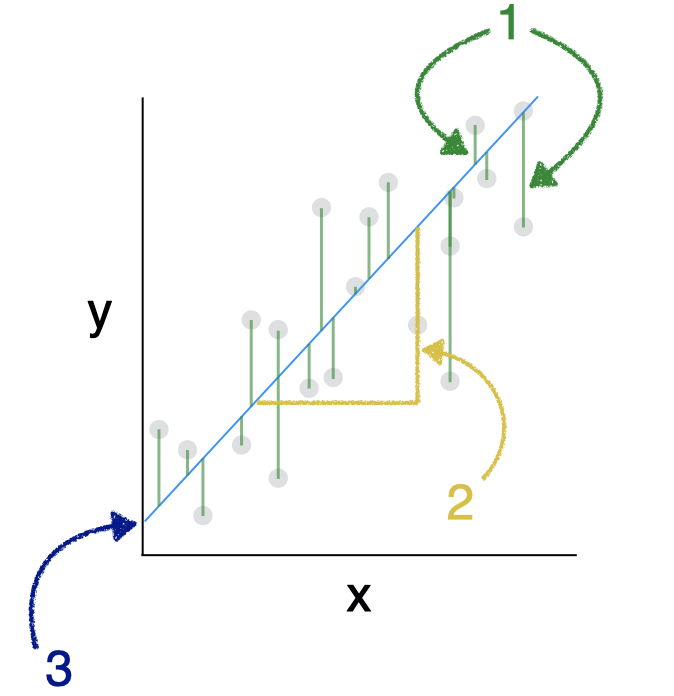

```{r setup, message=FALSE, warning=FALSE, include=FALSE}
library(emo)
library(learnr)
library(tidyverse)
library(openintro)

knitr::opts_chunk$set(echo = FALSE, 
                      fig.align = "center", 
                      fig.height = 3, 
                      fig.width = 5,
                      warning = FALSE, 
                      message = FALSE)

tutorial_options(exercise.eval = FALSE)

# Hash generation helpers
# Should ideally be loaded from the imstutorials package when it exists
is_server_context <- function(.envir) {
  # We are in the server context if there are the follow:
  # * input - input reactive values
  # * output - shiny output
  # * session - shiny session
  #
  # Check context by examining the class of each of these.
  # If any is missing then it will be a NULL which will fail.
  
  inherits(.envir$input, "reactivevalues") &
    inherits(.envir$output, "shinyoutput") &
    inherits(.envir$session, "ShinySession")
}

check_server_context <- function(.envir) {
  if (!is_server_context(.envir)) {
    calling_func <- deparse(sys.calls()[[sys.nframe() - 1]])
    err <- paste0("Function `", calling_func, "`", " must be called from an Rmd chunk where `context = \"server\"`")
    stop(err, call. = FALSE)
  }
}
encoder_logic <- function(strip_output = FALSE) {
  p <- parent.frame()
  check_server_context(p)
  # Make this var available within the local context below
  assign("strip_output", strip_output, envir = p)
  # Evaluate in parent frame to get input, output, and session
  local(
    {
      encoded_txt <- shiny::eventReactive(
        input$hash_generate,
        {
          # shiny::getDefaultReactiveDomain()$userData$tutorial_state
          state <- learnr:::get_tutorial_state()
          shiny::validate(shiny::need(length(state) > 0, "No progress yet."))
          shiny::validate(shiny::need(nchar(input$name) > 0, "No name entered."))
          shiny::validate(shiny::need(nchar(input$studentID) > 0, "Please enter your student ID"))
          user_state <- purrr::map_dfr(state, identity, .id = "label")
          user_state <- dplyr::group_by(user_state, label, type, correct)
          user_state <- dplyr::summarize(
            user_state,
            answer = list(answer),
            timestamp = dplyr::first(timestamp),
            .groups = "drop"
          )
          user_state <- dplyr::relocate(user_state, correct, .before = timestamp)
          user_info <- tibble(
            label = c("student_name", "student_id"),
            type = "identifier",
            answer = as.list(c(input$name, input$studentID)),
            timestamp = format(Sys.time(), "%Y-%m-%d %H:%M:%S %Z", tz = "UTC")
          )
          learnrhash::encode_obj(bind_rows(user_info, user_state))
        }
      )
      output$hash_output <- shiny::renderText(encoded_txt())
    },
    envir = p
  )
}


hash_encoder_ui <- {
  shiny::div("If you have completed this tutorial and are happy with all of your", "solutions, please enter your identifying information, then click the button below to generate your hash", textInput("name", "What's your name?"), textInput("studentID", "What is your student ID (Gebruikersnaam  s-/p-nummer)?"), renderText({
    input$caption
  }), )
}

```

## Visualization of linear models

Before we get into the mathematical specification for a regression model, let's build some intuition about what a regression line is.  


<div style="float: right; margin: 0px 0px 20px 20px">

</div>
In this section we will be looking at a dataset that records 104 observations of possums in Australia and New Guinea. Specifically, we will predict the body length of the possum from their tail length. You can find more information about this dataset [here](https://www.openintro.org/data/index.php?data=possum).

The scatterplot shows the relationship between the total length of a possum, and the corresponding length of its tail. Clearly there is not a perfect relationship here: the total length of the possum varies even for possums with the same tail length. But we still have some intuitive desire to describe the relationship with a line. 

```{r 1, echo = TRUE}
ggplot(data = possum, aes(y = total_l, x = tail_l)) +
  geom_point()
```

## Picking a line of best fit

### Through the origin

In the plot below, we've superimposed a line that goes through the origin - that is, the point where both $x$ and $y$ are equal to zero. The line has a slope of 2.5 centimeters (of total length) per centimeter (of tail length). We notice that, in some sense, the line does go "through" the points, but doesn't capture the general trend as best we could imagine. 

```{r 2, message=FALSE}
ggplot(data = possum, aes(y = total_l, x = tail_l)) +
  geom_point() + 
  geom_abline(intercept = 0, slope = 2.5) + 
  xlim(0, 50) + 
  ylim(0, 100)
```

### Through the origin, better fit

This line also goes through the origin, but has a gentler slope of 2.3 cm (of total length) per cm (of tail length). It seems like a "better" fit, since it cuts through the points in a more central way.  

```{r 3, message=FALSE}
ggplot(data = possum, aes(y = total_l, x = tail_l)) +
  geom_point() + 
  geom_abline(intercept = 0, slope = 2.3) + 
  xlim(0, 50) + 
  ylim(0, 100)
```

### Not through the origin

But why should we force the line to go through the origin? Here is a line that has a $y$-intercept of 40 cm, and an even gentler slope of 1.3 . It seems like an even better fit still. 

Do you think you could find an even better fit? In order to do so, you need some criteria for judging which line fits better. In particular, you need a numerical measurement of how good the fit of each possible line is. 

```{r 4, message=FALSE}
ggplot(data = possum, aes(y = total_l, x = tail_l)) +
  geom_point() + 
  geom_abline(intercept = 40, slope = 1.3) + 
  xlim(0, 50) + 
  ylim(0, 100)
```

### The "best" fit line

The simple linear regression model for a numeric response as a function of a numeric explanatory variable can be visualized on the corresponding scatterplot by a straight line. 

In regression, we use the least squares criterion to determine the best fit line. Statisticians have proven that (apart from pathological examples) if we seek the line that tries to minimize the sum of the squared distances between the line and a set of data points, a unique line exists. That line is called the "least squares regression line." 

We might consider linear regression to be a specific example of a larger class of *smooth* models. The `geom_smooth()` function allows you to draw such models over a scatterplot of the data itself. This technique is known as visualizing the model *in the data space*. The `method` argument to `geom_smooth()` allows you to specify what class of smooth model you want to see. Since we are exploring linear models, we'll set this argument to the value `"lm"`.

We can add the line to our plot using the `geom_smooth()` function and specifying the `method` argument to be `"lm"`, which stands for "linear model". 

```{r 5, echo = TRUE}
ggplot(data = possum, aes(y = total_l, x = tail_l)) +
  geom_point() + 
  geom_smooth(method = "lm")
```

### Ignore standard errors

Note that by default, this will draw the regression line in blue, with gray shading for the standard error associated with the line. That should not concern us just yet, so we can turn it off by setting the `se` argument to `FALSE`. 

```{r 6, echo = TRUE}
ggplot(data = possum, aes(y = total_l, x = tail_l)) +
  geom_point() + 
  geom_smooth(method = "lm", se = FALSE)
```

You'll explore the "best fit" line on your own in these next exercise.

## Your turn! 

Using the `bdims` dataset, create a scatterplot of body weight (`wgt`) as a function of height (`hgt`) for all individuals in the `bdims` dataset. 

Then, add a linear regression line on top of the scatterplot. 


```{r ex1, exercise = TRUE}
 ggplot(data = ___, aes(x = ___, y = ___)) + 
  ___ + 
  ___(method = ___, se = FALSE)
```

```{r ex1-hint-1}
 ggplot(data = bdims, aes(x = hgt, y = wgt)) + 
  geom_point() + 
  ___(method = ___, se = FALSE)
```

```{r ex1-hint-2}
 ggplot(data = bdims, aes(x = hgt, y = wgt)) + 
  geom_point() + 
  geom_smooth(method = ___, se = FALSE)
```


```{r ex1-solution}
ggplot(data = bdims, aes(x = hgt, y = wgt)) + 
  geom_point() + 
  geom_smooth(method = "lm", se = FALSE)
```

### Uniqueness of least squares regression line

The least squares criterion implies that the slope of the regression line is unique. In practice, the slope is computed by R. In this exercise, you will experiment with trying to find the optimal value for the regression slope for weight as a function of height in the `bdims` dataset via trial-and-error.

We've built a custom function for you called `add_line()`, which takes a single argument: the proposed slope coefficient and plots it on the scatterplot of height and weight. 

Use the code chunk below to experiment with different values (to the nearest integer) of the `my_slope` parameter until you find one that you think fits best.

```{r ex2-setup}
add_line <- function (my_slope) {

  bdims_summary <- bdims |>
    summarize(N = n(), r = cor(hgt, wgt),
              mean_hgt = mean(hgt), mean_wgt = mean(wgt),
              sd_hgt = sd(hgt), sd_wgt = sd(wgt)) |>
    mutate(true_slope = r * sd_wgt / sd_hgt, 
           true_intercept = mean_wgt - true_slope * mean_hgt)
  p <- ggplot(data = bdims, aes(x = hgt, y = wgt)) + 
    geom_point() + 
    geom_point(data = bdims_summary, 
               aes(x = mean_hgt, y = mean_wgt), 
               color = "red", size = 3)
  
  my_data <- bdims_summary |>
    mutate(my_slope = my_slope, 
           my_intercept = mean_wgt - my_slope * mean_hgt)
  p + geom_abline(data = my_data, 
                  aes(intercept = my_intercept, slope = my_slope), color = "dodgerblue")
}

ggplot(data = bdims, aes(x = hgt, y = wgt)) + 
  geom_point()
```

```{r ex2, exercise = TRUE}
# Input your best guess for the slope.
#Try numbers 0, 1, 2, 3, etc... 
 
add_line(my_slope = ___)
```


```{r quiz-fit}
quiz(caption = "", 
  question(
    "Which slope appears to fit the data best?", 
    answer("0"), 
    answer("1", correct = TRUE),
    answer("2"),
    answer("3"),
    answer("4"), try_again = TRUE
  ), 
  question(
    "Notice that all the lines pass through a red point in the middle. How do you think this point was found?", 
    answer("The point's coordinates (x,y) represent the medians of the variables `hgt` and `wgt`"), 
    answer("The point's coordinates (x,y) represent the mean of the variables `hgt` and `wgt`", correct = TRUE),
    answer("The point's coordinates (x,y) represent the standard deviation of the variables `hgt` and `wgt`"),
    try_again = TRUE
  )
)

```


## Understanding Linear Models

Models are ubiquitous in statistics. In many cases, we assume that the value of our response variable is some function of our explanatory variable, plus some random noise. The latter term is important, and in a philosophical sense, is the focus of statistical thinking.

What we are saying here is that there is some mathematical function $f$, which can translate values of one variable into values of another, except that there is some randomness in the process. What often distinguishes statisticians from other quantitative researchers is the way that we try to model that random noise. 

$$
  response = f(explanatory) + noise
$$

### Linear model

For a linear regression model, we simply assume that $f$ takes the form of a linear function. Thus, our model describes the value of the response variable in terms of what creates a line (an intercept and a slope). 

$$
  response = intercept + slope \cdot explanatory + noise
$$

### Regression model

In a regression model, we use Greek letters for the intercept and slope, indicating that they are population parameters which we hope to estimate with our sample. 

The intercept is notated as $\beta_0$ and the slope is notated as $\beta_1$. The noise term in a regression is often denoted $\epsilon$. In a regression, we assume that the noise terms have a Normal distribution, centered at 0 with a known standard deviation of $\sigma_\epsilon$. The equation below is what we call our "population" regression equation, symbolizing that it is for the population we are interested in studying. 

$$
  Y = \beta_0 + \beta_1 \cdot X + \epsilon \,, \qquad \epsilon \sim N(0, \sigma_\epsilon)
$$

### Fitted values

When we estimate our population regression equation with data, we need to indicate that our intercept and slope values are estimates for the *true* population intercept and slope. 

We do this by changing our equation in four ways: 

1. $Y$ is changed to $\hat{y}$, as we are now estimating the mean response rather than an individual response. 
2. The error terms ($\epsilon$) are removed, as we are no longer modeling individual responses. 
3. The $\beta_0$ is replaced with $\widehat{\beta_0}$, notating that this is an estimate of the true intercept. 
4. The $\beta_1$ is replaced with $\widehat{\beta_1}$, notating that this is an estimate of the true slope.

The resulting model looks like: 

$$
\hat{y} = \hat{\beta}_0 + \hat{\beta}_1 \cdot X
$$

### Residuals

The difference between what was observed in the data and what was predicted from the regression line is what we call a "residual." Obervations that lie above the regression line exceeded their predicted value and have a positive residual. Values below the regression line are less than their predicted value and have a negative residual. 

The residuals are the realization of the noise term from the population regression equation. While $\epsilon$ and $e$ play analogous roles in the regression equation, $\epsilon$ is an unknown, true quantity, while $e$ is a known, estimate of that quantity. 

$$
  e = Y - \hat{Y}
$$


```{r image-reg-labeled, out.width="60%"}


```


```{r quiz-reg-lab, echo=FALSE}
question("Identify the elements in the image above", allow_retry = TRUE, random_answer_order = TRUE, 
  answer("1 - residuals $\\epsilon$, 2 - slope $\\beta_1$, 3 - intercept $\\beta_0$", correct = TRUE),
  answer("1 - slope $\\beta_1$, 2 - residuals $\\epsilon$, 3 - intercept $\\beta_0$"),
  answer("1 - residuals $\\epsilon$, 2 - intercept $\\beta_0$, 3 - slope $\\beta_1$")
         )


```


### Fitting procedure

While we won't delve into the specifics of the least squares fitting procedure, we will outline what it does. It is intuitive that we would want a line that has small residuals. More precisely we choose a line that minimizes the sum of squared residuals. 

In this procedure, the residual for each observation is squared and all of the squared residuals are added up. You can think of the use of the squared error as saying that "a residual twice as large as another residual is more than twice as bad." In other words, overestimating by 4 is more than twice as bad as overestimating by 2. 

```{r quiz-reg-1}
question(
  "A least-squares regression line will always have the following attributes:", 
  allow_retry = TRUE, 
  random_answer_order = TRUE,  
  answer("The residuals will always sum to 0", correct = TRUE), 
  answer("The line always passes through the point $(\\bar{x}, \\bar{y})$", correct = TRUE), 
  answer("The line always minimizes the absolute distance to all the points at the same time"), 
  answer("The line always minimizes the square distance to all the points at the same time", correct = TRUE), 
  answer("The slope and the correlation coefficient are proportional to one another", correct = TRUE), 
  answer("The slope equals the correlation coefficient")
)

```


### Key concepts

It's worth reviewing some key concepts about regression models. 

- $\hat{Y}$ is the mean value of the response, for a given value of $X$.
  * $\hat{Y}$ is our best guess for the true value of $Y$ given what we know about $X$.
- $\hat{\beta}$'s are estimates of true, unknown $\beta$'s.
  * The estimated intercept and slope is our best guess of the true value of $\beta_0$ and $\beta_1$.
- Residuals ($e$'s) are estimates of true, unknown $\epsilon$'s.
  * The residuals are estimates of the true, unknown noise.
  * "error" may be a misleading term---better: *noise*.


You'll put your understanding of regression to use in these next exercises. 

## Your turn! 

Consider a linear regression model of the form:

$$
    Y = \beta_0 + \beta_1 \cdot X + \epsilon \,, \text{ where } \epsilon \sim N(0, \sigma_{\epsilon}) \,.
$$


```{r mc}
question("The slope coefficient is:",
  answer("$Y$", message = "Not quite! $Y$ represents the response variable."),
  answer("$\\beta_0$", message = "Try again! $\\beta_0$ represents the y-intercept."),
  answer("$\\beta_1$", correct = TRUE, message = "The $X$ represents the explanatory variables and the $\\beta_0$ represents the y-intercept."),
  answer("$\\epsilon$", message = "Wrong! That represents the disturbance term, or the noise."),
  allow_retry = TRUE
)
```


### Regression model output terminology

The fitted model for the poverty rate of U.S. counties as a function of high school graduation rate is:

$$
\widehat{poverty} = 64.594 - 0.591 \cdot hs_{grad}
$$


```{r mc1}
question("In Hampshire County in western Massachusetts, the high school graduation rate is 92.4%. These two facts imply that the mean poverty rate in Hampshire County is ___.
",
  answer("exactly 11.7%", message = "Incorrect, try again."),
  answer("exactly 10.0%", message = "Not quite!"),
  answer("expected to be about 10.0%", correct = TRUE, message = "Solve for poverty by plugging in 92.4 as hs_grad in the equation!"),
  answer("expected to be about 11.7%", message = "Did you plug 92.4 into the equation?"),
  allow_retry = TRUE
)
```


## Fitting a linear model "by hand"

Recall the simple linear regression model:

$$
    y = b_0 + b_1 \cdot x
$$

Two facts enable you to compute the slope $b_1$ and intercept $b_0$ of a simple linear regression model from some basic summary statistics.

First, the slope can be defined as:

$$
    b_1 = r_{x,y} \cdot \frac{s_y}{s_x}
$$

where $r_{x,y}$ represents the correlation (`cor()`) of $x$ and $y$ and $s_x$ and $s_y$ represent the standard deviation (`sd()`) of $x$ and $y$, respectively.

Second, the point $(\bar{x}, \bar{y})$ is *always* on the least squares regression line, where $\bar{x}$ and $\bar{y}$ denote the average of $x$ and $y$, respectively.

In this exercise, you will find the slope and intercept of the least squares regression line for body weight ($y$) as a function of height ($x$). But, you might need to do some algebra to solve for $b_0$!

The `bdims_summary` table has been added to your workspace. Run the code chunk below to preview what the table looks like! 

```{r preview-setup}
bdims_summary <- bdims |>
  summarize(N = n(), r = cor(hgt, wgt),  
            mean_hgt = mean(hgt), sd_hgt = sd(hgt), 
            mean_wgt = mean(wgt), sd_wgt = sd(wgt))
```

```{r preview, exercise = TRUE}
# Print bdims_summary
bdims_summary

```

Now, use `mutate()` and some algebra to add the `slope` and `intercept` to the `bdims_summary` table.

```{r ex3-setup}
bdims_summary <- bdims |>
  summarize(N = n(), r = cor(hgt, wgt),  
            mean_hgt = mean(hgt), sd_hgt = sd(hgt), 
            mean_wgt = mean(wgt), sd_wgt = sd(wgt))
```

```{r ex3, exercise = TRUE}
bdims_summary |>
  mutate(slope = ___, 
         intercept = ___)
```

```{r ex3-hint-1}
## Remember the slope can be calculated from 
## 1. the correlation 
## 2. the sd of height and weight
bdims_summary |>
  mutate(slope = r  * (sd_wgt / sd_hgt), 
         intercept = ___)
```

```{r ex3-hint-2}
## Remember that x-bar and y-bar lie on the regression line! 

bdims_summary |>
  mutate(slope = r  * (sd_wgt / sd_hgt), 
         intercept = mean_wgt  - ___)
```


```{r ex3-solution}
bdims_summary |>
  mutate(slope = r * sd_wgt / sd_hgt, 
         intercept = mean_wgt - slope * mean_hgt)
```


## Congratulations!

You have successfully completed Tutorial 4.2.  To generate a hash for submission, see below.


```{r, echo=FALSE, context="server"}
encoder_logic()
```

```{r encode, echo=FALSE}
learnrhash::encoder_ui(ui_before = hash_encoder_ui)
```


### Submit your hash in a form

After creating the hash, please copy it, navigate to [this form](https://forms.gle/ajEDfePc1jcTukyB7) and fill it in and submit. You will need to submit the form once for every lesson you complete in this tutorial.
