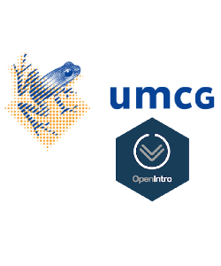

<meta http-equiv='cache-control' content='no-cache'> 
<meta http-equiv='expires' content='0'> 
<meta http-equiv='pragma' content='no-cache'>

```{r setup, include=FALSE}
knitr::opts_chunk$set(echo = TRUE)
library(glue)
# shiny_url <-  "https://oferengel-posit.shinyapps.io/ims-01-data-02/"
shiny_url <- params$shiny_url
```



Learnr tutorials supporting [OpenIntro::Introduction to Modern Statistics](https://openintro-ims.netlify.app/).
Each tutorial corresponds to one part of the book and is comprised of multiple lessons for a total of 35 lessons that cover the entire content of the book.

- [Tutorial 1. Introduction to data](01-data/)
- [Tutorial 2. Exploratory data analysis](02-explore/)
- [Tutorial 3. Regression modeling](03-model/)
- [Tutorial 4. Foundations of inference](04-foundations/)
- [Tutorial 5. Statistical inference](05-infer/)
- [Tutorial 6. Inferential modeling](06-model-infer/)

The originial tutorials were forked and adapted by [Ofer Engel](https://www.rug.nl/cf/university-college-fryslan/about-ucf/dr-ofer-engel?lang=en), the original tutorial content has been developed by [Mine Çetinkaya-Rundel](https://github.com/mine-cetinkaya-rundel), [Jo Hardin](https://github.com/hardin47), [Ben Baumer](https://github.com/beanumber), and [Andrew Bray](https://github.com/andrewpbray) and implemented in learnr with the help of [Yanina Bellini Saibene](https://github.com/yabellini), [Florencia D’Andrea](https://github.com/flor14), [Roxana Noelia Villafañe](https://github.com/data-datum), and [Allison Theobold](https://github.com/atheobold).

<!-- ## Instructor -->

<!--  -->

### Instructors and authors

#### Mine Çetinkaya-Rundel

Mine Çetinkaya-Rundel is Associate Professor of the Practice position at the Department of Statistical Science at Duke University and Data Scientist and Professional Educator at RStudio.
Mine's work focuses on innovation in statistics and data science pedagogy, with an emphasis on computing, reproducible research, student-centered learning, and open-source education as well as pedagogical approaches for enhancing retention of women and under-represented minorities in STEM.
Mine works on integrating computation into the undergraduate statistics curriculum, using reproducible research methodologies and analysis of real and complex datasets.
She also organizes [ASA DataFest](https://ww2.amstat.org/education/datafest/), an annual two-day competition in which teams of undergraduate students work to reveal insights into a rich and complex dataset.
Mine has been working on the [OpenIntro](openintro.org) project since its founding and as part of this project she co-authored four open-source introductory statistics textbooks (including this one!).
She is also the creator and maintainer of [datasciencebox.org](https://datasciencebox.org/) and she teaches the popular Statistics with R MOOC on Coursera.