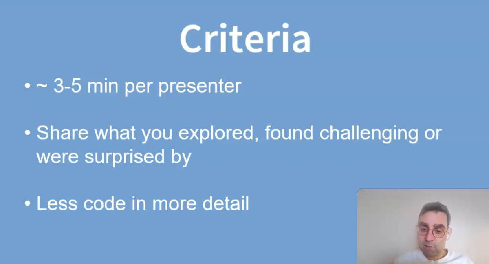

<meta http-equiv='cache-control' content='no-cache'>
<meta http-equiv='expires' content='0'>
<meta http-equiv='pragma' content='no-cache'>

```{r html, eval=FALSE, echo=FALSE}
<style>
.column-left{
  float: left;
  width: 75%;
  text-align: left;
}
.column-right{
  float: right;
  width: 40%;
  text-align: right;
  padding-left: 10px;
}

.column-full{
  float: none;
  width: 100%;
  text-align: left;
}


.column-right-text-left{
  float: right;
  width: 40%;
  text-align: left;
  font-size: 10px;
}


.column-right-text-center{
  float: right;
  width: 25%;
  text-align: center;
  font-size: 16px;
  margin: 10px 10px 10px 10px;
}

.RUsers {
  padding: 1em;
  background: aliceblue;
  color: black;
}


</style>


```
```{r setup, include=FALSE}
knitr::opts_chunk$set(echo = FALSE)
library(glue)
# shiny_url <-  "https://oferengel-posit.shinyapps.io/ims-01-data-02/"
shiny_url <- params$shiny_url
```

::: {style="float: right; margin: 0px 0px 20px 20px"}
 <br/><br/> $\mathbb{S}$ stands for STATISTICS
:::

Practical knowledge of statistics is a fundamental skill for medical research. The recent growth of Big Data Applications and Data Science only enhances the need for practical working knowledge of statistical analysis, helping you understand your own data as well as the analyses performed by others.

This course is designed to be a gentle introduction to the practice of solving problems in bio-statistics and epidemiology in a data driven manner. The course assumes no prior programming/coding experience. It is designed to provide the tools you need to progress according to your interest and in your time as much as possible. Succeeding in this course will be able to:

-   Use a modern suite of software packages for statistics and data science
-   Identify descriptive statistics for data exploration such as measures of spread and central tendency, measures of association and causation
-   Recognize various graphical representations of data, their advantages, and disadvantages
-   Fit a range of models such as linear least square regression (LLSR) and generalized linear models (GLM).
-   Perform statistical inference using statistical inference, confidence intervals, and hypothesis testing procedures.

Slides can all be downloaded from [this folder](https://bit.ly/3w8HEpv)


## Presenting your work

[This video](https://www.youtube.com/watch?v=uG31rF2fmEQ) presents some guidelines for presenting your lab code and report. Before you present, please make sure you publish your final report on Rpubs. [Here](https://www.youtube.com/watch?v=GJ36zamYVLg) are some instructions. Remember you may need to register and/or sign into RPubs first. Here's [another link](https://www.youtube.com/watch?v=O7DADwfZMDU) with explanations.

[{width=50%}](https://www.youtube.com/watch?v=uG31rF2fmEQ)


```{r img-present-lab, out.width="50%", eval=FALSE}


```


::: {#greyedtext}

### Week 1

Preparation **Deadline:** 8 February 2024

-   Readiness Assurance found [here](https://bit.ly/488ZIwV)


In class: [Lab 01 - Introduction to R and RStudio](https://bit.ly/3w8DPk9) 


### Week 2

Preparation **Deadline:** 15 February 2024

-   Complete last week's lab IN YOUR TEAM, for a class presentation
-   Please complete [this week's tutorials](https://bit.ly/3OzsqAb) (three tutorials)
-   Watch the [lectures and add your comments](https://bit.ly/3OvGDhy)
-   [Readiness Assurance](https://bit.ly/48axDW3) 

In class: [Lab 02 - Exploring numeric data](https://bit.ly/3wdzpIy) 


<!-- https://www.stat.uchicago.edu/~yibi/s220/labs/lab02.html -->

### Week 3

Preparation **Deadline:** 20 February 2024

-   Complete last week's lab IN YOUR TEAM, for a class presentation
-   Please complete this week's tutorials [Exploratory data analysis](02-explore/) 
-   Watch [these lecture](https://bit.ly/48cta58) and add your comments!
-   [Readiness Assurance](https://bit.ly/3SK4Cuu)


In class: [Lab 03 - Simple linear regression](https://oferengel.github.io/ims-tutorials-4-umcg/support/assignments/04_SLR/)

:::


### Week 4

Preparation **Deadline:** 6 March 2024

-   Complete last week's lab IN YOUR TEAM, for a class presentation
-   Please complete [this week's tutorials](03-model/index.html) (**FIVE** tutorials)
-   Watch [the lecture](https://bit.ly/3OQQkXP) and add your comments
-   Readiness Assurance you can find [here](https://bit.ly/3SHJbdD)

In class: [Lab 04 - Multiple linear regression](https://oferengel.github.io/ims-tutorials-4-umcg/support/assignments/05_MLR/)


### Week 5

Preparation **Deadline:** 13 March 2024

-   Continue working on last week's lab IN YOUR TEAM
-   Please complete [this week's tutorials](https://oferengel-posit.shinyapps.io/7_1_lesson)
-   Watch the [lectures](https://app.perusall.com/courses/jsm-medical-statistics/understanding-logarithms?assignmentId=hwCQRmhfrZvvKa8zW&part=1) and add your comments
-   Readiness Assurance you can find [here](https://forms.gle/oV2uYUBMih4ptRTEA)

In class: [Lab 05 - CREATE YOUR OWN](https://oferengel.github.io/ims-tutorials-4-umcg/support/assignments/11_final_project/)


### Week 6

Preparation **Deadline:** 24 March 2024

-   Complete last week's lab IN YOUR TEAM, for a class presentation


### Acknowledgements

The tutorials in this course are adopted from the learnr tutorials supporting [OpenIntro::Introduction to Modern Statistics](https://openintro-ims.netlify.app/).

The [original tutorials](https://openintrostat.github.io/ims-tutorials/) were forked and adapted by [Ofer Engel](https://www.rug.nl/cf/university-college-fryslan/about-ucf/dr-ofer-engel?lang=en), their content was developed by [Mine Çetinkaya-Rundel](https://github.com/mine-cetinkaya-rundel), [Jo Hardin](https://github.com/hardin47), [Ben Baumer](https://github.com/beanumber), and [Andrew Bray](https://github.com/andrewpbray) and implemented in learnr with the help of [Yanina Bellini Saibene](https://github.com/yabellini), [Florencia D’Andrea](https://github.com/flor14), [Roxana Noelia Villafañe](https://github.com/data-datum), and [Allison Theobold](https://github.com/atheobold).
