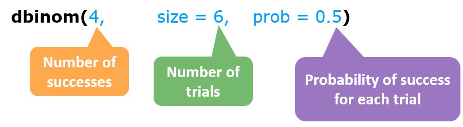

```{r setup, include=FALSE}
library(learnr)
library(gradethis)

gradethis::gradethis_setup()
# The ID to look for in the student document
options(tutorial.id = "UMCG/tests-introduction")

library(tidyverse)
knitr::opts_chunk$set(comment = "", echo = FALSE)

library(glue)
library(gt)
library(janitor)
# library(latex2exp)
# library(learnr)
# library(mosaic)
# library(scales)
# library(shiny)
# library(tidyverse)
# # library(here)
# # library(gradethis)
# library(viridis) 
# library(here)
# library(pacman)
# library(outbreaks)
# library(infer)

tutorial_options(exercise.startover	 = TRUE)


```

## Welcome

Consider the following problems:

-   A pharmaceutical company developed a new drug. They want to show that it is more effective than alternatives on the market when treating certain infections.
-   A researcher wishes to determine whether there is an association between diabetes and the consumption of sugary drinks.
-   A public health official wonders whether minorities are more prone to Tay-Sachs disease than others groups.

To answer these questions, we need to run experiments on samples from the population. But even if we make interesting findings in our sample, how can we tell that the same will hold for the entire population?

Hypothesis testing gives us an approach to answer this question. It is used to make inferences from samples to the population. It tells us about the effectiveness of treatments, the relationship between variables, and the differences between groups **in the population**.

In this tutorial, we begin to use statistical tools in order to make informed decisions based on imperfect data. Specifically you'll learn how to:

-   Distinguish between experiments, events and sample space
-   Implement simple hypothesis testing procedures
-   Understand p-values and confidence intervals

### Can our Data be surprising?

+-----------------------------------------------------------------------------------------------------------------------------------------------------------------------------------------------------------------------------------------------------------------------+---------+------------------------------------------------:+
| [Paul](https://www.youtube.com/watch?v=pc0FLC8H7D8){target="_blank" rel="noopener noreferrer"} was a common octopus who gained worldwide fame for his uncanny ability to predict the results of football matches during the 2008 UEFA European Football Championship. |         | {width="197"} |
|                                                                                                                                                                                                                                                                       |         |                                                 |
| From his aquarium home in Oberhausen in Germany, he would "predict" the results of football matches by selecting one of two food containers, each bearing the flag of the competing teams.                                                                            |         |                                                 |
+-----------------------------------------------------------------------------------------------------------------------------------------------------------------------------------------------------------------------------------------------------------------------+---------+-------------------------------------------------+

You can see below his performance at predicting matches in 2008.

```{r octopus-prediction, echo=FALSE}
tbl.2008.performance <- tribble(
  ~country_code_2,~Stage, ~Date, ~Prediction, ~Result, ~Outcome, ~country_name,
  "PL", "group stage", "08-Jun-08", "Germany", "2–0", "Correct", "Poland",
"HR", "group stage", "12-Jun-08", "Germany", "1–2", "Incorrect", "Croatia",
"AT", "group stage", "16-Jun-08", "Germany", "1–0", "Correct", "Austria",
"PT", "quarter-finals", "19-Jun-08", "Germany", "3–2", "Correct", "Portugal",
"TR", "semi-finals", "25-Jun-08", "Germany", "3–2", "Correct", "Turkey",
"ES", "final", "29-Jun-08", "Germany", "0–1", "Incorrect", "Spain") %>% 
  gt()  %>% 
  tab_header(title = "Projections by Paul the Octopus in the UEFA Euro 2008 tournament", 
    subtitle = md("Germany's matches only")) %>% 
  cols_move(
    columns = country_name,
    after = country_code_2
  ) %>% 
  fmt_flag(columns = country_code_2) %>%
  cols_label(
    country_code_2 = "Germany vs.   ",
     country_name = ""
  ) %>% cols_merge(
    columns = c(country_code_2, country_name),
    pattern = "{1}&nbsp;&nbsp;&nbsp;&nbsp;{2}"
  ) 

tbl.2008.performance
  
```

Paul guessed that Germany would win all of their games. He was a correct prediction in 4 out of 6 cases. He failed to predict their defeats by Croatia in the group stage and by Spain in the championship's final.

Paul's achievements in predicting football matches have been the subject of much debate. Should we be surprised about this result?

### 

```{r quiz-surprise}
quiz(caption = "",
    question("Or more to the point: how can we decide whether the data is surprising or not?",
    answer("Being surprised is a subjective concept. There is no objective way to answer this question."),
    answer("Yes, this data is objectively surprising"), 
    answer(" We can construct an indicator for how *surprising* this data is, given certain assumptions.", correct = TRUE),
    allow_retry = TRUE, 
    random_answer_order = TRUE
  )
)

```

### 

In this example, it is natural to assume that Paul the Octopus does not possess any meaningful prediction skills.

Making this assumption, we can ask whether we need to be surprised by the observations we make. For example, we can ask: what is the probability that Paul predicts six out of eight matches correctly, just by chance?

This probability is the **indicator** of our surprise.

::: tip
Statistical tests are based on an **indicator** that quantifies how surprised we should be by our observed data, given the assumptions that we make.
:::

In the following sections, we continue to explore statistical tests.

## Experiments, events and samples

Suppose that Paul the Octopus (aka the octopus-oracle) guesses which team wins in a match by choosing one of the teams completely at random.

```{r quiz-octopus-1}
quiz(caption = "",
    question("What's the probability that Paul predicts correctly in the very first match?",
    answer("0"),
    answer("1/2", correct = TRUE), 
    answer("2/3"),
    answer("1"),
    incorrect = "Assume that Paul guesses at random and that in each match there are only two possible outcomes: either the German team wins or the opponent team. Do try again!",
    allow_retry = TRUE, 
    random_answer_order = TRUE
  )
)

```

### 

The octopus can choose either the German team or its opponent. Each choice has the same probability. When the probabilities for all outcomes are the same, we talk of a uniform distribution of probabilities.

In a uniform distribution, all possible outcomes of an experiment are all equally likely. The set of 'all possible outcomes' is also known as the `sample space`. In our case, the sample space can be written as $\{\text{G}, \text{O}\}$, where:

-   $\text{G}$ stands for the outcome that Paul chose `Germany`
-   $\text{O}$ stands for the outcome that Paul chose the `Opponent` .

The total probability across all possible outcomes in the sample space always sums up to one:

$$
\text{Prob}(\text{G}) + \text{Prob}(\text{O}) = 1
$$

Assuming that all Paul is just guessing, all probabilities are equal. Since the the sum of those probabilities must be $1$, each probability must be exactly $1/2$ .

### 

This idea generalizes to uniform distributions with any number of outcomes.

The total probability is always $1$ no matter how the possible outcomes are distributed, so if we list the outcomes in the sample space in no particular order, then

$$
\text{Prob}(\text{1st outcome}) + \text{Prob}(\text{2nd outcome})+ \cdots + \text{Prob}(\text{last outcome}) =1
$$

### 

Suppose Paul predicted not one, but three matches. Now, the responses could be represented as a 3-letter string of $\text{G}$'s and $\text{O}$'s.

For example, $\text{G}\text{O}\text{G}$ would represent Paul's prediction of Germany winning the first match, the opponent winning the second match and Germany winning the third match again. Three letter strings like $\text{O}\text{O}\text{G}$, $\text{G}\text{O}\text{O}$ and $\text{O}\text{O}\text{O}$ are examples of possible outcomes that can appear in the sample space for the three-match experiment.

```{r quiz-octopus-2}

quiz(caption = "",
    question("In an experiment where Paul the octopus predicts the outcome of three matches, what is the size of the sample space?",
    answer("0"),
    answer("2"), 
    answer("6"),
    answer("8", correct = TRUE),
    incorrect = "Count how many different three letter strings you can construct using the letters G and O: {GGG, GGO, GOG,GOO, OGG, OGO, OOG, OOO}. What is the number of distinct three letter strings?",
    allow_retry = TRUE
  ),
    question("In the above experiment, what's the probability that Paul predicted all matches correctly?",
    answer("1/8", correct = TRUE),
    answer("1/4"), 
    answer("1/3"),
    answer("2/5"),
    incorrect = "Only one of the three-letter strings in the sample space represents the correct prediction in the three match experiment, so the probability that Paul predicts correctly is the probability of him picking that particular three-letter string. Assuming that all the three-letter strings are equally probable, the probability of choosing the correct one just by chance is 1 over the size of the sample space.",
    allow_retry = TRUE, 
    random_answer_order = TRUE
  )
)

```

### 

+----------------------------------------------------------------------------------------------------------------------------------------------------------------------------------------------------------+-------------------------------------------------+
| Paul's probability of guessing the results of one match is $\frac{1}{2}$. But it is much harder to guess the results of three matches correctly, because the probability of doing that is $\frac{1}{8}$. | {width="197"} |
|                                                                                                                                                                                                          |                                                 |
| Being able to calculate probabilities like that is useful if you want to judge whether Paul is a true Oracle.                                                                                            |                                                 |
|                                                                                                                                                                                                          |                                                 |
| To make this judgement with confidence, you would put Paul under severe testing conditions, tests that he is very unlikely to pass by guessing. But how to quantify the severity of the testing?         |                                                 |
+----------------------------------------------------------------------------------------------------------------------------------------------------------------------------------------------------------+-------------------------------------------------+

### 

It's helpful at this point to introduce some terminology, frequently used in hypothesis testing: experiments, the sample space, events and hypotheses.

```{r quiz-concepts}
quiz(caption = "",
    question("A process that realizes one of many possible outcomes. For example:  throwing a cubical die (which side comes on top?), drawing lottery numbers at a national lottery (which numbers won?), throwing three basketballs from the foul line (how many baskets are scored?) or having a baby (which sex were they assigned at birth?). ",
    answer("Experiment", correct = TRUE),
    answer("Sample space"), 
    answer("Event"),
    answer("Hypothesis"),
    random_answer_order = TRUE,
    allow_retry = TRUE
    ), # question
    question("the set of all possible outcomes $\\{O_1, O_2, ... O_n\\}$ we could expect to see if we run the experiment",
    answer("Experiment"),
    answer("Sample space", correct = TRUE), 
    answer("Event"),
    answer("Hypothesis"),
    random_answer_order = TRUE,
    allow_retry = TRUE
    ), # question
    question("A group of outcomes of particular interest, formally, a subset of the outcomes in the sample space. An example is flipping two coins, one showing heads and the other tails, or answering two out of three true/false questions correctly in a quiz",
    answer("Experiment"),
    answer("Sample space"), 
    answer("Event", correct = TRUE),
    answer("Hypothesis"),
    random_answer_order = TRUE,
    allow_retry = TRUE
    ), # question
    question("An assumption made before the evidence is collected from an experiment (For example, the assumption of innocence in a court of law, the assumption that a coin is fair, or the assumption that Paul the Octopus has equal chances to predict a match)",
    answer("Experiment"),
    answer("Sample space"), 
    answer("Event"),
    answer("Hypothesis", correct = TRUE),
    random_answer_order = TRUE,
    allow_retry = TRUE
    ) # question
  ) # quiz

```

### 

You decide to conduct a small randomized experiment to compare a herbal remedy to a placebo for treating a soar throat. Your outcome variable is the soar throat's severity and duration. Suppose you have recruited four volunteers with a soar throat of whom two are male (Alfred (A) and Ben (B)) and two are female (Carla (C) and Dora (D)). Two of these volunteers will be randomly chosen to receive the herbal remedy, and the other two will receive the placebo.

```{r quiz-events}

quiz(caption = "",
    question("Define an outcome as one way to partition the treatments among the volunteers. For example, one outcome would have Ben and Carla assigned to the treatment group $\\{\\{B, C\\},\\{A, D\\}\\}$. What is the size of the sample space in this experiment?",
    answer("0"),
    answer("2"), 
    answer("4"),
    answer("6", correct = TRUE),
    incorrect = "Count how many ways there are to partition the four letters into two groups",
    allow_retry = TRUE
  ),
    question("What is the probability for each outcome?",
    answer("1/6", correct = TRUE),
    answer("1/4"), 
    answer("1/2"),
    answer("2/3"),
    incorrect = "The probability is just  1 over the size of the sample space.",
    allow_retry = TRUE, 
    random_answer_order = TRUE
  ),
    question("What’s the probability of the event that the sample chosen to receive the herbal remedy consists of one female and one male?",
    answer("1/6"),
    answer("1/4"), 
    answer("1/2"),
    answer("2/3", correct = TRUE),
    incorrect = "List all the possible samples, and count how many have the pair {Alfred, Carla} or {Alfred, Dora}, both receiving either treatment or placebo",
    allow_retry = TRUE, 
    random_answer_order = TRUE
  )
)

# -AB CD, *AC BD, *AD BC, -CD AB, *BD AC, *BC AD

```

## Testing consecutive successes

Being skeptical we may hypothesis that Paul the Octopus does not have any meaningful way of making his predictions, and that he simply guesses between "Germany" and its "Opponent". More formally, the probability associated with each outcome (aka probability distribution) is $\text{Prob}(\text{G}) = \text{Prob}(\text{O}) = 1/2$.

### 

We want to run an experiment to see whether the results can confirm our hypothesis or whether it gives us a reason to reject it. But what is the minimum number of attempts needed, before we can make a decision?

Consider we observe $n$ consecutive correct predictions. What would be the probability of this performance, assuming that Paul is merely guessing?

```{r quiz-octopus-3}

quiz(caption = "",
    question("What is the probability that Paul guesses the outcome of $n$ matches correctly?",
    answer("$\\frac{1}{2n}$"),
    answer("$\\frac{1}{n^2}$"), 
    answer("$\\frac{1}{2^n}$", correct = TRUE),
    answer("$\\frac{1}{2(n+1)}$"),
    allow_retry = TRUE, 
    random_answer_order = TRUE
  )
)

```

### 

If our hypothesis is true and matches are predicted completely at random, the probability that Paul gets $n$ consecutive predictions correct is $\frac{1}{2^n}$

This probability is exponentially decreasing, so if Paul gives a long string of correct predictions, our hypothesis would look increasingly unlikely and we may suspect some foul play!

Because we are very skeptical that the Octopus can indeed predict the outcome of football matches, we may be willing to admit we were wrong only if the evidence would be so conclusive, that the probability of observing it would be lower than $\alpha=0.001$ ( $\alpha$ is our threshold, below which we will reject our hypothesis).

Use the code below to calculate the probability of guessing the outcome of $n$ consecutive football matches, by sheer luck.

```{r prob-exp, exercise=TRUE}
# Assuming that the octopus is only guessing n matches
n <- 5
# Increase n until the probability is just under 0.001
(1/2)^n

```

```{r prob-exp-solution}
# Assuming that the octopus is only guessing n matches
n <- 10
# Increase n until the probability is just under 0.001
(1/2)^n
```

```{r prob-exp-check}
grade_this_code( )
```

```{r quiz-octopus-4}

quiz(caption = "",
    question("Given the proposed threshold of $\\alpha=0.001$, how many consecutive matches must Paul predict correctly, before we change our mind about his abilities?",
    answer("At least 3 matches"),
    answer("At least 7 matches"), 
    answer("At least 10 matches", 
           correct = TRUE),
    answer("At least 12 matches"),
    incorrect = "In the code if you set n <- 1, you will see that this is the smallest number for which we get a probability below our threshold. ",
    allow_retry = TRUE  
    )
)

```

### Paul's performance in 2010

During the 2010 FIFA World Cup, Paul's predictions were broadcast live by German news channel n-tv, giving him something of a celebrity status.

{width="537"}

Paul predicted the winners of each of the eight 2010 FIFA World Cup matches that the German team played --- against Australia, Serbia, Ghana, England, Argentina, Spain and Uruguay --- as well as the tournament's Netherlands vs. Spain final. His prediction that Argentina would lose prompted Argentine chef Nicolas Bedorrou to post an octopus recipe on Facebook. But a claim about the octopus' abilities to predict the future is extraordinary, and extraordinary claims [require](https://en.wikipedia.org/wiki/Sagan_standard) extraordinary evidence.

Given this, we may want to keep our threshold for rejecting our hypothesis at $\alpha = 0.001$. Only if the probability of observing the data is below this number, will we consider the data as sufficient evidence against our hypothesis:

```{r quiz-octopus-5}

quiz(caption = "Paul's performance in 2010",
    question("Use the code chunk above to calculate the probability of guessing 8 consecutive football matches by pure chance.",
    answer("$p \\gt 5\\%$"),
    answer("$5\\% \\ge p \\gt 1\\%$"), 
    answer("$1\\% \\ge p \\gt 0.1\\%$", correct = TRUE),
    answer("$0.1\\% \\ge p$"),
    incorrect = "In the code chunk above, set $n \\leftarrow 8$, and run the code to calculate the probability.", 
    correct = "You can see that the probability of guessing is approximately 0.0039, which is  above 0.001, our threshold of rejecting the hypothesis. ",
    allow_retry = TRUE  
    ),
    question("Given our threshold of $\\alpha = 0.001$, would we reject our hypothsis?",
    answer("Yes we would, because the data is associated with $p \\gt 0.001$"),
    answer("Yes we would, because the data is associated with $p \\lt 0.001$"), 
    answer("No we wouldn't, because the data is associated with $p \\gt 0.001$", correct = TRUE),
    answer("No we wouldn't, because the data is associated with $p\\lt0.001$"),
    incorrect = "The probability we calculated is above our threshold, so our test is more stringent than what the evidence shows. Is our data compelling enough to pass the stringency of our test?",
    correct = "The probability we calculated is above our threshold, therefore the data does not pass the stringency of our test, and we do not have enough evidence for rejecting our hypothesis.",
    allow_retry = TRUE , 
    random_answer_order = TRUE 
    )
)

```

Our skepticism should lead us to choose a very stringent threshold of $\alpha=0.001$ because we need a highly unlikely observation in order to give up the hypothesis that the octopus is simply guessing.

### 

Data generally does not provide incontestable "proof" or "disproof" of our hypothesis. In fact, in the long run it is very likely to observe statistical anomalies. For example, [Delma Kinney](https://www.npr.org/sections/thetwo-way/2011/11/29/142910375/atlanta-man-wins-lottery-for-the-second-time-in-three-years) a fifty-year-old Atlanta man, won \$1 million in a lottery game in 2008 and then another \$1 million in a game in 2011. The probability of that happening to the same person is somewhere in the range of 1 in 25 trillion. By the same token, an Octopus could guess matches correctly for a very long stretch just by random chance. Statistics cannot prove that he is not merely guessing, but it does allow us to quantify how unlikely such an event could be.

There are many practical considerations that go into choosing the threshold at which we give up on a hypothesis, but in most cases, a threshold of $\alpha = 0.05$ is commonly used.

::: tip
In this section we calculated the probability to observe $n$ consecutive successes, in order to judge whether our observations are consistent with our hypothesis.

But recall that in 2008, four out of six guesses were accurate. Successful predictions can be surprising, even if they are not made one after the other. Should we be surprised if the octopus guesses four out of six matches correctly?

To deal with observations where successful predictions are not made consecutively, we need to develop a new statistical test, one which calculates the probabilities of observing $k$ successes, $n$ trials
:::

## Observing $k$ successes in $n$ trials

In the previous example, we assumed the probability to observe a success in a single trial (it was $\frac{1}{2}$). We then calculated the probability to observe $n$ consecutive successes in $n$ trials, and found that it was $\frac{1}{2^n}$.

We used this measure as an indicator for our "surprise".

But there was a problem with our indicator.

```{r quiz-prob-consec}

quiz(caption = "",
    question("What is the problem with our indicator?",
    answer("It does not always work."),
    answer("It is based on unrealistic assumptions."), 
    answer("It does not capture our surprise if the successes were not consecutive", correct = TRUE),
    message = "Consider a prediction that is correct only in 8 out of 10 cases or more. Even though we don't necessarily observe consecutive successes, this result could still be rather surprising, since it is based on random guesses. But our approach is designed for consecutive successes only, so it cannot deal with this problem.",
    allow_retry = TRUE, 
    random_answer_order = TRUE
  )
)
```

### 

Consider the following problems:

-   A horse gambler bets on a winning horse in eight out of ten races. Should you be suspicious of insider knowledge?
-   You count four left-handed people in a random sample of ten people. Should you be surprised?
-   Would your answer change if you counted forty in a random sample of 100 people?
-   Medicine A alleviated the symptoms of 7 in a sample of 12 individuals. Medicine B alleviated the symptoms of 10 in a sample of 12 individuals. Is medicine B better than A?

### 

The answer to these questions depend on probabilities, which can be calculated using the `dbinom` function. This function takes three non-default arguments:

-   `x` the number of successes we observed (e.g., how many matches did Paul guess correctly?).
-   `size` the number of trials made (e.g., how many matches did Paul attempt?)
-   `prob` the probability we assume for success in one trial (e.g., we might assume that Paul would guess correctly with a probability of $1/2$).

{width="592"}

When flipping a fair coin six times, what is the probability that you observe exactly four heads?

```{r dbinom-4-6, exercise = TRUE}
dbinom(
  ____, # the number of heads observed
  ____, # the number of times you flipped the coin
  ____  # Our assumed probability
)


```

```{r dbinom-4-6-solution}
dbinom(
  4, # the number of correct guesses 
  6, # the number of matches
  1/2  # Our assumed probability
)

```

```{r dbinom-4-6-check}
grade_this({
  # custom checking code appears here
  if (identical(.result, .solution)) {
    pass("Great work!")
  }
  fail("Try again!")
})
```

### Paul's performance in 2008

In 2008, our octopus guessed four matches correctly out of six.

```{r quiz-octopus-6-8}

quiz(caption = "",
    question_checkbox(
      "How would you calculate the probability of guessing _at least_ four out of six matches correctly?",
      answer("Calculate exactly three successes out of six attempts"),
      answer("Calculate exactly four successes out of six attempts", 
             correct = TRUE),
    answer("Calculate exactly five successes out of six attempts", 
           correct = TRUE),
    answer("Calculate exactly six successes out of six attempts", 
           correct = TRUE),
    answer("Add up the probabilities", correct = TRUE),
    answer("None of the above"),
    message = "Guessing _at least four_ matches means you need to add up the probabilities of guessing four, five and six matches correctly.",
    allow_retry = TRUE , 
    random_answer_order = FALSE 
    )
)

```

Use the code chunks below to calculate the probability of guessing at least four matches out of six correctly (assuming that every guess has 50% to turn out correctly):

```{r dbinom-4more-6, exercise = TRUE}
dbinom(___) + dbinom(___) + dbinom(___)


```

```{r dbinom-4more-6-solution}
dbinom(4, 6, 1/2) + dbinom(5, 6, 1/2) + dbinom(6, 6, 1/2)

```

```{r dbinom-4more-6-check}
grade_this({
  # custom checking code appears here
  if (identical(.result, .solution)) {
    pass("Great work!")
  }
  fail("Try again!")
})
```

### 

To speed things up, you can use the sum function to sum up all the probabilities. Try running the following code:

```{r dbinom-4-6-sum, exercise = TRUE}
dbinom(4:6, 6, 1/2) %>% sum()
```

### 

About 34%, or one-in-three attempts we would guess four out of six matches, purely by random chance. With such a large probability, we should not be surprised at all!

### 

Assuming that the chance of being assigned female at birth is $p=0.5$, you sample 60 babies randomly. What is the probability that forty or more are assigned female at birth?

```{r dbinom-sex, exercise = TRUE}
dbinom(___)  %>%  sum()


```

```{r dbinom-sex-solution}
dbinom(40:60, 60, p = 0.5)  %>% sum()

```

```{r dbinom-sex-check}
grade_this({
  # custom checking code appears here
  if (identical(.result, .solution)) {
    pass("Great work!")
  }
  fail("Try again!")
})
```

### 

That's less than $1\%$ chance to observe this sample, not very likely!! Our indicator is well below the threshold of $\alpha = 0.05$. What would we learn from this result?

### 

```{r quiz-sex-40-60}

quiz(caption = "",
    question(
      "If our  hypothesis is that the probability of being assigned female at birth is $p=0.5$, and we observed forty or more females in a sample of 60",
      answer("We would have to reject our hypothesis because the probability we calculated is greater than our threshold $\\alpha = 0.05$"),
      answer("We would have to reject our hypothesis because the probability we calculated is lower than our threshold $\\alpha = 0.05$", 
             correct = TRUE),
    answer("We would not  reject our hypothesis because the probability we calculated is lower than our threshold $\\alpha = 0.05$"),
    answer("We would not  reject our hypothesis because the probability we calculated is greater than our threshold $\\alpha = 0.05$"),
    allow_retry = TRUE , 
    random_answer_order = TRUE 
    ), 
    question_checkbox(
      "When comparing the probability of (at least) four successes out of six with the probability of (at least) forty out of sixty, what do we conclude?",
      answer("The probabilities are about the same"),
      answer("The latter is much smaller than the former", 
             correct = TRUE),
      answer("The latter is much greater than the former"),
    answer("Larger sample sizes make any deviation from our expectations rarer", correct = TRUE),
    answer("Larger sample sizes make any deviation from our expectations more common"),
    allow_retry = TRUE , 
    random_answer_order = FALSE 
    )
)

```

### Left-handedness in the population

You decide to measure the rate of left-handedness in the population. You tandefinedke a random sample of 100 individuals and record the rate in your sample. Consider the following hypothesis:

> "The proportion of left handed people in the population is 20%"

```{r quiz-lefthanded}

quiz(caption = "",
    question_checkbox(
      "Please choose the correct statements.",
      answer("I would expect to observe exactly 20 individuals to be left handed"),
      answer("I would expect any number of individuals to be left handed with equal probability"),
    answer("I would expect a number of left handed individuals to be close to 20, but not necessarily 20", 
           correct = TRUE),
    answer("If the number of left-handed individuals is much smaller than 20, I would reject the hypothesis", 
           correct = TRUE),
    allow_retry = TRUE , 
    random_answer_order = FALSE 
    ),     
    question_checkbox(
      "You take a sample of 100 individuals and find that the rate of left handedness in your sample is $n$, where $n\\lt20$. You decide to set a threshold for rejecting your hypothesis at $\\alpha=0.05$. What does that mean?",
      answer("I assume that the real rate of left-handedness is 5%"),
      answer("I assume that the real rate of left-handedness is 20%", 
           correct = TRUE),
    answer("I calculate the probability of observing $n$ (or a more extreme value), assuming that the real rate is $20\\%$. If this probability is greater than $5\\%$, I will not reject my hypothesis", 
           correct = TRUE),
    answer("I calculate the probability of observing $n$ (or a more extreme value), given that the real rate is $20\\%$. If this probability is greater than $5\\%$, I will reject my hypothesis"),
    allow_retry = TRUE , 
    random_answer_order = FALSE 
    )
)


```

### 

You take a sample of 100 individuals and find that the rate of left handedness in your sample is $n$, where $n \lt 20$. Use the code below to calculate the smallest value for $n$, such that the probability of observing this value (or less) is plausible enough: at a probability that is just above $5\%$ (assuming that the real probability is $20\%$).

```{r dbinom-righthanded, exercise = TRUE}

# Number of left-handed people oberved: n
# Decrease this number until the probability is just above 5%
n <- 18  

# Now calculate the probability of observing this (or a smaller) number 
# We want the probability to be just above  5%
dbinom(
  # The range of left-handed ppl we observe
  0:n, 
  # Our sample size
  ___,  
  # The probability we assume in our hypothesis
  p = ___   
  )  %>% sum()

```

```{r dbinom-righthanded-solution}

dbinom(
  0:14, 
  100, 
  p = 0.2
  )  %>% sum()

```

```{r dbinom-righthanded-check}
grade_this({
  # custom checking code appears here
  if (identical(.result, .solution)) {
    pass("Precisely! If the rate of left-handedness is 14 in a sample of 20, we would not reject our hypothesis. But any lower than that (i.e., observing 13  or less left-handed individuals) and we will need to reject our hypothesis in favour of one that says that the real rate is smaller than 20%")
  }
  fail("Try again! Remember that the range of left handed people you will observe will be between zero and a number that is lower than 20. Try something like 0:15 and see if the result is just below 5%. If it is above, choose a smaller number. If it is above, try a smaller number.")
})


```

::: tip
This section shows how to calculate the probability of observing $k$ successes out of $n$ trials, when we assume some base probability (this is our null hypothesis).

-   A statistical tests tells us to what extent an observation is consistent with the our null hypothesis.
-   Given our hypothesis, we calculate the probability of observing $k$ successes (or a more extreme observation), under the assumptions we have.
-   If the result of our calculation is below a certain threshold $\alpha$, we decide to reject our null hypothesis.
:::

### 

## Questions from past years' final exams

<!-- Taken from 202010 exam and answers.doc -->

The following questions are taken from final exams over the past years. See if you can answer them!

### Question 1:

In a large population, the prevalence of disease D is equal to 0.1. Randomly, a sample of 12 individuals are chosen. What is the probability that at least three of these individuals have disease D?

```{r exam-q-1a, exercise = TRUE}
dbinom(___)  %>%  sum()
```

```{r exam-q-1a-solution}
dbinom(3:12, 12, p = 0.1)  %>%  sum()
```

```{r exam-q-1a-check}
grade_this({
  # custom checking code appears here
  if (identical(.result, .solution)) {
    pass("Great work! There's about 11.1% probability that at least three individuals will have the disease.")
  }
  fail("Try again!")
})


```

### Question 2:

Subfertile women with a child wish may receive an in-vitro fertilization (IVF) treatment. The treatment is usually administered during six consecutive menstrual cycles. To evaluate the treatment, the occurrence of pregnancy (yes or no) within one year after the start of the treatment is often used as the outcome variable.

We denote the probability of such a pregnancy -- for an at random selected woman undergoing the IVF treatment - with the symbol $\pi$. Assume that $\pi=0.3$. What is the probability that at least 1 woman out of ten undergoing the IVF will become pregnant?

```{r exam-q-2a, exercise = TRUE}
dbinom(___)  %>%  sum()
```

```{r exam-q-2a-solution}
dbinom(1:10, 10, p = 0.3)  %>% sum()

```

```{r exam-q-2a-check}
grade_this({
  # custom checking code appears here
  if (identical(.result, .solution)) {
    pass("Great work! There's about 97.2% probability that at least one woman out of the ten will become pregnant")
  }
  fail("Try again! Add up all the relevant probabilities: exactly one woman gets pregnant, exactly two women gets pregnant, exactly three, ..., exactly ten women get pregnant. ")
})


```

### 

We would like to test the Null Hypothesis of $\pi=0.3$. In our sample of 10 women none became pregnant within one year. Use the following code to calculate the p-value and answer the following questions:

```{r exam-q-2b, exercise = TRUE}


```

```{r exam-q-2b-solution}
dbinom(0, 10, p = 0.3)  

```

```{r exam-q-2b-check}
grade_this({
  # custom checking code appears here
  if (identical(.result, .solution)) {
    pass("Great work! We can see that if our hypothesis were true, we would have about 2.8% chance to make the observation we have made. If our threshold for rejection was $\\alpha=.05$, this would be evidence enough that our hypothesis is wrong.")
  }
  fail("Try again!")
})
```

```{r quiz-subfertile}

quiz(caption = "",
    question_checkbox(
      "Please choose the correct statements.",
      answer("Assuming that $\\pi=0.3$, the probability of observing our sample is greater than $5\\%$"),
      answer("Assuming that $\\pi=0.3$, the probability of observing our sample is lower than $5\\%$", 
             correct = TRUE),
    answer("Given our observation, we should reject our hypothesis  $\\pi=0.3$ in favour of one that says we have a smaller rate (assuming a threshold of $\\alpha =0.05$)", 
           correct = TRUE),
    answer("Given our observation, we should NOT reject our hypothesis  $\\pi=0.3$ in favour of one that says we have a smaller rate  (assuming a threshold of $\\alpha =0.05$)"),
    answer("None of the above"),
    allow_retry = TRUE , 
    random_answer_order = FALSE 
    )
)

```

### 

A modified version of IVF, a treatment M, is also available. One group of women will receive M and an another group will receive the standard version S. The standard treatment has a success rate of about 30%. The M-treatment has a probability of success equal to 40%. Five women are treated with M, four women are treated with S. What is the probability that exactly two of these nine women will become pregnant within one year?

::: tip
The probability of two events happening at the same time equals to the product of their probabilities (aka multiplication rule). For example, the probability of one person getting pregnant from the M group and one from the S group is the product of the two probabilities.
:::

```{r exam-q-1c, exercise = TRUE}
# the probability of nobody getting pregnant from the S group
p0.S <- dbinom(0, ___, p = 0.3) 
# the probability of one person getting pregnant from the S group
p1.S <- dbinom(___) 
# the probability of two people getting pregnant from the S group
p2.S <- dbinom(___) 

# the probability of nobody getting pregnant from the M group
p0.M <- dbinom(___, 5, p = ___) 
# the probability of one person getting pregnant from the M group
p1.M <- dbinom(___) 
# the probability of two people getting pregnant from the M group
p2.M <- dbinom(___)

p0.S * p2.M +    # Zero women from the S group and 2 from the M group
  ___ * p1.M +   # One  woman from the S group and 1 from the M group
  ___ * ___      # Zero women from the S group and 2 from the M group

# 
#
#
```

```{r exam-q-1c-solution}
# the probability of nobody getting pregnant from the S group
p0.S <- dbinom(0, 4, p = 0.3) 
# the probability of one person getting pregnant from the S group
p1.S <- dbinom(1, 4, p = 0.3) 
# the probability of two people getting pregnant from the S group
p2.S <- dbinom(2, 4, p = 0.3) 

# the probability of nobody getting pregnant from the M group
p0.M <- dbinom(0, 5, p = 0.4) 
# the probability of one person getting pregnant from the M group
p1.M <- dbinom(1, 5, p = 0.4) 
# the probability of two people getting pregnant from the M group
p2.M <- dbinom(2, 5, p = 0.4)

p0.S * p2.M + p1.S * p1.M + p2.S * p0.M 

```

```{r exam-q-1c-check}
grade_this({
  # custom checking code appears here
  if (identical(.result, .solution)) {
    pass("Great work! That's about 21% chance that between the two groups, a total of two women will get pregnant")
  }
  fail("Try again!")
})
```

## Recap

Statistical testing boils down to the following steps:

-   Formulate your assumptions as a hypothesis, which is a claim made before experimentation.
-   Decide on a criterion that rejects the hypothesis if it is highly incompatible with the experimental results. The criterion consists of an indicator (such as the p-value) and a threshold (such as $\alpha = 0.05$)
-   Collect the data, and then decide whether to reject the hypothesis.

These are the basic steps of hypothesis testing in statistics. We saw all of these ideas play out in this tutorial.
