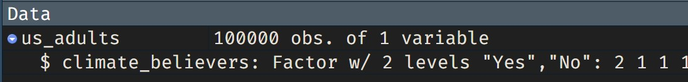

```{r global_options, include=FALSE}
knitr::opts_chunk$set(
  eval = TRUE, 
  # results = FALSE, 
  # fig.show = "hide", 
  message = FALSE
  )

# `tidyverse`, `mosaic`, `broom` and `infer`
library(tidyverse)
library(broom)
library(infer)

us_adults <- read_rds("data/climate_believers.rds")

```

<span style="color: red;font-size: 14px;font-weight: bold;">DEADLINE FOR COMPLETING THIS LAB: 20th October. 
<br/>Please submit your final report [using this form](https://forms.gle/JB5c9apmkx3wD8WG7). </span>


<!--img src="images/climate-change-denial.jpg" style="float: right;width: 300px;margin: 5px 5px 5px 5px"/ -->


<div style="float: right;width: 300px;margin: 5px 5px 5px 5px">
```{r img-climate-change-denial, echo=FALSE, fig.align='center'}

```
</div>


A 2019 Pew Research report states the following:

> Roughly six-in-ten U.S. adults (62%) say climate change is currently affecting their local community either a great deal or some, according to a new survey.
>
> **Source:** [Most Americans say climate change impacts their community, but effects vary by region](https://www.pewresearch.org/fact-tank/2019/12/02/most-americans-say-climate-change-impacts-their-community-but-effects-vary-by-region/)

In this lab, you will assume this $\pi=62\%$ is the very true population proportion. In reality, we cannot observe this value, but for the purpose of this lab we will create this hypothetical population. We will then sample our data from our hypothetical population, exploring how samples vary from one to another.


You will find all the work-space for your lab on posit cloud [using this link](https://posit.cloud/spaces/405625/content/6758634). 


To keep our computation simple, we will assume a total population size of 100,000 (even though that's smaller than the population size of all US adults).


### Creating a reproducible lab report

We will be using R Markdown to create reproducible lab reports. In RStudio, you will find the file `lab-03.Rmd` in the `Files` panel. Double click it to show the script in the code panel.

-   In the file, update the YAML with your name, the date and the name of the lab.
-   Load the `tidyverse`, `broom` and `infer` package.
-   Load the `climate_believers` data set into your workspace, and save it as `us_adults`. Notice that this time the file you are reading has an `rds` extension. You will therefore need to use the `read_rds("data/climate_believers")` function to read it.
-   knit your file to see that everything is working. 


We will first create our population assuming a population size of 100,000.

This means 62,000 (62%) of the adult population think climate change impacts their community, and the remaining 38,000 does not think so.

```{r write_rds, echo=FALSE, eval=FALSE}

tibble(
  climate_believers = 
    sample(c(rep("Yes", 62000), rep("No", 38000)), 100000)
  ) |> 
  mutate(climate_believers = factor(climate_believers, levels=c("Yes", "No"))) |> write_rds("data/climate_believers.rds")

us_adults <- read_rds("data/climate_believers.rds")
```


```{r img-environment-data, echo=FALSE, fig.align='center'}

```


The name of the data frame is `us_adults`. It contains only one categorical variable with the responses to the question *"Do you think climate change is affecting your local community?"*. The name of the variable is `climate_believers`.

1. We can visualize the hypothetical distribution of the responses in the population using a bar plot. Recreate the plot below using the `ggplot()`, `geom_bar()` and `labs()` layers. To flip the `x` and `y` coordinates, add the `coord_flip()` layer.
<br/>
<br/>

```{r bar-plot-pop, fig.height=2.5, fig.width=10, echo=FALSE}
ggplot(us_adults, aes(x = climate_believers)) +
  geom_bar() +
  labs(
    x = "", y = "",
    title = "Do you think climate change is affecting your local community?"
  ) +
  coord_flip() + 
  theme(text = element_text(size = 12))
```

<br/>
<br/>

2. Print the summary statistics to confirm we constructed the data frame correctly. Use the `count` function to show the numeric quantities and use `mutate(p = n /sum(n))` to calculate the proportions in the population. What is the proportion of climate-believers in our hypothetical population?


```{r summ-stat-pop-exercise, eval = FALSE, echo=TRUE}
______ %>%
  count(______) %>%
  mutate(p = ______ /______)
```

```{r summ-stat-pop, results = TRUE, echo=FALSE}
us_adults %>%
  count(climate_believers) %>%
  mutate(p = n /sum(n))
```

### Sampling from the population

We can now simulate a simple random sample of size 60 from the population, and compare it to the population itself.

<br/>
<br/>

:::{#boxedtext}
<div style="background-color: rgba(86, 155, 189, 0.2);
padding: 20px;
margin-bottom: 20px;
font-size: 10pt;">
**A note on setting a seed:** Setting a seed will cause R to select the same sample each time you knit your document.
This will make sure your results don't change each time you knit, and it will also ensure reproducibility of your work (by setting the same seed it will be possible to reproduce your results).
You can set a seed like this:

```{r set-seed}
# make sure to change the seed
set.seed(35797)
```

The number above is completely arbitrary. You can use your ID, birthday, or just a random string of numbers.
The important thing is that you use each seed only once in a document.
Remember to do this **before** you sample in the exercise above.

</div> 
:::

<br/>
<br/>

```{r sample}
set.seed(35797)
n <- 60
samp_1 <- us_adults %>%
  sample_n(size = n)

```

3.  Calculate the proportions like we did in the previous question  and answer the following: (1) What percent of your sample are climate-believers? (2) How does this compare to the proportion of climate-believers in the population? **Hint:** Just like we did with the population, we can calculate the proportion of those **in this sample** who think climate change affects their local community. 


```{r summ-stat-smpl-1, echo=FALSE, include=FALSE}
samp_1 %>%
  count(climate_believers) %>%
  mutate(p = n /sum(n))
```

4.  Create code to generate a second sample (call it `samp_2`). Answer the same questions as before, but this time with respect to `samp_2`. How do the two samples compare? Explain any difference you found between the two samples. **Warning:** DO NOT set the seed AGAIN!

```{r summ-stat-smpl-2, echo=FALSE, include=FALSE}
us_adults %>%
  sample_n(size = n) %>%
  count(climate_believers) %>%
  mutate(p = n /sum(n))
```

## Confidence intervals

Imagine that you only had the information from a sample. What would you be able to say about the population?

With just one sample, the best estimate of the population proportion $\pi$ is the sample proportion, usually denoted as $\hat{p}$ (here we are calling it `p_hat`).

That serves as a good **point estimate**. But in statistics, estimates are always associated with a measure of **uncertainty**.

This uncertainty can be quantified using the **standard error** and the **confidence interval**.

One way of calculating a confidence interval for a population proportion is based on the Central Limit Theorem, as $\hat{p} \pm z^\star SE_{\hat{p}}$ is, or more precisely, as $$ \hat{p} \pm z^\star \sqrt{ \frac{\hat{p} (1-\hat{p})}{n} } $$. 

We will explore this method more, later in the course, but in the meanwhile you can run it using the code shown below. 

5. Run the proportion test (see code below) on the first sample `samp_1`, to estimate the proportion of climate-believers in the population. Now answer the following questions: (1) How does the estimation compare to the real proportion of climate-believers in the population? (2) What is the  confidence interval associated with your estimation? (3) Is the proportion of climate-believers in the population contained within your confidence interval? 

```{r prop-test, echo=TRUE, eval=FALSE}

prop_test(samp_1, climate_believers ~ NULL) 

```


### Using bootstrapping to estimate uncertainty

Another way to estimate the uncertainty is by using simulation, or to be more specific, using **[bootstrapping](https://en.wikipedia.org/wiki/Bootstrapping_(statistics))**.

In this case we estimate a population parameter (the unknown population proportion of climate non-believers $\pi$), and we'll accomplish it using data from only the given sample.

In essence, bootstrapping assumes that there are more of observations in the populations like the ones in the observed sample.

So we "reconstruct" the population by re-sampling from our sample, with replacement. The bootstrapping scheme is as follows:

-   **Step 1.** Take a bootstrap sample - a random sample taken **with replacement** from the original sample, of the same size as the original sample.
-   **Step 2.** Calculate the bootstrap statistic - a statistic such as mean, median, proportion, slope, etc. computed on the bootstrap samples.
-   **Step 3.** Repeat steps (1) and (2) many times to create a bootstrap distribution - a distribution of bootstrap statistics.
-   **Step 4.** Calculate the bounds of the XX% confidence interval as the middle XX% of the bootstrap distribution.

Instead of coding up each of these steps, we will construct confidence intervals using the **infer** package.

Below is an overview of the functions we will use to construct this confidence interval:

+-------------+--------------------------------------------------------------------------------------------------------------------------------------------+
| Function    | Purpose                                                                                                                                    |
+=============+============================================================================================================================================+
| `specify`   | Identify your variable of interest                                                                                                         |
+-------------+--------------------------------------------------------------------------------------------------------------------------------------------+
| `generate`  | The number of samples you want to generate                                                                                                 |
+-------------+--------------------------------------------------------------------------------------------------------------------------------------------+
| `calculate` | The sample statistic you want to do inference with, or you can also think of this as the population parameter you want to do inference for |
+-------------+--------------------------------------------------------------------------------------------------------------------------------------------+
| `get_ci`    | Find the confidence interval                                                                                                               |
+-------------+--------------------------------------------------------------------------------------------------------------------------------------------+

6. This code will create 1000 bootstrapping samples from `samp_1`, and use those samples to find the 95 percent confidence interval for proportion of climate-believers. Run the code and compare your results with the proportion test we've run in the previous question. Does your confidence interval capture the true population proportion of US adults who think climate change affects their local community? 

```{r confidence-interval-infer, eval=FALSE}
samp_1 %>%
  specify(response = climate_believers, success = "Yes") %>%
  generate(reps = 1000, type = "bootstrap") %>%
  calculate(stat = "prop") %>%
  get_ci(level = 0.95)
```

-   In `specify` we specify the `response` variable and the level of that variable we are calling a `success`.
-   In `generate` we provide the number of resamples we want from the population in the `reps` argument (this should be a reasonably large number) as well as the type of resampling we want to do, which is `"bootstrap"` in the case of constructing a confidence interval.
-   Then, we `calculate` the sample statistic of interest for each of these resamples, which is `prop`ortion.

<div style="background-color: rgba(86, 155, 189, 0.2);
padding: 20px;
margin-bottom: 20px;
font-size: 10pt;">
**To recap:** even though we don't know what the full population looks like, from the sample we can be 95% confident that the true proportion of US adults who are climate believers is between the two bounds reported as result of this pipeline.
</div>


## Confidence levels

In this case, you have the rare luxury of knowing the true population proportion (62%) since you have data on the entire population.

7.  Now run the bootstrapping method on `samp_2`. How do your results compare? Each time you run a sample, you would get different intervals.  What proportion of those intervals would you expect to contain the true population mean?

In the next part of the lab, you will collect many samples to learn more about how sample proportions and confidence intervals constructed based on those samples vary from one sample to another.

-   Obtain a random sample.
-   Calculate the sample proportion, and use these to calculate and store the lower and upper bounds of the confidence intervals.
-   Repeat these steps 50 times.

Doing this would require learning programming concepts like iteration so that you can automate repeating running the code you've developed so far many times to obtain many (50) confidence intervals.

In order to keep the programming simpler, we are providing the interactive app below that basically does this for you.

```{r shiny, echo=FALSE, eval=TRUE, results = TRUE}
store_ci <- function(i, n, reps, conf_level, success) {
  us_adults %>%
    sample_n(size = n) %>%
    specify(response = climate_believers, success = success) %>%
    generate(reps, type = "bootstrap") %>%
    calculate(stat = "prop") %>%
    get_ci(level = conf_level) %>%
    rename(
      x_lower = names(.)[1],
      x_upper = names(.)[2]
    )
}

shinyApp(
  ui <- fluidPage(
    h4("Confidence intervals for the proportion of US adults who think 
     climate change"),

    h4(selectInput("success", "",
      choices = c(
        "is affecting their local community" = "Yes",
        "is not affecting their local community" = "No"
      ),
      selected = "Yes", width = "50%"
    )),

    # Sidebar with a slider input for number of bins
    sidebarLayout(
      sidebarPanel(
        numericInput("n_samp",
          "Sample size for a single sample from the population:",
          min = 1,
          max = 1000,
          value = 60
        ),

        hr(),

        numericInput("n_rep",
          "Number of resamples for each bootstrap confidence interval:",
          min = 1,
          max = 15000,
          value = 1000
        ),

        numericInput("conf_level",
          "Confidence level",
          min = 0.01,
          max = 0.99,
          value = 0.95,
          step = 0.05
        ),

        hr(),

        radioButtons("n_ci",
          "Number of confidence intervals:",
          choices = c(10, 25, 50, 100),
          selected = 50, inline = TRUE
        ),

        actionButton("go", "Go")
      ),

      # Show a plot of the generated distribution
      mainPanel(
        plotOutput("ci_plot")
      )
    )
  ),

  server <- function(input, output) {

    # set true p
    p <- reactive(ifelse(input$success == "Yes", 0.62, 0.38))

    # create df_ci when go button is pushed
    df_ci <- eventReactive(input$go, {
      map_dfr(1:input$n_ci, store_ci,
        n = input$n_samp,
        reps = input$n_rep, conf_level = input$conf_level,
        success = input$success
      ) %>%
        mutate(
          y_lower = 1:input$n_ci,
          y_upper = 1:input$n_ci,
          capture_p = ifelse(x_lower < p() & x_upper > p(), "Yes", "No")
        )
    })

    # plot df_ci
    output$ci_plot <- renderPlot({
      ggplot(df_ci()) +
        geom_segment(aes(x = x_lower, y = y_lower, xend = x_upper, yend = y_upper, color = capture_p)) +
        geom_point(aes(x = x_lower, y = y_lower, color = capture_p)) +
        geom_point(aes(x = x_upper, y = y_upper, color = capture_p)) +
        geom_vline(xintercept = p(), color = "darkgray") +
        labs(
          y = "", x = "Bounds of the confidence interval",
          color = "Does the interval capture the true population proportion?"
        ) +
        theme(legend.position = "bottom")
    })
  },
  options = list(height = 700)
)
```

8.  Given a sample size of 60, 1000 bootstrap samples for each interval, and 50 confidence intervals constructed (the default values for the above app), what proportion of your confidence intervals include the true population proportion? Is this proportion exactly equal to the confidence level? If not, explain why. Include an image of your plot with your the answer (to learn how to include an image in your RMarkdown, see [this](https://bookdown.org/yihui/rmarkdown-cookbook/figure-size.html)).


9.  Choose a **different confidence level** than 95%. Would you expect a confidence interval at this level to be wider or narrower than the confidence interval you calculated at the 95% confidence level? Explain your reasoning and confirm your using the app. What is the proportion of intervals that include the true population proportion? How does this percentage compare to the confidence level selected for the intervals? Include an image of your plot with your the answer.


10.  Using the app, experiment with different **sample sizes** and comment on how the widths of intervals change as sample size changes (increases and decreases). Include an image of your plot with your the answer.

11.  Finally, given a sample size (say, 60), how does the width of the interval change as you increase **the number of bootstrap samples**? Include an image of your plot with your the answer.


------------------------------------------------------------------------

<a rel="license" href="http://creativecommons.org/licenses/by-sa/4.0/">{style="border-width:0"}</a><br />This work is licensed under a <a rel="license" href="http://creativecommons.org/licenses/by-sa/4.0/">Creative Commons Attribution-ShareAlike 4.0 International License</a>.
