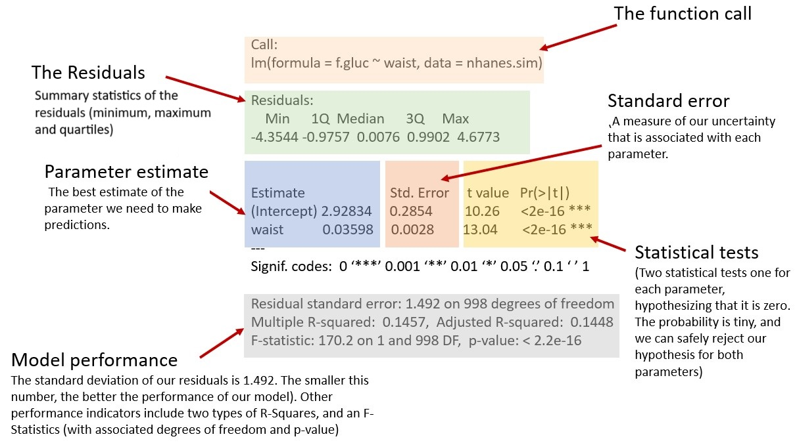

```{r global_options, include = FALSE}
knitr::opts_chunk$set(eval = TRUE, results = "as.is", fig.align = "center", message = "false", echo = FALSE)
library(extrafont) 
library(tidyverse)
library(table1)
library(broom)
library(car)
library(santoku)
library(wesanderson)

cols <- wes_palette("GrandBudapest1", 3)

# library(openintro)
penguins <- read_rds("data/penguins.rds")
# Custom ggplot theme to make pretty plots
# Get Barlow Semi Condensed at https://fonts.google.com/specimen/Barlow+Semi+Condensed
theme_clean <- function() {
  theme_minimal(base_family = "Barlow Semi Condensed") +
    theme(panel.grid.minor = element_blank(),
          plot.background = element_rect(fill = "white", color = NA),
          plot.title = element_text(face = "bold"),
          axis.title = element_text(face = "bold"),
          strip.text = element_text(face = "bold", size = rel(0.8), hjust = 0),
          strip.background = element_rect(fill = "grey80", color = NA),
          legend.title = element_text(face = "bold"))
}


```


```{r setting-up, eval=FALSE, echo=FALSE}

penguins <- palmerpenguins::penguins

# Update the flipper_length_mm to allow "ideal" diagnostics
set.seed(1243)
palmerpenguins::penguins |> 
  mutate(
    flipper_length_mm = (
      body_mass_g + 5780 + rnorm(nrow(palmerpenguins::penguins), 0, 300)
      ) / 50, 
    flipper_length_mm = round(flipper_length_mm, 2)) |> 
  mutate(species = fct_relevel(species, "Chinstrap")) ->
  penguins

penguins_strat <- penguins |> drop_na() |> 
  mutate(flipper_strat = chop_equally(flipper_length_mm, 6)) |>  
  summarise(mn.y = mean(body_mass_g),
            sd = sd(body_mass_g),
            n = n(),
            mn.x = mean(flipper_length_mm),
            .by = flipper_strat) |>
  mutate(y_hat = -4323.1018 + 42.6461 * mn.x, y_hat / mn.y)

penguins_strat

penguins_strat |> 
  summarise(mn.sd = mean(sd))


lm(body_mass_g ~ flipper_length_mm, penguins) |> 
  summary()

write_rds(penguins, "data/penguins.rds")


```


<span style="color: red;font-size: 14px;font-weight: bold;">DEADLINE FOR COMPLETING THIS LAB: Wednesday, 13rd March (midnight) 
<br/>GROUP WORK. One member of your group submits your final report [using this form](https://forms.gle/59RskJpiznEtc9US8). </span>


<div style= "float:right;position: relative; margin-left: 20px">
```{r img-penguins, echo=FALSE, fig.align="right", out.width=300}
knitr::include_graphics("images/penguins.png")
```
</div>


## Penguins

Between 2007 and 2009, data were collected about penguins in three islands of the Palmer Archipelago in Antarctica: the islands of Biscoe, Dream, and Torgersen. Data were collected and made available by [Dr. Kristen Gorman](https://www.uaf.edu/cfos/people/faculty/detail/kristen-gorman.php) and the [Palmer Station, Antarctica LTER](https://pallter.marine.rutgers.edu/), a member of the [Long Term Ecological Research Network](https://lternet.edu/). The `penguins` data-set is a collection of data for 342 penguins from 3 different species: Chinstrap, Gentoo, and Adélie. 

It includes the following variables:

- `species`: The penguin's species (Chinstrap, Gentoo, and Adélie)
- `island`: The island where the penguin lives (Biscoe, Dream, and Torgersen)
- `bill_length_mm`: The length of the penguin's bill, in millimeters (distance from the penguin's face to the tip of the bill)
- `bill_depth_mm`: The depth of the penguin's bill, in millimeters (height of the bill; distance from the bottom of the bill to the top of the bill)
- `flipper_length_mm`: The length of the penguin's flippers, in millimeters
- `body_mass_g`: The weight of the penguin, in grams
- `sex`: The sex of the penguin
- `year`: The year the observation was made


### Creating a reproducible lab report


You will find all the work-space for your lab on posit cloud [using this link](https://bit.ly/49CJKw6){target="_blank"}.

<div style= "float:right;position: relative; margin-left: 20px">
```{r img-depth, echo=FALSE, fig.align="right", out.width=300}
# knitr::include_graphics("images/islands.png")
knitr::include_graphics("images/culmen_depth.png")
```
</div>

We will be using R Markdown to create reproducible lab reports. In RStudio, you will find the file `lab-04.Rmd` in the `Files` panel. Double click it to show the script in the code panel.

-   In the file, update the YAML with your name, the date and the name of the lab.
-   Load the `tidyverse`, `broom`, `table1` and the `car`  packages.
-   Load the `penguins.rds` data set into your workspace, and save it as `penguins`. Notice that this time the file you are reading has an `rds` extension. You will therefore need to use the `read_rds` function to read it.
-   Knit your file to see that everything is working. 
-   For each question, please add the text of the question, the code chunks and your answer. The image below shows how to add a new code chunk in RStudio.     

```{r img-code-chunk, echo=FALSE, out.width=300}
knitr::include_graphics("images/code-chunk.jpg")
```

## Creating Table1

In most published articles, there is a “Table 1” containing descriptive statistics for the sample. This may include, for example, the mean and standard deviation for continuous variables, the frequency and proportion for categorical variables, and perhaps also the number of missing values.

The brute force method of creating such a table would be to compute each statistic for each variable of interest and then copy and paste the results into a table. Having done this even once you will wish for an easier method! There are many possible solutions, but one that is quick and easy to use the `table1` package described in the [following vignette](https://cran.r-project.org/web/packages/table1/vignettes/table1-examples.html){target="_blank"}


1. Use the `table1` package to replicate the table below. Use the examples provided in the [following vignette](https://cran.r-project.org/web/packages/table1/vignettes/table1-examples.html){target="_blank"}. What do you notice from the table? Which species of penguin is the heaviest? Which one has the largest flippers? Which have the largest bill depth? How are the different species distributed across the three islands?

```{r table1, echo=FALSE}
label(penguins$body_mass_g) <- "Body mass (g)"
label(penguins$sex)         <- "Sex"
label(penguins$flipper_length_mm) <- "Flipper length (mm)"
label(penguins$bill_depth_mm) <- "Bill depth (mm)"
label(penguins$island) <- "Island"


table1(~ sex + body_mass_g + flipper_length_mm + bill_depth_mm + island | species, data=penguins, caption = "Table 1: Measurements for three penguin species in the Palmer Archipelago", overall = FALSE)


```

<br/>
<br/>
<br/>

## Association between variables


<div style= "float:right;position: relative; margin-left: 20px">
```{r img-islands, echo=FALSE, fig.align="right", out.width=300}
knitr::include_graphics("images/islands.png")
```
</div>

We first want to know  the relationship between penguin weight (grams) and bill depth (mm). Start with a simple plot like the one below:


Notice that each point in the graph is associated with a penguin, and for each penguin we have information about its different features: weight, bill depth, flipper length etc.


2. Replicate the scatter plot below, coloring the  points according to the species. What can you tell about the relationship between bill depth and penguin weight? Comment on the intercepts and the slopes. Do different species have similar intercepts? Slopes? Does the outcome variable appear normally distributed? Why does this matter?


```{r plot-penguin-weight-depth-by-species, echo=FALSE, out.width="70%", warning=FALSE}
ggplot(data = penguins, 
       aes(x = bill_depth_mm, 
           y = body_mass_g, 
           color = species)
       ) +
  geom_point() + 
  geom_smooth(method = "lm", se = 0) +
  scale_x_continuous(name="bill depth (mm)", breaks=seq(13,21,by=1)) + 
  scale_y_continuous(name="body mass (g)") + 
  scale_color_manual(
    values = cols
    ) + 
  theme_clean()


```

3. Now replicate the plot below, describing the relationship between flipper length and body mass, and coloring the data according to the associated `species`. Facet the plot by island (search  online if necessary). Finally, tell a story about the relationship between flipper length and weight in these three penguin species, and the distribution of penguins across the three islands.


```{r scatter-mass-length, include=TRUE, echo=FALSE, warning=FALSE}
ggplot(data = penguins,
        aes(x = flipper_length_mm, y = body_mass_g, color = species)) +
     geom_point() +
     facet_wrap(~island, scales = "free", nrow = 2) + 
  scale_color_manual(
    values = cols
    ) + 
  theme_clean() +
  scale_y_continuous(name="body mass (g)") + 
  scale_x_continuous(name="flipper length (mm)") 

```


4. Replicate the scatter plot below, adding vertical and horizontal lines to indicate the mean of the predictor and of the outcome variable. Show that the linear regression line passes at the intersection of the two means. 

To create the horizontal and vertical lines, please use the layers `geom_vline(xintercept = ___)` and `geom_hline(yintercept =  = ___)`

```{r model-depth-weight, include=TRUE, warning=FALSE}

mn.flipper <- mean(penguins$flipper_length_mm, na.rm = TRUE)
mn.body_mass <- mean(penguins$body_mass_g, na.rm = TRUE)

ggplot(data = penguins,
        aes(x = flipper_length_mm, y = body_mass_g)) +
     geom_point(aes(color = species)) +
  geom_vline(xintercept = mn.flipper, alpha = .6) +
  geom_hline(yintercept = mn.body_mass, alpha = .6) +
  geom_label(aes(x = 225, y = mn.body_mass, label = "mean\n body mass")) + 
  geom_label(aes(x = mn.flipper, y = 5500, label = "mean\n flipper length")) + 
  geom_smooth(aes(x = flipper_length_mm, y = body_mass_g), method = "lm", se = 0) +
  scale_y_continuous(name="body mass (g)") + 
  scale_x_continuous(name="flipper length (mm)") + 
  scale_color_manual(values = cols) +
  theme_clean() 


```

<!-- 5. In R, run a hypothesis test to see whether the flipper length and the body mass are correlated. Write down your null hypothesis, the p-value and the confidence interval, describe and interpret your findings.  -->


## Modelling the association to predict body mass

In our first model we will look at the association between the length of the flippers and the body mass. Can we use the length of the flippers to predict the body mass? 


5. Use the `lm` function in R to fit a simple linear regression with one predictor. Write up your findings using the template below. Fill in the gaps in the template with the result of your model. 


```{r M1, echo=TRUE, eval=FALSE}
M1 <- lm(body_mass_g ~ flipper_length_mm,
                         data = penguins)

summary(M1)
tidy(M1, conf.int = TRUE)
glance(M1)

```

> Linear regression was used to test the association between _____ (_____) and _____ (_____) using data from n = _____ Penguins. _____% of the variation in _____ was explained by _____ ($R^2 =$ _____). There was a significant _____ (positive/negative) association between _____ and _____ (B = _____; 95% CI = _____, _____; p < .001). On average, for every 1-__ difference in _____, penguins differ in mean _____ by _____ _____. 


```{r img-lm-summary, echo=FALSE, fig.align="center", out.width=600}

```


6. Use the `lm` function in R to fit predict the body mass using a **different** explanatory variable.  Write up your findings using a similar template like the one used above. Which model is better, in your view? This one or the model in the previous question? Justify your answer.


7. We now want to fit a model with parallel slopes, one slope for each of the three species of penguins. Run the regression as you have done above, but this time, add the `species` variable as a predictor in your model. (1) Write the equation for the linear model (you will need to replace the coefficients in the formula $b_0, b_1, b_2$ with their estimates). (2) Write up your findings in a similar manner to the template shown in the previous question. (3) Write a separate model for each of the three species. (4) Use the `augment(M2)` to see the list of residuals and show that the mean of the residuals is almost zero and its standard deviation is the residual standard error.

$$
Y = b_0 + b_1\cdot X_{flipper} + b_2\cdot X_{chinstrap} + b_3\cdot X_{gentoo} + e\\
e\sim\mathcal{N}(0, s^2)
$$


```{r M2, echo=TRUE, eval=FALSE}

M2 <- lm(___ ~ ___ + ___, data = ___)

summary(M2)
tidy(M2, conf.int = TRUE)
glance(M2)
augment(M2)

```

8. Reproduce the parallel slopes image below using the coefficients from the second model `M2`. 


```{r parallel-body-flipper-echo, echo=TRUE, eval=FALSE}

coefs <- coef(M2)

penguins |> 
  ggplot(
    aes(x = ___, y = ___, color = ___)
    ) + 
  geom_point() + 
  # Use the intercept for the reference category (Adelie)
  geom_abline(
    intercept = coefs[___], slope = ___, color = "___"
    ) +
  # Use the appropriate intercept for Chinstrap
  geom_abline(
    intercept = ___ + ___, slope = ___, color = "___"
    ) +
  # Use the appropriate intercept for Gentoo
  geom_abline(
    intercept = ___ + ___, slope = ___, color = "___"
    ) + 
  scale_color_manual(
    values = c("___", "___", "___")
    ) 

```


```{r parallel-body-flipper-noshow, echo=FALSE, eval = TRUE, warning = FALSE}

# Load
M2 <- lm(body_mass_g ~ flipper_length_mm + species,
                         data = penguins)
coefs <- coef(M2)

penguins |> 
  ggplot(
    aes(
      flipper_length_mm, 
      body_mass_g, 
      color = species)
    ) + 
  geom_point() + 
  geom_abline(
    intercept = coefs[1],
    slope = coefs[2],
    color = cols[1],
    linewidth = 1
    ) +
  geom_abline(
    intercept = coefs[1] + coefs[3],
    slope = coefs[2],
    color = cols[2],
    linewidth = 1
    ) +
  geom_abline(
    intercept = coefs[1] + coefs[4],
    slope = coefs[2],
    color = cols[3],
    linewidth = 1
    ) +
  scale_color_manual(
    values = cols
    ) + 
  theme_clean() + 
  scale_y_continuous(name="body mass (g)") + 
  scale_x_continuous(name="flipper length (mm)") 

```


### Diagnostics

We will now look at four different diagnostic tests for the second model `M2`:

-   Residuals vs fitted `plot(M2, which = 1)`
-   QQ Residuals `plot(M2, which = 2)`
-   Scale Location `plot(M2, which = 3)`
-   Cook's distance `plot(M2, which = 4)`


9. Search online for an explanation of the various plots (for example, [this](https://library.virginia.edu/data/articles/diagnostic-plots){target="_blank"} is a good resource, but you may find others). Create a plot for **each** of the four diagnostic tests, and describe in words what is the purpose of each diagnostic plot. Then interpret the plot: what can we learn from it?  


## Using Anova sum-of-squares (type III)


The `summary(M2)` and `tidy(M2)` functions display separate P-values for categorical predictor non-reference levels (Chinstrap and Gentoo species), testing significance for specific pairwise comparisons between levels (Adelie vs. Chinstrap is tested seperately from Adelie vs. Gentoo). But what if you want a single overall test of significance for the categorical species predictor? The null hypothesis of no association corresponds to the mean outcome being equal at ALL levels of the predictor or, equivalently, that all differences in mean outcome between each level and the reference level are 0. For example, for `species`, which has 3 levels, the null hypothesis is that both $\beta_{chinstrap}=\beta_{gentoo}=0$ simultaneously, where $\beta_{chinstrap}=0$ corresponds to the mean weight of Chinstrap penguins equals to the mean weight of Adelie penguins, and    $\beta_{gentoo}=0$ corresponds to the mean weight of Gentoo penguins equals to the mean weight of Adelie penguins. If both are true then Adelie, Chinstrap and Gentoo species have equal mean weights, implying no association between species and weight. Since these are two tests, this would be a 2 df (two degree of freedom) test. In general, for a categorical predictor with `L` levels, we expect the corresponding test to have `L-1` degrees of freedom.

Obtain the p-value corresponding to this multiple degree of freedom (df) test by calling the `Anova()` (upper case A) function in the car package (Fox, Weisberg, and Price 2022; Fox and Weisberg 2019). The type = 3 option specifies that we want a Type III test, which is a test of a predictor after adjusting for all other terms in the model (in this case, we will be adjusting for the flipper length). A Type III test for a predictor compares the regression model to a reduced model in which that predictor has been removed - to learn more about this test, please watch [this video](https://www.youtube.com/watch?v=NKMFgejt3U0){target="_blank"}.


10. Run the type 3 Anova, discuss and interpret the output you see and link it to the results of the fitted model `summary(M2)`.


```{r Anova-3, eval=FALSE, echo = TRUE}
M2 <- lm(body_mass_g ~ flipper_length_mm + species,
                         data = penguins)
summary(M2)
Anova(M2, type = 3)
```


## Modelling the association between bill depth and body mass

11. Now repeat exercises 6 - 10 but this time analyze the association between the bill depth and the body mass: `body_mass_g ~ bill_depth_mm + species`.

```{r ex11, echo=FALSE, eval=FALSE}


penguins <- palmerpenguins::penguins
library(faux)
penguins_contrasts <- penguins %>% 
  mutate(species = fct_relevel(species, "Gentoo")) %>% 
  add_contrast("species", contrast = "treatment", colnames = c("species 1", "species 2")) %>% 
  select(c(1, 4, 6, 9, 10))  # %>% 
  # mutate(`species 1` = as.factor(`species 1`), `species 2` = as.factor(`species 2`))
# penguins_contrasts <- penguins %>% add_contrast("species", contrast = "treatment") %>% 
#   select(c(1, 4, 6, 9, 10))

M_mass_bill_1 <- lm(body_mass_g ~ bill_depth_mm, data = penguins_contrasts)
M_mass_bill_2 <- lm(body_mass_g ~ bill_depth_mm + species, data = penguins_contrasts)
M_mass_bill_3 <- lm(body_mass_g ~ bill_depth_mm + `species 1`, data = penguins_contrasts)
M_mass_bill_4 <- lm(body_mass_g ~ bill_depth_mm + `species 2`, data = penguins_contrasts)
M_mass_bill_5 <- lm(body_mass_g ~ bill_depth_mm + `species 1` + `species 2`, data = penguins_contrasts)

# summary(M_mass_bill_1)
# summary(M_mass_bill_3)
library(modelsummary)
config_modelsummary(factory_default = 'kableExtra')
modelsummary(list(M_mass_bill_1,M_mass_bill_2, M_mass_bill_3, M_mass_bill_4, M_mass_bill_5), stars = TRUE)

modelsummary(list(M1 = M_mass_bill_1, M2 = M_mass_bill_5), estimate = "{estimate} ({std.error}){stars}", statistic = NULL, gof_omit = "F|Log", 
             fmt = fmt_decimal(digits = 1, pdigits = 3))

?modelsummary
augment(M_mass_bill_5) %>% 
  mutate(
    species =
      str_c(
        as.character(`species 1`), 
        as.character(`species 2`)
        )
    ) %>% select(c(2, 3, 4, 5, 6, 12)) %>% 
ggplot(aes(x = bill_depth_mm, y = body_mass_g, color = species)) +
     geom_point() + 
    geom_line(aes(y = .fitted), linewidth = 1) + 
  scale_y_continuous(name="body mass (g)") + 
  scale_x_continuous(name="bill depth (mm)") + 
  theme_clean() + 
  theme(legend.position = "none")


```

