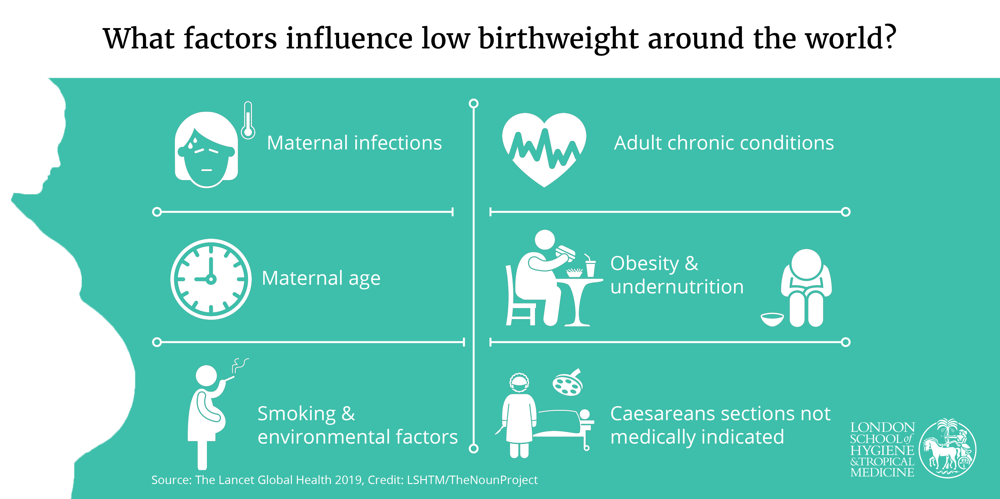

```{r global_options, include=FALSE}
library(emo)
library(tidyverse)
library(broom)
library(infer)
library(santoku)
library(car)
library(GGally)
library(modelsummary)
library(easystats)
library(table1)
library(gt)

knitr::opts_chunk$set(echo = FALSE, 
                      fig.align = "center", 
                      # fig.height = 3, 
                      # fig.width = 5,
                      warning = FALSE, 
                      message = FALSE)


natality <- read_rds("data/natality.rds") 

# Custom ggplot theme to make pretty plots
# Get Barlow Semi Condensed at https://fonts.google.com/specimen/Barlow+Semi+Condensed
theme_clean <- function() {
  theme_minimal(base_family = "Barlow Semi Condensed") +
    theme(panel.grid.minor = element_blank(),
          plot.background = element_rect(fill = "white", color = NA),
          plot.title = element_text(face = "bold"),
          axis.title = element_text(face = "bold"),
          strip.text = element_text(face = "bold", size = rel(0.8), hjust = 0),
          strip.background = element_rect(fill = "grey80", color = NA),
          legend.title = element_text(face = "bold"))
}


```


<span style="color: red;font-size: 14px;font-weight: bold;">GROUP WORK - DEADLINE  10-Nov-23. 
<br/>Please submit your final report [using this form](https://forms.gle/JB5c9apmkx3wD8WG7). </span>


<div style="float: right;width: 400px;margin: 5px 5px 5px 5px">
```{r img-regression-labeled, echo=FALSE, fig.align='center'}

```
</div>


The [2018 United States Birth Data](https://www.cdc.gov/nchs/nvss/births.htm) were compiled from information on birth certificates by the National Vital Statistics System, part of the National Center for Health Statistics, in cooperation with States ([National Center for Health Statistics 2022](https://bookdown.org/rwnahhas/RMPH/appendix-natality.html#ref-natality_about_2022)). The dataset consists of a random sample from the original dataset, registering births in the United States in the year 2018. Specifically, we will be looking at the following variables: 

- DBWT - birth weight (g) `r emo::ji("baby")`. This will be the outcome we will be predicting using a variety of linear regression models
- CIG_REC - smoked during pregnancy `r emo::ji("no_smoking")`
- risks - risk factors reported
- MAGER - mother’s age `r emo::ji("clock")`
- MRACEHISP - mother’s race/ethnicity
- DMAR - marital status`r emo::ji("ring")`
- MEDUC - mother’s education
- PRIORLIVE - prior births now living 
- PRIORDEAD - prior births now dead
- BMI  - mother’s body mass index, (kg/m2)


<div style= "float:right;position: relative; margin-left: 20px">
```{r img-depth, echo=FALSE, fig.align="right", out.width=300}
# knitr::include_graphics("images/islands.png")
knitr::include_graphics("images/regression-labeled.jpeg")
```
</div>

### Creating a reproducible lab report


You will find all the work-space for your lab on posit cloud [using this link](https://posit.cloud/spaces/405625/content/6957503){target="_blank"}.


We will be using R Markdown to create reproducible lab reports. In RStudio, you will find the file `lab05.Rmd` in the `Files` panel. Double click it to show the script in the code panel.

-   In the file, update the YAML with your name, the date and the name of the lab.
-   Load the `tidyverse`, `broom`, `table1`, `GGally`, `car`, `easystats` and the `modelsummary`  packages.
-   Load the `natality.rds` data set into your workspace, and save it as `natality`. 
-   Knit your file to see that everything is working. 
-   For each question, please add the text of the question, the code chunks and your answer. 

## Descriptive statistics

1. Use the `table1` package to create a table with appropriate descriptive information about the data set. Use the examples provided in the [following vignette](https://cran.r-project.org/web/packages/table1/vignettes/table1-examples.html){target="_blank"} to help you build a table.

```{r table1, fig.align='center'}

label(natality$PRIORLIVE) = "Prior births (living)"
label(natality$PRIORDEAD) = "Prior births (dead)"
natality |> mutate(CIG_REC = if_else(CIG_REC == "Yes", "Smoker", "Non smoker")) |> 
table1(~DBWT +
       # CIG_REC +
       risks +
       MAGER +
       MRACEHISP +
       DMAR +
       MEDUC +
       PRIORLIVE +
       PRIORDEAD +
       BMI + MEDUC   | CIG_REC, data = _, overall = FALSE, caption = "Maternal demographics stratified by smoking")

```

<br/>
<br/>
<br/>

2. Use the `ggpairs` function to explore the association between the different variables. Try to replicate the figure below, or create your own variation. 

```{r ggpairs, fig.align='center', fig.height=7}

labels <-  c(
  label(natality[[1]]), 
  label(natality[[3]]), 
  label(natality[[4]]),
  label(natality[[6]]),
  label(natality[[10]])
)

ggpairs(
  natality, c(1, 3, 4, 6, 10),  
  mapping = ggplot2::aes(color = CIG_REC), 
  upper = list(continuous = wrap("density", alpha = 0.9), combo = "facethist", discrete = wrap("colbar")),
  lower = list(continuous = wrap("cor"), combo = NULL),
  diag = list(continuous = wrap("densityDiag", colour = NA, alpha = .6), discrete = wrap("densityDiag")),
  legend = c(3,5),
  columnLabels = labels,
  title = "Natality in the United States (2018)", 
  showStrips	= FALSE, 
  cardinality_threshold = 5
) + labs(color = "Smoking") + 
  theme_minimal() + 
  theme(legend.position = "bottom")
```


## Linear regression

In the following exercises, you will assess the association between birth weight (the outcome) and smoking during pregnancy (the primary predictor), adjusted for risk factors reported, mother’s age, mother’s race/ethnicity, marital status, mother’s education, prior births now living and prior births now dead, and mother’s body mass index.


3. Fit four linear models, each nested within the other: the null model, the unadjusted model, the full model and the optimal model. Use the `step` function find the optimal model using the stepwise method. Then use `anova` to compare the four models. What is your conclusion? Now compare your models using `modelsummary` function. What does the number in the (brackets) mean? How can you identify the optimal model just by looking at the $R^2$ and the AIC?

```{r four-models, echo=TRUE, eval=FALSE}

M.NULL <- lm(DBWT ~ 1, natality)
M.UNADJUSTED <- lm(DBWT ~ CIG_REC, natality)
# The dot represents all variables except the outcome DBWT
M.FULL <- lm(DBWT ~ ., natality)  

# Finding the optimal model
step(M.NULL,
     scope = list(upper = M.FULL),
     direction="both",
     data=natality)


# Displaying the four models by each other
modelsummary(
  list(
    null = M.NULL, 
    unadjasted = M.UNADJUSTED, 
    ___ = ___, 
    ___ = ___
    ), 
  stars = TRUE
  )

```


:::{#boxedtext}
Stepwise regression is a systematic method for adding and removing terms from a linear or generalized linear model based on their statistical significance in explaining the response variable. The method begins with an initial model and then compares the explanatory power of incrementally larger and smaller models.

The step function uses forward and backward stepwise regression to determine a final model. At each step, the function searches for terms to add to the model or remove from the model based on the value of the 'Criterion' name-value pair argument.

Use the `step` function to run through different models - the last model shown is the one with the smallest [Akaike information criterion (AIC)](https://en.wikipedia.org/wiki/Akaike_information_criterion)
:::


```{r show-models-noshow, echo=FALSE, eval=TRUE}

M.NULL <- lm(DBWT ~ 1, natality)
M.UNADJUSTED <- lm(DBWT ~ CIG_REC, natality)
# The dot represents all variables except the outcome DBWT
M.FULL <- lm(DBWT ~ ., natality)
M.OPT <- lm(formula = DBWT ~ DMAR + MRACEHISP + BMI + risks + PRIORLIVE + CIG_REC + PRIORDEAD, data = natality)

modelsummary(
  list(
    null = M.NULL, 
    unadjusted = M.UNADJUSTED, 
    optimal = M.OPT, 
    full = M.FULL
    ), 
  stars = TRUE, 
  estimate = "{estimate} ({std.error}){stars}", 
  statistic = NULL
  )

```

Identify the largest coefficient in the optimal model (on an absolute scale). Do you think it has the largest effect on the birth-weight?

Not necessarily! Each variable has a different scale with different boundaries, so coefficients cannot be compared when they are not on a common scale. The model only tells us which parameters are statistically different from zero, but it does not allow us to compare between them.

This situation is why [Gelman recommends](http://www.stat.columbia.edu/~gelman/research/published/standardizing7.pdf) centering each continuous variable (that is, subtracting the mean from each value) and scaling it by **two** standard deviations (that is - dividing it by two standard deviations). You may often hear people scaling by just one standard deviation. This is useful; the regression coefficient that emerges comes from inputs where 0 is the mean, communicates magnitude effects that might be more interesting, and it will make the intercept interpretable as well. However, scaling by two standard deviations does all that and has the helpful side effect of putting everything on a roughly common scale. Basically, scaling by two standard deviations results in variables that have a mean 0 and a standard deviation of .5. Binary variables usually also have standard deviations close to 0.5. This may not be perfect, but it’s really good and often close.


4. Center and scale all the continuous variables, and create a [forest plot](https://en.wikipedia.org/wiki/Forest_plot) for the optimal model.


```{r scale-and-forest, eval=FALSE, echo=TRUE}

# Scaling
natality.ctr <- natality |>
  mutate_if(is.numeric, scale) |>
  mutate_if(is.numeric, ~ as.numeric(.x / 2))

# Fitting the model
M.OPT.ctr <- lm(
  DBWT ~ DMAR + MRACEHISP + BMI + 
    risks + PRIORLIVE + CIG_REC + 
    PRIORDEAD, 
  data = natality.ctr
  )

# creating a forest plot
M.OPT.ctr %>% 
  model_parameters() %>% 
  plot()

```


5. How do the effect estimate of smoking, the standard error of its estimate, its 95% confidence interval, and its statistical significance change between the un-adjusted, optimal and full models? Please use the centered and scaled models to answer this question. 


:::{#boxedtext}

You can display the various statistics using `M.FULL |> tidy(conf.int = TRUE)`.

:::


```{r ex-5, echo=FALSE}
# Scaling
natality.ctr <- natality |>
  mutate_if(is.numeric, scale) |>
  mutate_if(is.numeric, ~ as.numeric(.x / 2))


M.UNADJUSTED.ctr <- lm(DBWT ~ CIG_REC, natality.ctr)
# The dot represents all variables except the outcome DBWT
M.OPT.ctr <- lm(formula = DBWT ~ DMAR + MRACEHISP + BMI + risks + PRIORLIVE + CIG_REC + PRIORDEAD, data = natality.ctr)
M.FULL.ctr <- lm(DBWT ~ ., natality.ctr)


map(list(M.UNADJUSTED.ctr, M.OPT.ctr, M.FULL.ctr), 
    \(x) tidy(x, conf.int = TRUE) |> 
      filter(term == "CIG_RECYes")) |> 
  bind_rows() |> 
  mutate(
    model = c("Unadjasted", "Optimal", "Full"),
    .before = term) |> 
  mutate(CIG_RECYes = estimate, .before = estimate) |> 
  select(-term, -estimate) |> 
  gt()  |>
  fmt_number(
    columns = c(2, 3, 4, 6, 7),
    decimals = 3
  ) |> 
  fmt_scientific(
    columns = 5
  ) |> 
  cols_align(
  align = "center"
)

```


## Exploring interactions

6. Does the association between cigarette smoking during pregnancy and birth weight depend on mother's education? Modify the FULL model appropriately to be able to answer this question. Use `anova` to test whether the model with the interaction is significantly better than the one without it. Regardless of statistical significance, create a [dumbell plot](https://r-charts.com/distribution/dumbbell-plot-ggplot2/) illustrating the smoking effect at each level of mother’s education and estimate the cigarette smoking effect at each level of mother’s education. Hint: When creating the dataset for plotting, include the value zero for each predictor not included in the interaction (the reference level for all categorical variables). Picking the value zero in a centered predictor is like choosing the mean of that variable, which is a reasonable choice. 

```{r dumbellplot-MEDUC, out.width="75%"}

M.FULL_int.ctr <- lm(formula = DBWT ~ . + CIG_REC * MEDUC, data = natality.ctr)

# anova(M.FULL.ctr, M.FULL_int.ctr)


newdata <- data.frame(
    CIG_REC   = c("No", "Yes", "No", "Yes", "No", "Yes", "No", "Yes"),  
    MEDUC     = c("lower", "lower", "HS", "HS", "Some college", "Some college", "Uni", "Uni") 
    ) |> 
  mutate(
    risks = "No", 
    MAGER = 0, 
    MRACEHISP = "NH White", 
    DMAR = "Married", 
    PRIORLIVE = "0", 
    PRIORDEAD = "0", 
    BMI = 0
    )

newdata |> 
  mutate(
    DBWT = predict(
      M.FULL_int.ctr, 
      newdata
      )
  ) |> select(CIG_REC, MEDUC, DBWT) |> 
  pivot_wider(id_cols = MEDUC, names_from = CIG_REC, names_prefix = "smoke_", values_from = DBWT) |> 
  ggplot() + 
  geom_point(aes(x = "No",  y = smoke_No,  color = MEDUC), size = 5) +
  geom_point(aes(x = "Yes", y = smoke_Yes, color = MEDUC), size = 5) +
  geom_segment(aes(
    x = "No", 
    y = smoke_No, 
    xend = "Yes", 
    yend=smoke_Yes, 
    color = MEDUC
    ), linewidth = 2) + 
  scale_x_discrete(labels = c("no smoking", "smoking")) + 
  scale_y_continuous(breaks = seq(-0.2, 0.1, 0.05)) +
  labs(x = NULL, y = "Birth weight (centred, scaled)", color = "Mother's education") + 
  theme_minimal() + 
  theme(legend.position = "bottom", text = element_text(size = 14)) 
  


```


:::{#boxedtext}
To create the dumbell figure, you will need to predict the birth weight for smoking and non-smoking mums with different education levels. Here is the code for the calculations you need: 

```{r dumbells-prep, echo=TRUE, eval=FALSE}

M.FULL_int.ctr <- lm(formula = DBWT ~ . + CIG_REC * MEDUC, data = natality.ctr)

newdata <- data.frame(
  CIG_REC = c("No",    "Yes",   "No", "Yes", "No",           "Yes",          "No",  "Yes"),  
  MEDUC   = c("lower", "lower", "HS", "HS",  "Some college", "Some college", "Uni", "Uni") 
  ) |> 
  mutate(
    risks = "No", 
    MAGER = 0, 
    MRACEHISP = "NH White", 
    DMAR = "Married", 
    PRIORLIVE = "0", 
    PRIORDEAD = "0", 
    BMI = 0
    )

newdata |> 
  mutate(
    DBWT = predict(
      M.FULL_int.ctr, 
      newdata
      )
  ) |> select(CIG_REC, MEDUC, DBWT)
```

Once you have your data, here is how you create your dumbells: 

```{r dumbells-plot, echo=TRUE, eval=FALSE}

tribble(
  ~Education, ~No_Smoking, ~Smoking, 
  "Lower",    0.06227469,  0.04447809, 
  "HS",       0.08854779,  -0.05014673, 
  # ___,        ___,         ___, 
  # ___,        ___,         ___
  ) |> ggplot() + 
  geom_segment(
    aes(
      x = "No Smoking", y = No_Smoking, 
      xend = "Smoking", yend = Smoking, 
      color = Education
      ),
    linewidth = 2
    ) + 
  geom_point(
    aes(x = "No Smoking", y = No_Smoking, color = Education), 
    size = 6
    ) + 
  geom_point(
    aes(x = "Smoking", y = Smoking, color = Education), 
    size = 6
    )

```


:::


7. Does the association between mother’s BMI and birth-weight differ between mothers of different race/ethnicity? Modify the OPTIMAL model appropriately to be able to answer this question, using the dataset with the centered variables. Use `anova` to test whether the model with the interaction is significantly better than the one without it. Regardless of statistical significance, estimate the BMI effect at each level of mother’s race/ethnicity and plot the BMI effect at each level of mother’s race/ethnicity using a dumbell plot. 

```{r dumbellplot-MRACEHISP, echo = FALSE, out.width="75%"}


M.OPT_int.ctr <- lm(formula = DBWT ~ DMAR + MRACEHISP + BMI + risks + PRIORLIVE + CIG_REC + PRIORDEAD + BMI : MRACEHISP, data = natality.ctr)

# anova(M.OPT.ctr, M.OPT_int.ctr)


newdata <- data.frame(
    BMI       = rep(c(0, 2), 4),  
    MRACEHISP = rep(c("NH White", "NH Black", "NH Other", "Hispanic"), each = 2) 
    ) |> 
  mutate(
    DMAR = "Married", 
    risks = "No", 
    MAGER = 0, 
    PRIORLIVE = "0", 
    PRIORDEAD = "0", 
    CIG_REC = "No"
    )

newdata |> 
  mutate(
    DBWT = predict(
      M.OPT_int.ctr, 
      newdata
      )
  ) |> select(BMI, MRACEHISP, DBWT) |> 
  pivot_wider(id_cols = MRACEHISP, names_from = BMI, names_prefix = "BMI_", values_from = DBWT) |> 
  ggplot() + 
  geom_point(
    aes(x = "mean(BMI)", y = BMI_0, color = MRACEHISP), 
    size = 5
    ) +
  geom_point(
    aes(x = "mean(BMI) + sd(BMI)", y = BMI_2, color = MRACEHISP), 
    size = 5
    ) +
  geom_segment(
    aes(x = "mean(BMI)", 
        y = BMI_0, 
        xend = "mean(BMI) + sd(BMI)", 
        yend = BMI_2, 
        color = MRACEHISP), 
    linewidth = 2
    ) + 
  scale_x_discrete(labels = c("mean(BMI)", "mean(BMI) + sd(BMI)")) + 
  scale_y_continuous(breaks = seq(-0.2, 0.5, 0.1)) +
  labs(x = NULL, y = "Birth weight (centred, scaled)", color = "Mother’s race/ethnicity") + 
  theme_minimal() + 
  theme(legend.position = "bottom", text = element_text(size = 14)) 
  

```


8. Does the association between mother’s BMI and birth-weight depend on mother’s age? Modify the FULL model appropriately to be able to answer this question, using the dataset with the centered variables. Use `anova` to test whether the model with the interaction is significantly better than the one without it. Regardless of statistical significance, estimate the BMI effect for mothers age 20, 30, and 40 years and make a plot illustrating the BMI effect at each of these ages. 

```{r dumbellplot-MAGER, eval=TRUE, out.width="75%"}

M.FULL_int.ctr <- 
  lm(formula = DBWT ~ . + BMI : MAGER, data = natality.ctr)

# anova(M.FULL.ctr, M.FULL_int.ctr)

# summary(M.FULL_int.ctr)
newdata <- data.frame(
    BMI   = rep(c(0, 1, 2), 3),  
    MAGER = rep(c(20, 30, 40), each = 3) 
    ) |> 
  mutate(
    CIG_REC = "No",
    risks = "No", 
    MRACEHISP = "NH White",
    DMAR = "Married", 
    MEDUC = "lower", 
    PRIORLIVE = "0", 
    PRIORDEAD = "0" 
    )

newdata |> 
  mutate(
    DBWT = predict(
      M.FULL_int.ctr, 
      newdata
      )
  ) |> select(BMI, MAGER, DBWT) |> 
  pivot_wider(id_cols = MAGER, names_from = BMI, names_prefix = "BMI_", values_from = DBWT) |> 
  mutate(MAGER = factor(MAGER)) |> 
  ggplot() + 
  geom_point(
    aes(x = "mean(BMI)", y = BMI_0, color = MAGER), 
    size = 5
    ) +
  geom_point(
    aes(x = "mean(BMI) + sd(BMI)", y = BMI_2, color = MAGER), 
    size = 5
    ) +
  geom_segment(
    aes(x = "mean(BMI)", 
        y = BMI_0, 
        xend = "mean(BMI) + sd(BMI)", 
        yend = BMI_2, 
        color = MAGER), 
    linewidth = 2
    ) + 
 
  scale_x_discrete(labels = c("mean(BMI)",  "mean(BMI) + sd(BMI)")) + 
  scale_y_continuous(breaks = seq(-3, 0.5, 0.5)) +
  labs(x = NULL, y = "Birth weight (centred, scaled)", color = "Mother’s age") + 
  theme_minimal() + 
  theme(legend.position = "bottom", text = element_text(size = 14)) 
  

```


