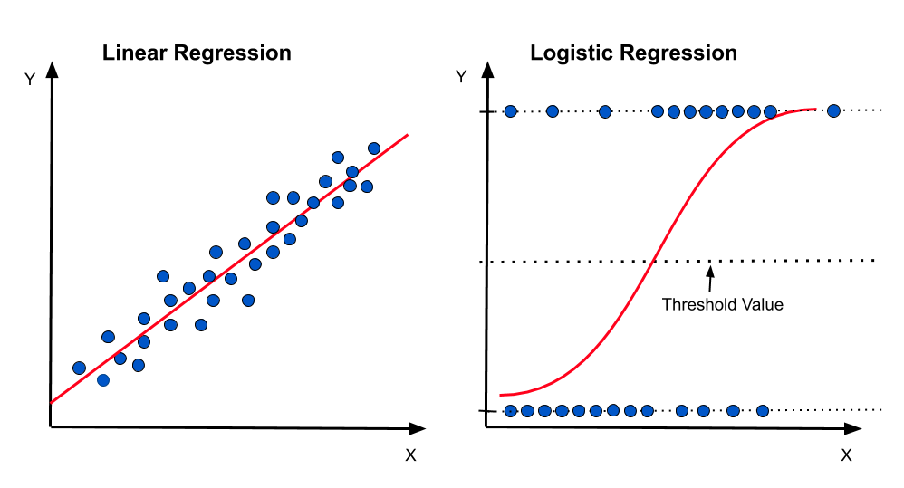

```{r global_options, include=FALSE}
library(emo)
library(tidyverse)
library(broom)
library(infer)
library(santoku)
library(car)
library(GGally)
library(modelsummary)
library(easystats)
library(table1)
library(gt)
library(janitor)
library(lmtest)
library(datawizard)
library(extrafont) 
library(marginaleffects)

knitr::opts_chunk$set(echo = FALSE, 
                      fig.align = "center", 
                      # fig.height = 3, 
                      # fig.width = 5,
                      warning = FALSE, 
                      message = FALSE)


# nsduh <- read_rds("nsduh.rds") |> 
#   mutate(mj_lifetime.numeric = as.numeric(mj_lifetime) - 1, 
#          .before = mj_agefirst) |> 
#   select(mj_lifetime, mj_lifetime.numeric, alc_agefirst, demog_age_cat6, demog_sex, demog_income)
# summary(nsduh$alc_agefirst)
# write_csv(nsduh, "nsduh.csv")
# nsduh <- read_csv("nsduh.csv")  |>
  # mutate_if(is.character, as.factor)
# write_rds(nsduh, "nsduh.rds")
nsduh <- read_rds("nsduh.rds") 
# Custom ggplot theme to make pretty plots
# Get Barlow Semi Condensed at https://fonts.google.com/specimen/Barlow+Semi+Condensed
theme_clean <- function() {
  theme_minimal(base_family = "Barlow Semi Condensed") +
    theme(panel.grid.minor = element_blank(),
          plot.background = element_rect(fill = "white", color = NA),
          plot.title = element_text(face = "bold"),
          axis.title = element_text(face = "bold"),
          strip.text = element_text(face = "bold", size = rel(0.8), hjust = 0),
          strip.background = element_rect(fill = "grey80", color = NA),
          legend.title = element_text(face = "bold"))
}


```


<span style="color: red;font-size: 14px;font-weight: bold;">GROUP WORK - DEADLINE  4-Dec-23. 
<br/>Please submit your final report [using this form](https://forms.gle/pxb8VyVzaUivdMbi8). </span>


<div style="float: right;width: 350px;margin: 5px 5px 5px 5px">
```{r img-logistic, echo=FALSE, fig.align='center'}

```
</div>

Probability, odds and odds ratio are different ways of expressing the same thing, but on different scales.

-   If the probability is greater than 0.5, the odds are greater than 1 and the log odds are positive.
-   If the probability is less than 0.5, the odds are less than 1 and the log odds are negative.
-   You can transform probability into odds $\text{odds} = \frac{p}{1-p}$
-   You can transform odds to probability $p = \frac{\text{odds}}{1+\text{odds}}$. 
-   Transforming log odds to probability in R, you can use the `plogis` function. For example, if the log-odds is zero, the probability is equal to `plogis(0) = 0.5`.

$$
\log\frac{p}{1-p} = \beta_0 + \beta_1X_1 + \beta_2X_2 + \ldots + \beta_kX_k
$$

Assuming you have your model, here is the interpretation

-   The intercept is the log-odds of the outcome when all continuous predictors are 0 and categorical variables are at their reference level. The odds of the outcome is $\text{odds} = \exp(\beta_0)$ and the probability is $\frac{\text{odds}}{1+\text{odds}}= \frac{\exp(\beta_0)}{1+\exp(\beta_0)}$

-   For a continuous predictor, the regression coefficient $\beta_k$ is the log of the odds ratio, comparing individuals who differ in that predictor by one unit, holding the other predictors fixed.

-   For a categorical predictor, the regression coefficient $\beta_k$ is the log of the odds ratio, comparing individuals at a given level of the predictor to those at the reference level, holding the other predictors fixed.

-   To compute **odds ratio** for a variable, exponentiate the corresponding regression coefficient $\text{odds ratio} = \exp(\beta_k)$.

-   To predict the **probability** of an outcome, calculate your log odds, and turn your log-odds to probability using the `plogis` function.


## The data: NSDUH (2019)


<div style="float: right;width: 200px;margin: 5px 5px 5px 5px">
```{r img-survey, echo=FALSE, fig.align='center'}

```
</div>

The teaching dataset `nsduh` includes a random subset of 1000 observations of adults, and variables that have been renamed for clarity. Sampling was done with replacement using sampling weights in order to approximate a nationally representative distribution. This sampling method is solely for the purpose of creating a teaching dataset to illustrate regression methods. The [National Survey on Drug Use and Health (NSDUH)](https://www.samhsa.gov/data/data-we-collect/nsduh-national-survey-drug-use-and-health), a product of the Substance Abuse and Mental Health Services Administration (SAMHSA) under the U.S. Department of Health and Human Services, measures the use of illegal substances, the use and misuse of prescribed substances, substance use disorder and treatment, and mental health outcomes ( [Substance Abuse and Mental Health Services Administration 2022](https://bookdown.org/rwnahhas/RMPH/appendix-nsduh.html#ref-nsduh_about_2022)). Downloadable data and documentation are freely available from SAMHSA ([U.S. Department of Health and Human Services, Substance Abuse and Mental Health Services Administration, Center for Behavioral Health Statistics and Quality 2019](https://bookdown.org/rwnahhas/RMPH/appendix-nsduh.html#ref-nsduh2019)) for research and statistical purposes. Documentation for the 2019 data can be found in the [2019 NSDUH Public Use File Codebook](https://www.datafiles.samhsa.gov/sites/default/files/field-uploads-protected/studies/NSDUH-2019/NSDUH-2019-datasets/NSDUH-2019-DS0001/NSDUH-2019-DS0001-info/NSDUH-2019-DS0001-info-codebook.pdf). See also [Policies](https://www.samhsa.gov/).


### Creating a reproducible lab report


You will find all the work-space for your lab on posit cloud [using this link](https://posit.cloud/spaces/446537){target="_blank"}.


We will be using R Markdown to create reproducible lab reports. In RStudio, you will need to create the file your `Rmd` file. 

-   In the file, update the YAML with your name, the date and the name of the lab.
-   Load the `tidyverse`, `broom`, `table1`, `GGally`, `car`, `easystats`, `gt`, `janitor`, `lmtest`, `datawizard`, `marginaleffects` and the `modelsummary`  packages.
-   Load the `nsduh.rds` data set into your workspace, and save it as `nsduh`. 
-   Knit your file to see that everything is working. 
-   For each question, please add the text of the question, the code chunks and your answer. 

## Exploratory data analysis

1. Create a `table1` and use `GGally::ggpairs` to explore your data. 

```{r ex1, eval=TRUE, echo=FALSE}
label(nsduh$mj_lifetime) <- "Marijuana (lifetime)"
label(nsduh$alc_agefirst) <- "Alcohol (age first used)"
label(nsduh$demog_age_cat6) <- "Age"
label(nsduh$demog_sex) <- "Sex"
label(nsduh$demog_income) <- "Income"

table1(~ demog_sex + alc_agefirst + demog_age_cat6  + demog_income | mj_lifetime, data = nsduh, overall = FALSE, caption = "Table 1: Demographic stratified by lifetime marijuana use") 
```


## Calculating odds ratio

2.  Use the contingency table below to calculate (a) probability of lifetime marijuana among sample subjects (independent of sex), among sample females and among sample males, (b) Odds of lifetime marijuana use among sample subjects, among sample females and among sample males. (c) What is the risk difference, the risk ratio and the odds ratio when comparing lifetime marijuana use among males and females in our sample?

```{r ex-2-sex-lifetime, echo=TRUE, eval=FALSE}

# Showing absolute numbers
nsduh |> 
  tabyl(demog_sex, mj_lifetime) |> 
  adorn_title()

# Showing percentages
nsduh |> 
  tabyl(demog_sex, mj_lifetime) |> 
  adorn_percentages() |> 
  adorn_pct_formatting() |> 
  adorn_title()


# Replace the blankss below with appropriate values
tribble(
  ~Prediction, ~General, ~Female, ~Male, 
  "Probability", ___, ___, ___, 
  "Odds",        ___, ___, ___, 
  "Log Odds",    ___, ___, ___
) |> gt()

# Replace the blanks below with appropriate values
tribble(
  ~Contrast, ~`Males vs. Females`, 
  "Risk difference", ___, 
  "Risk Ratio",      ___,
  "Odds ratio",      ___, 
  "Log odds ratio",  ___
) |> gt()

```


To answer the question, create the tables shown below, and fill in the gaps with the appropriate values

```{r ex-1-tables, out.width="50%"}

# prob female = 55.8%
# prob male = 46.6%
# odds_ratio = (55.8/44.2) / (46.6 / 53.4) = 1.45

# Fill in the gaps below with the values you've calculated above
tribble(
  ~Prediction, ~General, ~Female, ~Male, 
  "Probability", "___", "___", "___", 
  "Odds",        "___", "___", "___", 
  "Log odds",    "___", "___", "___"
) |> gt() |> 
  cols_align(
    align = "center", 
    columns = 2:4
  )

# Fill in the gaps below with the values you've calculated above
tribble(
  ~Contrast, ~`Males vs. Females`, 
  "Risk difference", "___", 
  "Risk Ratio",      "___",
  "Odds ratio",      "___",
  "Log odds ratio",  "___"
) |> gt() |> 
  cols_align(
    align = "center", 
    columns = 2
  )

```


3.  You will now estimate the same measures from the previous question, but this time using two types of regressions: a **logistic regression** and a regular **least squares linear regression**.  Show your code and present your results in a table adding the confidence intervals (see below). Explain your findings: what are the differences between the three approaches (using a contingency table as in the question above, using logistic regression and using linear regression)? What explains these differences (or lack thereof)? What are the advantages/drawbacks of using one approach over the other? 

:::{#boxedtext}
**Hint:** Use the two null models to calculate probability and odds at the general population level. Use the regression models with a single predictor to calculate the probabilities and odds for males and females as well as risk difference, risk ratio and odds ratio. Create your tables using the following pattern. 


```{r ex-1-sex-lifetime-ci, echo=TRUE, eval=FALSE}

# Replace the blanks below with appropriate values
tribble(
  ~Prediction, ~General, ~Female, ~Male, 
  "Probability", "XX CI [XX, XX]", "XX CI [XX, XX]", "XX CI [XX, XX]", 
  "Odds",        "XX CI [XX, XX]", "XX CI [XX, XX]", "XX CI [XX, XX]", 
  "Log Odds",    "XX CI [XX, XX]", "XX CI [XX, XX]", "XX CI [XX, XX]"
) |> gt()

# Replace the blanks below with appropriate values
tribble(
  ~Contrast, ~`Males vs. Females`, 
  "Risk difference", "XX CI [XX, XX]", 
  "Risk Ratio",      "XX CI [XX, XX]",
  "Odds ratio",      "XX CI [XX, XX]", 
  "Log odds ratio",  "XX CI [XX, XX]"
) |> gt()

```


:::

```{r ex-2, echo=TRUE, eval=FALSE}
#################
# The null model 
#################

# Using logistic regression
mdl.glm.null <- glm(
  mj_lifetime ~ 1, 
  data = nsduh, 
  family = binomial
  )

summary(mdl.glm.null)

# Log - odds for lifetime marijuana (everyone)
tidy(
  mdl.glm.null, 
  conf.int = TRUE
  )

# Odds of lifetime marijuana (everyone)
tidy(
  mdl.glm.null, 
  exponentiate = TRUE,
  conf.int = TRUE
  )

# Probability of lifetime marijuana (everyone)
tidy(
  mdl.glm.null, 
  conf.int = TRUE
  ) |> 
  select(estimate, conf.low, conf.high) |> 
  mutate_all(plogis)


#################
# Now let us use a linear regression
# Notice: we will be violating assumptions. Oh no! 😱
mdl.lm.null <- lm(mj_lifetime.numeric ~ 1, data = nsduh )

# Probability of lifetime marijuana (everyone) using linear regression
tidy(
  mdl.lm.null, 
  conf.int = TRUE
  ) 

########################
# The unadjusted model
#######################

# Now use the logistic and linear model, but this time 
# Using the formula `mj_lifetime.numeric ~ demog_sex` 
mdl.glm <- ___ 
mdl.lm  <- ___ 
  


```


```{r ex-2-noshow, echo=FALSE, eval=FALSE}

# To calculate the confidence intervals, use the `avg_comparisons` function
mdl |> 
  avg_comparisons(
    variables = "demog_sex", 
    comparison = "___"
    )

# For the comparison argument you can use (among others):
# 1 "difference" for probability difference (incl. confidence intervals)
# 2 "ratio" for risk ratio
# 3 "lnor"  for for log odds ratio
# 4 Odds Ratio - Can you find out how to calculate the CI?

# Check the help file for the avg_comparisons 
# for more types of comparison!
# Compare your results when using the 
# the logistic model vs. the linear model


mdl.glm.null <- glm(mj_lifetime ~ 1, data = nsduh, family = binomial)
mdl.glm.null |> 
  tidy(conf.int = TRUE, exponentiate = FALSE) |> 
  mutate(
    estimate = plogis(estimate), 
    conf.low = plogis(conf.low), 
    conf.high = plogis(conf.high), .keep = "none")
# lifetime mj is 50.9% and between 47.8% and 54%

mdl.lm.null <- 
  lm(mj_lifetime.numeric ~ 1, data = nsduh)

mdl.lm.null |> 
  tidy(conf.int = TRUE) |> 
  mutate(estimate, conf.low, conf.high, .keep = "none")

mdl.glm <- 
  glm(mj_lifetime ~ demog_sex, data = nsduh, family = "binomial")
tidy(mdl.glm, conf.int = TRUE, exponentiate = TRUE)
tidy(mdl.glm, conf.int = TRUE)


mdl.lm <- 
  lm(mj_lifetime.numeric ~ demog_sex, data = nsduh)
summary(mdl.lm)


# demog_sexMale  0.36784    0.12738   2.888  0.00388 **

# probability among female
plogis(-0.13504)

# probability among male
plogis(-0.13504 + 0.36784)
plogis(-0.13504 + 0.36784) - plogis(-0.13504)

avg_comparisons(mdl.glm, variables = "demog_sex", comparison = "difference")
avg_comparisons(mdl.lm, variables = "demog_sex", comparison = "difference")
avg_comparisons(mdl.glm, variables = "demog_sex", comparison = "ratio")
avg_comparisons(mdl.lm, variables = "demog_sex", comparison = "ratio")
avg_comparisons(mdl.glm, variables = "demog_sex", comparison = "lnor")
avg_comparisons(mdl.lm, variables = "demog_sex", comparison = "lnor")
avg_comparisons(mdl.glm, variables = "demog_sex", comparison = 	\(hi, lo) ((hi/(1 - hi))/(lo/(1 - lo))))
avg_comparisons(mdl.lm, variables = "demog_sex", comparison = 	\(hi, lo) ((hi/(1 - hi))/(lo/(1 - lo))))


# Odds ratio male over female
exp(0.36784)


mdl.lm <- lm(mj_lifetime.numeric ~ demog_sex, data = nsduh )
summary(mdl.lm)
# probability among female
0.46629
# probability among male
0.46629 + 0.09165 = 0.55794


predictions(mdl.lm, 
            newdata = datagrid(demog_sex = c("Male", "Female")))
comparisons(mdl.lm, variables = "demog_sex", by = TRUE)

# Conclusion: Males have significantly greater odds of lifetime marijuana use than females (OR = 1.44; 95% CI = 1.13, 1.86; p = .004). Males have 44% greater odds of lifetime marijuana use than females.


```


:::{#boxedtext}

The confidence intervals is provided as follows:

```{r echo=TRUE, eval=FALSE}
library(broom)
mdl |> 
  tidy(conf.int = TRUE)
```

For the confidence interval of the odds ratio, you will need to exponentiate the appropriate values, either manually or by running the following code:


```{r echo=TRUE, eval=FALSE}
library(broom)
# You will use exponentiate only with the glm model!
mdl.glm |> 
  tidy(conf.int = TRUE, exponentiate = TRUE)
```

But how will you calculate the confidence intervals of the risk ratio and the risk difference? 
To do that, we will be using the `avg_comparison` function in the `marginaleffects` package. Here is how this works: 

```{r echo=TRUE, eval=FALSE}
library(marginaleffects)
avg_comparisons(
  model = ____, 
  variables = "demog_sex", # This is the exposure variable
  comparison = "____"
)
```


-   For the `model` argument you can use `mdl.glm` or `mdl.lm`, and compare between the results you get from the two models. 
-   For the comparison argument you can use a variety of contrast indicators. Use `lnor` to calculate the log odds ratio (and its standard error and confidence interval). Use `ratio` for the risk ratio and `difference` for the probability difference. What do you need to do in order to estimate the odds ratio? How do different approaches compare? Did you get similar results? Why or why not? 

:::


4. Write up your results using the template shown below. 

> Conclusion: Males have significantly ___ (higher/lower) odds of lifetime marijuana use than females (OR = ___ ; 95% CI = ___ , ___ p = ___ ). Males have ___% (higher/lower) odds of lifetime marijuana use than females.

For this simple case with a binary outcome and a binary predictor, the odds ratio you calculated should be the same as the odds ratio obtained via the cross-product from a 2 x 2 contingency table. But what if your predictor variable is not binary, but continuous? 


5. Whereas in the previous questions we explored the relationship between lifetime marijuana use and sex, we will now explore the association between lifetime marijuana use (`mj_lifetime`) and age at first use of alcohol (`alc_agefirst`)? Fit a logistic regression and interpret the results, using the template shown below. 

```{r ex6.3, eval=TRUE, echo=FALSE}
fit.ex6.3 <- glm(mj_lifetime ~ alc_agefirst, family = binomial, data = nsduh)

# summary(fit.ex6.3)

# Age at first alcohol use is significantly negatively associated with lifetime marijuana use (OR = 0.753; 95% CI = 0.713, 0.792; p < .001). Individuals who first used alcohol at, say, age 19 years have 24.7% lower odds of having ever used marijuana than those who first used alcohol at age 18 years.

```


> Age at first alcohol use is significantly ___ (negatively/positively) associated with lifetime marijuana use (OR = ___ ; 95% CI = ___ , ___ ; p < ___ ). Individuals who first used alcohol at age 19 years have ___ % ___ (lower/higher) odds of having ever used marijuana than those who first used alcohol at age 18 years. In contrast, the reduction in odds associated with starting drinking alcohol **3 years later** is ___ % ___ (lower/higher) odds.


## Adjusted logistic regression

The main reason for combining multiple predictors is to address the problem of confounding bias. Confounding bias occurs when a predictor affects both outcome and exposure. Adding a confounder to as a predictor to the model removes this bias. 

With multiple predictors in a logistic regression model, the resulting odds ratios are called Adjusted Odds Ratio (AOR).

6. What is the association between lifetime marijuana use (`mj_lifetime`) and age at first use of alcohol (`alc_agefirst`), adjusted for age (`demog_age_cat6`), sex (`demog_sex`), and income (`demog_income`)? Fit a model with and without an interaction term (`alc_agefirst:demog_sex`) and compute the AOR, its 95% CI, and the p-value that tests the significance of age at first use of alcohol. Report also their AORs of the other predictors, their 95% CIs and p-values. Since there are some categorical predictors with more than two levels, use `car::Anova(model, type = 3)` function to compute p-values for multiple degrees of freedom. In your answer, fill in the template below. 

```{r ex-5-no-show, include=FALSE}
fit.ex6.3.adj <- glm(mj_lifetime ~ alc_agefirst + demog_age_cat6 + demog_sex +  demog_income, family = binomial, data = nsduh)
# Regression coefficient table
tidy(fit.ex6.3.adj, exponentiate = TRUE)

fit.ex6.3.int.adj <- glm(mj_lifetime ~ alc_agefirst + demog_age_cat6 + demog_sex +  demog_income + alc_agefirst:demog_sex, family = binomial, data = nsduh)


# Regression coefficient table
tidy(fit.ex6.3.int.adj, exponentiate = TRUE)

lrtest(fit.ex6.3, fit.ex6.3.adj, fit.ex6.3.int.adj)

```


> Interpreting the output:

> The AOR for our primary predictor `alc_agefirst` is ___. This represents the OR for lifetime marijuana use comparing those with a one-year difference in age at first use of alcohol, adjusted for age, sex, and income.

> The remaining AORs compare levels of categorical predictors to their reference level, adjusted for the other predictors in the model. For example, comparing individuals with the same age of first alcohol use, sex, and income, 35-49 year-olds have ___ %  (lower/higher) odds of lifetime marijuana use than 18-25 year-olds (OR = ___ ; 95% CI = ___ , ___ ; p = ___ ). An overall 4 df p-value for age can be read from the Type III Test table. It (is/is not) significant at p = ___ . An overall, 3 df p-value for income (is/is not) significant at (p = ___ ).


> Conclusion: After adjusting for age, sex, and income, age at first alcohol use is significantly ___ (negatively/positively) associated with lifetime marijuana use (AOR = ___ ; 95% CI = ___ , ___ ; p < ___ ). Individuals who first used alcohol at a given age have ___ % (lower/higher) odds of having ever used marijuana than those who first used alcohol one year earlier. The association between age of first alcohol use and lifetime marijuana use differs significantly between males and females (p = ___ ). A likelihood ratio test shows that the adjusted model with the interaction is ___ (superior/not superior) to the one without the interaction (p = ___)


::: {#boxedtext}
Use `car::Anova(mdl, type = 3)` to test whether all the regression coefficients associated with a single term in the model (e.g., a single predictor, a single interaction) are simultaneously zero. For binary categorical predictors, continuous predictors, and interactions between them, the `car::Anova()` output is redundant with the regression coefficient table output from `summary()` since each such term only has one corresponding regression coefficient. 

However, you must use `car::Anova()` to test the significance of a categorical predictor with more than two levels or of an interaction that involves a categorical predictor with more than two levels. `car::Anova()` carries out comparisons for each of a set of specific pairs of nested models – each comparison is between the full model and a reduced model with one predictor (or interaction) removed.

:::


7. Replicate the model summary shown below, and discuss its main features. Use the likelihood ratio test to determine which model is best, and discuss the association between age of first alcohol and lifetime marijuana use, when comparing males to females.  

```{r ex-7}

modelsummary(list(Unadjasted = fit.ex6.3, Adjusted = fit.ex6.3.adj, Interaction = fit.ex6.3.int.adj), 
  stars = TRUE, 
  estimate = "{estimate} ({std.error}){stars}", 
  statistic = NULL, 
  coef_rename = TRUE)


nsduh.ctr <- nsduh |>
  standardize(two_sd = TRUE)


fit.ex6.3.int.adj.ctr <- glm(
  mj_lifetime ~ alc_agefirst + 
    demog_age_cat6 + 
    demog_sex +  
    demog_income + 
    alc_agefirst:demog_sex, 
  family = binomial, 
  data = nsduh.ctr
  )

```


8. Replicate the forest plot shown below, using centralized variables scaled such that standard deviations are 0.5 (you can use the function `datawizard::standardize(two_sd = TRUE)`. What is the advantage of this plot compared to the model summary tables shown above? 

```{r}

# modelsummary(list(non_c = fit.ex6.3.int.adj, 
# c = fit.ex6.3.int.adj.ctr), stars = TRUE)

# creating a forest plot
fit.ex6.3.int.adj.ctr %>% 
  model_parameters() %>% 
  plot() + 
  theme_clean() + 
  labs(x = "Log-Odds (standardized)") +
  theme(legend.position = "bottom")


```


9.  We want to continue exploring the association between age of first alcohol use and lifetime marijuana use, and how this association varies between males and females. Try to replicate the following graphs, and interpret what you see. Note also that something interesting happens at the age of 18. What is special about that age, according to the two graphs? 

```{r ex9-nowshow, echo=FALSE, eval=TRUE}

library(patchwork)
p1 <- plot_predictions(fit.ex6.3.int.adj, 
                 condition = c("alc_agefirst", "demog_sex")) + 
  theme_clean() + 
  labs(x = "Alcohol (age first used)", y = "Probability of lifetime marijuana use", color = NULL, fill = NULL) +
  theme(legend.position = "bottom") + 
  scale_x_continuous(breaks = c(seq(5, 40, 5), 18)) 


p2 <- plot_comparisons(
  fit.ex6.3.int.adj, 
  variables = list(
    demog_sex = c("Male", "Female")
    ), 
  condition = "alc_agefirst") + 
  geom_hline(yintercept = 0, lty = 2) +
  theme_clean() + 
  scale_x_continuous(breaks = c(seq(5, 40, 5), 18)) + 
  labs(x = "Alcohol (age first used)", y = "Pr(Female) - Pr(Male)", title = "Lifetime Marijuana use: Female vs. Male") +
  theme(legend.position = "bottom")


p1 + p2
```

::: {#boxedtext}

The first graph compares the predicted probabilities for males and females along time of alcohol's first use. The code to create it looks something like the following:

```{r ex9-predict, echo=TRUE, eval=FALSE}

mdl.int <- glm(mj_lifetime ~ ___, family = ___, data = ___)


plot_predictions(mdl.int, 
                 condition = c("alc_agefirst", "demog_sex"))


```

The second graph shows the difference between the predicted probabilities for males and females along age of alcohol's first use. The code to create it looks something like the following:

```{r ex9-compare, echo=TRUE, eval=FALSE}

plot_comparisons(
  ___, 
  variables = list(
    demog_sex = c("Male", "Female")
    ), 
  condition = "alc_agefirst")


```


:::