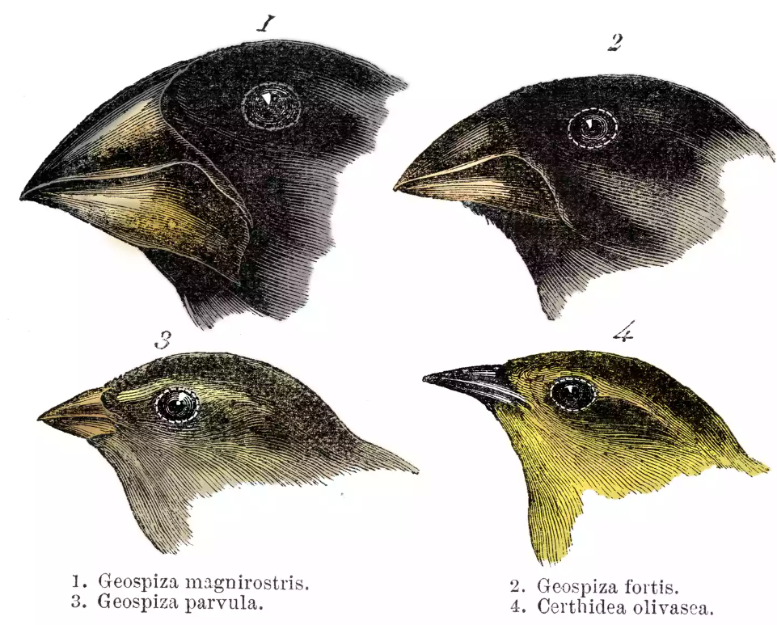

```{r global_options, include=FALSE}
library(emo)
library(tidyverse)
library(broom)
library(infer)
library(santoku)
library(car)
library(GGally)
library(modelsummary)
library(easystats)
library(table1)
library(gt)
library(janitor)
library(lmtest)
library(datawizard)
library(extrafont) 
library(lme4)
library(lmerTest)
library(patchwork)

knitr::opts_chunk$set(echo = FALSE, 
                      eval = FALSE,
                      fig.align = "center", 
                      # fig.height = 3, 
                      # fig.width = 5,
                      warning = FALSE, 
                      message = FALSE)


# nsduh <- read_rds("nsduh.rds") |> 
#   mutate(mj_lifetime.numeric = as.numeric(mj_lifetime) - 1, 
#          .before = mj_agefirst) |> 
#   select(mj_lifetime, mj_lifetime.numeric, alc_agefirst, demog_age_cat6, demog_sex, demog_income)
# summary(nsduh$alc_agefirst)
# write_csv(nsduh, "nsduh.csv")
# nsduh <- read_csv("nsduh.csv")  |>
  # mutate_if(is.character, as.factor)
# write_rds(finches, "geospiza.rds")
finches <- read_rds("geospiza.rds") 
# Custom ggplot theme to make pretty plots
# Get Barlow Semi Condensed at https://fonts.google.com/specimen/Barlow+Semi+Condensed
theme_clean <- function() {
  theme_minimal(base_family = "Barlow Semi Condensed") +
    theme(panel.grid.minor = element_blank(),
          plot.background = element_rect(fill = "white", color = NA),
          plot.title = element_text(face = "bold"),
          axis.title = element_text(face = "bold"),
          strip.text = element_text(face = "bold", size = rel(0.8), hjust = 0),
          strip.background = element_rect(fill = "grey80", color = NA),
          legend.title = element_text(face = "bold")) + 
    theme(legend.position = "bottom")
}


```


<span style="color: red;font-size: 14px;font-weight: bold;">GROUP WORK - DEADLINE  24-Nov-23. 
<br/>Please submit your final report [using this form](https://forms.gle/JB5c9apmkx3wD8WG7). </span>


<div style="float: right;width: 350px;margin: 5px 5px 5px 5px">
```{r img-logistic, echo=FALSE, eval=TRUE, fig.align='center'}

```
</div>

The designation "Darwin's finches" refers to a group of 15 finch-like species, 14 of which are endemic to the Galápagos Archipelago (the Galápagos finches). We are going to work with morphological data from Galapagos finches of the genus [*Geospiza*](https://en.wikipedia.org/wiki/Geospiza), data originally published by Sato, A. et al. (2001). [On the origin of Darwin's finches](http://mbe.oxfordjournals.org/content/18/3/299.full). Molecular Biology and Evolution, 18(3), 299-311.


### Creating a reproducible lab report


You will find all the work-space for your lab on posit cloud [using this link](https://posit.cloud/spaces/405625/content/7058756){target="_blank"}.

-   Load the `tidyverse`, `broom`, `table1`, `GGally`, `lme4`, `lmerTest`,  `datawizard` and the `modelsummary`  packages, and any other packages you might deem useful.
-   Load the `geospiza.rds` data set into your workspace, and assign it into an object called `finches`. 
-   Knit your file to see that everything is working. 
-   For each question, please add the text of the question, the code chunks and your answer. 

## Exploratory data analysis

1. Create a `table1` and use `GGally::ggpairs` to explore your data. 

```{r table1, eval=TRUE, echo=FALSE}
label(finches$beakh) <- "Beak height"
units(finches$beakh) <- "mm"

label(finches$wingl) <- "Wing (length)"
units(finches$wingl) <- "mm"
label(finches$ubeakl) <- "Upper beak"
units(finches$ubeakl) <- "mm"
label(finches$sex) <- "Sex"


table1(~ beakh + wingl + ubeakl  + sex  | species , data = finches, overall = FALSE, caption = "Table 1: Darwin's finches by species") 
```

The first rule of any data analysis is to plot the data. It's a common saying that this is also the second and third rule of data analysis. Never underestimate the value of plotting the data creatively. Occasionally, we fit statistical models in between plotting the data.

We are going to look at predicting the height of birds' beaks based on their measured wing length. And we have measurements for a variety of species. Fitting a single linear regression to these data would produce this plot:


```{r one-model, eval=FALSE, echo=TRUE}
ggplot(finches, aes(wingl, beakh)) +
  geom_point(aes(colour = species)) +
  geom_smooth(method = "lm", color = "grey")  

```


```{r one-model-noshow, eval=TRUE, echo=FALSE}
ggplot(finches, aes(wingl, beakh)) +
  geom_point(aes(colour = species), alpha = .7) +
  geom_smooth(method = "lm", color = "grey", alpha = .2)  + theme_clean() + 
  labs(x = "wing length (mm)", y = "Beak height (mm)", title = "Figure 1: Simple Linear Least Squares Regression (LLSR)")

```

The first thing we see is that the linear regression line tries to capture all the birds, but it doesn't really capture the pattern we see in the species: its intercept is much lower than the species and the slope is much steeper than what we expect from the species. 

Similar to Simpson's paradox, the linear regression may capture the entire population, but it does not really capture the trend that we see in each species. 

There is another concern: some species (e.g., `magnirostris`) appear to be concentrated above the linear regression much more frequently than other species. This becomes clearer if we facet according to species


```{r facet-species-no-fixed, eval=FALSE, echo=TRUE}

m1 <- lm(beakh ~ wingl, finches)

ggplot(finches, aes(wingl, beakh)) +
  geom_point(alpha= 0.5, (aes(color = species))) +
  geom_smooth(
    data = augment(m1), 
    aes(x=wingl, y = beakh), 
    method = "lm"
    ) + 
  facet_wrap(~species) 

```


```{r facet-species-no-fixed-noshow, eval=TRUE, echo=FALSE}

m1 <- lm(beakh ~ wingl, finches)
ggplot(finches, aes(wingl, beakh)) +
  geom_point(alpha= 0.5, (aes(color = species))) +
  geom_smooth(
    data = augment(m1), 
    aes(x=wingl, y = beakh), 
    method = "lm", 
    color = "grey", 
    alpha = .5
    ) + 
  facet_wrap(~species) + theme_clean() + 
  labs(x = "beak height (mm)", y = "residuals", title = "Figure 2: Each species separated against the linear regression line")

```


And even more so if we look at the residuals per species...


```{r resid-show, eval=FALSE, echo=TRUE}
finches$resids <- residuals(m1)
ggplot(___, aes(___, ___)) +
  geom_hline(yintercept = 0, lty = 2) +
  geom_point() +
  facet_wrap(~___, scales = "___") 
 
```

```{r resid-no-fe, eval=TRUE}
finches$resid <- residuals(m1)
ggplot(finches, aes(wingl, resid, color = species)) +
  geom_hline(yintercept = 0, lty = 2) +
  geom_point(alpha = .5) +
  facet_wrap(~species, scales = "free_x") + theme_clean() + 
  labs(x = "beak height (mm)", y = "residuals", title = "Figure 3: Plotting the residuals for each species separately")
```


To deal with this, we could also use the parallel slope model, which is a fixed effects for the species, so that each species has its own intercept. The formula we will be modelling is `beakh ~ wingl + species`, and the result is the following: 

```{r fe-int, eval=TRUE}


p_fe <- finches |> 
  lm(beakh ~ wingl + species, data = _) |> 
  augment() |> 
ggplot(aes(wingl, beakh, colour = species, group = species)) +
  geom_point(alpha = .5) +
  geom_line(aes(wingl, .fitted), size = 1, alpha = .5) + theme_clean() +
  labs(x = "wing length (mm)", y = "beak height (mm)", title = "Figure 4: Fixed intercept model", subtitle = "Each species has its own intercept")

p_fe

```

The residuals would look like this: 

```{r resid-fe-int, eval = TRUE}
finches |> 
  lm(beakh ~ wingl + species, data = _) |> 
  augment() |> 
ggplot(aes(wingl, .resid, colour = species)) +
  geom_point(alpha = .5) +
  geom_hline(yintercept = 0, lty = 2) +
  facet_wrap(~species, scales = "free_x") + 
  theme_clean() +   
  labs(x = "wing length (mm)", y = "residuals", title = "Figure 5: Residuals for the fixed intercept model")
```


This looks a bit better, for example the residuals of the `magnirostris` are centered much better than in Figure 3. But we can see that forcing the lines to be parallel makes them fit some species better than others. For example, in the `fuliginosa` species and the `difficilis` species we can see a pattern that suggests that we need to tilt the linear model a bit, i.e., that we would need different slopes for the different species. We could, of course, fit a model for each species separately, such that each species would have their own unique intercept *and* slope. This would then be the result: 

```{r fe-int-slope, eval=TRUE}

ggplot(finches, aes(wingl, beakh, color = species, group = species)) +
  geom_point(alpha = .7) +
  geom_smooth(method = "lm", alpha = .2)  + 
  theme_clean() + 
  labs(x = "wing length (mm)", y = "beak height (mm)", title = "Fixed effects: intercepts and slopes", 
       subtitle = "Intercepts and slopes are calculated separatly for each species")

```

The residual plot would then look like this 

```{r resid-fe-int-slope, eval = TRUE}
finches |> 
lm(beakh ~ wingl  + species + wingl:species, data = _) |> 
  augment() |> 
ggplot(aes(wingl, .resid, color = species)) +
  geom_hline(yintercept = 0, lty = 2) +
  geom_point(alpha = .5) +
  facet_wrap(~species, scales = "free_x") + theme_clean() + 
  labs(x = "wing length (mm)", y = "residuals")

```

But the trouble is that in this case, each species is effectively treated as its own little sample, completely disconnected from the other species. This is a problem when some species are very rare but share a lot in common with other species. In this case, we would have a lot of uncertainty around estimates of the rare species, and we are not sharing information between species that have many common features.  

2. Try to replicate as many graphs as you can from those shown above, and try to explain what could be the limitations of a fixed effects models we created? 

## Fitting a random intercepts model

Whereas the fixed effect approach let each `species` have its own intercept, completely isolated from the other species, random effects allow information to be shared across species. We are going to use the `lme4` package as our default option for fitting these types of models, and we will see how the models **constrain** the different intercepts by a normal distribution so that information is partially shared across species. In that way, rare species that have small samples would benefit from the "information" we can glean from the other species.  

The workhorse function of the lme4 package for fitting mixed effects models is the function `lmer`. You can pronounce it however you like. Some people would say "lemur", others "ell-em-ee-are". The syntax is just like `lm` with the addition of a formula for the "random effects".

You can find extensive details in the documentation `?lme4::lmer`.

```{r lmer-show, echo=TRUE}
m_lmer <-  lmer(beakh ~ wingl + (1 | species), data = finches)
```


```{r lmer-noshow-test, eval=FALSE, echo=FALSE}

library(datawizard)
library(broom)
library(stringr)
finches.c <- datawizard::standardise(finches)
finches.c <- finches


finches.c |> 
  lm(beakh ~  wingl, data = _) |> 
  summary()
finches.c |> 
  lm(beakh ~  0 + wingl + species,, data = _) |> 
  summary()
lmer(beakh ~ wingl + (1 | species), data = finches.c) |> 
  summary()


# Fixed effects 
f.int <- finches.c |> 
  lm(beakh ~  0 + wingl + species,, data = _) |> 
  tidy() |> select(term, estimate) |> filter(term !="wingl") |> 
  mutate(species = gsub("species", "", term), f.int = estimate, .keep = "none")
  


# random effects 
ref <- lmer(beakh ~ wingl + (1 | species), data = finches.c) |> 
  ranef() 
r.int <- ref$species |> mutate(r.int = `(Intercept)` + 1.142e-01) |> 
   rownames_to_column() |> mutate(species = rowname) |> 
  select(-1, -2) |> select(2, 1)
r.int <- ref$species |> mutate(r.int = `(Intercept)` + -3.819) |> 
   rownames_to_column() |> mutate(species = rowname) |> 
  select(-1, -2) |> select(2, 1)

# data 
dt <- finches.c |> summarise(
  mn.bk = mean(beakh), 
  sd.bk = sd(beakh), 
  mn.wg = mean(wingl), 
  sd.wg = sd(wingl), 
  n = n(), 
  .by = species
  )

jn <- f.int |> inner_join(r.int, by = "species") |> 
  inner_join(dt, by = "species")
jn |> 
summarise(weighted.mean(f.int, n))

```


Notice the new piece `+ (1 | species)`. The `1` refers to "intercept" and the `| species` tells the function that you want to let the intercept vary by the values in the `species` column.

### Plotting the predictions

Let's look at what we just did. We'll start by plotting the predictions. To do that, we'll use the `predict` function. Because we are applying it to an object of class `merMod` (meaning it was created by the `lmer` function), we can get details on that function at `?predict.merMod`.

```{r lmer-predict-show, echo=TRUE}
finches$predict_lmer <- predict(m_lmer)
```

Now let's plot those predictions:

```{r plot-lmer-noshow, eval=TRUE}
m_lmer <-  lmer(beakh ~ wingl + (1 | species), data = finches)
finches$predict_lmer <- predict(m_lmer)

finches |> 
ggplot(aes(wingl, beakh, colour = species)) +
  geom_point(alpha = 0.5) + 
  geom_line(aes(y = predict_lmer)) + 
  theme_clean() + 
  labs(x = "wing length (mm)", y = "beak height (mm)", title = "Random intercept model", subtitle = "Intercepts are normally distributed")
```


```{r plot-lmer, echo=TRUE, eval=FALSE}
finches |> 
ggplot(aes(___, ___, colour = ___)) +
  geom_point(alpha = 0.5) + # alpha = 0.1 make 10% opaque
  geom_line(aes(y = predict_lmer))  
```


There is another kind of prediction we can make with a mixed effects model. We can make a prediction at the "population" level. This is our expectation if we sampled a new species of unknown identity. With the lme4 package, we can do that by adding the argument `re.form = NA` to the `predict` function:

```{r pred-pop-show, echo=TRUE, eval=TRUE}
finches$predict_lmer_population <- 
  predict(m_lmer, re.form = NA)
```

Let's add the population prediction to the plot in black with a thicker line:

```{r rand-eff-noshow, echo=TRUE, eval=FALSE}
___ |> 
ggplot(aes(___, ___, colour = ___)) +
  geom_point(alpha = 0.1) +
  geom_line(aes(y = ___) +
  geom_line(aes(y = ___), 
            colour = "grey", 
            size = 1) 

```


```{r rand-eff, eval=TRUE}
p_rint <- finches |> 
ggplot(aes(wingl, beakh, colour = species)) +
  geom_point(alpha = 0.5) +
  geom_line(aes(y = predict_lmer)) +
  geom_line(aes(y = predict_lmer_population), 
            colour = "grey", 
            size = 1) + 
  theme_clean() +
  labs(x = "wing length (mm)", y = "beak height (mm)", title = "Random intercept model", subtitle = "Intercepts are normally distributed")


  # p_fe + p_rint
# finches |> 
#   lm(beakh ~ 0 + wingl + species, data = _) |> 
#     summary()


p_rint

```


3. Try to replicate as many figures above as you can. What do you notice about the intercepts? What do you notice about the slopes? How does this compare to the previous models we fit?


## Understanding the model output 

We can extract the random intercepts with the function `ranef`. Let's do that now. 

```{r lmer, echo=TRUE}
ranef(m_lmer)
```

Look at the structure of `ranef(m_lmer)`. How might you extract those values?

```{r, echo=TRUE}
ranef(m_lmer)$species[, 1] # exercise
```

Let's try plotting them. We'll use a little dplyr magic to make a nice data frame.

```{r, echo=TRUE}
 # row.names(.) means the row names of the data frame:
re <- ranef(m_lmer)$species %>% 
  mutate(species = row.names(.)) %>% 
  rename(intercept = `(Intercept)`) # a nicer column name
ggplot(re, aes(x = 1, y = intercept)) + geom_point(alpha = 0.7)

re
```

What is the mean of these random intercepts?

```{r, echo=TRUE}
round(mean(ranef(m_lmer)$species[, 1]), 2)
```

Is that what you expected? Why or why not?

And what are the estimates of the main effects?

```{r, echo=TRUE}
fixef(m_lmer)
fixef(m_lmer)[[1]]
fixef(m_lmer)[[2]]
```

So the intercept estimate for each species is equal to the "fixed effect" intercept plus the "random" deviation.

We can get the intercept estimates for each taxon in a couple of ways. Let's try that. First we can combine the 2 values we just accessed. 

```{r, echo=TRUE}
fixef(m_lmer)[[1]] + ranef(m_lmer)$taxon
```

Or we can use the function `coef` to combine them for us.

```{r, echo=TRUE}
coef(m_lmer)
```

As with most modelling functions in R, we can get details on the model fit with the function `summary`, in this case we are actually calling `summary.merMod`. Let's look at the output and figure out what it means. 

```{r, echo=TRUE}
summary(m_lmer)
```

The following are the important pieces:

```{}
Random effects:
 Groups   Name        Variance Std.Dev.
 species  (Intercept) 9.6096   3.0999 
 Residual             0.8176   0.9042 
Number of obs: 1434, groups:  species, 6
```

This tells us the variance and standard deviation (Std.Dev. = sqrt(Variance)) of our random intercept on `species` and of the residual variation `Residual`. We are also told how many rows of data we have `Number of obs: 1434` and how many random intercept groups we have `species, 6`.

```{}
Fixed effects:
            Estimate Std. Error 
(Intercept)  -3.819     1.385
wingl        0.2248     0.00791  
```

This tells us our fixed effect estimates and their standard errors. Assuming normality, a 95% confidence interval on those coefficients can be obtained with their estimate +/- 1.96 the standard error. In other words approximately estimate +/- 2*SE. We'll come back to this topic later. 

```{}
Correlation of Fixed Effects:
           (Intr)
wingl      -0.405
```

This tells us that our intercept and slope are negatively correlated. Why is this?

This isn't great, and if this correlation is very strong and our model is complicated it might result in computational problems. The easiest way to try and solve this issue is by "centering" the predictor by subtracting the mean. 

There are a lot of details in the output from `summary(m_lmer)` and usually a lot more decimal places than are reasonable. 

A useful alternative is the function `arm::display` which focuses on the important pieces. 

```{r arm-display, echo=TRUE}
arm::display(m_lmer)
```

Some suggest not loading the package arm, and instead call its functions directly (e.g. `arm::display`) because the package loads many other functions and packages that we don't need.

## Interpreting the model predictions

What do the model predictions mean?

We have assumed that the relationship between log(wing length) and log(beak height) is constant across taxa. Therefore, the single slope value is:

```{r slope-show, echo=TRUE}
(slope <- fixef(m_lmer)[[2]] %>% round(1))
```

Remember that we are modelling a predictor and a response. So we are claiming that an 1 point change in the predictor relates to a certain  point change in the response Y.


What does our fixed intercept mean?

In this case, it's not very meaningful. It's the expected beak  when wing length = 0. In other words, we would expect a bird with a wing length of 1mm to have a beak height of `r round(fixef(m_lmer)[[1]], 2)`mm.

4. How might we make the intercept more meaningful if we were to refit this model? (*Hint:* consider centering your predictor variable!)

### Addendum

George Box, a famous statistician, once wrote "...all models are wrong, but some are useful".

It's important to know what our models are ignoring and what assumptions we are making. Discuss with your neighbour what is wrong with this model and how it could be done better. How big a problem do you think these issues might be?

For example: <!-- exercise -->

- we've assumed each taxon is independent but some are obviously more phylogenetically related to each other --- we could incorporate this information <!-- exercise -->
- we might want to consider letting the slopes vary as well <!-- exercise -->
- we've combined all the islands together, and it's possible there is some variation by island <!-- exercise -->
- some islands are closer to each other than others, so we might want to check for spatial autocorrelation <!-- exercise -->
- we might want to try centering the predictor to reduce correlation between the intercept and slope and make the intercept more interpretable <!-- exercise -->^
