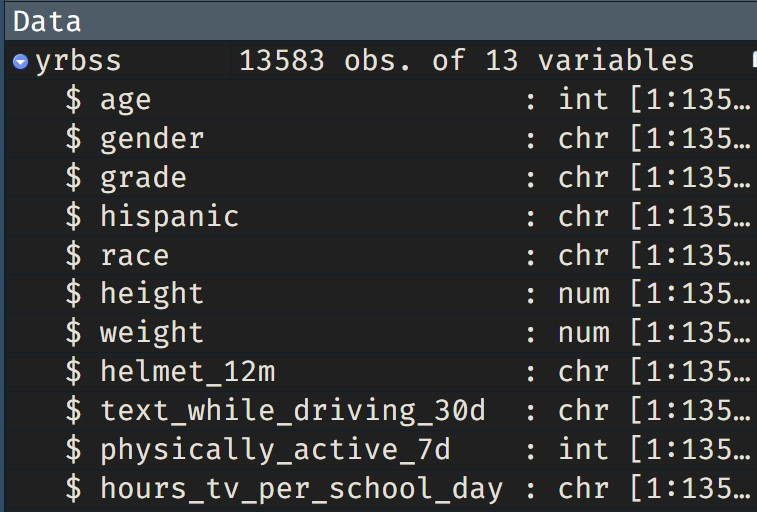

```{r global_options, include=FALSE, echo=FALSE}
knitr::opts_chunk$set(eval = TRUE, results = FALSE, fig.show = "hide", message = FALSE, fig.align = "centre")
library(tidyverse)
library(skimr)
library(infer)
yrbss <- read_csv("data/yrbss.csv")

```


```{r load-packages, message=FALSE, eval=FALSE, echo=FALSE}
# Let's load the packages.
library(tidyverse)
library(infer)
library(skimr)
library(mosaic)
write_csv(yrbss, "data/yrbss.csv")
```

Every two years, the Centers for Disease Control and Prevention conduct the Youth Risk Behavior Surveillance System (YRBSS) survey, where it takes data from high schoolers (9th through 12th grade), to analyze health patterns.

You will work with a selected group of variables from a random sample of observations during one of the years the YRBSS was conducted.


### Creating a reproducible lab report

Remember that we will be using R Markdown to create reproducible lab reports.
In RStudio, go to the file `lab-03.Rmd`

-   Update the YAML with your name, the date and the name of the lab.
-   load the `tidyverse`, `skimr`, `mosaic` and `infer` package.
-   Load the `yrbss` data set into your workspace.
-   knit your file to see that everything is working. 

If you run the code in the chunk, you should now see the yrbss data in your environment panel on the top left in rstudio.

```{r img-environment-data, echo=FALSE}

```


There are observations on 13 different variables, some categorical and some numerical. The meaning of each variable can be [found here](https://www.openintro.org/data/index.php?data=yrbss).


1.  What are the cases in this data set? How many cases are there in our sample?

Remember that you can answer this question by viewing the data in the data viewer or by using the following command:

```{r str}
glimpse(yrbss)
```

## Exploratory data analysis

You will first start with analyzing the weight of the participants in kilograms: `weight`.

Using visualization and summary statistics, describe the distribution of weights.

The `skim()` function from the **skimr** package produces nice summaries of the variables in the dataset, separating categorical (character) variables from quantitative variables.

```{r summary, eval=TRUE}
yrbss %>% 
  skim()
```

1.  How many observations are we missing weights from? How many are missing from the variable `physically_active_7d`?

Next, consider the possible relationship between a high schooler's weight and their physical activity.
Plotting the data is a useful first step because it helps us quickly visualize trends, identify strong associations, and develop research questions.

First, let's create a new variable `physical_3plus`, which will be coded as either "yes" if the student is physically active for *at least* 3 days a week, and "no" if not. We will also remove missing data.

```{r create-new-var}
yrbss <- yrbss |> 
  drop_na(physical_3plus, weight) |> 
  mutate(
    physical_3plus = if_else(
      physically_active_7d > 2,
      "yes", 
      "no"
      )
    )
```


::: {#boxedtext}

Notice that the data set includes a new variable called `physical_3plus`. This variable is of type `character`. In order to turn it into a categorical variable, we need to run the following command:

```{r 3plus-to-factor}

yrbss <- yrbss %>% 
  mutate(
    physical_3plus = factor(physical_3plus)
    )

```

Now you should see that `physical_3plus` is a factor, which is the R equivalent of a categorical variable.  

:::

2.  Try to replicate the box-plot and the summary table shown below. What can you learn from it about the association between the variables `physical_3plus` and `weight`? What do you expect and why?

```{r, eval=TRUE, echo=FALSE}
yrbss |> 
  ggplot(aes(physical_3plus, weight)) + 
  geom_boxplot() + 
  labs(x = "Three or more activities a week") + 
  theme_minimal()
```


The box plots show how the medians of the two distributions compare, but we can also compare the means of the distributions using the following to first group the data by the `physical_3plus` variable, and then calculate the mean `weight` in these groups using the `mean` function while ignoring missing values by setting the `na.rm` argument to `TRUE`.


```{r by-means}
yrbss |> 
  drop_na(physical_3plus) |> 
  group_by(physical_3plus)  |> 
  summarise(mean_weight = mean(weight, na.rm = TRUE), 
            sd_weight   = sd(weight, na.rm = TRUE), 
            n           = n())
```

There is an observed difference in the mean weights of the two groups, but is this difference large enough to deem it "statistically significant"?
In order to answer this question we will conduct a hypothesis test.


## Inference

3. To test the difference between the two groups, we will run a t-test. Write the hypotheses for testing if the average weights are different for those who exercise at least times a week and those who don't. Run the t-test and formulate your conclusion by filling in the sentence shown below. 
    
    
```{r, eval=FALSE, echo=FALSE}
t_test(
  weight ~ physical_3plus, 
  data = yrbss) 

```

::: {#boxedtext}

Please use the formulation below in your answer. You will need to fill in the gaps.

> The _____ subjects who were physically active three or more days per week (M = _____, SD = _____) compared to the  _____ participants who were physically active fewer days 
 (M = _____, SD = _____) were associated with significantly greater weight, t(_____) = _____, p = _____.


:::


Next, we will work through creating a permutation distribution using tools from the **infer** package.

But first, we need to initialize the test, which we will save as `obs_diff`.

```{r inf-weight-habit-ht-initial, tidy=FALSE, warning = FALSE}
obs_diff <- yrbss %>%
  specify(weight ~ physical_3plus) %>%
  calculate(stat = "diff in means", order = c("yes", "no"))
```

Recall that the `specify()` function is used to specify the variables you are considering (notated `y ~x`), and you can use the `calculate()` function to specify the `stat`istic you want to calculate and the `order` of subtraction you want to use.
For this hypothesis, the statistic you are searching for is the difference in means, with the order being `yes - no`.

After you have calculated your observed statistic, you need to create a permutation distribution.
This is the distribution that is created by shuffling the observed weights into new `physical_3plus` groups, labeled "yes" and "no"

We will save the permutation distribution as `null_dist`.

```{r inf-weight-habit-ht-null, tidy=FALSE, warning = FALSE}
null_dist <- yrbss %>%
  specify(weight ~ physical_3plus) %>%
  hypothesize(null = "independence") %>%
  generate(reps = 1000, type = "permute") %>%
  calculate(stat = "diff in means", order = c("yes", "no"))
```

The `hypothesize()` function is used to declare what the null hypothesis is.
Here, we are assuming that student's weight is independent of whether they exercise at least 3 days or not.

We should also note that the `type` argument within `generate()` is set to `"permute"`.
This ensures that the statistics calculated by the `calculate()` function come from a reshuffling of the data (not a resampling of the data)!
Finally, the `specify()` and `calculate()` steps should look familiar, since they are the same as what we used to find the observed difference in means!

We can visualize this null distribution with the following code:

```{r}
ggplot(data = null_dist, aes(x = stat)) +
  geom_histogram()
```

5.  Add a vertical red line to the plot above, demonstrating where the observed difference in means (`obs_diff`) falls on the distribution.

6.  How many of these `null_dist` permutations have a difference at least as large (or larger) as `obs_diff`?

Now that you have calculated the observed statistic and generated a permutation distribution, you can calculate the p-value for your hypothesis test using the function `get_p_value()` from the infer package.

```{r inf-weight-habit-ht-pvalue}
null_dist %>%
  get_p_value(obs_stat = obs_diff, direction = "two_sided")
```

7.  What warning message do you get?
    Why do you think you get this warning message?

8.  Construct and record a confidence interval for the difference between the weights of those who exercise at least three times a week and those who don't, and interpret this interval in context of the data.

------------------------------------------------------------------------

## More Practice

9.  Calculate a 95% confidence interval for the average height in meters (`height`) and interpret it in context.

10. Calculate a new confidence interval for the same parameter at the 90% confidence level.
    Comment on the width of this interval versus the one obtained in the previous exercise.

11. Conduct a hypothesis test evaluating whether the average height is different for those who exercise at least three times a week and those who don't.

12. Now, a non-inference task: Determine the number of different options there are in the dataset for the `hours_tv_per_school_day` there are.

13. Come up with a research question evaluating the relationship between height or weight and sleep.
    Formulate the question in a way that it can be answered using a hypothesis test and/or a confidence interval.
    Report the statistical results, and also provide an explanation in plain language.
    Be sure to check all assumptions, state your $\alpha$ level, and conclude in context.

------------------------------------------------------------------------

<a rel="license" href="http://creativecommons.org/licenses/by-sa/4.0/">{style="border-width:0"}</a><br />This work is licensed under a <a rel="license" href="http://creativecommons.org/licenses/by-sa/4.0/">Creative Commons Attribution-ShareAlike 4.0 International License</a>.
