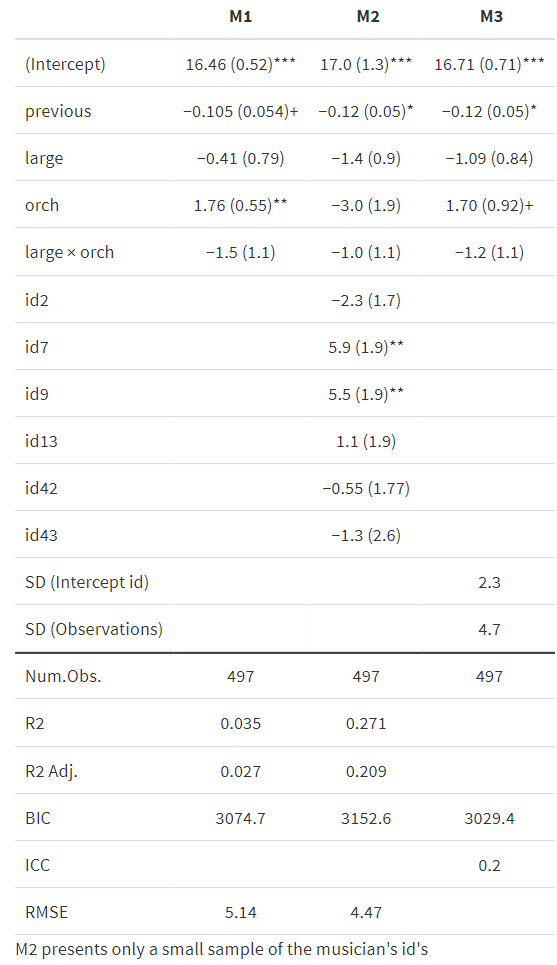

```{r global_options, include=FALSE}
library(emo)
library(tidyverse)
library(broom)
library(infer)
library(santoku)
library(car)
library(GGally)
library(modelsummary)
library(easystats)
library(table1)
library(gt)
library(datawizard)
library(marginaleffects)
library(janitor)

library(extrafont) 
library(marginaleffects)
library(faux)

knitr::opts_chunk$set(echo = FALSE, 
                      eval = TRUE,
                      fig.align = "center", 
                      # fig.height = 3, 
                      # fig.width = 5,
                      warning = FALSE, 
                      message = FALSE)


theme_clean <- function() {
  theme_minimal(base_family = "Barlow Semi Condensed") +
    theme(panel.grid.minor = element_blank(),
          plot.background = element_rect(fill = "white", color = NA),
          plot.title = element_text(face = "bold"),
          axis.title = element_text(face = "bold"),
          strip.text = element_text(face = "bold", size = rel(0.8), hjust = 0),
          strip.background = element_rect(fill = "grey80", color = NA),
          legend.title = element_text(face = "bold"))
}


music <- read_csv("music.csv") |> 
  mutate_if(is.character, as.factor)  %>%
  mutate(
    orch = 
      ifelse(instrument ==  "orchestral instrument",1,0),
    large = 
      ifelse(perform_type=="Large Ensemble",1,0), 
    id = fct_relevel(factor(id), "34")
    )

summary(music)
```


## Multilevel regressions

Stage fright can be a serious problem for performers, and understanding the personality underpinnings of performance anxiety is an important step in determining how to minimize its impact. [Sadler and Miller (2010)](http://dx.doi.org/10.1177/1948550610370492) studied the emotional state of musicians before performances and factors which may affect their emotional state. Data was collected by having 37 undergraduate music majors from a competitive undergraduate music program fill out diaries prior to performances over the course of an academic year. In particular, study participants completed a survey to measure their negative affect: a measure of anxiety their anxiety before the concert. 

The data-set includes the following variables:


- `id` = unique musician identification number
- `previous` = the number of previous performances by the musician
- `large` = Performance as part of a Large Ensemble (small ensemble = 0, large = 1)
- `na` = negative affect score from PANAS (**Response variable**)
- `gender` = musician gender
- `orch` =  Orchestral musician (voice or piano = 0, Orchestral = 1)


However, another key assumption in these models is the independence of all observations. While we might reasonably conclude that responses from different study participants are independent (although possibly not if they are members of the same ensemble group), it is not likely that the 15 or so observations taken over multiple performances from a single subject are similarly independent. If a subject begins with a relatively high level of anxiety (compared to other subjects) before their first performance, chances are good that they will have relatively high anxiety levels before subsequent performances. 


```{r lattice, eval=TRUE}


m.pre <- lm(na ~ previous + large + orch + large:orch, data = music)
m.pre.fixed <- lm(na ~ previous + id, data = music)


# summary(m.pre.fixed)
# tidy(m.pre.fixed) |> arrange(p.value) |> print(n=40)
m.pre.fixed.aug <- augment(m.pre.fixed) |>  
  filter(id %in% c(32, 17, 19, 40, 22, 1, 39, 18, 6, 41, 3, 13, 2, 33, 10))


# Lattice plot for NA vs. Previous Performances
music |>  
  filter(id %in% c(32, 17, 19, 40, 22, 1, 39, 18, 6, 41, 3, 13, 2, 33, 10)) |> 
  ggplot(aes(x=previous,y=na)) + 
  geom_point() + 
  geom_line(data = m.pre.fixed.aug, aes(x=previous, y=.fitted)) + 
  # geom_smooth(method="lm",color="black") + 
  facet_wrap(~id, ncol=5, labeller = labeller(id = label_both), scale = "free_x") +   
  theme(strip.text.x=element_blank()) + 
  labs(x="Previous Performances",y="Negative Affect") + 
  theme_clean()


```

From these figures we clearly see that in general, there is a decrease in the negative affect score over time. But each musician has a different intercept: some musicians tend to be more anxious than others (e.g., musician id 22, 32), whereas others less anxious (e.g. id 1, 41)


```{r models, eval=FALSE, include=FALSE}


m.pre.fixed <- lm(na ~ previous + id, data = music)


library(lme4)


m.pre.fixed.plus <- lm(na ~ previous + large + orch + large:orch + id, data = music)
# 
# m.pre.random <- lmerTest::lmer(na ~ previous + (1|id), data = music)

m.random     <- lmerTest::lmer(na ~ previous + large + orch + large:orch + (1|id), data = music)

summary(m.random)

modelsummary(
  list(M1 = m.pre, M2 = m.pre.fixed.plus, M3 = m.random), 
  stars = TRUE, 
  coef_omit= -c(1, 2, 1 + 2, 2 + 2, 3 + 2, 6 + 1, 10 + 1, 13, 16,  39:42),
 estimate = "{estimate} ({std.error}){stars}", statistic = NULL, gof_omit = "Marg|AIC|Log|F|Cond", notes = "M2 presents only a small sample of the musician's id's", fmt = fmt_significant(2))


```


```{r ex-1-01-img, eval=TRUE, out.width="70%", echo=FALSE}

```


1. The summary table presents three models of negative affect score of musicians over time. The first two are regular least square linear regressions (LLSR), and the last one is a multilevel regression model with a random intercept. Please write each of the models in mathematical form. What percent of the total variance in the negative affect scores can be explained by variance between musicians?


:::{#boxedtext}

An LLSR model should be written as follows: 

$$
Y = \beta_0 + \beta_1X_1+\ldots +  \epsilon \\ \epsilon\sim\mathcal{N}(0, \sigma^2)
$$
Replace the $\beta$'s with the estimation of the coefficients and the $\sigma$ with the residual standard error (shown in the table as RMSE = Root Mean Square Error)

A random effects model is written in the following way: 


$$
Y = \beta_0 + a_i + \beta_1X_1+\ldots +\epsilon \\ 
a_i\sim\mathcal{N}(0, \sigma_{\text{int}}^2) \\
\epsilon\sim\mathcal{N}(0, \sigma_{\text{obs}}^2)
$$
-     The random intercept $a_i$ is normally distributed around zero with a standard deviation `SD (Interecept)` (the variation between musicians)
-   The residuals $\epsilon$ are distributed around zero with a standard deviation `SD (Observations)` (the variation within musicians)


In this model, the performance anxiety scores of musician $i$ is a function of the number of previous performances, the size of the ensemble and whether or not they play an orchestral instrument. $\beta_0$ is the mean response for all the musicians aka the grand mean – the true mean of all observations across the entire population. Adding up $\beta_0 + a_i$, we get the mean response for musician $i$, when all the indicators are zero. 

The variance components consist of $s_{\text{obs}}^2$ the within-person variability, while $s_{\text{int}}^2$ is the between-person variability. 

The name random intercepts model then arises from the Level Two equation for $a_i$. Each subject’s intercept is assumed to be a random value from a normal distribution centered at 0 with variance  $s_{\text{obs}}^2$.

:::


## Binomial probability


A new test has been developed to diagnose a strain of virus. Out of a random sample of 10000 individuals, 10% are found to have the virus (`true +`) and 90% do not have the virus (`true -`). Of the 9000 individuals who do not carry the virus, 8910 have tested negative ("true negative") and 90 have positive ("false positive"). Of the 1000 who carry the virus, 990 are true positive and 10 are false positive. 

```{r ex2, echo=FALSE, eval=TRUE}

df <- tribble(
  ~status, ~tested, ~freq, 
  "true+", "test+", 990, 
  "true+", "test-", 10, 
  "true-", "test+", 90, 
  "true-", "test-", 8910 
) |> uncount(freq)

df |> 
  tabyl(status, tested) |> 
  adorn_totals(where = c("row", "col")) |> 
   gt::gt() |> gtExtras::gt_theme_guardian()
```

2. Calculate the odds ratio for being tested positive, when comparing someone who carries the virus to someone who does not carry the virus.  

```{r ex2-sol, echo=FALSE, include=FALSE}
(90 / 8910) / (990/10)
```

3. Is the outcome of the test independent of the true status of illness? Test the assumption of independence and describe your conclusion. 


:::{#boxedtext}

Here you will need to run a chi-square test. To run the test, you can use the following code: 

```{r ex3, echo=TRUE, eval=FALSE}
m <- matrix(c(8910, 10, 90, 990), ncol=2)

# The following is optional
dimnames(m) <- list(
  status = c("true-", "true+"),
  tested = c("test-", "test+") 
  )

chisq.test(m)

```


:::

4. Calculate the sensitivity, the specificity and the positive predictive value (PPV) of the test. Calculate the 95% confidence interval of the PPV.

:::{#boxedtext}

Sensitivity, Specificity and Positive Predictive Value (PPV) are measures of the accuracy of a diagnostic test. 

-   The sensitivity is the probability that someone tests positive, given that they are truly carrying the virus. From the total number of people who have the virus, how many will test positive?
-   The specificity is the probability that someone tests negative, given that they are **not** carrying the virus. From the total number of people who do not have the virus, how many will test negative?
-   The PPV is the probability that someone is carrying the virus, given that they are testing positive. Out of the total number of people who have been tested positive, how many are truly carrying the virus?


Finally, if we want to test the confidence interval for a proportion, we use the `prop.test` command in R. For example, say that we know that 123 out of 245 people are carrying a dangerous virus. Our confidence interval would be calculated as follows: 

```{r ex4, echo=TRUE, eval=FALSE}
prop.test(x = 123, n = 245)

```

From this calculation we can see that the sample proportion is 0.502 (which is exactly $\frac{123}{245}$), and the confidence interval associated with this value is CI [0.438, 0.566]


:::

5. You would like to compare the sensitivity of two different methods to diagnose a certain virus. Using method A, you test 200 people who carry the virus and you find 190 test positive. Using method B, you test 150 people who carry the virus and you find that 140 test positive. What would be your null hypothesis? What is the p-value and the confidence interval for the difference in the sensitivity between the two methods? 


:::{#boxedtext}

In this case we have not one, but two different proportions we want to compare to one another. The code you need is the following: 

```{r ex-5, echo=TRUE, eval=FALSE}
# The number of people who were tested positive is x = c(190, 140)
# The number of people tested are n = c(200, 150)

prop.test(x = c(190, 140), n = c(200, 150))

```


:::


6. How would your answers to question 4 change if the virus was much rarer? Use the contingency matrix below and calculate again the sensitivity, the specificity and the PPV of the test. 


```{r ex5, echo=FALSE, eval=TRUE}

df <- tribble(
  ~status, ~tested, ~freq, 
  "true +", "test +", 99, 
  "true +", "test -", 1, 
  "true -", "test +", 99, 
  "true -", "test -", 9801 
) |> uncount(freq)

df |> 
  tabyl(status, tested) |> 
  adorn_totals(where = c("row", "col")) |> 
   gt::gt() |> gtExtras::gt_theme_guardian()
```


