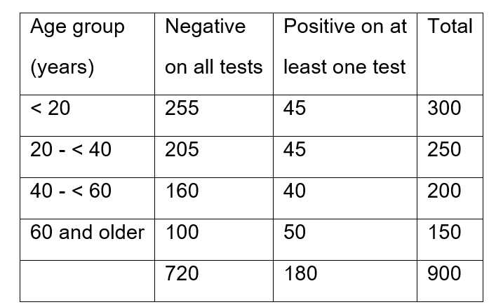
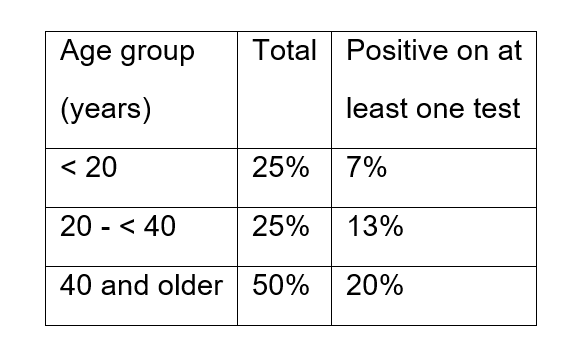
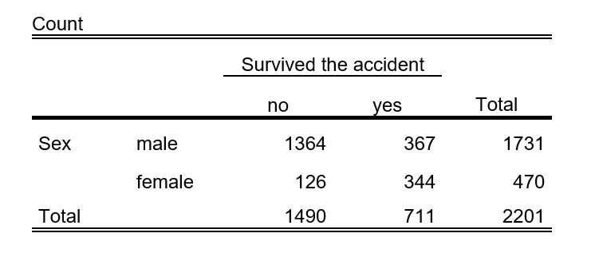
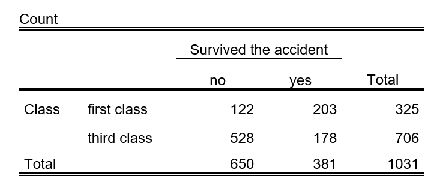
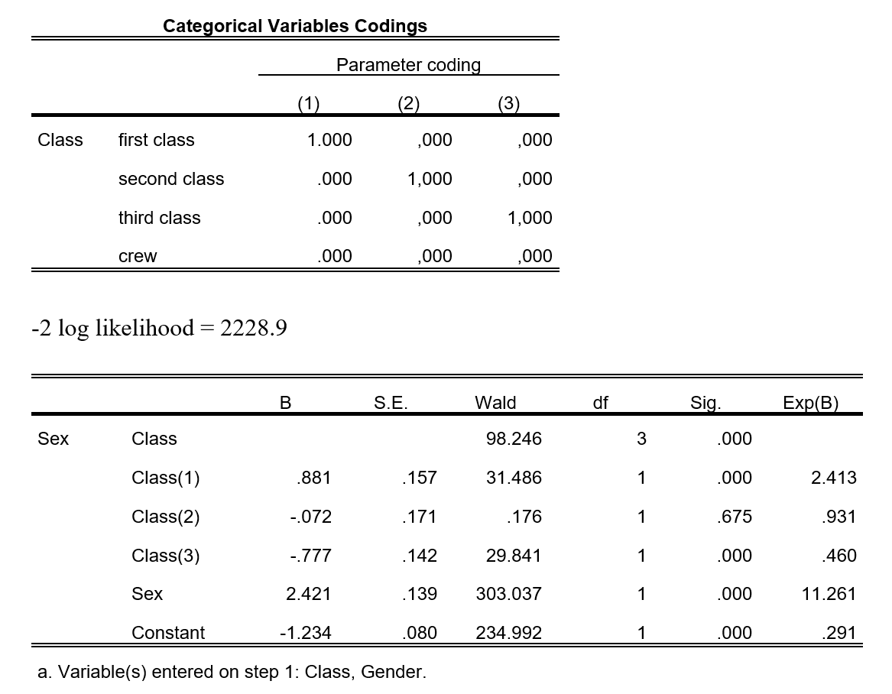
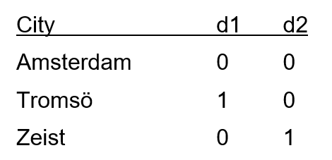
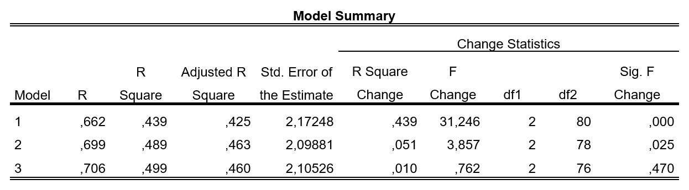
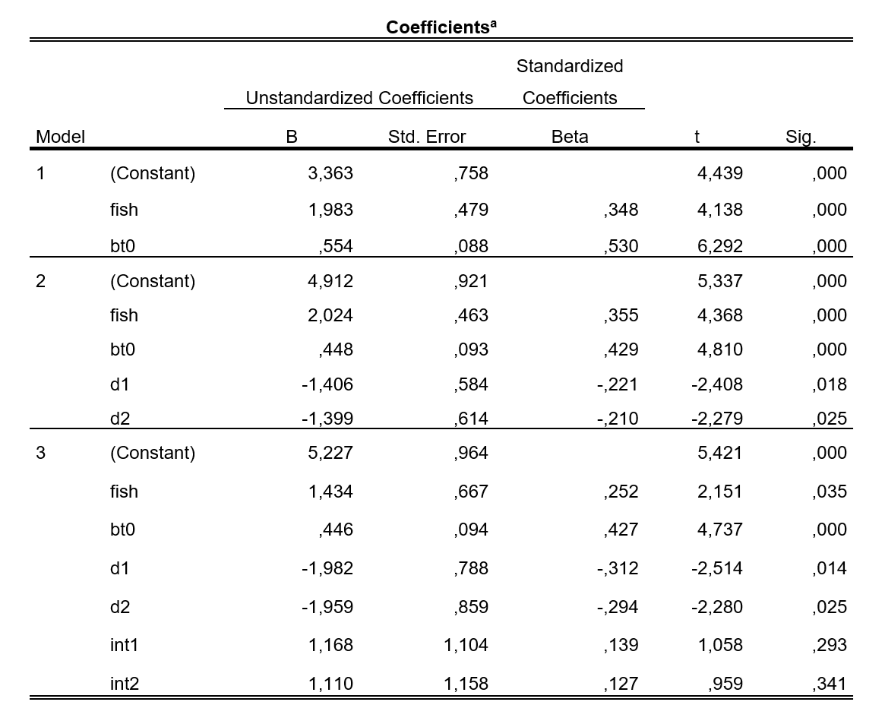

```{r global_options, include=FALSE}
library(emo)
library(tidyverse)
library(broom)
library(infer)
library(santoku)
library(car)
library(GGally)
library(modelsummary)
library(easystats)
library(table1)
library(gt)
library(datawizard)
library(marginaleffects)
library(janitor)

library(extrafont) 
library(marginaleffects)
library(faux)

knitr::opts_chunk$set(echo = FALSE, 
                      eval = FALSE,
                      fig.align = "center", 
                      # fig.height = 3, 
                      # fig.width = 5,
                      warning = FALSE, 
                      message = FALSE)


theme_clean <- function() {
  theme_minimal(base_family = "Barlow Semi Condensed") +
    theme(panel.grid.minor = element_blank(),
          plot.background = element_rect(fill = "white", color = NA),
          plot.title = element_text(face = "bold"),
          axis.title = element_text(face = "bold"),
          strip.text = element_text(face = "bold", size = rel(0.8), hjust = 0),
          strip.background = element_rect(fill = "grey80", color = NA),
          legend.title = element_text(face = "bold"))
}


```


<span style="color: red;font-size: 14px;font-weight: bold;">INDIVIDUAL WORK - DEADLINE  29-Nov-23 at 16:00. 
<br/>Please submit your final report [using this form](https://bit.ly/3N4Hox6). </span>


## Binomial probability

In a certain population, data were collected in 900 randomly chosen individuals. Participants were asked if they tested at least once positive on the COVID self-tests they took last year.


```{r ex-1-01-img, eval=TRUE, out.width="50%", echo=FALSE}

```


1. Give a 95% confidence interval for the proportion of individuals who tested at least once positive on the COVID self-tests in this population, based on this information if we can assume that these 900 individuals are representative for the total population. [4]

```{r ex-1}

binom.test(180, 900)
prop.test(180, 900)

```


2. One individual is chosen randomly from this table. What is the probability that this person is younger than 20 years if we know that this person tested positive on the COVID self-test twice? [4]

```{r ex-2}

# binom.test(45, 180)
prop.test(45, 180)


```


3. From the 900 individuals in the sample, randomly 3 individuals were chosen for in-depth interviews. What is the probability that all three are younger than 40 years? [5]

```{r ex3}
# prob that one is younger than 40
# 250 + 300

dbinom(3, 3, (250 + 300)/900)

```


4. In another (very large) population, 15% tested at least once positive. A random sample of 10 individuals was taken. What is the probability that exactly 7 individuals in this sample tested negative on all tests? [6]

```{r ex4}

dbinom(7, 10, .85)

```


5. In this second population, there is information on the age distribution and the prevalence of negative / positive testing. From this very large population, randomly 3 individuals are chosen, one from each age group. What is the probability that one of these three individuals tested positive at least once, the other two did not? [6] [6]


```{r ex-5-01-img, eval=TRUE, out.width="45%", echo=FALSE}

```

```{r ex5}
0.07*.87*.80 / (0.07*.87*.80 + .83*.13*.80 + .83*.87*.20)

```


## Categorical response

The Titanic was a British passenger liner that sank in the North Atlantic Ocean in 1912. Out of 2201 individuals who were on board (1316 passengers and 885 crew) only 711 survived the accident. From all passengers, it is known whether they traveled first, second or third class.


```{r ex-6-01-img, eval=TRUE, out.width="60%", echo=FALSE}

```

6. Calculate the Odds Ratio to survive the accident for Females compared to Male passengers. [4]


```{r ex6}

prop.test(c(367, 344), c(1731, 470))
(344 / 126) / (367 / 1364) 


```


```{r ex-7-02-img, eval=TRUE, out.width="60%", echo=FALSE}

```


7. Test, based on the table above, if surviving the accident is independent of class when comparing first class passengers compared to third class passengers. Which test do you use? Present your calculations and your conclusion [5]

```{r ex7}
prop.test(c(203, 178), c(325, 706))
(203/325 - 203) / (178/706 - 178)

```


A logistic regression was performed with outcome survival of the accident (0 = no, 1 = yes):

```{r ex-8-03-img, eval=TRUE, out.width="90%"}

```

8. Interpret the intercept (constant) and the coefficients for Sex, Class(1), Class(2), Class(3) in the table above. Compare the coefficient for Sex with your findings in question 6, and highlight which variables are significant predictors for survival? Motivate your answers. [5]

```{r ex-8}

# Const 
# odds survival for male crew member is 0.291, 
# prob is 0.2254067, plogis(-1.234) = 0.2254821

# Sex
# exp(2.421) = 11.261 odds ratio
# (344/126) / (367/1364)

# Class 1
# Odds are 2.413 times than crew

# Class 2 - no siginficant difference to crew

# Class 3
# Odds are 0.460 times than crew


```


9. 	What is, based on this model, the OR of surviving for a female in the first class compared to male crew member? Compare with your answer to question 6 above. How do you explain the difference? [4]

```{r ex-9}
# exp(2.421 + .881) = 27.16692

```


10.	Give a 95% CI for the OR of sex, adjusted for class. [6]

```{r ex-10}

exp(2.421 + c(-1.96, 1.96)*.139)

```


A second Model was tested, including the same variables as in the last model plus an extra variable, the interaction between sex and class. 


11.   The $-2$ log likelihood of this new model is 2163.7. Test if this new model is significantly better than the first model. Describe your steps clearly.[4]


```{r ex11}

pchisq(2228.9 - 2163.7, df = 1, lower.tail = FALSE)

```


## Linear regression

In a study on the effect of eating fish on bleeding time, 84 male volunteers from three cities were randomly divided over two groups: fish diet and meat diet. (Variable `fish`: coded as 0 for meat diet and 1 for fish diet). The bleeding time (volunteers were made to bleed and the time was recorded in minutes until it stopped bleeding) was measured twice: at baseline (the variable `bt0`) and after six weeks of diet (`bt6`). For the linear regression, two dummy variables (d1 and d2) were created as follows:


```{r ex-12-01-img, eval=TRUE, out.width="40%"}

```

12.	In a simple linear regression, the researchers estimated the relationship between bt6 and bt0. Match the scatter plot with the attributes shown below: [8]

-   Pearson’s correlation coefficient is 1 and the estimated slope is 1
-   Pearson’s correlation coefficient is 0.3 and the estimated slope is 1
-   Pearson’s correlation coefficient is 1 and the estimated slope is 0.3 
-   Pearson’s correlation coefficient is 0.3 and the estimated slope is 0.3 


```{r ex12, eval = TRUE}

# cor = 1, b = 1
df <- rnorm_multi(100, 2, mu = c(0 + 3, 4 + 3), sd = 1, r = .999, varnames = c("bt0", "bt1"), empirical = TRUE) |> 
  mutate(facet = "Figure 2") 
  

# cor = .3, b = 1
df <- rnorm_multi(100, 2, mu = c(0 + 3, 4 + 3), sd = c(3/4, 10/4), .3, varnames = c("bt0", "bt1"), empirical = TRUE) |> 
  mutate(facet = "Figure 4") |> add_row(df) 


# cor = 1, b = 0.3
df <- rnorm_multi(100, 2, mu = c(0 + 3, 4 + 3), sd = c(10/4, 3/4), 0.999, varnames = c("bt0", "bt1"), empirical = TRUE)  |> 
  mutate(facet = "Figure 1") |> add_row(df)  


# cor = 0.3, b = 0.3
df <- rnorm_multi(100, 2, mu = 0, sd = 1, 0.3, varnames = c("bt0", "bt1"), empirical = TRUE)  |> 
  mutate(facet = "Figure 3") |> add_row(df)  

df |> ggplot(aes(bt0, bt1)) +
  geom_point() +
  geom_smooth(method="lm") + 
  facet_wrap(~facet, scales = "free") +
  theme_clean() + 
  labs(x = "Bleeding time (baseline)", y = "Bleeding time (six weeks)") + 
  theme(text = element_text(size = 18))


```

13.	The researchers had SPSS to run three linear regression analyses (see below). In the third model, int1 and int2 are two interaction terms, between fish and d1 and d2 respectively. What is the null hypothesis you test, if you compare model 3 with model 2? [4]


```{r ex-13-img, eval=TRUE, out.width="90%"}



```


```{r ex13}
# H0: int1 = int2 = 0

```


14.	Is model 2 a significantly better model than model 1? Please explain your answer. [5]


```{r ex14}
# Yes the change statistic is significant

```


15.	For this question, take the results of model 2. What is the predicted bleeding time after 6 weeks for a male in Tromsö on a fish diet with a bleeding time of 5 minutes at baseline? [3]

```{r ex15}
# Original: For this question, please use the estimations of M2. 
# What is the predicted mean bleeding time after 6 weeks for 
# males in Zeist on a fish diet with a bleeding time 
# of 9 minutes at baseline?

# 4.912 + 2.024 + .448*5 -1.406 
# 7.77 minutes


```


16.	Give the 95% confidence interval for the coefficient of bleeding time at baseline according to model 2. [4]


```{r ex16}

# .448 + c(-1.96, 1.96)*0.093 = 0.26572 0.63028

```

## Mixed models 


```{r mixed-setup, eval=TRUE, echo=FALSE}
library(lme4)
library(performance)
library(mosaic)

md <- read_csv("https://oferengel.quarto.pub/umcg-beyond-mlr/data/musicdata.csv", show_col_types = FALSE) %>% dplyr::select(-1) %>% mutate(female = as.factor(ifelse(gender=="Female",1,0)))  %>% 
   mutate(
      students   = 
        as.factor(ifelse(audience=="Student(s)",1,0)),
      instructor = 
        as.factor(ifelse(audience=="Instructor",1,0))) %>% 
  select(id, pa, female, students, 
         instructor, mpqab, audience) %>% 
  mutate(mpqab.cntr = mpqab - median(mpqab), 
         audience   = factor(audience)) %>% select(-mpqab)

levels(md$audience) <- c("instructor", "other", "other", "students")


```


Sadler and Miller (2010) studied the emotional state of musicians before performances and factors which may affect their emotional state. Data was collected by having 37 undergraduate music majors from a competitive undergraduate music program fill out diaries prior to performances over the course of an academic year. In particular, before every performance, musicians filled in an instrument to measure their positive affect (`pa`, a state measure of happiness).


The data we will be using includes the following variables:

-   `pa` this response variable (aka the dependent variable) is a measure of the musician's pre-performance level of happiness. The values range from 10 to 50

-   `instructor` a dummy variable that has the value one if the audience consists of instructors, and is otherwise zero.

-   `students` a dummy variable with the value one if the audience consists of students, and is otherwise zero.

-   `female` a dummy variable with the value one if the musician is female, and is otherwise zero.

-   `mpqab.cntr` absorption sub-scale of the MPQ instrument, a measure of a personality trait associated with one's openness to absorbing sensory and imaginative experiences. The variable is centered around its median value and its values range between $-16$ and $4$.


Below you can see the pairwise plots. Notice that the binary variable such as `female`, `instructor` and `students`, the left column is associated with a value of zero (e.g., `female=0` ) whereas the right column with a value of one.

```{r mixed-data, eval = TRUE, echo=FALSE}
md %>% select(-id, -audience) %>%  
  GGally::ggpairs(
    mapping = ggplot2::aes(color = female), 
  upper = list(#continuous = wrap("density", alpha = 0.9), 
               combo = "facethist", discrete = wrap("colbar")),
  lower = list(continuous = wrap("cor"), combo = NULL),
  diag = list(continuous = wrap("densityDiag", alpha = .6, color = "white")),
    title = "Emotional state of musicians before performances", 
    legend = c(3,5)
  ) + 
  theme_clean()  + 
  theme(legend.position = "bottom")
```

Musician's pre-performance happiness level (`pa`) stratified by sex.

```{r mixed-fem, echo=FALSE, eval=TRUE}
favstats(pa~female, data=md)
```

<!-- Below the distribution of the pre-performance happiness level (the response variable) shown across performers and performances on the left. On the right you can see the distribution of performers' mean pre-performance happiness levels. -->

```{r mixed, echo=FALSE, eval=FALSE}
# The marginal distribution of the response variable... 
p1 <- ggplot(md) + 
  geom_histogram(aes(pa, after_stat(density)), 
                 binwidth = 2) + 
  geom_function(fun=dnorm, 
                args=list(mean=mean(md$pa), sd=sd(md$pa))) + labs(x="Pre-performance happiness level", Title = "Distribution across performers and performances") + 
  theme_clean()

md.byid <- md %>% group_by(id) %>% 
  summarise(mn.pa=mean(pa))  

p2 <- md.byid %>% 
  ggplot()  + 
  geom_histogram(aes(x=mn.pa, y=after_stat(density)), binwidth = 3) + 
  geom_function(fun=dnorm, 
                args=list(mean=mean(md.byid$mn.pa), 
                          sd=sd(md.byid$mn.pa))) + labs(x="Performer mean happiness level", Subtitle = "Distribution of the mean response") + 
  theme_clean()

gridExtra::grid.arrange(p1,p2 , ncol=2)


```

The distribution of pre-performance happiness level for each type of audience.

```{r mixed-audience, eval=TRUE, echo=FALSE}
#| eval: true
md %>% 
  ggplot(aes(pa, audience)) + 
  geom_boxplot() + 
  ylab("Positive affect") + xlab("") + 
  theme_clean()
```

And the musician's pre-performance happiness level (`pa`) divided by type of audience

```{r pa-favstats, echo=FALSE, eval=TRUE}
favstats(pa~audience, data=md)
```

16. For each of the statements below, choose true or false.


-   The distribution of the pre-performance happiness level is roughly normal
-   The distribution of performers mean pre-performance happiness level is far from normal
-   Males express slightly higher happiness levels than females
-   When the audience consists of students, happiness levels are slightly lower than audience in the `other` category
-   There is a significant positive correlation between the (centralized) absorption measure and pre-performance happiness 
-   The sample has more male performers than females


17. Match each unit with the appropriate level of the model (level one is the lowest observational level, level two is above): `instructor`, `student`, `female`, `mpqab.cntr`, `pa`.  


18. Match each of the models below (M1, M2, M3, M4) with each of the equation sets further below. 

```{r ex18, eval=TRUE}

M1_fe <- lm(pa ~ 1, data = md)
# summary(M1)

M1_rf <- lmerTest::lmer(pa ~ 1 + (1|id), data = md)
# summary(M2)

M2_fe <- lm(pa ~ instructor + students, data = md)
# summary(M2)

M2_rf <- lmerTest::lmer(pa ~ instructor + students + (1|id), data = md)


modelsummary(
  list(M1 = M1_fe, M2 = M1_rf, M3 = M2_fe, M4 = M2_rf), 
  stars = TRUE, 
 estimate = "{estimate} ({std.error}){stars}", statistic = NULL, gof_omit = "Marg|AIC|Log|F|Cond", notes = "M2 presents only a small sample of the musician's id's", fmt = fmt_significant(2))


```


#### Equation set 1

$$
\begin{align}
\text{pa}&=\beta_0 + a_i+\epsilon \\
a_i&\sim\mathcal{N}(0, \sigma_a^2)\\
\epsilon&\sim\mathcal{N}(0, \sigma_\epsilon^2)\\
\end{align}
$$

#### Equation set 2

$$
\begin{align}
\text{pa}&=\beta_0 +\epsilon \\
\epsilon&\sim\mathcal{N}(0, \sigma_\epsilon^2)\\
\end{align}
$$

#### Equation set 3

$$
\begin{align}
\text{pa}&=\beta_0 + a_i+\beta_1X_{\text{instructor}}+\beta_2X_{\text{students}}+\epsilon \\
a_i&\sim\mathcal{N}(0, \sigma_a^2)\\
\epsilon&\sim\mathcal{N}(0, \sigma_\epsilon^2)\\
\end{align}
$$


#### Equation set 4

$$
\begin{align}
\text{pa}&=\beta_0 + \beta_1X_{\text{instructor}}+\beta_2X_{\text{students}}+\epsilon \\
\epsilon&\sim\mathcal{N}(0, \sigma_\epsilon^2)\\
\end{align}
$$


## R Cheat-Sheet

The following commands in R could be helpful: 

-   `prop.test(x, n)` You have a sample proportion and you want to say something about the population proportion? For example, you sampled 10 left-handed people in a sample of 100? You will find that the 95% confidence interval in the population is between 5% and 18% using  `prop.test(10, 100)`.
-   Use `prop.test(x, n, p)` to test whether a proportion is equal to a hypothesized value, `p`. For example, if you sampled 100 children and found that 55 of them are girls, you can test whether the proportion in the population is possibly 49% by running `prop.test(x = 60, n = 100, p = 0.49)`
- `prop.test(x = c(x1, x2), n = (n1, n2))` You can use the two-sample proportion to check whether the proportions of the two populations is equal to one another. For example, if you sample 120 males and find 10 of them to be colour blind, and you sample 200 women and find 4  of them to be color blind. To test whether the proportion among the populations is equal, you run `prop.test(x = c(10, 4), n = c(120, 200))`
-   `plogis(x)` How do you transform log-odds into a probability? Very simple! After calculating the log odds, use the function `plogis` to turn any number, negative, positive, small or large into a probability!
-   `pchisq(x, df, lower.tail = FALSE)` Use it to test various p-values. For example, for the log likelihood test, every model is associated with a $-2$ log likelihood. To test whether a complex model is better than a reduced model, the `x` in the `pchisq` function is the (absolute) difference between the two models, the `df` is the difference in the number of parameters, and the result is the p-value associated with the likelihood ratio test. 
-   `dbinom(k, n, prob)` What is the probability of observing 8 girls in a sample of 10 children, if the proportion of girls in the population is 49%? Calculate the probability by using the function `dbinom(8, 10, .49)`. 

