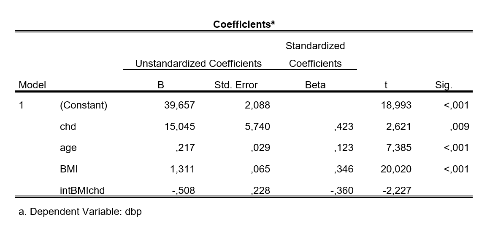
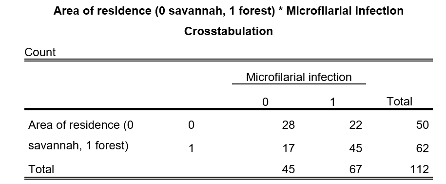
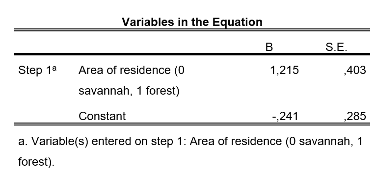
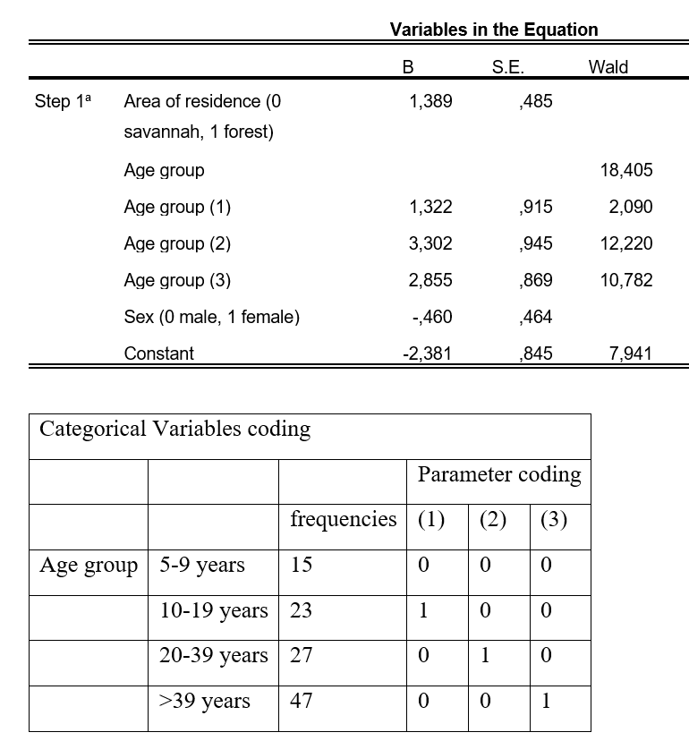

```{r global_options, include=FALSE}
library(emo)
library(tidyverse)
library(broom)
library(infer)
library(santoku)
library(car)
library(GGally)
library(modelsummary)
library(easystats)
library(table1)
library(gt)
library(datawizard)
library(marginaleffects)

knitr::opts_chunk$set(echo = FALSE, 
                      fig.align = "center", 
                      # fig.height = 3, 
                      # fig.width = 5,
                      warning = FALSE, 
                      message = FALSE, 
                      eval = FALSE)


```

## Comparing groups. 

1. Treated with In Vitro Fertilisation (IVF), women between 30 and 35 years old have a probability of success (becoming pregnant) of 0.4. Ten women between 30 and 35, all independent of each other, will be in the IVF program next year. What is the probability that exactly 4 of them will become pregnant? [3]

```{r}
dbinom(4, 10, 0.4)
```


:::{#boxedtext}

See some hints below
:::


This is an example for a question about the binomial distribution. Where we have a $N$ [bernoulli trials](https://en.wikipedia.org/wiki/Bernoulli_trial), each trial can end in a `success` or `failure`, and each trial has the same probability of `success`: $p$. 

The probability that **exactly** $n$ successes out of $N$ trials can be calculated in R using the following command: 

```{r ex-01, echo=TRUE, eval=FALSE}
dbinom(n, N, p)

```

So for example, if 50 women are giving birth, and we consider giving birth to a baby girl is a success with probability $p=0.49$, the probability of exactly 25 baby girls out of 50 births is `dbinom(25, 50, .49)`. 

The probability of 25 or more baby girls would be the sum


```{r ex-02, echo=TRUE, eval=FALSE}
dbinom(25, 50, 0.49) + 
  dbinom(26, 50, 0.49) +
  dbinom(27, 50, 0.49) + 
  ... + 
  dbinom(49, 50, 0.49) + 
  dbinom(50, 50, 0.49) 

```


It could also be written as `dbinom(25:50, 50, 0.49) |> sum()`.


2.	For 36 – 40 years old women, following this IVF program, the probability to become pregnant equals 0.3. Two women from this group, and one woman aged 32 are in the IVF program, all independent of each other. What is the probability that exactly two of these three women will become pregnant? [6]

```{r}
dbinom(2, 2, .3)*dbinom(0, 1, .4) + 
  dbinom(1, 2, .3)*dbinom(1, 1, .4)
```


:::{#boxedtext}

To answer this question, you need to add up two probabilities: 

-   The probability that the two women from the older group becomes pregnant (two successes in two trials) group multiplied the probability that the younger woman does NOT get pregnant (zero successes from one trial) `dbinom(__, 2, .3)*dbinom(__, 1, .4)`
-   The probability that the ONE woman from the older group becomes pregnant (one success in two trials) group multiplied the probability that the younger woman gets pregnant (zero successes from one trial) `dbinom(__, 2, .3)*dbinom(__, 1, .4)`
 
You will need to add up the two probabilities, and that is your final answer! 
 
:::


3.	 [Ophthalmologists](https://en.wikipedia.org/wiki/Ophthalmology) want to compare two types of eye drops, A and B, to prevent dryness of the eye. 44 volunteers with dryness problems in both eyes receive A in the one eye and B in the other. They evaluate both eye drops with a binary response ("helpful" or "not helpful").


```{r Ophthalmology, echo=FALSE, eval=TRUE}
library(gtExtras)

tribble(
  ~outcome_right,   ~outcome_left,    ~freq, 
  "helpful",         "helpful",        18,
  "helpful",         "not helpful",    15,
  "not helpful",     "helpful",        5,
  "not helpful",     "not helpful",    6,
) |> pivot_wider(id_cols = outcome_right, 
                 names_from = outcome_left, 
                 values_from = freq, 
                 names_prefix = "left eye_") |> 
  mutate(
    outcome = "right eye", 
    sum = `left eye_helpful` + `left eye_not helpful`
    ) |> group_by(outcome) |> 
  gt(rowname_col = "outcome_right")  %>% 
  tab_spanner_delim(
    delim = "_"
  ) |> 
  summary_rows(
    # groups = everything(),
    # columns = num,
    fns = list(
      total = "sum"
    )
  ) |> 
  gtExtras::gt_theme_espn()

```


4.	Another group of ophthalmologists also want to compare eye drops A with eye drops B, but they have patients with dryness in one eye only. What kind of study design and statistical test would you advise this group to use? [4]


```{r}

```


5.	In a certain population, systolic blood pressure (SBP) is normally distributed with a mean of 115 mm Hg and a standard deviation equal to 15 mm Hg. A random sample of 25 individuals was taken from this population. What is the probability that the mean SBP of this group will be smaller than 109 mm HG? [4]

:::{#boxedtext}

If we know that a variable has a normal distribution in the population with mean $\mu = mu$ and standard deviation $\sigma = sigma$, the probability of observing a result that is equal to $x$ or smaller can be calculated using `pnorm(x, mu, sigma)`. Remember that in this specific case we are taking a sample of 25 individuals, so the standard deviation of means would be normally distributed with the same mean as in the population, but the standard deviation would be $\sigma/\sqrt{n}$. 

:::


## Linear regression

Cariologists are interested in the relation between Diastolic Blood Pressure (dbp in mm Hg) on the one hand and several explanatory variables on the other. They collected data on 3154 individuals and performed a linear regression analysis. The binary variable “chd” (chronic heart disease) is coded 0 (no) and 1 (yes). Age is measured in years and BMI (Body Mass Index) in kg/m2. The variable “intBMIchd” is calculated as the product of BMI and chd.

```{r Q2_lm, eval=TRUE}

```

6. The P-value in the last row was eliminated. Is the test in the last row significant? What null hypothesis is tested in this last row? [4]

7.	What is the estimated mean dpd for a 50 years old person with a BMI of 25 and without `chd`, based on this model? [3]

8.	What is the estimated mean dpd for a 50 years old person with a BMI of 30 and with `chd`, based on this model? [3]

9.	Draw, as accurately as possible, the estimated relationships between BMI and dbp for 60 years old individuals with and without `chd` ~~in the separate sheet. Do not forget to put your name on this sheet.~~ [4]

10.	The variable `Smokecat` is a categorical variable with three categories: 0 : 0 cigarettes, 1: 1 – 20 cigarettes a day, 2: more than 20 cigarettes a day. Dummy variables are created and added to the previous model to test if `Smokecat` is significant, given the other variables. Which test will be used to test the null hypothesis that `Smokecat` has no effect on `dbp`, given the other variables? [3]

11.	Let’s assume `Smokecat` was not significant and not added to the model. The cardiologists want to test if dbp depends on BMI in a quadratic way. What will the new model look like? 


## Logistic regression


In some countries in Africa, there is a high prevalence of Microfilarial infection (0 = no, 1 = yes). A study focused on several risk factors, one of them being "area of residence".


```{r Q3_OR, eval=TRUE}

```


12 Calculate the Odds Ratio of having Microfilarial infection for individuals living at the savannah compared to individuals living in the forest. [4]

13.	Also a simple logistic regression was performed. Check the OR you calculated in the previous question using the information in the table below. What is your conclusion? [4]

```{r Q3_logit, eval=TRUE}

```


14.	Calculate the 95% confidence interval for the OR, based on the coefficient in the table of the simple logistic regression. [4]


```{r ex14}

mdl <- data.frame(x = rbinom(1000, 1, .5)) |> 
  mutate(y = rbinom(1000, 1, plogis(-.5 + x))) |> 
  glm(y ~ x, data = _, family = binomial) 
mdl |> broom::tidy() 
library(aod)

wald.test(b=coef(object=mdl), Sigma=vcov(object=mdl), Terms=c(1,2))
7.70^2

```


```{r Q3_logit_2, eval=TRUE}

```


15. What is the Wald value of Area of residence in this model? [3]


:::{#boxedtext}

There is a slight difference between the test statistic we use in R and the Wald statistic, in that the test statistic we use is simply the ratio of the estimate and the standard error. The square of that ratio is the Wald statistic. In order to calculate the Wald statistic, simply take the ratio and square it.

:::


16.	Is sex a significant variable in this model? [4]


:::{#boxedtext}

To answer the question, simply take the square root of the Wald statistic and compare it to the critical value of a 5% significance test.

:::

17.	Which age group has the highest risk according to this model? [4]
18.	How can we test if this model fits the data? [3]
