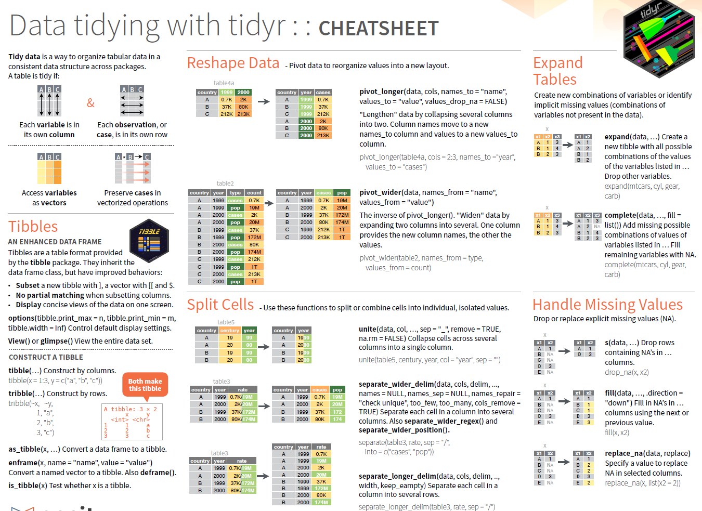
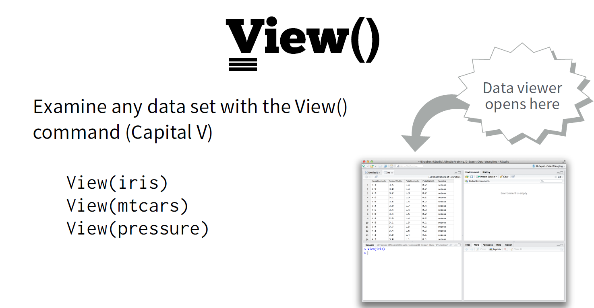
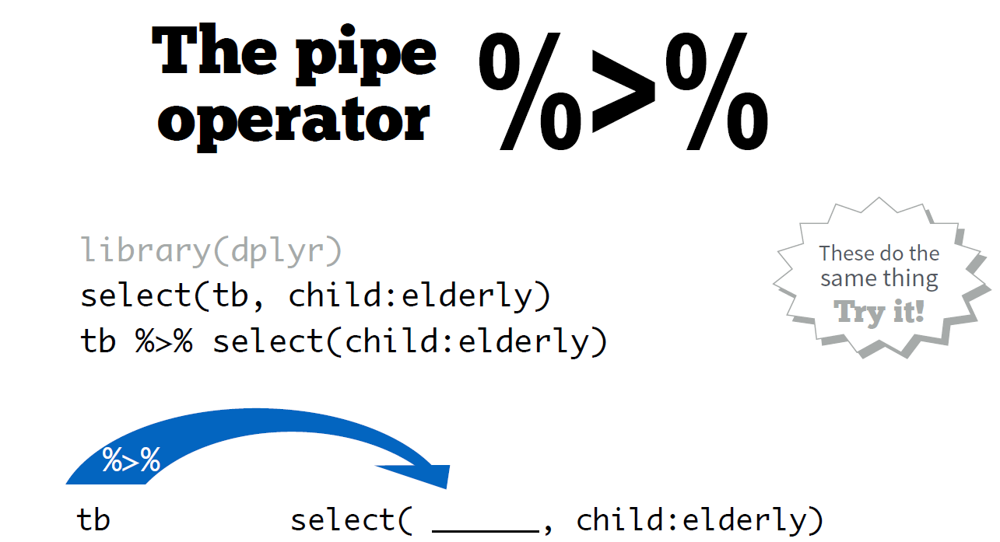
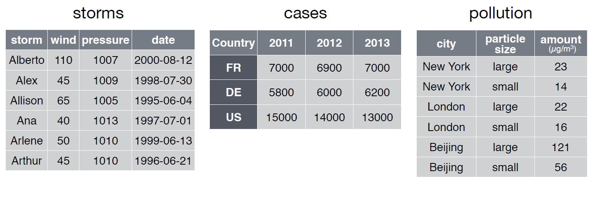
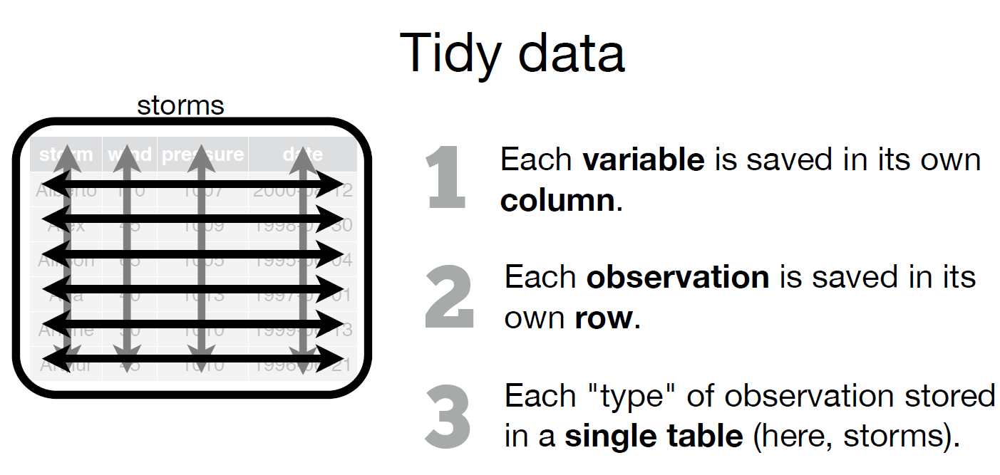
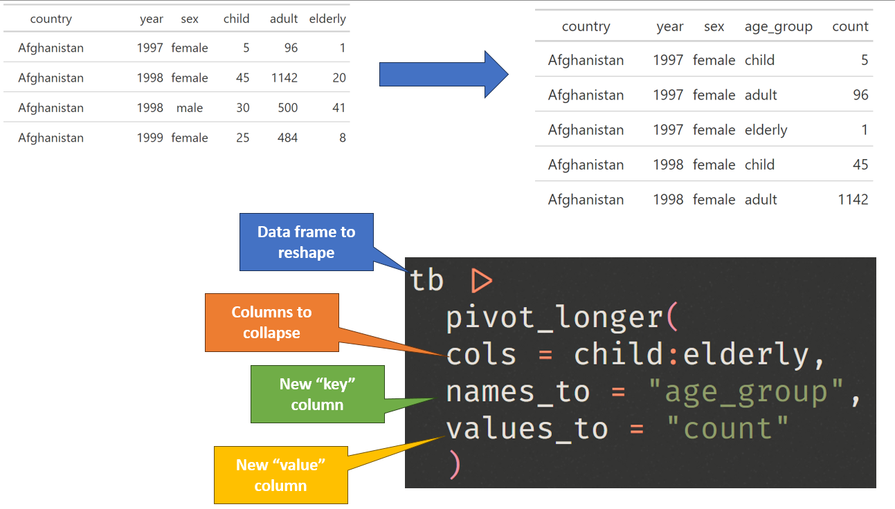
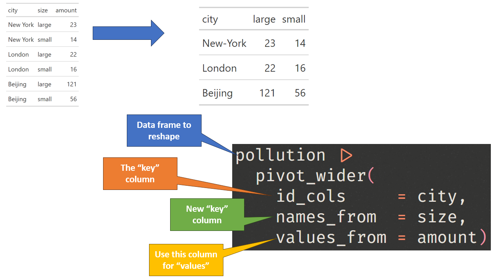
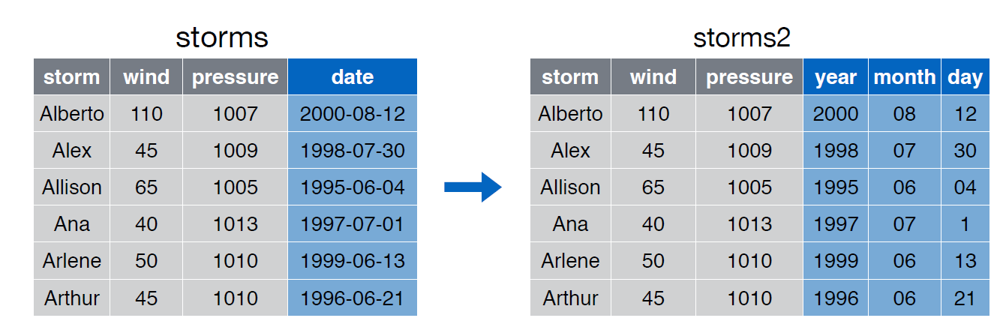
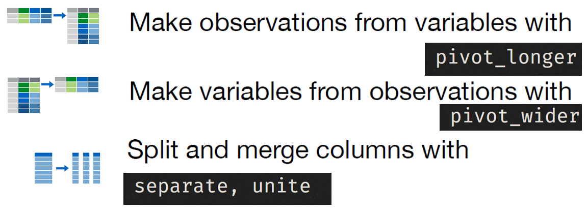

```{r global_options, include=FALSE}
library(tidyverse)
library(EDAWR)
library(broom)
library(readr)
library(scales)
library(gt)


knitr::opts_chunk$set(echo = FALSE, 
                      fig.align = "center", 
                      # fig.height = 3, 
                      # fig.width = 5,
                      warning = FALSE, 
                      message = FALSE)


```


Data wrangling is a crucial step in the data analysis process, involving the **transformation**, **cleaning**, and **preparation** of raw data into a format that is suitable for analysis and visualization. R, a powerful programming language for data analysis and statistics, offers a suite of libraries within the tidyverse ecosystem that streamline and simplify this data manipulation process.

The tidyverse is a collection of R packages, including dplyr, tidyr, ggplot2, and others, that share a common philosophy and syntax for data manipulation. This suite of packages provides a cohesive and efficient framework for working with data, making it easier for data analysts and scientists to explore, reshape, and analyze datasets.

In this introduction to data wrangling using R's tidyverse suite, we will explore some of the fundamental concepts and techniques for data manipulation, highlighting the key functions and workflows that enable you to clean, transform, and prepare data for meaningful analysis. Whether you are a beginner or an experienced R user, the tidyverse's consistent and intuitive approach to data manipulation can help you become more productive and effective in your data wrangling tasks.

Data wrangling has two main goals: 

- Make data suitable to use with a particular software
- Reveal information in your data

A good reference for data wrangling with R is the [data-wrangling cheat-sheet](https://bit.ly/3vDp74k){target="_blank"}. 


You will find all the work-space for your lab on posit cloud [using this link](https://bit.ly/3S4hCL0){target="_blank"}.


```{r img-tidyr-cheetsheet}

```

## Review of basic R commands

Let's start by exploring the view command

```{r img-view}

```


Now load the Tubercolosis dataset into the `tb` object. 


```{r read_tb, echo=TRUE}
tb <- read_rds("data/tb.rds")

```

Now try to run the following two commands and figure out what they are doing? 

```{r img-pipe}

```

1. The code in the figure shows two ways of using the `select` command. The first does not use a pipe, and the second uses a pipe. Run the two commands in the code-chunk below. What is the difference in the output between these two methods? Which method is better, and why? 

## The pivot functions

The `pivot_longer` and `pivot_wider` functions in the dplyr package are  tools for reshaping and transforming data frames. They allow you to convert data between wide and long formats, making it easier to work with various types of data and facilitate downstream analysis and visualization. 


:::{#boxedtext}

DATASETS come in many formats...

... but R prefers one type of format...

:::


```{r img-edawr-datasets}

```


```{r img-tidy-str}

```


Let's try to re-create a small snippet of the `cases` dataset. 

```{r create-cases, echo=TRUE, eval=FALSE}
tribble(
  ~country, ~`2011`, ~`2012`, ~`2013`, 
  "FR",       7000 ,   6900 ,   7000 ,
  "DE",       5800 ,   6000 ,   6200 , 
  "US",      15000 ,  14000 ,  13000
)

```

### Pivot longer

2. Use the code above to create a tidy dataset, based on the information shown above. CLUE: The new dataset will have three variables: `country`, `year` and `n`.


Of course, there is an automatic way to do this! Fill in and run the following code:

```{r pivot_wider_show, eval=FALSE, echo=TRUE}
tribble(
  ~country, ~`2011`, ~`2012`, ~`2013`, 
  "FR",       7000 ,   6900 ,   7000 ,
  "DE",       5800 ,   6000 ,   6200 , 
  "US",      15000 ,  14000 ,  13000
) |> 
  pivot_longer(
    cols = __:__)
```

```{r pivot_longer_noshow, eval=FALSE}
tribble(
  ~country, ~`2011`, ~`2012`, ~`2013`, 
  "FR",       7000 ,   6900 ,   7000 ,
  "DE",       5800 ,   6000 ,   6200 , 
  "US",      15000 ,  14000 ,  13000
) |> 
  pivot_longer(
    cols = 2:4, 
    names_to = "year", 
    values_to = "n")

tb |> filter(child>0) |> 
  gt::gt()

tb |> 
  pivot_longer(
  cols = child:elderly,
  names_to = "age_group", 
  values_to = "count"
  ) 


```

To specify the names of the columns, you will need to use the names_to and values_to arguments. Try it!

```{r pivot_longer_show2, eval=FALSE, echo=TRUE}
tribble(
  ~country, ~`2011`, ~`2012`, ~`2013`, 
  "FR",       7000 ,   6900 ,   7000 ,
  "DE",       5800 ,   6000 ,   6200 , 
  "US",      15000 ,  14000 ,  13000
) |> 
  pivot_longer(
    cols = __:__, 
    names_to = "__", 
    values_to = "__")
```


```{r img-pivot-long}

```

### Pivot wider

3. Let's try to re-create a small snippet of the `pollution` dataset. Now re-create the tidy form of this dataset. CLUE: Use three variables: `city`, `large`, `small`. 

```{r create-pollution, echo=TRUE, eval=FALSE}
tribble(
  ~city,       ~size,   ~amount, 
  "New-York",  "large",   23, 
  "New-York",  "small",   14, 
  "London",    "large",   22, 
  "London",    "small",   16, 
  "Beijing",   "large",   121, 
  "Beijing",   "small",    56
)

```

4. Now use the `pivot_wider` function to transform the data-set automatically! Fill in the code below and run it. 

```{r create-pollution2, echo=TRUE, eval=FALSE}
tribble(
  ~city,       ~size,   ~amount, 
  "New-York",  "large",   23, 
  "New-York",  "small",   14, 
  "London",    "large",   22, 
  "London",    "small",   16, 
  "Beijing",   "large",   121, 
  "Beijing",   "small",    56
) |> 
  pivot_wider(
    id_cols     = ___, 
    names_from  = ___, 
    values_from = ___)

```


```{r pivot_wider_noshow, eval=FALSE}

tribble(
  ~city,       ~size,   ~amount, 
  "New-York",  "large",   23, 
  "New-York",  "small",   14, 
  "London",    "large",   22, 
  "London",    "small",   16, 
  "Beijing",   "large",   121, 
  "Beijing",   "small",    56
) |> 
  pivot_wider(
    id_cols = city, 
    names_from = size, 
    values_from = amount) |> 
  gt::gt()


pollution |> 
  pivot_wider(
    id_cols     = city, 
    names_from  = size, 
    values_from = amount)

pollution |> 
  gt()

pollution |> 
  pivot_wider(
    id_cols = city, 
    names_from = size, 
    values_from = amount) |> 
  gt::gt()


```


```{r img-pivot-wider}

```

### `unite` and `separate`

The dataset `storm` has one variable `date` that is effectively composed of three variables: `year`, `month` and `storm`. 

5. Load the `storms` dataset to separate the `date` variable into the three variables: `year`, `month` and `storm`. 

```{r load-unite, eval=FALSE}
# EDAWR::storms |> 
#   write_rds("data/storms.rds")

storms |> 
  separate(
    date, 
    c("year", "month", "day"), 
    sep = "-"
    )

```


```{r img-unite-separate}

```


### Recap: pivoting

```{r img-recap_pivot}

```

## Case study: Storms

For this part of the lab, please go to [this tutorial](https://bit.ly/4aSQAzb) and complete it. 


## Case study: Diamonds


In this case study, you’ll use functions from dplyr and ggplot2 to explore the `diamonds` data set, which contains the prices and other attributes of almost 54,000 diamonds. 

**Run the two lines of code below to view the data set:**

```{r diamonds, echo=TRUE, eval=FALSE}
diamonds
glimpse(diamonds)
```

6. What do the variables `x`, `y` and `z` refer to? 

```{r longer, eval=FALSE}
diamonds |> 
  pivot_longer(
    x:z, 
    names_to = "dimension", 
    values_to = "mm") |> 
  select(-table, -depth)


```


In this case study, we want to answer the following questions: 

* How are price and carat related?
* Which diamonds are the most expensive, based on cut and color?


### Exploring diamonds 

Plotting is one of the quickest ways to visualize and explore data. 

7. Use `ggplot()` to create a histogram of `price`. Use `binwidth = 1000` to set the width of each bar to 1000.  


8. The following figure was created by creating a logarithmic `x-axis`. Try to replicate it and explain what is the advantage of a logarithmic x-axis. Npte: add a vertical line that marks the median price value by layering `geom_vline(xintercept = median(diamonds$price))` on top of the plot. Where does the median price value lie?

```{r diamonds-log-price}
diamonds |> 
  ggplot(aes(price)) + 
  geom_histogram(binwidth = 1000) + 
  geom_vline(xintercept = median(diamonds$price), col = "red")

diamonds |> 
  ggplot(aes(price)) + 
  geom_histogram(binwidth = 0.2) + 
  geom_vline(xintercept = median(diamonds$price), col = "red")+
  scale_x_log10() + 
  theme_minimal()
```

### Exploring carat

The carat or weight of a diamond is one of its most important attributes. One carat is approximately equal to 0.2 g. 

9. Create another histogram that displays the distribution of `carat` in the data set using `binwidth = 0.01`. Add a vertical line that marks the median carat value by layering `geom_vline(xintercept = median(diamonds$carat))` on top of the plot. Where does the median carat value lie?
 
```{r diamonds-price, eval=FALSE}
diamonds %>% 
  ggplot(aes(carat)) + 
  geom_histogram(binwidth=0.01) + 
  geom_vline(xintercept = median(diamonds$carat), col = "red")
```

The carat of a diamond has a significant impact on its price. Since both `carat` and `price` are numerical variables, we can create a scatter plot to explore their relationship.

10. Create a scatter plot with `carat` on the x-axis and `price` on the y-axis.


11. In the previous plot, `geom_point()` plotted many points on top of each other, making it difficult for us to understand where most of the data lies. **Try using `geom_hex()` instead of `geom_point()` to make a more effective plot.**


```{r carat-price-hex}
diamonds |> 
  ggplot(aes(carat, price)) + 
  geom_hex() + 
  scale_fill_viridis_c(
    trans="log",
    breaks = exp(seq(0,8,2)), 
    labels = c("1", "e^2", "e^4", "e^6", "e^8")) + 
  theme_minimal() + 
  scale_y_log10(
    breaks = c(300, 1000, 3000, 5500, 10000, 18000), 
    labels = label_number(scale_cut = cut_short_scale(), suffix = "$")) +
  theme(legend.position = "bottom") 

```

This graph shows not only that the larger the carat, the higher the price, but also that the variation in the price increases. For example,a diamond of half a carat would cost no more than about 5,000\$, but a diamond of 2 carat would cost anything between about 5,500\$ and about 18,000\$. 


### Cut and Color


There are many factors that determine the price of the diamond, including cut and color. In this data set, diamond colors are labeled D through J, where D represents a colorless or white diamond and J is slightly colored. Typically, the less color a diamond has, the higher its value. 

12. Use `diamonds` to display median price and median carat by `color`. Your resulting tibble should have two columns: `color` and `median_price` and `median_carat`.

```{r cut-color}

diamonds |> 
  summarise(
    `median_price` = median(price), 
    `median_carat` = median(carat), 
    .by = "color"
    ) |> 
  gt() |> 
  fmt_currency(columns = `median_price`)

```


:::{#boxedtext}

Notice diamonds of color J are the most expensive, even though they are slightly colored. What do you think could explain this? 

:::


Color and carat alone does not determine the price of a diamond. Another important attribute of a diamond is its cut, which can range from fair to ideal. Typically, the better the cut of a diamond, the higher its price. 


13. How many diamonds of each cut are present in `j_diamonds`? Re-create the following table displaying the answer:

```{r j-diamonds-cut-display, echo=FALSE}
diamonds %>% 
  filter(color == "J") %>%
  count(cut) |> 
  gt(caption = "J diamonds: cuts")
```


Most of the J diamonds have a premium or ideal cut, which could explain why J diamonds are highly priced. 
