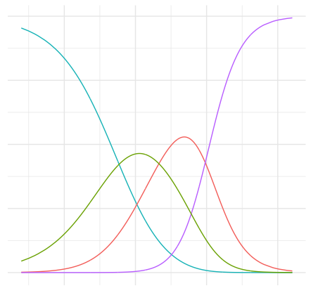

```{r global_options, include = FALSE}
knitr::opts_chunk$set(eval = TRUE, results = "as.is", fig.align = "center", message = "false", echo="false")
library(tidyverse, quietly = TRUE)
conflicted::conflicts_prefer(dplyr::filter, dplyr::lag, .quiet = TRUE)
library(emo)

```


<span style="color: red;font-size: 14px;font-weight: bold;">DEADLINE  24-March-24. 
<br/>Please submit your final report [using this form](https://forms.gle/tv1QDTshLHe1zrix6). </span>


In this lab you will prepare a  **brand new** lab that could be used for the next generation of students in the course! You will apply what you’ve learned, using R  and regression analysis to investigate a question that interests you or your group. This question may come from one of other courses, your research interests, your future career interests, etc. The lab will consist of at least 5 - 7 thoughtful questions for students, as well as your proposed answers. 


<div style="float: right;width: 350px;margin: 5px 5px 5px 5px">
```{r img-logistic, echo=FALSE, eval=TRUE, fig.align='center'}

```
</div>


## Data 

You can either begin with the question of interest or you can browse for datasets until you stumble across something interesting. As you’re looking for data, keep in mind your regression analysis must be done in R Studio. Once you find a data set, you should make sure you are able to load it into R Studio, especially if it is in a format we haven’t used in class before. If you’re having trouble loading your data set into R Studio, ask for help as soon as possible, so you can make any necessary adjustments before the project proposal is due.

In order for you to have the greatest chance of success with this project it is important that you choose a manageable dataset. This means that the data should be readily accessible and large enough that multiple main effects and interactions can be explored for your model. As such, your dataset must have at least 100 observations and at least 10 variables (exceptions can be made but you must speak with me first). The data set should include both quantitative and categorical variables.


### Data Sources of Interest


[Rdatasets](https://vincentarelbundock.github.io/Rdatasets/articles/data.html) is a collection of 2264 datasets which were originally distributed alongside the statistical software environment R and some of its add-on packages. The goal is to make these data more broadly accessible for teaching and statistical software development.

[Kaggle](https://www.kaggle.com/datasets?search=Health) is a data science competition platform and online community of data scientists and machine learning practitioners under Google LLC. Kaggle enables users to find and publish datasets, explore and build models in a web-based data science environment, work with other data scientists and machine learning engineers, and enter competitions to solve data science challenges

[ICPSR](https://www.icpsr.umich.edu/icpsrweb/ICPSR/) 
An international consortium of more than 750 academic institutions and research organizations, ICPSR (Inter-university Consortium for Political and Social Research) provides leadership and training in data access, curation, and methods of analysis for the social science research community. Some datasets are readily available for R, but many will require some processing or conversion.


Other options include [Our World in Data](https://ourworldindata.org/) and [Data world](https://data.world/datasets/epidemiology), a centralized data catalog platform. There are plenty of other resources, try searching the web for publicly available datasets!


## Components of your output

Your output should include the following sections (make sure the code is available and that it could be hidden or shown as necessary). 

### Section 1 - Introduction

Introduce the background to the data, a reference to it (use a [hyperlink](https://bookdown.org/yihui/rmarkdown/markdown-syntax.html) to the resource you are using!) and describe the research question(s) relevant research questions. Give a motivation for the question by making the case for why anyone would care about it (here you may want to cite relevant literature). Optionally, you could suggest hypotheses regarding your question of interest. 

Place your data in the /data folder, and give an initial description of the data, providing its dimensions (number of observations and variables) and the data dictionary (a description of every variable in the dataset). Describe each of tthe variables you will be using. 

### Section 2 - Exploratory Data Analysis (EDA) 

In this section, you will ask the students to explore their data set, using `table1`, `ggpairs` and / or visualisations using `ggplot` graphs (scatter-plots, box-plots etc.). Including summary statistics and visualizations, along with some explanation on how they help you learn more about your data. 

 
 
### Section 3 - Regression analysis 

This section includes the results of your final regression model(s). In addition to displaying the model output, you should include a brief description of why you chose that type of model and any interpretations/ interesting findings from the coefficients. You should also include a discussion of the model assumptions, diagnostics and model fit analysis (comparison between a couple of models and explanation of which model is the best).

This section should be very clear about:

-   Description of the response variable and its variable type (continuous or binary)
-   Description of the predictor variables and the population coefficients you wish to understand using statistical inference
-   Description of any variables relevant to the analysis

### Section 4: Discussion & Conclusion

This section should include any relevant predictions and/or conclusions drawn from the model. Also critique your own methods and provide suggestions for improving your analysis. Issues pertaining to the reliability and validity of your data and appropriateness of the regression analysis should also be discussed here. A paragraph on what you would do differently if you were able to start over with the project or what you would do next if you were going to continue work on the project should also be included.

Finally, summarize your project and highlight any final points you wish the reader to get from the project. You may also discuss any other models you tried, a check of the assumptions, and a brief explanation of why you didn’t select the models.
 
## Two types of activity for students
 
Two ideas for activities and questions for your students could include `recreation` and `extension`: 

- `Recreation`: create a nice looking table, image or a plot and ask students to recreate it. Try to predict where they might get stuck and provide just enough guidance for them to proceed (but not too much!)
- `Extension`: Starting from the recreation above, ask your students to extend the table or plot in their own creative way. Give specific ideas on how they might do the extension, which plots/tables they might want to consider, what colors or themes to use and where to find the resources needed


## Evaluation 

The project will be evaluated based on the following criteria:

-   Consistency: Is there a consistent theme running through your lab? Are the different parts integrated?
-   Clarity: Can the audience easily understand your questions and what they have to do in order to answer them?
-   Relevance: Did you use the appropriate statistical techniques to address your question? Was your analysis thorough (e.g. did you consider interactions in addition to main effects?)?
-   Engaging content: Did you attempt to answer a challenging and interesting question rather than just calculating a lot of descriptive statistics and simple linear regression models?
-   Organization: Is your write up and presentation organized in a way that is neat and clear for the audience to understand?


------------------------------------------------------------------------

## Acknowledgement

This lab was adapted from the Duke University's course [stat210](https://www2.stat.duke.edu/courses/Spring19/sta210.001/project/project.html) 

<a rel="license" href="http://creativecommons.org/licenses/by-sa/4.0/">{style="border-width:0"}</a><br />This work is licensed under a <a rel="license" href="http://creativecommons.org/licenses/by-sa/4.0/">Creative Commons Attribution-ShareAlike 4.0 International License</a>.
