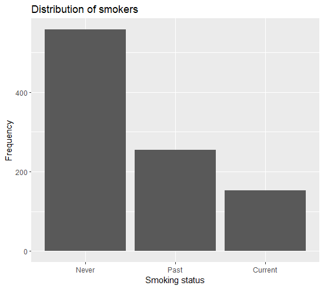
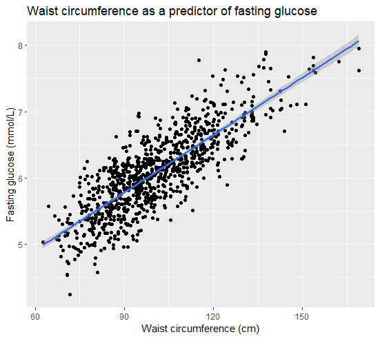

Levels of fasting glucose are measured using blood drawn following a fast. This indicator is used as a criteria used to diagnose Type 2 diabetes. An individual can be [classified](https://www.mayoclinic.org/diseases-conditions/type-2-diabetes/diagnosis-treatment/drc-20351199) as "normal", "pre-diabetic" or "diabetic" according to the following standards:

-   `normal` if their fasting glucose is less than 5.6 mmol/L
-   `pre-diabetic` if their fasting glucose is between 5.6–6.9 mmol/L
-   `diabetic` if their fasting glucose is at least 7 mmol/L on two separate tests, respectively

The code below investigates the distribution of fasting glucose (mmol/L) using **artificial and simulated** data for purposes of demonstration only.


```{r setup, include = FALSE}
# Load your packages here

```

## Visualize data

In this lab you'll use `ggplot2` to visualize the distribution of applicant smoking statuses. If you need a refresher for using `ggplot`, you can have a look at [this tutorial](https://www.youtube.com/watch?v=xnVBAwsEpJo), for example.

## Recreation 1: distribution of smoking habits

Run the code chunk below to see a plot.

```{r recreate-this-1, include = FALSE}

```

First, load the data from the data file `nhanes_fg_sim.Rdata`, which is saved in the `data/` folder in your working directory. Once you load the file you will see a new data frame in your environment panel. The name of the data frame is `fg_sim`.

Then, use `ggplot() + geom_bar()` to recreate the bar blot shown above. Inside its brackets, the `ggplot()` function will need two arguments:

-   The dataset
-   A mapping between the `x` coordinate and the `smoker` variable

You can then use the `labs` layer to change the title of the plot, as well as the title of the `x` and `y` axis.

Write your code in the chunk below:

```{r recreation-1}

```


## Recreation 2: Fasting glucose vs. waist (scatter plot)

We will now try to recreate the following scatter plot, showing the link between the 

```{r recreate-this-2, include=FALSE}

```

To create the scatter plot we will need to do three things differently: 

-   First, instead of a `geom_bar` layer we will use a `geom_point()`. 
-   Second, whereas the `geom_bar` required only to map the `x` coordinate, the `geom_point` will need both the `x` and the `y`.
-   Third, add the `geom_smooth()` layer to create a straight line that runs through the data points. 

Try your code in the chunk below. Don't forget to change the :

```{r recreation-2}

```


## Recreation 3: Fasting glucose distribution for waist strata (boxplot) 

Finally, we want to divide the observations into five strata of waist circumference. 

-   The first strata will include 20% "skiniest" individuals with the lowest waist circumference, 
-   The second strata will include the next 20% etc...

For each strata, we will use a boxplot to show the distribution of fasting glucose for that each strata separately. If you are not sure how to interpret a boxplot, please run the code below:


```{r explain-boxplot, include = FALSE}
knitr::include_graphics("images/Explaining-boxplot.png")
```

To create our boxplots, we will need to map the `x` axis to the `w_strata` variable and to use the `geom_boxplot` layer. Try to create the diagram below


```{r recreate-this-3, include = FALSE}
knitr::include_graphics("images/recreate-03.png")
```

Write your code in the chunk below:

```{r recreation-3}

```


## Extension

For your extension, consider making additional plots to visualize other variables in the data set. You could explore a variety of questions, for example, you might want to explore the relationship between smoking and waist circumference. You could also explore other types of layers such as `theme_bw()`, or you might want to add new variables such as the diabetes status (normal, pre-diabitic or diabetic).

Experiment using your imagination and write your code in the following chunk:

```{r extension}

```
