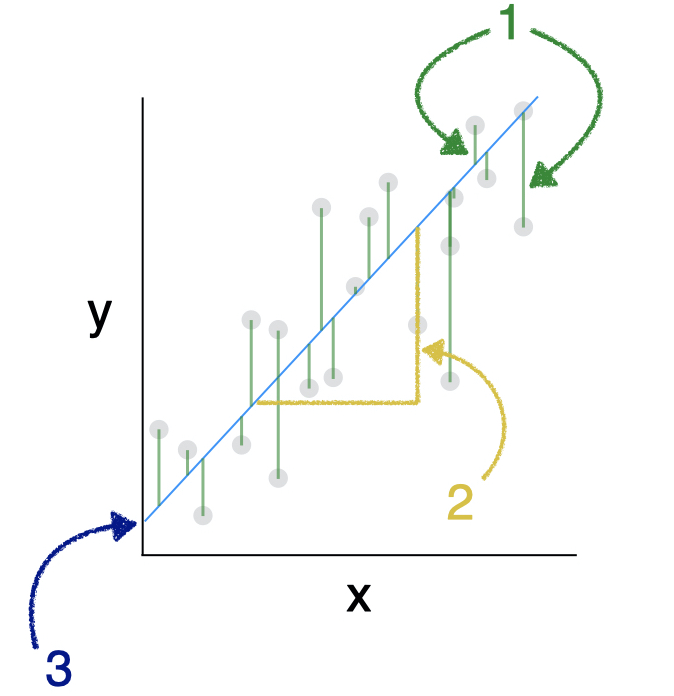
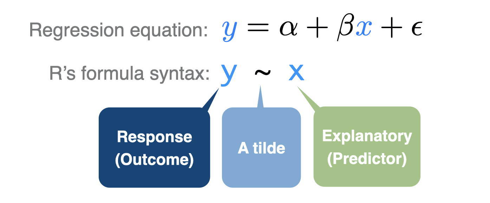
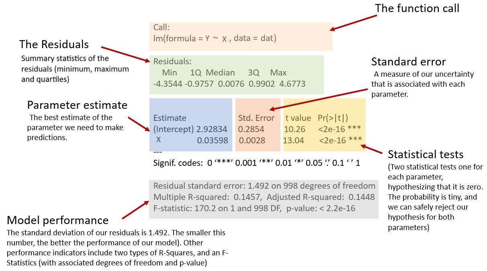

```{r global_options, include=FALSE}
library(emo)
library(tidyverse)
library(broom)
library(infer)
library(santoku)
library(car)


knitr::opts_chunk$set(echo = FALSE, 
                      fig.align = "center", 
                      fig.height = 3, 
                      fig.width = 5,
                      warning = FALSE, 
                      message = FALSE)


```


<span style="color: red;font-size: 14px;font-weight: bold;">GROUP WORK - DEADLINE 27th of October. 
<br/>Please submit your final report [using this form](https://forms.gle/JB5c9apmkx3wD8WG7). </span>


<div style="float: right;width: 200px;margin: 5px 5px 5px 5px">
```{r img-regression-labeled, echo=FALSE, fig.align='center'}

```
</div>


```{r prep-lab, eval = FALSE}
cor2data <- function(cor, n, seed){
  # number of observations to simulate
  nobs = n
  # cor <- matrix(cbind(1, 0.001, 0.001, 1), nrow=2)
  # rownames(cor) <- colnames(cor) <- c("x1",  "e")
  # Cholesky decomposition
  U = t(chol(cor))
  nvars = dim(U)[1]
  
  if(missing(seed)) {
    
  } else {
    set.seed(seed)
  }
  
  # Random variables that follow the correlation matrix
  rdata = matrix(rnorm(nvars*nobs,0,1), nrow=nvars, ncol=nobs)
  X = U %*% rdata
  # Transpose, convert to data
  # require(tidyverse)
  Data = t(X)
  Data = as.data.frame(Data)
  return(Data)
}

vars <- c("x1",  "e")
Cor <- matrix(cbind(1, 0.001,
                    0.001, 1), nrow=2)
rownames(Cor) <- colnames(Cor) <- vars

df <- cor2data(Cor, 1000, 8675309) %>% as_tibble() # Jenny I got your number...
df |> 
  mutate(y = 1 + x1 + 0.5*e) |> 
  mutate(quantile = chop_equally(x1, 6, labels = 1:6)) -> df

glimpse(df)

# The quantiles
df |> 
  group_by(quantile) |> 
  summarise(n())

df |> ggplot(aes(quantile, y, color = quantile)) + 
  geom_violin(alpha=.6) + 
  geom_jitter(alpha=.6) 

# Show the model
m1 <- lm(y ~ x1, data = df)
summary(m1)
# Interpret the two parameters
# Explain the degrees of freedom
# Explain the residual standard error
# Interpret the R squared
# Interpret the F-statistic 


# Scatterplot with linear regression
df |> ggplot(aes(x1, y)) + 
  geom_point(alpha=.6, aes(color = quantile)) + 
  geom_smooth(method = "lm")

mean.x1 <- mean(df$x1)
mean.y1 <- mean(df$y)

# Show that it is passing through the middle
df |> ggplot(aes(x1, y)) + 
  geom_point(alpha=.6, aes(color = quantile)) + 
  geom_point(x = mean.x1, y = mean.y1, size = 4) + 
  geom_smooth(method = "lm")


# Show that the sum of the residuals is zero and that x is uncorrelated with the residuals
augment(m1) |> 
  summarize(sum.resid = sum(.resid))
cor_test(x1 ~ .resid, data = augment(m1))

# Diagnostics 
plot(m1, which = 1)
plot(m1, which = 2)
plot(m1, which = 3)
plot(m1, which = 4)
plot(m1, which = 5)
plot(m1, which = 6)


######################
# nhanes
load("data/nhanes1718_adult_fast_sub_rmph.RData") 
nhanes_adult_fast_sub |> 
  select(LBDGLUSI, BMXWAIST, RIAGENDR, smoker) |> 
  mutate(fast_gluc = LBDGLUSI, waist = BMXWAIST, gender = RIAGENDR, smoking = smoker, .keep = "none")  -> nhanes
readr::write_rds(nhanes, "data/nhanes.rds")

nhanes <- read_rds("data/nhanes.rds")

```

In general, a regression analysis estimates the association between an outcome  $Y$ and one or more predictors $X_1, X_2,\ldots,X_k)$. We use Least Square Linear Regression when the outcome   $Y$ is continuous. 

The term simple linear regression (SLR) is typically used for the setting where there is only one outcome $Y$ and one predictor $X$ and that predictor. 

The data consist of $n$ independent observations ($n$ rows of data), containing the values of the outcome $Y$ and the predictor $X$. The data for the $i_{th}$ observation (or individual, or case) are denoted $(x_i, y_i)$. Each observation has an associated outcome value and predictor value. Equation (1) describes the simple linear regression model for a predictor $X$:


$$
Y_i = \beta_0+\beta_1X_i+\epsilon_i
$$

where $\beta_0$ and $\beta_1$ are the slope and intercept, respectively, the UNKNOWN parameters of the best fit line for the population. $\epsilon$ is the error term, or the residual, which is assumed to have a normal distribution with the same variance no matter what $X$ is. The standard deviation of $\epsilon$ is also known as the residual standard error or the Root Mean Standard Error (RMSE), and is a measure of uncertainty associated with the model. The smaller the RMSE, the better the performance of our model. 

You will find all the work-space for your lab on posit cloud [using this link](TBD). 

### Creating a reproducible lab report

We will be using R Markdown to create reproducible lab reports. In RStudio, you will find the file `lab-04.Rmd` in the `Files` panel. Double click it to show the script in the code panel.

-   In the file, update the YAML with your name, the date and the name of the lab.
-   Load the `tidyverse`, `broom`, `car` and `infer` package.
-   knit your file to see that everything is working. 


## Using a toy dataset

Real data is messy and rarely meets the various assumptions needed to run a simple linear regression. It is for that reason, that in this section we will use a 


## Diabetes and fasting  glucose


<div style="float: right;width: 200px;margin: 5px 5px 5px 5px">
```{r img-CDC_diabetes, echo=FALSE, fig.align='center'}

```
</div>

Levels of fasting glucose, measured using a blood draw following a fast, are one criteria used to diagnose Type 2 diabetes. An individual [is classified](https://www.mayoclinic.org/diseases-conditions/type-2-diabetes/diagnosis-treatment/drc-20351199) as: 

-   **normal** if their fasting glucose less than 5.6 mmol/L, on two separate tests, respectively.
-   **pre-diabetic** fasting glucose is between 5.6–6.9 mmol/L, on two separate tests, respectively.
-   **diabetic** fasting glucose is at least 7 mmol/L on two separate tests, respectively. 

In this lab, we will model the fasting glucose (mmol/L) using data from adults aged 20 years old or more. The data is taken from the the [National Health and Nutrition Examination Survey (NHANES)](https://www.cdc.gov/nchs/nhanes/about_nhanes.htm), a survey designed to "assess the health and nutritional status of adults and children in the United States." The study began in the 1960s and since 1999 has has been conducted in 2-year cycles (e.g, 1999-2000, 2001-2002). 
  
The data-set we use is stored in `nhanes.rds`. It contains a random sub-sample of 1,000 adults who had blood drawn after fasting. We will run some exploratory analysis, investigating the distribution of fasting glucose, and how its mean varies with waist circumference (a continuous predictor) and with smoking levels.

Load the `nhanes.rds` data set into your workspace, and save it as `nhanes`. Notice that this time the file you are reading has an `rds` extension. You will therefore need to use the `read_rds("data/nhanes.rds")` function to read it.


1. We can visualize the distribution of the fasting glucose using a histogram. Recreate the plot below using the `ggplot()`, `geom_histogram()` and `labs()` and any other  layers you think are appropriate, and comment on the distribution and the appropriateness of the linear model. 

```{r fg-hist, results='asis'}
nhanes <- read_rds("data/nhanes.rds")
nhanes |> 
  ggplot(aes(fast_gluc)) + 
  geom_histogram(binwidth = .1) + 
  labs(x = "fasting glucose (mmol/L)") + 
  theme_minimal() 

```


2. Recreate the plot below using the `ggplot()`, `geom_point()`,  `geom_smooth(method = "lm")` and any other  layers you think are appropriate. Comment on what you see: what is the association between waist and fasting glucose?


```{r fg-waist, results='asis'}
nhanes |> 
  ggplot(aes(waist, fast_gluc)) + 
  geom_point(alpha = .5) + 
  labs(
    y = "Fasting glucose (mmol/L)", 
    x = "Waist circumference (cm)"
    ) + 
  geom_smooth(method = "lm", se = 0) +
  theme_minimal() +
  # scale_y_log10() +
  theme(text = element_text(size = 12))  
 
```

The figure above illustrates the expected value of fasting glucose given waist circumference. The line in shows us how fasting glucose differs, on average, between individuals with different waist circumference.

In this example, the predictor variable is continuous. When the predictor is categorical, taking on only a few values, then rather than fit a straight line SLR estimates the mean outcome at each discrete level of the predictor.


3. Recreate the plot below, visualizing how the distribution of  fasting glucose depends on the smoking status. You may choose the `geom_boxplot()` layer or the `geom_violin()` layer. Comment on what you see: what is the association between smoking and fasting glucose?


```{r fg-smoke, results='asis'}
nhanes |> 
  ggplot(aes(smoking, fast_gluc)) + 
  geom_boxplot() + 
  labs(
    y = "Fasting glucose (mmol/L)", 
    x = ""
    ) + 
  scale_y_continuous(breaks = seq(2, 20, 2)) +
  theme_minimal() +
  theme(text = element_text(size = 14))  
 
```

You can imagine a line connecting the mean median glucose at different levels of smoking status in the figure. 

### A model with a continuous predictor


Now you are ready to use R to fit your first regression model! To fit a linear regression, use the `lm()` function (`lm` stands for "linear model"). The syntax is `lm(y ~ x, data = dat)` where `dat` is a data.frame containing variables with the names `y` and `x`. After fitting the model, use `summary()` to view the output.

```{r img-formula, out.width="60%"}



```


4.  Regress **fasting glucose** on the continuous predictor **waist circumference**. Assign the output of `lm()` to an object, in this case M1 (model 1). To print the results of your model, use the `summary(M1)` function. To print the confidence intervals of the estimations, use the `confint(M1)` function. 


```{r m-1-show, echo=TRUE, eval=FALSE}

M1 <- lm(___ ~ ___, data = ___)
summary(___)
confint(___)

```


```{r m-1-no-show, echo=FALSE, include=FALSE}

M1 <- lm(fast_gluc ~ waist, data = nhanes)
# summary(M1)
# confint(M1)

```

To understand the output, see the explanation below.  The `Estimate` column displays the estimated regression coefficients, the best fit regression line has consists of an estimate of the intercept and the slope.  

The `Coefficients` table also displays the standard error of each Estimate, its t value (= `Estimate`/`Std. Error`), and its p-value (labeled `Pr(>|t|`)). The `t value` tells you how many standard deviations away from 0 the estimate falls. 

-   The p-value for the intercept is usually not of interest, -   The p-value for the predictor tests the null hypothesis that the outcome has no association with the predictor or, equivalently, that the slope is zero. 

The null hypothesis is that there is no association between the outcome and the predictor.

5. Write down the formula for the fitted model, filling in the gaps with correct estimates: $Y = \underline{~~~~~} + \underline{~~~~~}\cdot X + e$. Then copy the blue boxed text below, filling the gaps with the appropriate numbers.

```{r img-lm-summary, out.width="85%"}



```

::: {#boxedtext}

The remainder of the summary indicates the following:

-   **Residual standard (SE) error**: The Residual standard error is ____. This is an estimate of $\sigma$, the standard deviation of the model error term.
-   **Residual SE degrees of freedom (df)**: The residual SE df is ____ and corresponds to the sample size minus the number of regression parameters. In this example, there are ____ regression parameters (the intercept and the slope). Adding, the sample size with no missing data is $963 + 2 = 965$. 
-   **Observations deleted**: A note that ____ observations  were deleted due to **missingness**. 
-   **Multiple R2**: The Multiple R-squared value ____, which is a measure of goodness of fit ranging from 0 (no association) to 1 (perfect linear association). It is interpreted as the proportion of variation in the outcome explained by the model. 
-   **Adjusted R2**: The Adjusted R-squared ____ is an alternative that penalizes R2 based on how many predictors are in the model, and therefore it is less than the Multiple R2. 
-   **Global F test**: The F-statistic of our model is _____. This statistic is used to test  the null hypothesis that **all** the coefficients other than the intercept are 0. For models with a single continuous predictor, the F statistic is the square of the slope's t-value, and the its associated p-value is identical to the slope's p-value. The global F-test is usually not of great interest because typically, we are interested in testing individual predictors. 

Below is an example of how to write up these results for a report or publication: 

>  Linear regression was used to test the association between ____ (mmol/L) and ____ (cm) using data from ____ adults from NHANES 2017-2018. ____ of the variation in fasting glucose was explained by ____ (R2 = ____). There was a significant ____ (positive/negative) association between ____ and ____ (B = ____; 95% CI = ____, ____; p < ____). On average, for every 1-cm difference in ____, adults differ in mean fasting glucose by ____ mmol/L. 

:::

### A model with a categorical predictor

Earlier we showed that when you have a categorical predictor linear regression is essentially comparing the mean outcome between levels of that predictor. This is exactly what two-sample t-tests and one-way analysis of variance (ANOVA) do: they compare means between independent samples. These methods are equivalent to a linear regression with a single categorical predictor. The advantage of using linear regression, however, is that it is easy to adjust for additional variables by adding more predictors to the model.

6. Regress fasting glucose on the categorical predictor smoking status, which has three levels: Never, Past, and Current. Assign the model to the object `M2`. The syntax is the same as for a continuous predictor, but the interpretation of the estimated regression coefficients differs.


```{r m-2-no-show, echo=FALSE, include=FALSE}

M2 <- lm(fast_gluc ~ smoking, data = nhanes)
# summary(M2)
# confint(M1)

```


The primary way in which this differs from the output for a continuous predictor is that the Coefficients table now has, in addition to the (Intercept) row, has two additional coefficients, both contrasting with the reference smoking level: `Never`.

-   **smokingPast** corresponds to the difference in the estimated mean outcome between `Past` smokers and the `Never` smokers (the reference level) 
-   **smokingCurrent**  corresponds to the difference in the estimated mean outcome between `Current` smokers and the `Never` smokers (the reference level) 

By default, `lm()` sets the reference level to be the first level of the categorical predictor.

This output states that:

-   The estimated mean fasting glucose among the reference level (the `Never` smokers) is 5.94 mmol/L. **NOTE** The intercept is the mean at the reference level in this case. 
-   Past smokers have significantly greater mean fasting glucose than never smokers (the difference between them is $B = 0.420, p\lt0.01$). 
-   Current smokers have greater mean fasting glucose than never smokers ($B = 0.255; p = .077$), but this difference is not statistically significant.

### Testing for multiple degrees of freedom 

P-values for categorical predictor non-reference levels give us tests of significance for specific pairwise comparisons between levels. But what if you want a single overall test of significance for the categorical predictor? 

Consider that if we have a categorical predictor with three levels, we will end up with two slopes, our model will look like this:

$$
Y=\beta_0+\beta_1X_1+\beta_2X_2+\epsilon
$$

Where $X_1$ is one for a past smoker and zero otherwise, and $X_2$ is one for a current smoker and zero otherwise.

The null hypothesis of no association corresponds to the mean outcome being equal at ALL levels of the predictor or, equivalently, that all differences in mean outcome between each level and the reference level are 0. In our example, "smoking status" with  3 levels. The null hypothesis is that both parameters $\beta_1=0$ and $\beta_2=0$  simultaneously. 

If both are population parameters are zero, then Current, Past, and Never smokers have equal means and no association exists in the population between smoking status and the outcome. 

Since these are two tests, this would count for two degree of freedom. In general, for a categorical predictor with $L$ levels, the test will require $L-1$ degrees of freedom. 


We can obtain the p-value corresponding to this test by calling the `Anova()` (upper case A) function in the `car` library. The `type = 3` option specifies that we want a Type III test, which is a test of a predictor after adjusting for all other terms in the model (there are no other terms in our model, but there will be when we get to multiple linear regression). 


Is the predictor smoking status significantly associated with the outcome fasting glucose? We already fit the regression model and assigned it to the object `M2` so you can run the following test: 

```{r Anova-III, echo=TRUE, include=TRUE, eval=FALSE}
Anova(M2, type = 3) 

```

The Type III test states that the 2 degree of freedom test of smoker is statistically significant ($p = .001393$). In other words, we reject the null hypothesis that mean fasting glucose is the same for never, past, and current smokers. 

In the case of a single categorical predictor, the Type III test is equivalent to the global F test shown in the `lm()` output above since both tests compare a model with one predictor to a model without any predictors. This will not be the case in multiple linear regression: the Type III test is used for tests of **individual predictors** adjusted for all others, whereas the global F-test in the `lm()` output is used to test ALL predictors simultaneously by comparing the regression model to a model with just an intercept.

7. Write down the formula for the fitted model, filling in the gaps with correct estimates: $Y = \underline{~~~~~} + \underline{~~~~~}\cdot X_1 + \underline{~~~~~}\cdot X_2 + e$. Then copy the blue boxed text below, filling the gaps with the appropriate numbers from model `M2`.

::: {#boxedtext}

> We used linear regression to test the association between ____ (mmol/L) and ________ (Never, Past, Current) using data from ____ adults from NHANES 2017-2018. ____% of the variation in ____ was explained by smoking status (R2 = ____). The association between ____ and ________ was statistically significant (F[2, 997] = ____, p = ____). Mean fasting glucose was significantly greater among ________ than among ________ (B = ____; 95% CI = ____, ____; p < ____), but not significantly different between ____ and ____ (B = ____; 95% CI = ____, ____; p = ____).

:::


### Predictions from the model

Fitted values are predictions – the predicted value of the outcome at a given value of the predictor. To compute a prediction you could manually enter the predictor value into the model and compute the result. 
ict(
  M1,
  newdata = data.frame(waist = 100),
  interval = "confidence"
  )


predict(
  M2,
  newdata = data.frame(smoking = "Current"),
  interval = "confidence"
  )


```


### Acknowledgements

This lab was adopted from Introduction to Regression Methods for Public Health using R by Ramzi W. Nahhas is licensed under a [Creative Commons Attribution-NonCommercial-NoDerivatives 4.0 International License](http://creativecommons.org/licenses/by-nc-nd/4.0/)

------------------------------------------------------------------------

<a rel="license" href="http://creativecommons.org/licenses/by-sa/4.0/">{style="border-width:0"}</a><br />This work is licensed under a <a rel="license" href="http://creativecommons.org/licenses/by-sa/4.0/">Creative Commons Attribution-ShareAlike 4.0 International License</a>.