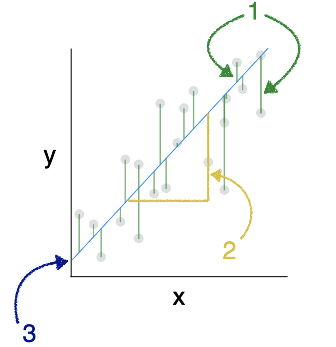

```{r global_options, include=FALSE}
library(emo)
library(tidyverse)
library(broom)
library(infer)
library(santoku)
library(car)


knitr::opts_chunk$set(echo = FALSE, 
                      fig.align = "center", 
                      fig.height = 3, 
                      fig.width = 5,
                      warning = FALSE, 
                      message = FALSE)


```


<span style="color: red;font-size: 14px;font-weight: bold;">GROUP WORK - DEADLINE 27th of October. 
<br/>Please submit your final report [using this form](https://forms.gle/JB5c9apmkx3wD8WG7). </span>


<div style="float: right;width: 200px;margin: 5px 5px 5px 5px">
```{r img-regression-labeled, echo=FALSE, fig.align='center'}

```
</div>


```{r prep-lab, eval = FALSE}
cor2data <- function(cor, n, seed){
  # number of observations to simulate
  nobs = n
  # cor <- matrix(cbind(1, 0.001, 0.001, 1), nrow=2)
  # rownames(cor) <- colnames(cor) <- c("x1",  "e")
  # Cholesky decomposition
  U = t(chol(cor))
  nvars = dim(U)[1]
  
  if(missing(seed)) {
    
  } else {
    set.seed(seed)
  }
  
  # Random variables that follow the correlation matrix
  rdata = matrix(rnorm(nvars*nobs,0,1), nrow=nvars, ncol=nobs)
  X = U %*% rdata
  # Transpose, convert to data
  # require(tidyverse)
  Data = t(X)
  Data = as.data.frame(Data)
  return(Data)
}

vars <- c("x",  "e")
Cor <- matrix(cbind(1, 0.001,
                    0.001, 1), nrow=2)
rownames(Cor) <- colnames(Cor) <- vars

df <- cor2data(Cor, 1000, 8675309) %>% as_tibble() # Jenny I got your number...
df |> 
  mutate(y = 1 + x + 0.5*e) |> 
  mutate(bin = chop_equally(x, 6, labels = 1:6)) |> 
  select(-e) -> df

glimpse(df)
write_csv(df, "data/toy_data.csv")

# The bins
df |> count(bin) 
df |> 
  count(bin) 


df |> ggplot(aes(quantile, y, color = quantile)) + 
  geom_violin(alpha=.6) + 
  geom_jitter(alpha=.6) 

# Show the model
m1 <- lm(y ~ x1, data = df)
summary(m1)
# Interpret the two parameters
# Explain the degrees of freedom
# Explain the residual standard error
# Interpret the R squared
# Interpret the F-statistic 


# Scatterplot with linear regression
df |> ggplot(aes(x1, y)) + 
  geom_point(alpha=.6, aes(color = quantile)) + 
  geom_smooth(method = "lm")

mean.x1 <- mean(df$x1)
mean.y1 <- mean(df$y)

# Show that it is passing through the middle
df |> ggplot(aes(x1, y)) + 
  geom_point(alpha=.6, aes(color = quantile)) + 
  geom_point(x = mean.x1, y = mean.y1, size = 4) + 
  geom_smooth(method = "lm")


# Show that the sum of the residuals is zero and that x is uncorrelated with the residuals
augment(m1) |> 
  summarize(sum.resid = sum(.resid))
cor_test(x1 ~ .resid, data = augment(m1))

# Diagnostics 
plot(m1, which = 1)
plot(m1, which = 2)
plot(m1, which = 3)
plot(m1, which = 4)
plot(m1, which = 5)
plot(m1, which = 6)


```

A regression analysis estimates the association between an outcome  $Y$ and one or more predictors $X_1, X_2,\ldots,X_k)$. We use Least Square Linear Regression when the outcome $Y$ is continuous, and when the outcome is normally distributed after adjusting for all predictors. 

We start by modelling a single predictor. Our dataset consists of $n$ independent observations ($n$ rows of data), each row containing the value of the outcome $Y$ and the value of a predictor $X$. The data for the $i_{th}$ observation (or individual, or case) are denoted $(x_i, y_i)$. Each observation has an associated outcome value and predictor value. Equation (1) describes the simple linear regression model for a predictor $X$:


$$
Y_i = \beta_0+\beta_1X_i+\epsilon_i
$$

where $\beta_0$ and $\beta_1$ are the intercept and slope, respectively, both UNKNOWN parameters of the straight line that best fits the complete (yet unknown) population data. $\epsilon$ is the error term, or the residual, which is assumed to have a normal distribution with the same variance no matter what $X$ is. The standard deviation of $\epsilon$ is also known as the residual standard error or the Root Mean Standard Error (RMSE), and is a measure of uncertainty associated with the model. The smaller the RMSE, the better the performance of our model. 

You will find all the work-space for your lab on posit cloud [using this link](TBD). 

### Creating a reproducible lab report

We will be using R Markdown to create reproducible lab reports. In RStudio, you will find the file `lab-04.Rmd` in the `Files` panel. Double click it to show the script in the code panel.

-   In the file, update the YAML with your name, the date and the name of the lab.
-   Load the `tidyverse`, `broom` packages.
-   Load your toy data from the `data` folder and assign it to an object with the name `toy`. 
-   Knit your file often to see that everything is working. 


## Using a toy dataset

Real data is messy and rarely meets all the assumptions required for  a simple linear regression. It is for that reason, that in this section we will use a 


------------------------------------------------------------------------

<a rel="license" href="http://creativecommons.org/licenses/by-sa/4.0/">{style="border-width:0"}</a><br />This work is licensed under a <a rel="license" href="http://creativecommons.org/licenses/by-sa/4.0/">Creative Commons Attribution-ShareAlike 4.0 International License</a>.